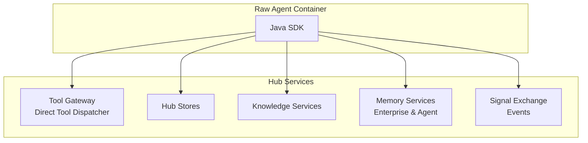

# Java SDK: Hub Integration APIs

> **Status**: 🟢 Design Complete  
> **Last Updated**: 2026-01-12  
> **Design Level**: C2 (Container)

---

## Overview

The Hub Integration APIs provide Java SDK interfaces for Raw Agents to interact with Hub services: tool discovery and invocation, Stores, Knowledge Services, Memory Services (Enterprise Memory and Agent Memory), and Events APIs (Signal Exchange). These APIs provide a unified interface for all Hub service interactions.

**Key Design Point**: The SDK provides framework-agnostic APIs that abstract Hub service details, handle authentication, and provide consistent error handling and observability.

---

## Architecture



---

## Functional Scope

### Tool Discovery and Calling

- **Tool Discovery**: Discover available tools based on agent's access permissions
- **Tool Invocation**: Invoke tools with automatic credential resolution and access control
- **Tool Metadata**: Access tool schemas, capabilities, and usage patterns
- **Direct Tool Dispatcher**: Direct tool invocation bypassing Signal Exchange

### Stores

- **Store Access**: Read/write access to Hub Stores
- **Store Operations**: Get, put, delete, list operations
- **Store Isolation**: Automatic isolation per (tenant, workbench, scenario, request, agent)

### Knowledge Services

- **Knowledge Search**: RAG-based search across knowledge bases
- **Reference Data**: Lookup reference data and structured information
- **Knowledge Base Access**: Access to specific knowledge bases configured in Training Spec

### Memory Services

- **Enterprise Memory**: Access to Enterprise Memory (precedents, case history, patterns)
- **Agent Memory**: Access to Agent Memory (conversation, KV stores, documents, logs)
- **Memory Tools**: Tool-based access to Enterprise Memory with built-in authorization

### Events APIs

- **Request Updates**: Submit request updates to Signal Exchange
- **Event Publishing**: Publish events to Signal Exchange
- **Event Subscription**: Subscribe to events (future capability)

---

## API Reference

### Initialization

```java
import io.olympus.seer.sdk.SeerSDK;
import io.olympus.seer.sdk.hub.HubClient;

// Initialize SDK (auto-detects agent identity from environment)
SeerSDK sdk = SeerSDK.fromEnvironment();

// Access Hub Integration APIs
HubClient hub = sdk.getHubClient();
```

### Tool Discovery and Calling

```java
// Discover available tools
List<Tool> tools = hub.getTools().discover().join();
for (Tool tool : tools) {
    System.out.println(tool.getName() + ": " + tool.getDescription());
    System.out.println("  Protocol: " + tool.getProtocol());
    System.out.println("  Schema: " + tool.getInputSchema());
}

// Get tool by name/protocol
Tool tool = hub.getTools().get("get-transactions").join();
System.out.println(tool.getSchema());

// Invoke tool
Map<String, Object> params = new HashMap<>();
params.put("account_id", "acc-123");
params.put("date_range", Map.of("start", "2026-01-01", "end", "2026-01-31"));

ToolResult result = hub.getTools().invoke("get-transactions", params).join();
System.out.println(result.getData());

// Invoke tool with alias (from Employment Spec)
ToolResult result = hub.getTools().invokeByAlias(
    "get_transactions",  // From Employment Spec tool bindings
    params
).join();
```

### Stores

```java
// Get value from store
Object value = hub.getStores().get("case-entities", "customer_profile").join();

// Put value to store
Map<String, Object> assessment = Map.of(
    "risk_score", 0.85,
    "decision", "escalate"
);
hub.getStores().put("case-entities", "fraud_assessment", assessment).join();

// Delete value from store
boolean deleted = hub.getStores().delete("case-entities", "old_key").join();

// List keys in store
List<String> keys = hub.getStores().list("case-entities").join();
for (String key : keys) {
    System.out.println(key);
}

// Check if key exists
boolean exists = hub.getStores().exists("case-entities", "customer_profile").join();
```

### Knowledge Services

```java
// Search knowledge base
List<KnowledgeResult> results = hub.getKnowledge().search(
    "fraud-policies",
    "chargeback eligibility criteria",
    5
).join();
for (KnowledgeResult result : results) {
    System.out.println(result.getChunk() + ": " + result.getScore());
}

// Get reference data
Object referenceData = hub.getKnowledge().getReference(
    "fraud-policies",
    "chargeback_rules"
).join();

// List available knowledge bases
List<KnowledgeBase> knowledgeBases = hub.getKnowledge().listBases().join();
for (KnowledgeBase kb : knowledgeBases) {
    System.out.println(kb.getName() + ": " + kb.getDescription());
}
```

### Memory Services

#### Enterprise Memory

```java
// Search precedents
List<Precedent> precedents = hub.getMemory().getEnterprise().searchPrecedent(
    "unauthorized transaction disputes",
    5,
    0.7
).join();
for (Precedent precedent : precedents) {
    System.out.println(precedent.getCaseId() + ": " + precedent.getSummary() + 
                       " (score: " + precedent.getSimilarityScore() + ")");
}

// Get case history
CaseHistory caseHistory = hub.getMemory().getEnterprise().getCaseHistory(
    "case-12345"
).join();

// Get patterns
List<Pattern> patterns = hub.getMemory().getEnterprise().getPatterns(
    "fraud_indicators"
).join();
```

#### Agent Memory

```java
// KV Store operations
Map<String, Object> assessment = Map.of("risk_score", 0.85);
hub.getMemory().getAgent().getKv().put(
    "case-entities",
    "fraud_assessment",
    assessment
).join();
Object value = hub.getMemory().getAgent().getKv().get(
    "case-entities",
    "fraud_assessment"
).join();

// Conversation operations
hub.getMemory().getAgent().getConversation().append(
    "case-dialog",
    "assistant",
    "Analyzing transaction patterns..."
).join();
List<Message> messages = hub.getMemory().getAgent().getConversation().getLast(
    "case-dialog",
    10
).join();

// Document operations
hub.getMemory().getAgent().getDocuments().store(
    "case-documents",
    "doc-123",
    "Transaction analysis report...",
    Map.of("type", "analysis", "created_at", "2026-01-12")
).join();
Document document = hub.getMemory().getAgent().getDocuments().get(
    "case-documents",
    "doc-123"
).join();

// Log operations
hub.getMemory().getAgent().getLog().append(
    "case-audit",
    "INFO",
    "Transaction analyzed",
    Map.of("transaction_id", "tx-123", "risk_score", 0.85)
).join();
List<LogEntry> logs = hub.getMemory().getAgent().getLog().getLast(
    "case-audit",
    20
).join();
```

### Events APIs

```java
// Submit request update
Map<String, Object> payload = Map.of(
    "task_id", "task-001",
    "task_type", "fraud_investigation",
    "context", Map.of(...)
);
hub.getEvents().submitRequestUpdate(
    "req-abc123",
    "task_created",
    payload
).join();

// Publish event
Map<String, Object> eventPayload = Map.of(
    "case_id", "case-12345",
    "risk_score", 0.85,
    "decision", "escalate"
);
hub.getEvents().publish("case.analyzed", eventPayload).join();
```

---

## Integration Points

### Tool Gateway / Direct Tool Dispatcher

- **Tool Discovery**: Tool Registry for tool discovery
- **Tool Invocation**: Direct Tool Dispatcher for tool calls
- **Access Control**: Automatic access control enforcement
- **Credential Resolution**: Automatic credential resolution from Employment Spec

### Hub Stores

- **Store Service**: Direct API calls to Hub Stores
- **Isolation**: Automatic isolation per (tenant, workbench, scenario, request, agent)
- **Authentication**: Uses agent's SPIFFE identity

### Knowledge Services

- **Knowledge Base API**: Direct API calls to Knowledge Services
- **RAG Search**: RAG-based search across knowledge bases
- **Reference Data**: Structured reference data lookup

### Memory Services

- **Enterprise Memory**: Tool-based access via Memory Access Tools
- **Agent Memory**: Direct SDK access to Agent Memory Services
- **Authorization**: Built-in authorization for Enterprise Memory access

### Signal Exchange

- **Request Updates**: API for submitting request updates
- **Event Publishing**: API for publishing events
- **Event Subscription**: Future capability for event subscriptions

---

## Key Design Decisions

### Framework-Agnostic Design

**Decision**: SDK APIs are framework-agnostic and work with any Java agentic framework.

**Rationale**:
- Raw Agents may use different frameworks (custom Java frameworks)
- SDK should not impose framework constraints
- Simple, direct API surface

### Tool-Based Enterprise Memory Access

**Decision**: Enterprise Memory access goes through Memory Access Tools, not direct API calls.

**Rationale**:
- Built-in authorization and access control
- Context-aware tool invocations
- Consistent with Hub tool invocation patterns
- Audit trail for all memory access

### Direct Tool Dispatcher

**Decision**: SDK uses Direct Tool Dispatcher for tool invocations, bypassing Signal Exchange when appropriate.

**Rationale**:
- Lower overhead for function-like tool calls
- Automatic credential resolution
- Access control enforcement
- Observability integration

### Automatic Isolation

**Decision**: All store and memory operations are automatically isolated per (tenant, workbench, scenario, request, agent).

**Rationale**:
- Prevents accidental cross-contamination
- Security and privacy by default
- No manual scope management needed

### Async/Await Pattern

**Decision**: Java SDK uses CompletableFuture for async operations.

**Rationale**:
- Non-blocking I/O for better performance
- Standard Java async pattern
- Compatible with reactive frameworks

---

## Error Handling

```java
import io.olympus.seer.sdk.exceptions.ToolNotFoundException;
import io.olympus.seer.sdk.exceptions.AccessDeniedException;
import io.olympus.seer.sdk.exceptions.StoreException;

try {
    ToolResult result = hub.getTools().invoke("get-transactions", params).join();
} catch (ToolNotFoundException e) {
    // Tool not found or not accessible
    System.err.println("Tool not available");
} catch (AccessDeniedException e) {
    // Access denied by access control
    System.err.println("Access denied to tool");
} catch (StoreException e) {
    // Store operation failed
    System.err.println("Store error: " + e.getMessage());
}
```

---

## Observability

The SDK automatically instruments all Hub service interactions:

- **Metrics**: Tool invocation latency, store operation counts, memory access patterns
- **Traces**: Full trace context for all Hub service calls
- **Logs**: Structured logging for all operations with context

---

## Related Documentation

- [Hub Tool Gateway](../../../../../olympus-hub-docs/04-subsystems/hub-native-utilities/direct-tool-dispatcher.md)
- [Hub Stores](../../../../../olympus-hub-docs/04-subsystems/stores/README.md)
- [Knowledge Services](../../../../../olympus-hub-docs/04-subsystems/knowledge-services/README.md)
- [Memory Services](../../../../../olympus-hub-docs/04-subsystems/memory-services/README.md)
- [Signal Exchange](../../../../../olympus-hub-docs/04-subsystems/signal-exchange/README.md)
- [Java SDK: Overview](../README.md)

---

*Hub Integration APIs provide unified access to all Hub services with automatic authentication, access control, and observability.*
