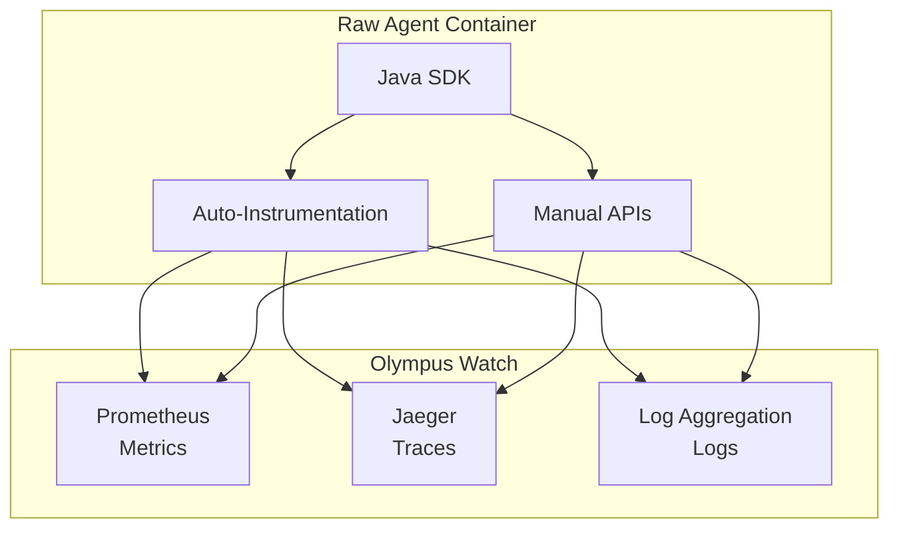

# Java SDK: Observability APIs

> **Status**: 🟢 Design Complete  
> **Last Updated**: 2026-01-12  
> **Design Level**: C2 (Container)

---

## Overview

The Observability APIs provide Java SDK interfaces for Raw Agents to report metrics, create traces, emit structured logs, and enable auto-instrumentation. All observability data flows to Olympus Watch for unified monitoring, dashboards, and alerting.

**Key Design Point**: The SDK provides auto-instrumentation for common operations (LLM calls, tool invocations, memory operations) and manual APIs for custom instrumentation. All data is structured and includes trace context propagation.

---

## Architecture



---

## Functional Scope

### Metrics Reporting

- **Custom Metrics**: Counter, histogram, gauge metrics
- **Standard Metrics**: Pre-defined agent metrics (request duration, LLM tokens, tool invocations)
- **Prometheus Format**: Metrics exposed via `/metrics` endpoint
- **Metric Labels**: Structured labels for filtering and aggregation

### Tracing

- **Span Creation**: Manual span creation for custom operations
- **Auto-Instrumentation**: Automatic spans for LLM calls, tool invocations, memory operations
- **Trace Context Propagation**: W3C Trace Context via OpenTelemetry
- **Span Attributes**: Custom attributes for span enrichment

### Structured Logging

- **Structured JSON Logs**: Consistent log format with required fields
- **Context Propagation**: Automatic inclusion of trace_id, span_id, request_id
- **Log Levels**: DEBUG, INFO, WARN, ERROR with configurable minimum level
- **PII Redaction**: Automatic PII redaction by log shipper (defense-in-depth)

### Auto-Instrumentation

- **LLM Calls**: Automatic spans and metrics for Model Gateway calls
- **Tool Invocations**: Automatic spans and metrics for tool calls
- **Memory Operations**: Automatic spans and metrics for memory store operations
- **Context Assembly**: Automatic spans for context compilation

---

## API Reference

### Initialization

```java
import io.olympus.seer.sdk.SeerSDK;
import io.olympus.seer.sdk.observability.ObservabilityClient;

// Initialize SDK (auto-detects agent identity from environment)
SeerSDK sdk = SeerSDK.fromEnvironment();

// Access Observability APIs
ObservabilityClient observability = sdk.getObservabilityClient();
```

### Metrics

```java
// Counter metric
observability.getMetrics().counter("transactions_analyzed").inc();
observability.getMetrics().counter("transactions_analyzed")
    .labels("outcome", "approved")
    .inc();

// Histogram metric
observability.getMetrics().histogram("risk_score").observe(0.85);
observability.getMetrics().histogram("request_duration_seconds").observe(1.23);

// Gauge metric
observability.getMetrics().gauge("active_requests").set(5);
observability.getMetrics().gauge("queue_size").inc();
observability.getMetrics().gauge("queue_size").dec();
```

### Tracing

```java
import io.olympus.seer.sdk.observability.Span;

// Manual span creation
try (Span span = observability.startSpan("custom_analysis")) {
    span.setAttribute("transaction_id", txId);
    AnalysisResult result = performAnalysis();
    span.setAttribute("risk_score", result.getRiskScore());
    span.setAttribute("decision", result.getDecision());
}

// Nested spans
try (Span outer = observability.startSpan("fraud_investigation")) {
    try (Span inner1 = observability.startSpan("transaction_analysis")) {
        analyzeTransaction();
    }
    try (Span inner2 = observability.startSpan("pattern_matching")) {
        matchPatterns();
    }
}
```

### Structured Logging

```java
import io.olympus.seer.sdk.observability.Log;

// Info log
observability.log().info("Transaction analyzed")
    .field("transaction_id", txId)
    .field("risk_score", result.getRiskScore())
    .field("decision", "approve")
    .emit();

// Error log
observability.log().error("Analysis failed")
    .field("transaction_id", txId)
    .field("error", e.getMessage())
    .field("stack_trace", getStackTrace(e))
    .emit();

// Debug log
observability.log().debug("Retrieving context")
    .field("request_id", reqId)
    .field("sources", Arrays.asList("memory", "knowledge"))
    .emit();
```

### Auto-Instrumentation

```java
import io.olympus.seer.sdk.observability.AutoInstrument;

// Auto-instrument method
@AutoInstrument
public AnalysisResult analyzeTransaction(String transactionId) {
    // LLM calls, tool invocations, memory ops automatically traced
    CompiledContext context = contextCompiler.compile(...);
    LLMResult result = llm.call(...);
    tool.invoke(...);
    memory.store(...);
    return result;
}

// Auto-instrument async method
@AutoInstrument
public CompletableFuture<AnalysisResult> analyzeTransactionAsync(String transactionId) {
    // Automatically traced
    ...
}
```

---

## Integration Points

### Olympus Watch

- **Prometheus**: Metrics scraped from `/metrics` endpoint
- **Jaeger**: Traces exported via OpenTelemetry
- **Log Aggregation**: Logs shipped via Atlantis log shipper
- **Dashboards**: Pre-built dashboards in Watch
- **Alerts**: Configurable alert rules in Watch

### OpenTelemetry

- **OTel SDK**: Underlying instrumentation library
- **Trace Context**: W3C Trace Context propagation
- **Exporters**: OTLP exporters for traces and metrics

### Atlantis Infrastructure

- **Log Shipper**: DaemonSet for log collection and PII redaction
- **OTel Collector**: Metrics and trace collection
- **Prometheus**: Metrics scraping

---

## Key Design Decisions

### Built on Watch

**Decision**: All observability data flows to Olympus Watch; no Seer-specific observability infrastructure.

**Rationale**:
- Unified observability platform
- No duplicate infrastructure
- Consistent with Hub observability patterns

### Auto-Instrumentation

**Decision**: SDK provides auto-instrumentation for common operations (LLM calls, tool invocations, memory operations).

**Rationale**:
- Reduces developer burden
- Ensures consistent instrumentation
- Captures all agent operations automatically

### Structured Logging

**Decision**: All logs are structured JSON with required fields (timestamp, level, agent_id, request_id, trace_id).

**Rationale**:
- Enables log aggregation and search
- Supports correlation with traces and metrics
- Consistent format across all agents

### PII Redaction

**Decision**: PII redaction performed by log shipper (defense-in-depth), but agents should avoid logging PII.

**Rationale**:
- Defense-in-depth security
- Automatic redaction reduces risk
- Agents should still minimize PII in logs

### Async/Await Pattern

**Decision**: Java SDK uses CompletableFuture for async operations.

**Rationale**:
- Non-blocking I/O for better performance
- Standard Java async pattern
- Compatible with reactive frameworks

---

## Related Documentation

- [Agent Observability](../../agent-observability.md) — Full observability design
- [Olympus Watch](../../../../../olympus-hub-docs/05-infrastructure/olympus-watch.md) — Observability platform
- [Java SDK: Overview](../README.md)

---

*Observability APIs provide comprehensive metrics, tracing, and logging with auto-instrumentation, all integrated with Olympus Watch.*
