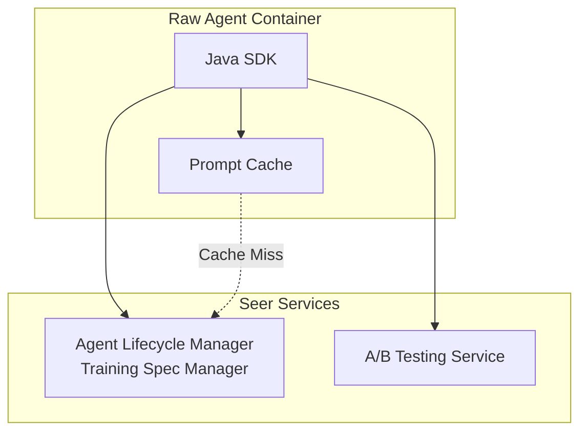

# Java SDK: Prompt Access APIs

> **Status**: 🟢 Design Complete  
> **Last Updated**: 2026-01-12  
> **Design Level**: C2 (Container)

---

## Overview

The Prompt Access APIs provide Java SDK interfaces for Raw Agents to retrieve prompts from Training Specs with support for A/B testing, authority enforcement awareness, prompt versioning, and autonomy level-based selection. Prompts are tagged with autonomy levels (Full, Suggest, Ask, Watch) and are used at the tagged level or lower levels of autonomy.

**Key Design Point**: Prompts are retrieved from Training Specs and selected based on the current agent's autonomy level. A/B testing variants are automatically selected based on configured experiments.

---

## Architecture



---

## Functional Scope

### Prompt Retrieval

- **Get System Prompt**: Retrieve the system prompt for the current agent
- **Get Skill Prompt**: Retrieve a specific skill prompt by name
- **Get Prompt by Autonomy Level**: Retrieve prompts filtered by autonomy level
- **List Available Prompts**: List all available prompts and their autonomy levels

### Autonomy Level-Based Selection

- **Autonomy Level Hierarchy**: Full > Suggest > Ask > Watch
- **Prompt Selection**: Prompts tagged with an autonomy level are used at that level or lower levels
- **Exclusive Tags**: Prompts can be exclusively tagged for a specific autonomy level
- **Current Autonomy Level**: Determined from Employment Spec authority configuration

### A/B Testing Awareness

- **Variant Selection**: Automatic selection of prompt variants based on A/B test configuration
- **Experiment Tracking**: Track which variant is used for each agent instance
- **Sticky Assignment**: Consistent variant assignment per agent instance

### Authority Enforcement Awareness

- **Authority-Aware Prompts**: Prompts include authority constraints and ceilings
- **Context Injection**: Authority information automatically injected into prompts
- **Dynamic Prompting**: Prompts adapt based on current authority state

### Prompt Versioning

- **Version Resolution**: Automatic version resolution (latest vs. specific version)
- **Version History**: Access to version history and change tracking
- **Version Pinning**: Support for version pinning to prevent unexpected changes

---

## API Reference

### Initialization

```java
import io.olympus.seer.sdk.SeerSDK;
import io.olympus.seer.sdk.prompts.PromptClient;

// Initialize SDK (auto-detects agent identity from environment)
SeerSDK sdk = SeerSDK.fromEnvironment();

// Access Prompt APIs
PromptClient prompts = sdk.getPromptClient();
```

### Get System Prompt

```java
// Get system prompt (with autonomy level filtering)
Prompt systemPrompt = prompts.getSystemPrompt().join();

// Get with specific autonomy level
GetPromptOptions options = GetPromptOptions.builder()
    .autonomyLevel(AutonomyLevel.FULL)  // FULL, SUGGEST, ASK, WATCH
    .build();
Prompt systemPrompt = prompts.getSystemPrompt(options).join();

// Get with A/B testing
GetPromptOptions abOptions = GetPromptOptions.builder()
    .abTestGroup("experiment-001")
    .build();
Prompt systemPrompt = prompts.getSystemPrompt(abOptions).join();
```

### Get Skill Prompt

```java
// Get skill prompt by name
Prompt skillPrompt = prompts.getSkillPrompt("analyze-transaction").join();

// Get with autonomy level
GetPromptOptions options = GetPromptOptions.builder()
    .autonomyLevel(AutonomyLevel.SUGGEST)
    .build();
Prompt skillPrompt = prompts.getSkillPrompt("analyze-transaction", options).join();

// Get with A/B testing
GetPromptOptions abOptions = GetPromptOptions.builder()
    .abTestGroup("experiment-001")
    .build();
Prompt skillPrompt = prompts.getSkillPrompt("analyze-transaction", abOptions).join();
```

### Autonomy Level-Based Selection

```java
// Get prompt for current autonomy level (from Employment Spec)
GetPromptOptions options = GetPromptOptions.builder()
    .useCurrentAutonomy(true)  // Default: true
    .build();
Prompt prompt = prompts.getSystemPrompt(options).join();

// Get prompt for specific autonomy level
GetPromptOptions levelOptions = GetPromptOptions.builder()
    .autonomyLevel(AutonomyLevel.ASK)  // Will include prompts tagged "ASK", "WATCH"
    .build();
Prompt prompt = prompts.getSystemPrompt(levelOptions).join();

// List prompts by autonomy level
List<Prompt> promptsByLevel = prompts.listByAutonomyLevel(AutonomyLevel.FULL).join();
for (Prompt prompt : promptsByLevel) {
    System.out.println(prompt.getName() + ": " + prompt.getAutonomyLevel());
}
```

### A/B Testing

```java
// Get prompt with A/B testing (automatic variant selection)
GetPromptOptions options = GetPromptOptions.builder()
    .enableAbTesting(true)  // Default: true
    .build();
Prompt prompt = prompts.getSystemPrompt(options).join();

// Get specific A/B test variant
GetPromptOptions variantOptions = GetPromptOptions.builder()
    .abTestGroup("experiment-001")
    .variant("variant-b")
    .build();
Prompt prompt = prompts.getSystemPrompt(variantOptions).join();

// Get A/B test assignment for current agent
ABTestAssignment assignment = prompts.getAbTestAssignment("experiment-001").join();
System.out.println("Variant: " + assignment.getVariant());
System.out.println("Sticky: " + assignment.isSticky());
```

### Authority Enforcement Awareness

```java
// Get prompt with authority constraints injected
GetPromptOptions options = GetPromptOptions.builder()
    .includeAuthority(true)  // Default: true
    .build();
Prompt prompt = prompts.getSystemPrompt(options).join();

// Access authority information in prompt
System.out.println(prompt.getAuthorityConstraints());
System.out.println(prompt.getCeilings());
System.out.println(prompt.getDelegationInfo());

// Get prompt without authority injection
GetPromptOptions noAuthOptions = GetPromptOptions.builder()
    .includeAuthority(false)
    .build();
Prompt prompt = prompts.getSystemPrompt(noAuthOptions).join();
```

### Prompt Versioning

```java
// Get latest version
Prompt prompt = prompts.getSystemPrompt().join();

// Get specific version
GetPromptOptions versionOptions = GetPromptOptions.builder()
    .version("1.2.3")
    .build();
Prompt prompt = prompts.getSystemPrompt(versionOptions).join();

// List available versions
List<VersionInfo> versions = prompts.listVersions("system").join();
for (VersionInfo version : versions) {
    System.out.println(version.getVersion() + ": " + version.getCreatedAt());
}

// Get version info
VersionInfo versionInfo = prompts.getVersionInfo("system", "1.2.3").join();
System.out.println(versionInfo.getChanges());
```

### Prompt Fields Access

```java
Prompt prompt = prompts.getSystemPrompt().join();

// Access prompt content
System.out.println(prompt.getContent());
System.out.println(prompt.getText());

// Access metadata
System.out.println(prompt.getName());
System.out.println(prompt.getAutonomyLevel());
System.out.println(prompt.getVersion());
System.out.println(prompt.getCreatedAt());

// Access authority information
if (prompt.getAuthorityConstraints() != null) {
    System.out.println(prompt.getAuthorityConstraints().getCeilings());
    System.out.println(prompt.getAuthorityConstraints().getDelegation());
}

// Access A/B testing info
if (prompt.getAbTestInfo() != null) {
    System.out.println(prompt.getAbTestInfo().getExperimentId());
    System.out.println(prompt.getAbTestInfo().getVariant());
}
```

---

## Autonomy Level Selection Logic

### Autonomy Level Hierarchy

```
Full > Suggest > Ask > Watch
```

### Selection Rules

1. **Tagged Level or Lower**: A prompt tagged with "Full" can be used at Full, Suggest, Ask, or Watch
2. **Tagged Level or Lower**: A prompt tagged with "Suggest" can be used at Suggest, Ask, or Watch
3. **Tagged Level or Lower**: A prompt tagged with "Ask" can be used at Ask or Watch
4. **Tagged Level Only**: A prompt tagged with "Watch" can only be used at Watch
5. **Exclusive Tags**: If a prompt is exclusively tagged for a level, it's only used at that level

### Example

```java
// Training Spec has:
// - systemPrompt (autonomy_level: "Full")
// - systemPromptSuggest (autonomy_level: "Suggest", exclusive: true)
// - systemPromptAsk (autonomy_level: "Ask")

// Agent with autonomy level "Full":
GetPromptOptions fullOptions = GetPromptOptions.builder()
    .autonomyLevel(AutonomyLevel.FULL)
    .build();
Prompt prompt = prompts.getSystemPrompt(fullOptions).join();
// Returns: systemPrompt (tagged "Full")

// Agent with autonomy level "Suggest":
GetPromptOptions suggestOptions = GetPromptOptions.builder()
    .autonomyLevel(AutonomyLevel.SUGGEST)
    .build();
Prompt prompt = prompts.getSystemPrompt(suggestOptions).join();
// Returns: systemPromptSuggest (exclusive "Suggest" tag)

// Agent with autonomy level "Ask":
GetPromptOptions askOptions = GetPromptOptions.builder()
    .autonomyLevel(AutonomyLevel.ASK)
    .build();
Prompt prompt = prompts.getSystemPrompt(askOptions).join();
// Returns: systemPromptAsk (tagged "Ask")
```

---

## Training Spec Prompt Structure

```yaml
behavioral:
  systemPrompt: |
    You are a Fraud Case Analyst...
  systemPromptAutonomyLevel: "Full"  # Tag for autonomy level
  
  skillPrompts:
    - name: analyze-transaction
      prompt: |
        When analyzing a transaction...
      autonomyLevel: "Suggest"  # Tag for autonomy level
      exclusive: false  # Can be used at lower levels
    
    - name: recommend-outcome
      prompt: |
        When recommending...
      autonomyLevel: "Ask"
      exclusive: true  # Only used at "Ask" level
    
    - name: observe-only
      prompt: |
        Observe and report...
      autonomyLevel: "Watch"
      exclusive: true  # Only used at "Watch" level
```

---

## Integration Points

### Agent Lifecycle Manager

- **Training Spec Manager**: Source of truth for prompts
- **Integration**: Direct API calls to Training Spec Manager
- **Authentication**: Uses agent's SPIFFE identity for authentication

### A/B Testing Service

- **Variant Selection**: Automatic variant selection based on experiments
- **Assignment Tracking**: Track variant assignments per agent
- **Integration**: API calls to A/B Testing Service

### Employment Spec

- **Current Autonomy Level**: Retrieved from Employment Spec authority configuration
- **Authority Constraints**: Authority ceilings and delegation info injected into prompts

### Local Cache

- **In-Memory Cache**: Fast local access to prompts
- **Cache Invalidation**: Listens for prompt update events
- **Cache Refresh**: Periodic refresh and on-demand refresh

---

## Key Design Decisions

### Autonomy Level-Based Selection

**Decision**: Prompts are tagged with autonomy levels and selected based on the agent's current autonomy level.

**Rationale**:
- Different autonomy levels require different prompt styles
- Full autonomy needs different instructions than supervised autonomy
- Ensures prompts match the agent's authority level

**Selection Logic**:
- Prompts tagged at a level can be used at that level or lower
- Exclusive tags restrict usage to specific levels
- Current autonomy level determined from Employment Spec

### A/B Testing Integration

**Decision**: A/B testing is built into prompt retrieval with automatic variant selection.

**Rationale**:
- Enables prompt experimentation without code changes
- Supports gradual rollout of prompt improvements
- Tracks variant performance per agent instance

### Authority Enforcement Awareness

**Decision**: Authority constraints are automatically injected into prompts.

**Rationale**:
- Agents need to know their authority limits
- Prompts should reflect current authority state
- Reduces risk of agents exceeding authority

### Async/Await Pattern

**Decision**: Java SDK uses CompletableFuture for async operations.

**Rationale**:
- Non-blocking I/O for better performance
- Standard Java async pattern
- Compatible with reactive frameworks

---

## Error Handling

```java
import io.olympus.seer.sdk.exceptions.PromptNotFoundException;
import io.olympus.seer.sdk.exceptions.AutonomyLevelMismatchException;

try {
    GetPromptOptions options = GetPromptOptions.builder()
        .autonomyLevel(AutonomyLevel.FULL)
        .build();
    Prompt prompt = prompts.getSystemPrompt(options).join();
} catch (PromptNotFoundException e) {
    // Prompt not found for current autonomy level
    System.err.println("No prompt found for autonomy level");
} catch (AutonomyLevelMismatchException e) {
    // Requested autonomy level doesn't match available prompts
    GetPromptOptions currentOptions = GetPromptOptions.builder()
        .useCurrentAutonomy(true)
        .build();
    Prompt prompt = prompts.getSystemPrompt(currentOptions).join();
}
```

---

## Observability

The SDK automatically instruments prompt access:

- **Metrics**: Prompt retrieval latency, cache hit/miss rates, A/B test variant distribution
- **Traces**: Full trace context for prompt retrieval operations
- **Logs**: Structured logging for prompt selection, A/B test assignments, and errors

---

## Related Documentation

- [Agent Lifecycle Manager: Training Spec Manager](../agent-lifecycle-manager/training-spec-manager.md)
- [Training Spec CRD](../../hub-integration/training-spec-crd.md)
- [APO: Autonomy Levels](../../../personas-and-needs/apo.md)
- [Java SDK: Overview](../README.md)

---

*Prompt Access APIs provide autonomy level-aware, A/B testing-enabled prompt retrieval with authority enforcement awareness.*
