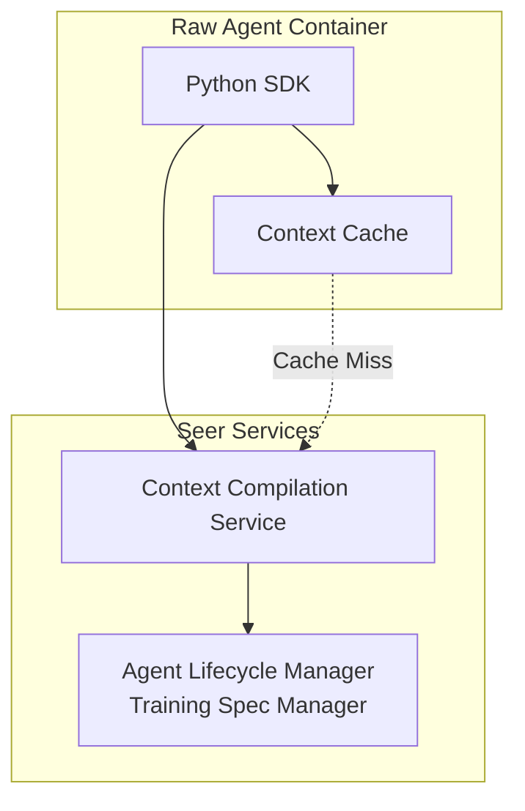

# Python SDK: Context Compiler APIs

> **Status**: 🟢 Design Complete  
> **Last Updated**: 2026-01-12  
> **Design Level**: C2 (Container)

---

## Overview

The Context Compiler APIs provide Python SDK wrappers for the Context Compilation Service, enabling Raw Agents to compile context from four sources: Enterprise Knowledge, Enterprise Memory, Agent Memory, and Hub Request Context (including request hierarchy/ancestry topology). The SDK handles automatic retriever selection based on request update metadata matching Training Spec selector criteria.

**Key Design Point**: The SDK provides a simple, framework-agnostic interface that automatically handles retriever configuration selection from Training Specs. Agent code remains framework-agnostic and doesn't need to specify retrievers.

---

## Architecture



---

## Functional Scope

### Context Compilation

- **Compile Context**: Compile context from four sources with automatic retriever selection
- **Compile with Overrides**: Compile context with optional overrides (token budget, cache control)
- **Async Compilation**: Asynchronous context compilation for non-blocking operations
- **Batch Compilation**: Compile context for multiple requests in parallel

### Automatic Retriever Selection

- **Request-Update-Based Selection**: Automatic retriever selection based on request update metadata
- **Training Spec Integration**: Retrievers configured in Training Spec with selector criteria
- **Selector Matching**: Automatic matching against updateType, taskType, contextKeys, etc.
- **Configuration Merging**: Multiple matching configurations are automatically merged

### Request Hierarchy Integration

- **Ancestry Traversal**: Automatic traversal of request hierarchy to access ancestor contexts
- **Goal and Role-Based Filtering**: Ancestor contexts filtered based on agent goal and role
- **Context Inheritance**: Access to context from all requestors in ancestry chain

### Tool-Aware Compilation

- **Tool Integration**: Available tools automatically incorporated into context constraints
- **Tool Capability Influence**: Tool capabilities influence context retrieval and ranking
- **Tool Metadata**: Tool schemas and usage patterns included in context

### Caching

- **Local Cache**: Compiled context cached locally for performance
- **Cache Invalidation**: Cache automatically invalidated on context updates
- **Cache Refresh**: Configurable refresh interval and on-demand refresh

---

## API Reference

### Initialization

```python
from seer_sdk import SeerSDK

# Initialize SDK (auto-detects agent identity from environment)
sdk = SeerSDK.from_environment()

# Access Context Compiler APIs
context_compiler = sdk.context_compiler
```

### Compile Context

```python
# Basic compilation (automatic retriever selection)
context = await context_compiler.compile(
    request_id="req-abc123",
    update_id="upd-xyz789"
)

# Access compiled context
print(context.constraints)
print(context.facts)
print(context.precedent)
print(context.procedures)
print(context.working_state)
print(context.request_context)
```

### Compile with Options

```python
# Compile with token budget override
context = await context_compiler.compile(
    request_id="req-abc123",
    update_id="upd-xyz789",
    token_budget=10000  # Override total budget
)

# Compile with cache control
context = await context_compiler.compile(
    request_id="req-abc123",
    update_id="upd-xyz789",
    use_cache=True,      # Use cache if available (default: True)
    refresh_cache=False  # Force refresh from source (default: False)
)
```

### Async Compilation

```python
import asyncio

async def compile_context():
    context = await context_compiler.compile(
        request_id="req-abc123",
        update_id="upd-xyz789"
    )
    return context

# Run async compilation
context = asyncio.run(compile_context())
```

### Batch Compilation

```python
# Compile context for multiple requests
requests = [
    {"request_id": "req-001", "update_id": "upd-001"},
    {"request_id": "req-002", "update_id": "upd-002"},
    {"request_id": "req-003", "update_id": "upd-003"}
]

contexts = await context_compiler.compile_batch(requests)
for context in contexts:
    print(f"{context.request_id}: {context.metadata.token_count} tokens")
```

### Context Fields Access

```python
context = await context_compiler.compile(
    request_id="req-abc123",
    update_id="upd-xyz789"
)

# Constraints (tool allowlist, safety rules, policy constraints)
constraints = context.constraints
print(constraints.tool_allowlist)
print(constraints.safety_rules)
print(constraints.policy_constraints)

# Goal
goal = context.goal
print(goal.objective)
print(goal.definition_of_done)

# Facts
for fact in context.facts:
    print(f"{fact.source}: {fact.content} (confidence: {fact.confidence})")

# Precedent
for precedent in context.precedent:
    print(f"{precedent.record_id}: {precedent.summary} (relevance: {precedent.relevance_score})")

# Procedures
procedures = context.procedures
print(procedures.applicable_sops)
print(procedures.agent_procedures)

# Working State
working_state = context.working_state
print(working_state.tool_outputs)
print(working_state.session_variables)

# Request Context
request_context = context.request_context
print(f"Current: {request_context.current.request_id}")
for ancestor in request_context.ancestors:
    print(f"Ancestor {ancestor.depth}: {ancestor.request_id} ({ancestor.relevance})")
```

### Context Metadata

```python
context = await context_compiler.compile(
    request_id="req-abc123",
    update_id="upd-xyz789"
)

# Metadata
metadata = context.metadata
print(f"Token count: {metadata.token_count}")
print(f"Budget remaining: {metadata.budget_remaining}")
print(f"Compilation time: {metadata.compilation_time_ms}ms")
print(f"Retrieval stats: {metadata.retrieval_stats}")
```

### Provenance

```python
context = await context_compiler.compile(
    request_id="req-abc123",
    update_id="upd-xyz789"
)

# Provenance
provenance = context.provenance
for source in provenance.sources:
    print(f"{source.type}: {source.records_returned} records in {source.latency_ms}ms")
    print(f"  Query: {source.query}")
    print(f"  Version: {source.version}")

# Reproducibility hash
print(f"Context hash: {provenance.hash}")
```

### Context Text Format

```python
context = await context_compiler.compile(
    request_id="req-abc123",
    update_id="upd-xyz789"
)

# Get context as formatted text
text = context.as_text
print(text)

# Get context as structured dict
context_dict = context.as_dict
print(context_dict)
```

### Cache Management

```python
# Invalidate cache for a request
await context_compiler.cache.invalidate(request_id="req-abc123")

# Refresh cache
await context_compiler.cache.refresh(request_id="req-abc123")

# Check cache status
cache_status = context_compiler.cache.status(request_id="req-abc123")
print(cache_status.is_valid)
print(cache_status.last_updated)
print(cache_status.version)
```

---

## Automatic Retriever Selection

The SDK automatically selects retrievers based on request update metadata matching Training Spec selector criteria. Agent code doesn't need to specify retrievers.

### How It Works

1. **Request Update Metadata**: SDK extracts metadata from request update (updateType, taskType, contextKeys, etc.)
2. **Training Spec Lookup**: SDK loads Training Spec retriever configurations
3. **Selector Matching**: SDK matches request update against selector criteria
4. **Configuration Merging**: When multiple selectors match, configurations are merged
5. **Context Compilation**: SDK invokes Context Compilation Service with selected configuration

### Example

```python
# Agent code - doesn't know about Training Spec
# Just invokes context compilation with request update
context = await context_compiler.compile(
    request_id=invocation.request.request_id,
    update_id=invocation.update.update_id
    # No retriever specification needed!
    # SDK automatically matches request update against Training Spec selectors
)
```

### Training Spec Configuration

```yaml
# Training Spec defines retriever configurations with selectors
spec:
  contextCompilation:
    retrieverConfigs:
      - selector:
          updateType: "task_created"
          taskType: "fraud_investigation"
        retrievers: [...]
        tokenBudget: {...}
        ranking: {...}
      - selector:
          updateType: "context_update"
          contextKeys: ["customer_profile"]
        retrievers: [...]
        tokenBudget: {...}
      - selector: {}  # Default fallback
        retrievers: [...]
```

---

## Integration Points

### Context Compilation Service

- **Service API**: Direct API calls to Context Compilation Service
- **Integration**: SDK wraps service API with convenience methods
- **Authentication**: Uses agent's SPIFFE identity for authentication

### Agent Lifecycle Manager

- **Training Spec Manager**: Source of retriever configurations
- **Integration**: SDK loads Training Spec for retriever configuration selection

### Local Cache

- **In-Memory Cache**: Fast local access to compiled context
- **Cache Invalidation**: Listens for context update events
- **Cache Refresh**: Periodic refresh and on-demand refresh

---

## Key Design Decisions

### Framework-Agnostic Design

**Decision**: SDK APIs are framework-agnostic and work with any Python agentic framework.

**Rationale**:
- Raw Agents may use different frameworks (LangChain, LangGraph, Strands, custom)
- SDK should not impose framework constraints
- Simple, direct API surface

### Automatic Retriever Selection

**Decision**: SDK automatically selects retrievers based on request update metadata matching Training Spec selector criteria.

**Rationale**:
- Agent code remains framework-agnostic
- Context compilation behavior configured declaratively in Training Spec
- No code changes needed when retriever strategies evolve

### Request Hierarchy Integration

**Decision**: SDK automatically traverses request hierarchy and filters ancestor contexts based on agent goal and role.

**Rationale**:
- Agents need access to ancestor context
- Goal and role-based filtering ensures relevance
- Prevents information overload

---

## Error Handling

```python
from seer_sdk.exceptions import ContextCompilationError, RetrieverConfigNotFound

try:
    context = await context_compiler.compile(
        request_id="req-abc123",
        update_id="upd-xyz789"
    )
except ContextCompilationError as e:
    # Context compilation failed
    print(f"Compilation error: {e.message}")
    print(f"Retry after: {e.retry_after}")
except RetrieverConfigNotFound:
    # No retriever configuration found for request update
    print("No retriever configuration found")
```

---

## Observability

The SDK automatically instruments context compilation:

- **Metrics**: Compilation latency, token usage, cache hit/miss rates, retrieval stats
- **Traces**: Full trace context for compilation operations
- **Logs**: Structured logging for compilation, retriever selection, and errors

---

## Related Documentation

- [Context Compilation Service](../../context-compiler/compilation-service.md)
- [Context Assembly Concepts](../../../implementation-concepts/context-assembly.md)
- [Python SDK: Overview](../README.md)

---

*Context Compiler APIs provide automatic, tool-aware context compilation from four sources with request hierarchy integration and Training Spec-based retriever configuration.*
