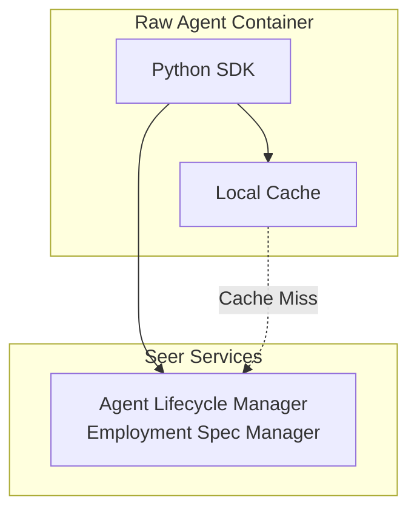

# Python SDK: Employment Spec Access APIs

> **Status**: 🟢 Design Complete  
> **Last Updated**: 2026-01-12  
> **Design Level**: C2 (Container)

---

## Overview

The Employment Spec Access APIs provide Python SDK interfaces for Raw Agents to retrieve, cache, and access their Employment Specification. The Employment Spec contains authority delegation, work scope, resource quotas, tool bindings, and operational environment configuration.

**Key Design Point**: Employment Specs are retrieved from the Agent Lifecycle Manager and cached locally for performance. The SDK handles versioning, cache invalidation, and automatic refresh.

---

## Architecture



---

## Functional Scope

### Employment Spec Retrieval

- **Get Current Employment Spec**: Retrieve the Employment Spec for the current agent instance
- **Get Spec by ID**: Retrieve a specific Employment Spec by ID (for multi-agent scenarios)
- **Get Spec Version**: Retrieve a specific version of an Employment Spec
- **List Available Versions**: List all available versions of an Employment Spec

### Caching

- **Local Cache**: Employment Specs are cached in memory for performance
- **Cache Invalidation**: Cache automatically invalidated on spec updates
- **Cache Refresh**: Configurable refresh interval and on-demand refresh
- **Cache Key**: Based on agent ID and spec version

### Versioning

- **Version Resolution**: Automatic version resolution (latest vs. specific version)
- **Version Locking**: Support for version pinning to prevent unexpected changes
- **Version History**: Access to version history and change tracking

---

## API Reference

### Initialization

```python
from seer_sdk import SeerSDK

# Initialize SDK (auto-detects agent identity from environment)
sdk = SeerSDK.from_environment()

# Access Employment Spec APIs
employment_spec = sdk.employment_spec
```

### Get Current Employment Spec

```python
# Get current agent's employment spec (cached)
spec = await employment_spec.get_current()

# Access spec fields
print(spec.agent_id)
print(spec.work_scope.workbench)
print(spec.authority.ceilings.max_single_transaction)
print(spec.tool_bindings)
```

### Get Spec with Options

```python
# Get with cache control
spec = await employment_spec.get_current(
    use_cache=True,          # Use cache if available (default: True)
    refresh_cache=False,     # Force refresh from source (default: False)
    version=None             # Specific version (default: latest)
)

# Get specific version
spec = await employment_spec.get_version(version="1.2.3")

# Get by spec ID
spec = await employment_spec.get_by_id(spec_id="es-fraud-analyst-001")
```

### Cache Management

```python
# Invalidate cache
await employment_spec.cache.invalidate()

# Refresh cache
await employment_spec.cache.refresh()

# Check cache status
cache_status = employment_spec.cache.status()
print(cache_status.is_valid)
print(cache_status.last_updated)
print(cache_status.version)
```

### Version Management

```python
# List available versions
versions = await employment_spec.list_versions()
for version in versions:
    print(f"{version.version}: {version.created_at}")

# Get version info
version_info = await employment_spec.get_version_info(version="1.2.3")
print(version_info.changes)
print(version_info.created_by)
```

### Spec Fields Access

```python
spec = await employment_spec.get_current()

# Authority delegation
delegation = spec.delegation
print(delegation.type)  # "user" | "role"
print(delegation.delegator)
print(delegation.accountable)

# Work scope
work_scope = spec.work_scope
print(work_scope.workbench)
print(work_scope.scenarios)
print(work_scope.temporal_scope)

# Authority ceilings
ceilings = spec.authority.ceilings
print(ceilings.max_single_transaction)
print(ceilings.max_daily_total)
print(ceilings.max_per_customer)

# Resource quotas
quotas = spec.resources.quotas
print(quotas.compute.cpu)
print(quotas.compute.memory)
print(quotas.tokens.daily)

# Tool bindings
tool_bindings = spec.operational_env.tool_bindings
for binding in tool_bindings:
    print(f"{binding.alias}: {binding.protocol}")

# Memory bindings
memory_bindings = spec.operational_env.memory_bindings
for binding in memory_bindings:
    print(f"{binding.name}: {binding.workbench_store}")
```

---

## Integration Points

### Agent Lifecycle Manager

- **Employment Spec Manager**: Source of truth for Employment Specs
- **Integration**: Direct API calls to Employment Spec Manager
- **Authentication**: Uses agent's SPIFFE identity for authentication

### Local Cache

- **In-Memory Cache**: Fast local access to Employment Spec
- **Cache Invalidation**: Listens for spec update events
- **Cache Refresh**: Periodic refresh and on-demand refresh

---

## Key Design Decisions

### Caching Strategy

**Decision**: Employment Specs are cached locally in memory for performance.

**Rationale**:
- Employment Specs change infrequently
- Fast access needed for every agent operation
- Reduces load on Agent Lifecycle Manager

**Cache Invalidation**:
- Automatic invalidation on spec updates (via event subscription)
- Manual invalidation via API
- Configurable TTL as fallback

### Version Resolution

**Decision**: SDK supports both latest version and version pinning.

**Rationale**:
- Latest version for normal operations
- Version pinning for stability in production
- Version history for audit and debugging

### Framework-Agnostic Design

**Decision**: APIs are framework-agnostic and work with any Python agentic framework.

**Rationale**:
- Raw Agents may use different frameworks (LangChain, LangGraph, Strands, custom)
- SDK should not impose framework constraints
- Simple, direct API surface

---

## Error Handling

```python
from seer_sdk.exceptions import EmploymentSpecNotFound, CacheError

try:
    spec = await employment_spec.get_current()
except EmploymentSpecNotFound:
    # Spec not found for current agent
    print("Employment spec not found")
except CacheError:
    # Cache error, will retry from source
    spec = await employment_spec.get_current(use_cache=False)
```

---

## Observability

The SDK automatically instruments Employment Spec access:

- **Metrics**: Cache hit/miss rates, retrieval latency
- **Traces**: Full trace context for spec retrieval operations
- **Logs**: Structured logging for cache operations and errors

---

## Related Documentation

- [Agent Lifecycle Manager: Employment Spec Manager](../agent-lifecycle-manager/employment-spec-manager.md)
- [Employment Spec CRD](../../hub-integration/employment-spec-crd.md)
- [Python SDK: Overview](../README.md)

---

*Employment Spec Access APIs provide fast, cached access to Employment Specifications with versioning and cache management.*
