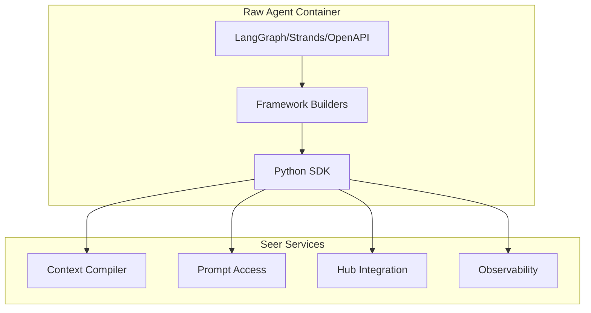

# Python SDK: Framework Convenience APIs

> **Status**: 🟢 Design Complete  
> **Last Updated**: 2026-01-12  
> **Design Level**: C2 (Container)

---

## Overview

The Framework Convenience APIs provide Python SDK builders and integrations for popular agentic frameworks: LangGraph, Strands, and OpenAPI agent builders. These APIs maintain framework-agnostic design principles while providing convenient integrations for developers using these frameworks.

**Key Design Point**: The SDK provides framework-specific builders that integrate Seer services (context compilation, prompts, tools, observability) with popular frameworks, while maintaining the core SDK APIs as framework-agnostic.

---

## Architecture



---

## Functional Scope

### LangGraph Integration

- **LangGraph Agent Builder**: Builder for creating LangGraph agents with Seer integration
- **Context Compilation Node**: LangGraph node for context compilation
- **Tool Integration**: Automatic tool integration with LangGraph tools
- **Observability Integration**: Automatic observability for LangGraph nodes

### Strands Integration

- **Strands Agent Builder**: Builder for creating Strands agents with Seer integration
- **Context Compilation Step**: Strands step for context compilation
- **Tool Integration**: Automatic tool integration with Strands tools
- **Observability Integration**: Automatic observability for Strands steps

### OpenAPI Agent Builder

- **OpenAPI Agent Builder**: Builder for creating agents from OpenAPI specifications
- **Automatic Tool Generation**: Generate tools from OpenAPI schemas
- **Seer Service Integration**: Integrate Seer services with OpenAPI agents

### Framework-Agnostic Core

- **Core SDK APIs**: All core SDK APIs remain framework-agnostic
- **Framework Adapters**: Framework-specific adapters wrap core APIs
- **No Framework Lock-In**: Developers can use core APIs without framework builders

---

## API Reference

### LangGraph Integration

```python
from seer_sdk.frameworks.langgraph import SeerLangGraphBuilder
from langgraph.graph import StateGraph

# Initialize builder
builder = SeerLangGraphBuilder.from_environment()

# Create LangGraph agent with Seer integration
graph = builder.create_agent(
    name="fraud-analyst",
    system_prompt="You are a fraud analyst...",
    tools=["get-transactions", "analyze-pattern"],
    context_compilation=True  # Enable automatic context compilation
)

# Add custom nodes
graph.add_node("custom_analysis", custom_analysis_function)

# Compile graph
app = graph.compile()

# Run agent
result = app.invoke({"input": "Analyze transaction tx-123"})
```

### Strands Integration

```python
from seer_sdk.frameworks.strands import SeerStrandsBuilder
from strands import Strand

# Initialize builder
builder = SeerStrandsBuilder.from_environment()

# Create Strands agent with Seer integration
strand = builder.create_agent(
    name="fraud-analyst",
    system_prompt="You are a fraud analyst...",
    tools=["get-transactions", "analyze-pattern"],
    context_compilation=True  # Enable automatic context compilation
)

# Add custom steps
strand.add_step("custom_analysis", custom_analysis_function)

# Run agent
result = strand.run("Analyze transaction tx-123")
```

### OpenAPI Agent Builder

```python
from seer_sdk.frameworks.openapi import SeerOpenAPIAgentBuilder

# Initialize builder
builder = SeerOpenAPIAgentBuilder.from_environment()

# Create agent from OpenAPI spec
agent = builder.from_openapi_spec(
    openapi_spec_path="fraud-api.yaml",
    agent_name="fraud-analyst",
    system_prompt="You are a fraud analyst...",
    context_compilation=True  # Enable automatic context compilation
)

# Run agent
result = agent.run("Analyze transaction tx-123")
```

### Framework-Agnostic Usage

```python
from seer_sdk import SeerSDK

# Use core SDK APIs directly (framework-agnostic)
sdk = SeerSDK.from_environment()

# Context compilation
context = await sdk.context_compiler.compile(...)

# Prompts
prompt = await sdk.prompts.get_system_prompt()

# Tools
result = await sdk.hub.tools.invoke(...)

# Observability
sdk.observability.metrics.counter("custom_metric").inc()
```

---

## Integration Points

### Core SDK APIs

- **Context Compiler APIs**: Framework builders use core context compilation APIs
- **Prompt Access APIs**: Framework builders use core prompt access APIs
- **Hub Integration APIs**: Framework builders use core Hub integration APIs
- **Observability APIs**: Framework builders use core observability APIs

### Framework-Specific Integrations

- **LangGraph**: Integration with LangGraph StateGraph and nodes
- **Strands**: Integration with Strands Strand and steps
- **OpenAPI**: Integration with OpenAPI specification parsing and tool generation

---

## Key Design Decisions

### Framework-Agnostic Core

**Decision**: Core SDK APIs remain framework-agnostic; framework builders are optional convenience layers.

**Rationale**:
- Developers can use core APIs with any framework
- No framework lock-in
- Framework builders are optional convenience

### Framework Builders as Adapters

**Decision**: Framework builders are adapters that wrap core SDK APIs with framework-specific interfaces.

**Rationale**:
- Maintains single source of truth (core APIs)
- Framework builders don't duplicate functionality
- Easier to maintain and extend

### Automatic Integration

**Decision**: Framework builders automatically integrate Seer services (context compilation, prompts, tools, observability).

**Rationale**:
- Reduces boilerplate code
- Ensures consistent integration patterns
- Developers can opt-in to specific integrations

---

## Related Documentation

- [Python SDK: Employment Spec APIs](employment-spec-apis.md)
- [Python SDK: Prompt APIs](prompt-apis.md)
- [Python SDK: Context Compiler APIs](context-compiler-apis.md)
- [Python SDK: Overview](../README.md)

---

*Framework Convenience APIs provide optional builders for popular frameworks while maintaining framework-agnostic core APIs.*
