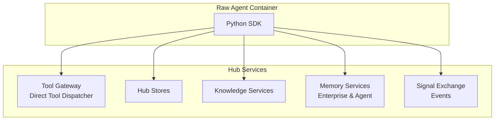

# Python SDK: Hub Integration APIs

> **Status**: 🟢 Design Complete  
> **Last Updated**: 2026-01-12  
> **Design Level**: C2 (Container)

---

## Overview

The Hub Integration APIs provide Python SDK interfaces for Raw Agents to interact with Hub services: tool discovery and invocation, Stores, Knowledge Services, Memory Services (Enterprise Memory and Agent Memory), and Events APIs (Signal Exchange). These APIs provide a unified interface for all Hub service interactions.

**Key Design Point**: The SDK provides framework-agnostic APIs that abstract Hub service details, handle authentication, and provide consistent error handling and observability.

---

## Architecture



---

## Functional Scope

### Tool Discovery and Calling

- **Tool Discovery**: Discover available tools based on agent's access permissions
- **Tool Invocation**: Invoke tools with automatic credential resolution and access control
- **Tool Metadata**: Access tool schemas, capabilities, and usage patterns
- **Direct Tool Dispatcher**: Direct tool invocation bypassing Signal Exchange

### Stores

- **Store Access**: Read/write access to Hub Stores
- **Store Operations**: Get, put, delete, list operations
- **Store Isolation**: Automatic isolation per (tenant, workbench, scenario, request, agent)

### Knowledge Services

- **Knowledge Search**: RAG-based search across knowledge bases
- **Reference Data**: Lookup reference data and structured information
- **Knowledge Base Access**: Access to specific knowledge bases configured in Training Spec

### Memory Services

- **Enterprise Memory**: Access to Enterprise Memory (precedents, case history, patterns)
- **Agent Memory**: Access to Agent Memory (conversation, KV stores, documents, logs)
- **Memory Tools**: Tool-based access to Enterprise Memory with built-in authorization

### Events APIs

- **Request Updates**: Submit request updates to Signal Exchange
- **Event Publishing**: Publish events to Signal Exchange
- **Event Subscription**: Subscribe to events (future capability)

---

## API Reference

### Initialization

```python
from seer_sdk import SeerSDK

# Initialize SDK (auto-detects agent identity from environment)
sdk = SeerSDK.from_environment()

# Access Hub Integration APIs
hub = sdk.hub
```

### Tool Discovery and Calling

```python
# Discover available tools
tools = await hub.tools.discover()
for tool in tools:
    print(f"{tool.name}: {tool.description}")
    print(f"  Protocol: {tool.protocol}")
    print(f"  Schema: {tool.input_schema}")

# Get tool by name/protocol
tool = await hub.tools.get("get-transactions")
print(tool.schema)

# Invoke tool
result = await hub.tools.invoke(
    tool_name="get-transactions",
    parameters={
        "account_id": "acc-123",
        "date_range": {"start": "2026-01-01", "end": "2026-01-31"}
    }
)
print(result.data)

# Invoke tool with alias (from Employment Spec)
result = await hub.tools.invoke_by_alias(
    alias="get_transactions",  # From Employment Spec tool bindings
    parameters={...}
)
```

### Stores

```python
# Get value from store
value = await hub.stores.get(
    store="case-entities",
    key="customer_profile"
)

# Put value to store
await hub.stores.put(
    store="case-entities",
    key="fraud_assessment",
    value={"risk_score": 0.85, "decision": "escalate"}
)

# Delete value from store
deleted = await hub.stores.delete(
    store="case-entities",
    key="old_key"
)

# List keys in store
keys = await hub.stores.list("case-entities")
for key in keys:
    print(key)

# Check if key exists
exists = await hub.stores.exists("case-entities", "customer_profile")
```

### Knowledge Services

```python
# Search knowledge base
results = await hub.knowledge.search(
    knowledge_base="fraud-policies",
    query="chargeback eligibility criteria",
    top_k=5
)
for result in results:
    print(f"{result.chunk}: {result.score}")

# Get reference data
reference_data = await hub.knowledge.get_reference(
    knowledge_base="fraud-policies",
    key="chargeback_rules"
)

# List available knowledge bases
knowledge_bases = await hub.knowledge.list_bases()
for kb in knowledge_bases:
    print(f"{kb.name}: {kb.description}")
```

### Memory Services

#### Enterprise Memory

```python
# Search precedents
precedents = await hub.memory.enterprise.search_precedent(
    query="unauthorized transaction disputes",
    limit=5,
    min_score=0.7
)
for precedent in precedents:
    print(f"{precedent.case_id}: {precedent.summary} (score: {precedent.similarity_score})")

# Get case history
case_history = await hub.memory.enterprise.get_case_history(
    case_id="case-12345"
)

# Get patterns
patterns = await hub.memory.enterprise.get_patterns(
    pattern_type="fraud_indicators"
)
```

#### Agent Memory

```python
# KV Store operations
await hub.memory.agent.kv.put(
    store="case-entities",
    key="fraud_assessment",
    value={"risk_score": 0.85}
)
value = await hub.memory.agent.kv.get("case-entities", "fraud_assessment")

# Conversation operations
await hub.memory.agent.conversation.append(
    store="case-dialog",
    role="assistant",
    content="Analyzing transaction patterns..."
)
messages = await hub.memory.agent.conversation.get_last(
    store="case-dialog",
    n=10
)

# Document operations
await hub.memory.agent.documents.store(
    store="case-documents",
    document_id="doc-123",
    content="Transaction analysis report...",
    metadata={"type": "analysis", "created_at": "2026-01-12"}
)
document = await hub.memory.agent.documents.get("case-documents", "doc-123")

# Log operations
await hub.memory.agent.log.append(
    store="case-audit",
    level="INFO",
    message="Transaction analyzed",
    attributes={"transaction_id": "tx-123", "risk_score": 0.85}
)
logs = await hub.memory.agent.log.get_last("case-audit", n=20)
```

### Events APIs

```python
# Submit request update
await hub.events.submit_request_update(
    request_id="req-abc123",
    update_type="task_created",
    payload={
        "task_id": "task-001",
        "task_type": "fraud_investigation",
        "context": {...}
    }
)

# Publish event
await hub.events.publish(
    event_type="case.analyzed",
    payload={
        "case_id": "case-12345",
        "risk_score": 0.85,
        "decision": "escalate"
    }
)
```

---

## Integration Points

### Tool Gateway / Direct Tool Dispatcher

- **Tool Discovery**: Tool Registry for tool discovery
- **Tool Invocation**: Direct Tool Dispatcher for tool calls
- **Access Control**: Automatic access control enforcement
- **Credential Resolution**: Automatic credential resolution from Employment Spec

### Hub Stores

- **Store Service**: Direct API calls to Hub Stores
- **Isolation**: Automatic isolation per (tenant, workbench, scenario, request, agent)
- **Authentication**: Uses agent's SPIFFE identity

### Knowledge Services

- **Knowledge Base API**: Direct API calls to Knowledge Services
- **RAG Search**: RAG-based search across knowledge bases
- **Reference Data**: Structured reference data lookup

### Memory Services

- **Enterprise Memory**: Tool-based access via Memory Access Tools
- **Agent Memory**: Direct SDK access to Agent Memory Services
- **Authorization**: Built-in authorization for Enterprise Memory access

### Signal Exchange

- **Request Updates**: API for submitting request updates
- **Event Publishing**: API for publishing events
- **Event Subscription**: Future capability for event subscriptions

---

## Key Design Decisions

### Framework-Agnostic Design

**Decision**: SDK APIs are framework-agnostic and work with any Python agentic framework.

**Rationale**:
- Raw Agents may use different frameworks (LangChain, LangGraph, Strands, custom)
- SDK should not impose framework constraints
- Simple, direct API surface

### Tool-Based Enterprise Memory Access

**Decision**: Enterprise Memory access goes through Memory Access Tools, not direct API calls.

**Rationale**:
- Built-in authorization and access control
- Context-aware tool invocations
- Consistent with Hub tool invocation patterns
- Audit trail for all memory access

### Direct Tool Dispatcher

**Decision**: SDK uses Direct Tool Dispatcher for tool invocations, bypassing Signal Exchange when appropriate.

**Rationale**:
- Lower overhead for function-like tool calls
- Automatic credential resolution
- Access control enforcement
- Observability integration

### Automatic Isolation

**Decision**: All store and memory operations are automatically isolated per (tenant, workbench, scenario, request, agent).

**Rationale**:
- Prevents accidental cross-contamination
- Security and privacy by default
- No manual scope management needed

---

## Error Handling

```python
from seer_sdk.exceptions import ToolNotFound, AccessDenied, StoreError

try:
    result = await hub.tools.invoke("get-transactions", {...})
except ToolNotFound:
    # Tool not found or not accessible
    print("Tool not available")
except AccessDenied:
    # Access denied by access control
    print("Access denied to tool")
except StoreError as e:
    # Store operation failed
    print(f"Store error: {e.message}")
```

---

## Observability

The SDK automatically instruments all Hub service interactions:

- **Metrics**: Tool invocation latency, store operation counts, memory access patterns
- **Traces**: Full trace context for all Hub service calls
- **Logs**: Structured logging for all operations with context

---

## Related Documentation

- [Hub Tool Gateway](../../../../../olympus-hub-docs/04-subsystems/hub-native-utilities/direct-tool-dispatcher.md)
- [Hub Stores](../../../../../olympus-hub-docs/04-subsystems/stores/README.md)
- [Knowledge Services](../../../../../olympus-hub-docs/04-subsystems/knowledge-services/README.md)
- [Memory Services](../../../../../olympus-hub-docs/04-subsystems/memory-services/README.md)
- [Signal Exchange](../../../../../olympus-hub-docs/04-subsystems/signal-exchange/README.md)
- [Python SDK: Overview](../README.md)

---

*Hub Integration APIs provide unified access to all Hub services with automatic authentication, access control, and observability.*
