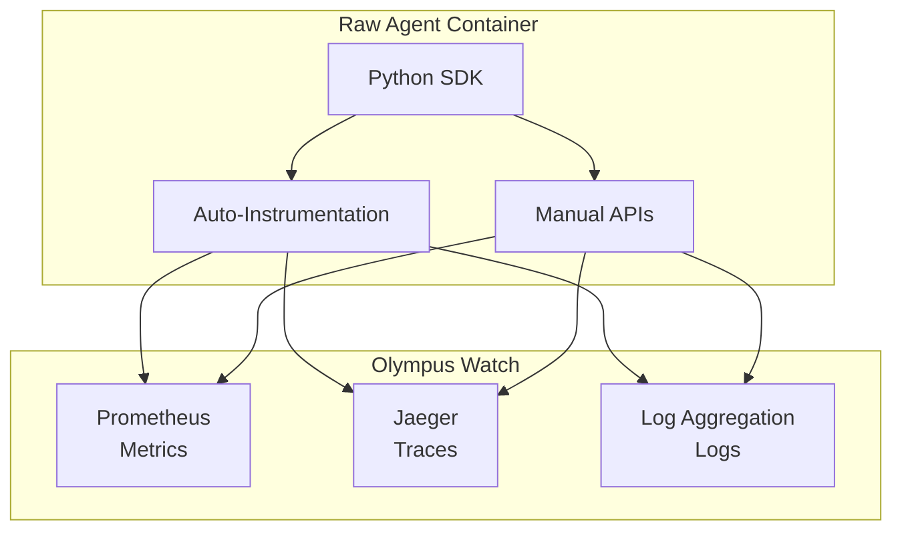

# Python SDK: Observability APIs

> **Status**: 🟢 Design Complete  
> **Last Updated**: 2026-01-12  
> **Design Level**: C2 (Container)

---

## Overview

The Observability APIs provide Python SDK interfaces for Raw Agents to report metrics, create traces, emit structured logs, and enable auto-instrumentation. All observability data flows to Olympus Watch for unified monitoring, dashboards, and alerting.

**Key Design Point**: The SDK provides auto-instrumentation for common operations (LLM calls, tool invocations, memory operations) and manual APIs for custom instrumentation. All data is structured and includes trace context propagation.

---

## Architecture



---

## Functional Scope

### Metrics Reporting

- **Custom Metrics**: Counter, histogram, gauge metrics
- **Standard Metrics**: Pre-defined agent metrics (request duration, LLM tokens, tool invocations)
- **Prometheus Format**: Metrics exposed via `/metrics` endpoint
- **Metric Labels**: Structured labels for filtering and aggregation

### Tracing

- **Span Creation**: Manual span creation for custom operations
- **Auto-Instrumentation**: Automatic spans for LLM calls, tool invocations, memory operations
- **Trace Context Propagation**: W3C Trace Context via OpenTelemetry
- **Span Attributes**: Custom attributes for span enrichment

### Structured Logging

- **Structured JSON Logs**: Consistent log format with required fields
- **Context Propagation**: Automatic inclusion of trace_id, span_id, request_id
- **Log Levels**: DEBUG, INFO, WARN, ERROR with configurable minimum level
- **PII Redaction**: Automatic PII redaction by log shipper (defense-in-depth)

### Auto-Instrumentation

- **LLM Calls**: Automatic spans and metrics for Model Gateway calls
- **Tool Invocations**: Automatic spans and metrics for tool calls
- **Memory Operations**: Automatic spans and metrics for memory store operations
- **Context Assembly**: Automatic spans for context compilation

---

## API Reference

### Initialization

```python
from seer_sdk import SeerSDK

# Initialize SDK (auto-detects agent identity from environment)
sdk = SeerSDK.from_environment()

# Access Observability APIs
observability = sdk.observability
```

### Metrics

```python
# Counter metric
observability.metrics.counter("transactions_analyzed").inc()
observability.metrics.counter("transactions_analyzed", labels={"outcome": "approved"}).inc()

# Histogram metric
observability.metrics.histogram("risk_score").observe(0.85)
observability.metrics.histogram("request_duration_seconds").observe(1.23)

# Gauge metric
observability.metrics.gauge("active_requests").set(5)
observability.metrics.gauge("queue_size").inc()
observability.metrics.gauge("queue_size").dec()
```

### Tracing

```python
from seer_sdk.observability import span

# Manual span creation
with span("custom_analysis", attributes={"transaction_id": tx_id}):
    result = perform_analysis()
    span.set_attribute("risk_score", result.risk_score)
    span.set_attribute("decision", result.decision)

# Nested spans
with span("fraud_investigation"):
    with span("transaction_analysis"):
        analyze_transaction()
    with span("pattern_matching"):
        match_patterns()
```

### Structured Logging

```python
from seer_sdk.observability import log

# Info log
log.info("Transaction analyzed",
    transaction_id=tx_id,
    risk_score=result.risk_score,
    decision="approve"
)

# Error log
log.error("Analysis failed",
    transaction_id=tx_id,
    error=str(e),
    stack_trace=traceback.format_exc()
)

# Debug log
log.debug("Retrieving context",
    request_id=req_id,
    sources=["memory", "knowledge"]
)
```

### Auto-Instrumentation

```python
from seer_sdk.observability import auto_instrument

# Auto-instrument function
@auto_instrument
def analyze_transaction(transaction_id: str):
    # LLM calls, tool invocations, memory ops automatically traced
    context = context_compiler.compile(...)
    result = llm.call(...)
    tool.invoke(...)
    memory.store(...)
    return result

# Auto-instrument async function
@auto_instrument
async def analyze_transaction_async(transaction_id: str):
    # Automatically traced
    ...
```

---

## Integration Points

### Olympus Watch

- **Prometheus**: Metrics scraped from `/metrics` endpoint
- **Jaeger**: Traces exported via OpenTelemetry
- **Log Aggregation**: Logs shipped via Atlantis log shipper
- **Dashboards**: Pre-built dashboards in Watch
- **Alerts**: Configurable alert rules in Watch

### OpenTelemetry

- **OTel SDK**: Underlying instrumentation library
- **Trace Context**: W3C Trace Context propagation
- **Exporters**: OTLP exporters for traces and metrics

### Atlantis Infrastructure

- **Log Shipper**: DaemonSet for log collection and PII redaction
- **OTel Collector**: Metrics and trace collection
- **Prometheus**: Metrics scraping

---

## Key Design Decisions

### Built on Watch

**Decision**: All observability data flows to Olympus Watch; no Seer-specific observability infrastructure.

**Rationale**:
- Unified observability platform
- No duplicate infrastructure
- Consistent with Hub observability patterns

### Auto-Instrumentation

**Decision**: SDK provides auto-instrumentation for common operations (LLM calls, tool invocations, memory operations).

**Rationale**:
- Reduces developer burden
- Ensures consistent instrumentation
- Captures all agent operations automatically

### Structured Logging

**Decision**: All logs are structured JSON with required fields (timestamp, level, agent_id, request_id, trace_id).

**Rationale**:
- Enables log aggregation and search
- Supports correlation with traces and metrics
- Consistent format across all agents

### PII Redaction

**Decision**: PII redaction performed by log shipper (defense-in-depth), but agents should avoid logging PII.

**Rationale**:
- Defense-in-depth security
- Automatic redaction reduces risk
- Agents should still minimize PII in logs

---

## Related Documentation

- [Agent Observability](../../agent-observability.md) — Full observability design
- [Olympus Watch](../../../../../olympus-hub-docs/05-infrastructure/olympus-watch.md) — Observability platform
- [Python SDK: Overview](../README.md)

---

*Observability APIs provide comprehensive metrics, tracing, and logging with auto-instrumentation, all integrated with Olympus Watch.*
