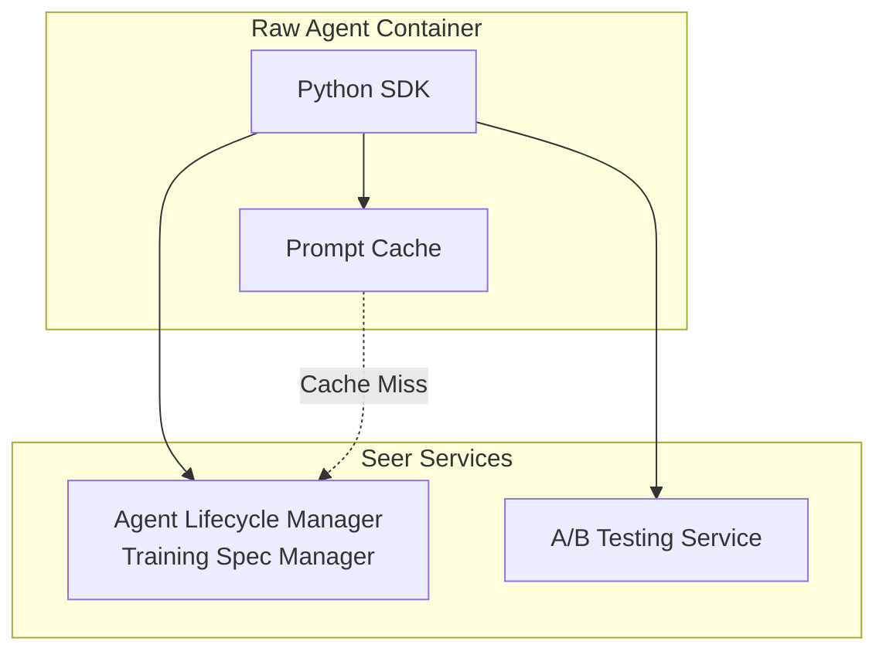

# Python SDK: Prompt Access APIs

> **Status**: 🟢 Design Complete  
> **Last Updated**: 2026-01-12  
> **Design Level**: C2 (Container)

---

## Overview

The Prompt Access APIs provide Python SDK interfaces for Raw Agents to retrieve prompts from Training Specs with support for A/B testing, authority enforcement awareness, prompt versioning, and autonomy level-based selection. Prompts are tagged with autonomy levels (Full, Suggest, Ask, Watch) and are used at the tagged level or lower levels of autonomy.

**Key Design Point**: Prompts are retrieved from Training Specs and selected based on the current agent's autonomy level. A/B testing variants are automatically selected based on configured experiments.

---

## Architecture



---

## Functional Scope

### Prompt Retrieval

- **Get System Prompt**: Retrieve the system prompt for the current agent
- **Get Skill Prompt**: Retrieve a specific skill prompt by name
- **Get Prompt by Autonomy Level**: Retrieve prompts filtered by autonomy level
- **List Available Prompts**: List all available prompts and their autonomy levels

### Autonomy Level-Based Selection

- **Autonomy Level Hierarchy**: Full > Suggest > Ask > Watch
- **Prompt Selection**: Prompts tagged with an autonomy level are used at that level or lower levels
- **Exclusive Tags**: Prompts can be exclusively tagged for a specific autonomy level
- **Current Autonomy Level**: Determined from Employment Spec authority configuration

### A/B Testing Awareness

- **Variant Selection**: Automatic selection of prompt variants based on A/B test configuration
- **Experiment Tracking**: Track which variant is used for each agent instance
- **Sticky Assignment**: Consistent variant assignment per agent instance

### Authority Enforcement Awareness

- **Authority-Aware Prompts**: Prompts include authority constraints and ceilings
- **Context Injection**: Authority information automatically injected into prompts
- **Dynamic Prompting**: Prompts adapt based on current authority state

### Prompt Versioning

- **Version Resolution**: Automatic version resolution (latest vs. specific version)
- **Version History**: Access to version history and change tracking
- **Version Pinning**: Support for version pinning to prevent unexpected changes

---

## API Reference

### Initialization

```python
from seer_sdk import SeerSDK

# Initialize SDK (auto-detects agent identity from environment)
sdk = SeerSDK.from_environment()

# Access Prompt APIs
prompts = sdk.prompts
```

### Get System Prompt

```python
# Get system prompt (with autonomy level filtering)
system_prompt = await prompts.get_system_prompt()

# Get with specific autonomy level
system_prompt = await prompts.get_system_prompt(
    autonomy_level="Full"  # "Full" | "Suggest" | "Ask" | "Watch"
)

# Get with A/B testing
system_prompt = await prompts.get_system_prompt(
    ab_test_group="experiment-001"
)
```

### Get Skill Prompt

```python
# Get skill prompt by name
skill_prompt = await prompts.get_skill_prompt("analyze-transaction")

# Get with autonomy level
skill_prompt = await prompts.get_skill_prompt(
    name="analyze-transaction",
    autonomy_level="Suggest"
)

# Get with A/B testing
skill_prompt = await prompts.get_skill_prompt(
    name="analyze-transaction",
    ab_test_group="experiment-001"
)
```

### Autonomy Level-Based Selection

```python
# Get prompt for current autonomy level (from Employment Spec)
prompt = await prompts.get_system_prompt(
    use_current_autonomy=True  # Default: True
)

# Get prompt for specific autonomy level
prompt = await prompts.get_system_prompt(
    autonomy_level="Ask"  # Will include prompts tagged "Ask", "Watch"
)

# List prompts by autonomy level
prompts_by_level = await prompts.list_by_autonomy_level("Full")
for prompt in prompts_by_level:
    print(f"{prompt.name}: {prompt.autonomy_level}")
```

### A/B Testing

```python
# Get prompt with A/B testing (automatic variant selection)
prompt = await prompts.get_system_prompt(
    enable_ab_testing=True  # Default: True
)

# Get specific A/B test variant
prompt = await prompts.get_system_prompt(
    ab_test_group="experiment-001",
    variant="variant-b"
)

# Get A/B test assignment for current agent
assignment = await prompts.get_ab_test_assignment("experiment-001")
print(f"Variant: {assignment.variant}")
print(f"Sticky: {assignment.is_sticky}")
```

### Authority Enforcement Awareness

```python
# Get prompt with authority constraints injected
prompt = await prompts.get_system_prompt(
    include_authority=True  # Default: True
)

# Access authority information in prompt
print(prompt.authority_constraints)
print(prompt.ceilings)
print(prompt.delegation_info)

# Get prompt without authority injection
prompt = await prompts.get_system_prompt(
    include_authority=False
)
```

### Prompt Versioning

```python
# Get latest version
prompt = await prompts.get_system_prompt()

# Get specific version
prompt = await prompts.get_system_prompt(version="1.2.3")

# List available versions
versions = await prompts.list_versions("system")
for version in versions:
    print(f"{version.version}: {version.created_at}")

# Get version info
version_info = await prompts.get_version_info("system", version="1.2.3")
print(version_info.changes)
```

### Prompt Fields Access

```python
prompt = await prompts.get_system_prompt()

# Access prompt content
print(prompt.content)
print(prompt.text)

# Access metadata
print(prompt.name)
print(prompt.autonomy_level)
print(prompt.version)
print(prompt.created_at)

# Access authority information
if prompt.authority_constraints:
    print(prompt.authority_constraints.ceilings)
    print(prompt.authority_constraints.delegation)

# Access A/B testing info
if prompt.ab_test_info:
    print(prompt.ab_test_info.experiment_id)
    print(prompt.ab_test_info.variant)
```

---

## Autonomy Level Selection Logic

### Autonomy Level Hierarchy

```
Full > Suggest > Ask > Watch
```

### Selection Rules

1. **Tagged Level or Lower**: A prompt tagged with "Full" can be used at Full, Suggest, Ask, or Watch
2. **Tagged Level or Lower**: A prompt tagged with "Suggest" can be used at Suggest, Ask, or Watch
3. **Tagged Level or Lower**: A prompt tagged with "Ask" can be used at Ask or Watch
4. **Tagged Level Only**: A prompt tagged with "Watch" can only be used at Watch
5. **Exclusive Tags**: If a prompt is exclusively tagged for a level, it's only used at that level

### Example

```python
# Training Spec has:
# - systemPrompt (autonomy_level: "Full")
# - systemPromptSuggest (autonomy_level: "Suggest", exclusive: true)
# - systemPromptAsk (autonomy_level: "Ask")

# Agent with autonomy level "Full":
prompt = await prompts.get_system_prompt(autonomy_level="Full")
# Returns: systemPrompt (tagged "Full")

# Agent with autonomy level "Suggest":
prompt = await prompts.get_system_prompt(autonomy_level="Suggest")
# Returns: systemPromptSuggest (exclusive "Suggest" tag)

# Agent with autonomy level "Ask":
prompt = await prompts.get_system_prompt(autonomy_level="Ask")
# Returns: systemPromptAsk (tagged "Ask")
```

---

## Training Spec Prompt Structure

```yaml
behavioral:
  systemPrompt: |
    You are a Fraud Case Analyst...
  systemPromptAutonomyLevel: "Full"  # Tag for autonomy level
  
  skillPrompts:
    - name: analyze-transaction
      prompt: |
        When analyzing a transaction...
      autonomyLevel: "Suggest"  # Tag for autonomy level
      exclusive: false  # Can be used at lower levels
    
    - name: recommend-outcome
      prompt: |
        When recommending...
      autonomyLevel: "Ask"
      exclusive: true  # Only used at "Ask" level
    
    - name: observe-only
      prompt: |
        Observe and report...
      autonomyLevel: "Watch"
      exclusive: true  # Only used at "Watch" level
```

---

## Integration Points

### Agent Lifecycle Manager

- **Training Spec Manager**: Source of truth for prompts
- **Integration**: Direct API calls to Training Spec Manager
- **Authentication**: Uses agent's SPIFFE identity for authentication

### A/B Testing Service

- **Variant Selection**: Automatic variant selection based on experiments
- **Assignment Tracking**: Track variant assignments per agent
- **Integration**: API calls to A/B Testing Service

### Employment Spec

- **Current Autonomy Level**: Retrieved from Employment Spec authority configuration
- **Authority Constraints**: Authority ceilings and delegation info injected into prompts

### Local Cache

- **In-Memory Cache**: Fast local access to prompts
- **Cache Invalidation**: Listens for prompt update events
- **Cache Refresh**: Periodic refresh and on-demand refresh

---

## Key Design Decisions

### Autonomy Level-Based Selection

**Decision**: Prompts are tagged with autonomy levels and selected based on the agent's current autonomy level.

**Rationale**:
- Different autonomy levels require different prompt styles
- Full autonomy needs different instructions than supervised autonomy
- Ensures prompts match the agent's authority level

**Selection Logic**:
- Prompts tagged at a level can be used at that level or lower
- Exclusive tags restrict usage to specific levels
- Current autonomy level determined from Employment Spec

### A/B Testing Integration

**Decision**: A/B testing is built into prompt retrieval with automatic variant selection.

**Rationale**:
- Enables prompt experimentation without code changes
- Supports gradual rollout of prompt improvements
- Tracks variant performance per agent instance

### Authority Enforcement Awareness

**Decision**: Authority constraints are automatically injected into prompts.

**Rationale**:
- Agents need to know their authority limits
- Prompts should reflect current authority state
- Reduces risk of agents exceeding authority

---

## Error Handling

```python
from seer_sdk.exceptions import PromptNotFound, AutonomyLevelMismatch

try:
    prompt = await prompts.get_system_prompt(autonomy_level="Full")
except PromptNotFound:
    # Prompt not found for current autonomy level
    print("No prompt found for autonomy level")
except AutonomyLevelMismatch:
    # Requested autonomy level doesn't match available prompts
    prompt = await prompts.get_system_prompt(use_current_autonomy=True)
```

---

## Observability

The SDK automatically instruments prompt access:

- **Metrics**: Prompt retrieval latency, cache hit/miss rates, A/B test variant distribution
- **Traces**: Full trace context for prompt retrieval operations
- **Logs**: Structured logging for prompt selection, A/B test assignments, and errors

---

## Related Documentation

- [Agent Lifecycle Manager: Training Spec Manager](../agent-lifecycle-manager/training-spec-manager.md)
- [Training Spec CRD](../../hub-integration/training-spec-crd.md)
- [APO: Autonomy Levels](../../../personas-and-needs/apo.md)
- [Python SDK: Overview](../README.md)

---

*Prompt Access APIs provide autonomy level-aware, A/B testing-enabled prompt retrieval with authority enforcement awareness.*
