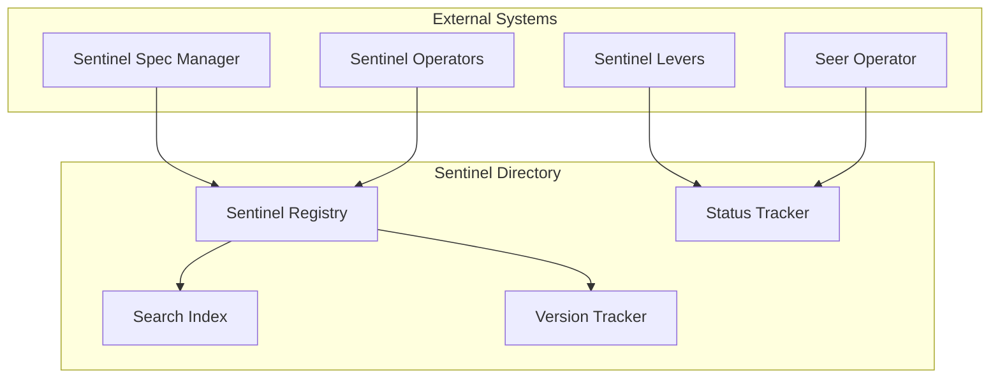
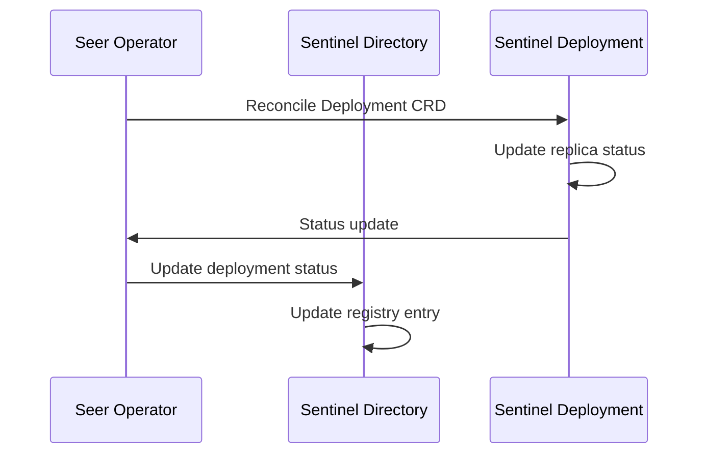

# Sentinel Directory

> **Status**: 🟢 Design Complete  
> **Last Updated**: 2026-01-14  
> **Design Level**: C2 (Container)

---

## Overview

Sentinel Directory is the registry for Sentinel Specs and Deployments. It provides search, version tracking, and deployment status for sentinels.

**Key Principle**: Sentinel Directory maintains a searchable index of all sentinels, their versions, deployment status, and associated metadata.

---

## Architecture



---

## Functional Scope

### Sentinel Registry

Sentinel Directory maintains a registry of Sentinel Specs:

#### Registry Entry Structure

```yaml
sentinel_entry:
  sentinel_id: "stuck-agent-detector"
  sentinel_name: "Stuck Agent Detector"
  sentinel_type: "realtime"  # realtime | analytical | request
  version: "1.0.0"
  workbench_id: "acme-disputes"
  
  # COG Sentinel fields (only for COG Sentinels)
  cog_sentinel:
    is_cog: false             # true if COG Sentinel
    source_workbench: null    # Source COGW workbench (if COG)
    read_only: false          # true if read-only copy in target
    global_status: null       # Status set by COGW admin
    local_status: null        # Status set by local admin
  
  target_scope:
    workbench_ids: ["acme-disputes"]
    agent_ids: []
  state: "deployed"  # drafted | validated | deployed | suspended | archived
  deployment_status:
    deployment_id: "stuck-agent-detector-deployment"
    replicas: 2
    active_replicas: 2
    last_deployment: "2026-01-13T10:00:00Z"
  metadata:
    created_at: "2026-01-13T09:00:00Z"
    created_by: "user@acme.com"
    updated_at: "2026-01-13T10:00:00Z"
```

#### Request Sentinel Registry Entry

Request Sentinels include additional fields for scenario references and participation configuration:

```yaml
sentinel_entry:
  sentinel_id: "token-usage-governance"
  sentinel_name: "Token Usage Governance Sentinel"
  sentinel_type: "request"
  version: "1.0.0"
  workbench_id: "acme-disputes"
  target_scope:
    workbench_ids: ["acme-disputes"]
  state: "deployed"
  
  # Request Sentinel specific fields
  sentinel_scenario_specs:
    normative_ref:
      name: "token-usage-governance-normative"
      version: "1.0.0"
    automation_ref:
      name: "token-usage-governance-automation"
      version: "1.0.0"
    deployment_ref:
      name: "token-usage-governance-deployment"
      version: "1.0.0"
  
  trained_agent_ref:
    name: "token-usage-governance-agent"
    namespace: "acme-disputes"
    version: "1.0.0"
  
  participation_filters:
    mode: "observe_and_participate"
    scenario_whitelist: ["standard-dispute", "high-value-dispute"]
    scenario_blacklist: []
    on_request_update:
      enabled: true
  
  # Enrollment statistics
  enrollment_stats:
    current_enrollments: 45
    total_enrollments: 1250
    max_concurrent: 100
  
  deployment_status:
    employed_agent_id: "token-usage-governance-agent-001"
    status: "active"
    last_activity: "2026-01-14T10:30:00Z"
  
  metadata:
    created_at: "2026-01-14T09:00:00Z"
    created_by: "developer@acme.com"
    updated_at: "2026-01-14T10:00:00Z"
```

#### Registry Indexes

| Index | Purpose |
|-------|---------|
| **By Sentinel ID** | Direct lookup |
| **By Workbench** | Workbench-scoped sentinels |
| **By Sentinel Type** | Realtime vs. Analytical vs. Request |
| **By State** | Active sentinels |
| **By Deployment Status** | Deployment health |
| **By Trained Agent** | Find sentinels using specific Trained Agent (Request only) |
| **By Scenario Filter** | Find sentinels filtering specific scenarios (Request only) |
| **By Participation Mode** | Filter by observe/participate/observe_and_participate (Request only) |

---

### Search & Discovery

Sentinel Directory provides search capabilities:

#### Search Queries

| Query Type | Description | Example |
|-----------|-------------|---------|
| **By Workbench** | Find sentinels for a workbench | `workbench_id=acme-disputes` |
| **By Sentinel Type** | Find realtime, analytical, or request sentinels | `type=request` |
| **By Agent** | Find sentinels targeting an agent | `target_agent_id=fraud-analyst` |
| **By State** | Find sentinels in a specific state | `state=deployed` |
| **By Deployment Status** | Find sentinels by deployment health | `deployment_status=healthy` |
| **By Trained Agent** | Find request sentinels using a Trained Agent | `trained_agent_ref=token-governance-agent` |
| **By Scenario Whitelist** | Find request sentinels filtering a scenario | `scenario_whitelist_contains=standard-dispute` |
| **By Participation Mode** | Find request sentinels by participation mode | `participation_mode=observe_and_participate` |

#### Search Example

```yaml
search_query:
  workbench_id: "acme-disputes"
  sentinel_type: "realtime"
  state: "deployed"
  
search_results:
  - sentinel_id: "stuck-agent-detector"
    sentinel_name: "Stuck Agent Detector"
    state: "deployed"
    deployment_status: "healthy"
  - sentinel_id: "cost-anomaly-detector"
    sentinel_name: "Cost Anomaly Detector"
    state: "deployed"
    deployment_status: "healthy"
```

---

### Version Tracking

Sentinel Directory tracks sentinel versions:

#### Version History

```yaml
version_history:
  sentinel_id: "stuck-agent-detector"
  versions:
    - version: "1.0.0"
      state: "deployed"
      deployed_at: "2026-01-13T10:00:00Z"
      deployment_id: "stuck-agent-detector-deployment-v1"
    - version: "0.9.0"
      state: "archived"
      archived_at: "2026-01-13T09:00:00Z"
```

#### Version Compatibility

- **Version tracking** for spec evolution
- **Compatibility matrix** for version upgrades
- **Migration paths** for version transitions

---

### Deployment Status Tracking

Sentinel Directory tracks deployment status:

#### Deployment Status

| Status | Description |
|--------|-------------|
| **Healthy** | All replicas active, no errors |
| **Degraded** | Some replicas inactive, errors present |
| **Unhealthy** | All replicas inactive, critical errors |
| **Unknown** | Status cannot be determined |

#### Status Update Flow



---

## Integration Points

### Upstream Integration

| Service | Integration Method | Purpose |
|---------|-------------------|---------|
| **Sentinel Spec Manager** | Spec registration API | Register new specs |
| **Sentinel Operators** | Lifecycle API | Update lifecycle state |
| **Sentinel Levers** | Status update API | Update runtime status |
| **Seer Operator** | Deployment status API | Update deployment status |

### Downstream Integration

| Service | Integration Method | Purpose |
|---------|-------------------|---------|
| **Search Consumers** | Search API | Query sentinel registry |

---

## Key Design Decisions

### Registry Model

- **Centralized registry** for all sentinels
- **Searchable indexes** for efficient queries
- **Version tracking** for spec evolution

### Status Tracking

- **Real-time status updates** from Seer Operator
- **Deployment health** monitoring
- **State synchronization** across systems

### Discovery Model

- **Workbench-scoped** sentinel discovery
- **Agent-scoped** sentinel discovery
- **Type-based** sentinel filtering

---

## Related Documentation

- [Sentinel Spec Manager](./sentinel-spec-manager.md) — Spec structure and registration
- [Sentinel Operators](./sentinel-operators.md) — Lifecycle management
- [Sentinel Levers](./sentinel-levers.md) — Runtime controls

---

*Sentinel Directory provides a searchable registry of Sentinel Specs and Deployments with version tracking and deployment status.*
