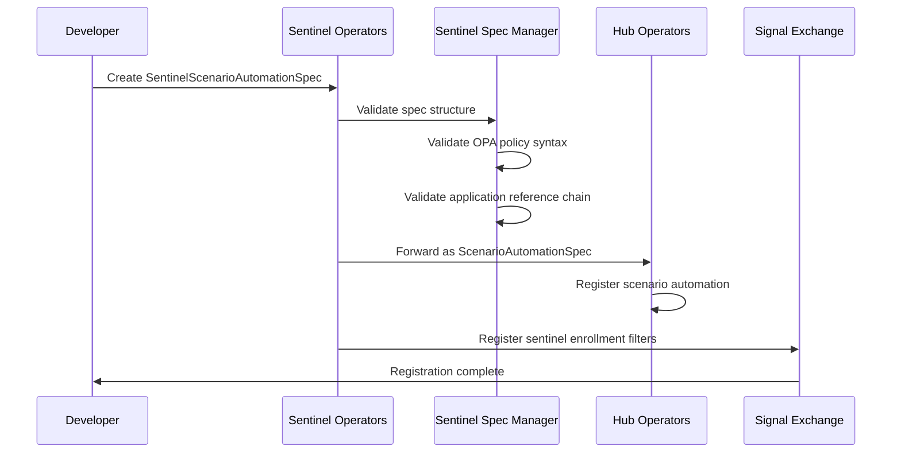

# Sentinel Scenario Automation Specification

> **Status**: 🟢 Design Complete  
> **Last Updated**: 2026-01-14  
> **Design Level**: C2 (Container)

---

## Overview

The **SentinelScenarioAutomationSpec** defines how a Request Sentinel scenario is automated. It extends Hub's `ScenarioAutomationSpec` with an isolated `sentinel` section that configures participation mode and filtering rules.

This specification binds the sentinel to a Hub Application (which references a Trained Agent via `seerTrainingRef`) and defines how the sentinel enrolls in and interacts with requests.

---

## Relationship to Hub ScenarioAutomationSpec

```
┌─────────────────────────────────────────────────────────────────────────────┐
│                    SPECIFICATION EXTENSION                                    │
│                                                                               │
│   ┌─────────────────────────────────────────────────────────────────────┐   │
│   │  Hub ScenarioAutomationSpec                                          │   │
│   │  • normative_ref                                                     │   │
│   │  • application (Hub Application binding)                             │   │
│   │  • triggers                                                          │   │
│   │  • tools                                                             │   │
│   │  • ai_agent configuration                                            │   │
│   └────────────────────────────────┬────────────────────────────────────┘   │
│                                    │                                         │
│                                    │ extends with sentinel section           │
│                                    ▼                                         │
│   ┌─────────────────────────────────────────────────────────────────────┐   │
│   │  SentinelScenarioAutomationSpec                                      │   │
│   │  • All fields from ScenarioAutomationSpec                            │   │
│   │  + sentinel:                                                         │   │
│   │      participation:                                                  │   │
│   │        mode: observe | participate | observe_and_participate         │   │
│   │        filters:                                                      │   │
│   │          scenario_whitelist: []                                      │   │
│   │          scenario_blacklist: []                                      │   │
│   │          on_request_update:                                          │   │
│   │            enabled: true                                             │   │
│   │            update_filter_policy: <OPA Rego>                          │   │
│   └─────────────────────────────────────────────────────────────────────┘   │
│                                                                               │
└─────────────────────────────────────────────────────────────────────────────┘
```

---

## Specification Structure

### CRD Definition

```yaml
apiVersion: seer.olympus.io/v1
kind: SentinelScenarioAutomationSpec
metadata:
  name: token-usage-governance-automation
  namespace: acme-disputes
  labels:
    workbench: acme-disputes
    sentinel: token-usage-governance
spec:
  # Reference to Normative Spec
  normative_ref:
    name: token-usage-governance-normative
    version: "1.0.0"

  # Hub Application Binding
  # This HubApplicationSpec contains seerTrainingRef pointing to Trained Agent
  application:
    ref: token-usage-governance-agent  # HubApplicationSpec name
    version: "1.0.0"
    runtime: seer

  # Triggers (Request Sentinels use internal enrollment, not external triggers)
  # Triggers section is typically empty or omitted for Request Sentinels
  triggers: []

  # Tool Bindings (inherited from ScenarioAutomationSpec)
  tools:
    - id: get-token-metrics
      tool_ref: hub://agent-analytics/token-metrics
      description: "Retrieve token usage metrics for a request"
      permissions:
        - read

    - id: add-observation
      tool_ref: hub://cronus/add-observation
      description: "Add observation to request"
      permissions:
        - write

    - id: escalate
      tool_ref: hub://task-management/escalate
      description: "Escalate to supervisor"
      permissions:
        - write

  # AI Agent Configuration
  ai_agent:
    model:
      provider: bedrock
      model_id: anthropic.claude-3-haiku  # Lightweight model for monitoring

    system_prompt_ref: "prompts://seer/token-governance-sentinel"

    guardrails:
      - id: read-only-unless-escalation
        enabled: true
        config:
          allow_writes_for:
            - add-observation
            - escalate

    memory:
      conversation_memory: false  # Sentinels typically don't need conversation memory
      working_memory: true
      entity_memory: false

  # ═══════════════════════════════════════════════════════════════════════════
  # SENTINEL-SPECIFIC SECTION
  # ═══════════════════════════════════════════════════════════════════════════
  sentinel:
    participation:
      # Participation Mode
      # - observe: Receive notifications but don't appear as assignee
      # - participate: Appear as assignee, can take actions
      # - observe_and_participate: Both observe and participate
      mode: observe_and_participate

      # Enrollment Filters
      filters:
        # Scenario Whitelist (optional)
        # If specified, only requests for these scenarios trigger enrollment
        scenario_whitelist:
          - standard-dispute
          - high-value-dispute
          - complex-dispute

        # Scenario Blacklist (optional)
        # Requests for these scenarios are excluded from enrollment
        scenario_blacklist:
          - internal-test-scenario

        # Request Update Filter
        on_request_update:
          enabled: true
          
          # OPA Policy for filtering which updates trigger enrollment
          # If policy returns true, sentinel enrolls on this update
          update_filter_policy: |
            package seer.sentinel.enrollment

            default allow = false

            # Enroll when a Seer agent is assigned to the request
            allow {
              input.update_type == "TASK_LIFECYCLE"
              input.payload.task.agent_type == "seer"
            }

            # Enroll when token usage is reported
            allow {
              input.update_type == "PROGRESS"
              input.payload.metrics.token_usage != null
            }

            # Enroll on any decision record
            allow {
              input.update_type == "DECISION"
            }
```

---

## Sentinel Section Details

### Participation Mode

| Mode | Description | Use Case |
|------|-------------|----------|
| **observe** | Receives webhook notifications for request updates but does not appear as an assignee | Passive monitoring, analytics, logging |
| **participate** | Added as an assignee to requests, can take actions within its child request | Active intervention, governance enforcement |
| **observe_and_participate** | Both observes and participates | Full monitoring with intervention capability |

### Enrollment Filters

Filters determine which requests the sentinel enrolls in:

#### Scenario Whitelist

```yaml
scenario_whitelist:
  - standard-dispute
  - high-value-dispute
```

- If specified, sentinel **only** enrolls in requests for listed scenarios
- If empty or omitted, sentinel considers all scenarios (subject to blacklist)

#### Scenario Blacklist

```yaml
scenario_blacklist:
  - internal-test-scenario
  - sandbox-scenario
```

- Requests for listed scenarios are **excluded** from enrollment
- Applied after whitelist filtering

#### Request Update Filter

```yaml
on_request_update:
  enabled: true
  update_filter_policy: |
    package seer.sentinel.enrollment
    
    default allow = false
    
    allow {
      input.update_type == "DECISION"
    }
```

- When `enabled: true`, sentinel can enroll on request updates (not just creation)
- `update_filter_policy` is an OPA Rego policy evaluated against request updates
- If policy returns `true`, sentinel enrolls in the request (if not already enrolled)

---

## OPA Policy Input Context

The `update_filter_policy` receives the following input:

```yaml
input:
  # Request Update DTO
  update_type: "PROGRESS"  # STATUS_CHANGE, TASK_LIFECYCLE, DECISION, etc.
  request_id: "req-12345"
  workbench_id: "acme-disputes"
  scenario_id: "standard-dispute"
  
  # Update Payload (varies by update_type)
  payload:
    metrics:
      token_usage:
        prompt_tokens: 1500
        completion_tokens: 800
        total_tokens: 2300
    
  # Request Metadata
  request:
    status: "ACTIVE"
    created_at: "2026-01-14T10:00:00Z"
    priority: "high"
    
  # Current Sentinel State
  sentinel:
    already_enrolled: false
    enrollment_count: 0  # How many times this sentinel enrolled in this request
```

---

## Trained Agent Reference Chain

The SentinelScenarioAutomationSpec does not directly reference the Trained Agent. Instead, it follows the standard Hub pattern:

```
SentinelScenarioAutomationSpec
       │
       │ application.ref
       ▼
HubApplicationSpec
       │
       │ seerTrainingRef
       ▼
TrainingSpec (Seer Trained Agent Spec)
```

### Example HubApplicationSpec

```yaml
apiVersion: hub.olympus.io/v1
kind: HubApplicationSpec
metadata:
  name: token-usage-governance-agent
  namespace: acme-disputes
  labels:
    hub.olympus.io/workbench: acme-disputes
    hub.olympus.io/runtime: seer
    seer.olympus.io/resource-type: trained-agent
    seer.olympus.io/agent-type: specialist
spec:
  application:
    name: token-usage-governance-agent
    display_name: "Token Usage Governance Agent (Trained Agent)"
    version: "1.0.0"
    description: "Sentinel agent for monitoring token usage across requests"

  runtime:
    type: seer
    version: "1.0.0"

  # Reference to Seer TrainingSpec
  seerTrainingRef:
    name: token-usage-governance-training-v1
    namespace: acme-disputes
    version: "1.0.0"

  dependencies:
    tools:
      - protocol: agent-analytics/token-metrics
      - protocol: cronus/add-observation
```

---

## Validation Rules

| Rule | Description |
|------|-------------|
| **Required Fields** | `normative_ref`, `application.ref`, `sentinel.participation.mode` |
| **Mode Validation** | `mode` must be one of: `observe`, `participate`, `observe_and_participate` |
| **Policy Syntax** | `update_filter_policy` must be valid OPA Rego syntax |
| **Application Exists** | Referenced HubApplicationSpec must exist |
| **Trained Agent Chain** | HubApplicationSpec must have valid `seerTrainingRef` |
| **Filter Consistency** | Scenario cannot appear in both whitelist and blacklist |

---

## Processing Flow



---

## Related Documentation

- [Sentinel Spec Manager](./sentinel-spec-manager.md) — Manages SentinelSpec that references this spec
- [Sentinel Scenario Normative Spec](./sentinel-scenario-normative-spec.md) — Normative requirements
- [Sentinel Scenario Deployment Spec](./sentinel-scenario-deployment-spec.md) — Deployment configuration
- [Hub ScenarioAutomationSpec](../../../olympus-hub-docs/04-subsystems/operators/developer-operators.md) — Base specification pattern
- [Hub Application Spec](../../../olympus-hub-docs/04-subsystems/operators/developer-operators.md#hub-application-operator) — Application binding pattern

---

*SentinelScenarioAutomationSpec extends Hub's ScenarioAutomationSpec with a `sentinel` section for configuring participation mode and enrollment filters.*
