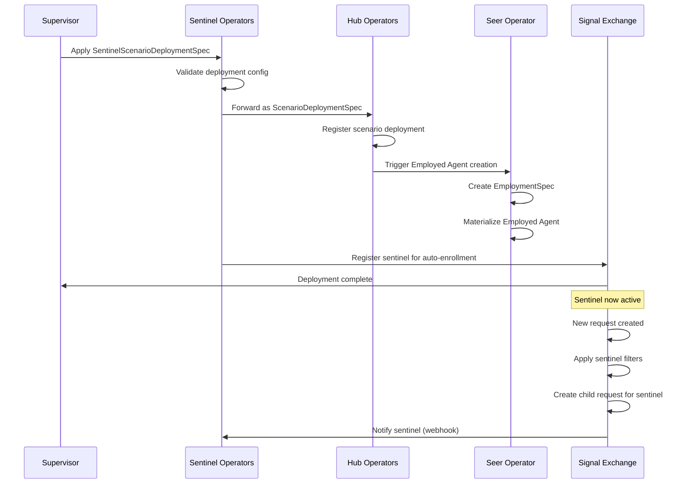

# Sentinel Scenario Deployment Specification

> **Status**: 🟢 Design Complete  
> **Last Updated**: 2026-01-14  
> **Design Level**: C2 (Container)

---

## Overview

The **SentinelScenarioDeploymentSpec** defines how a Request Sentinel scenario is deployed. It extends Hub's `ScenarioDeploymentSpec` with Sentinel-specific deployment settings.

When this specification is applied, it triggers the creation of an Employed Agent that serves as the Request Sentinel's runtime instantiation.

---

## Relationship to Hub ScenarioDeploymentSpec

```
┌─────────────────────────────────────────────────────────────────────────────┐
│                    SPECIFICATION EXTENSION                                    │
│                                                                               │
│   ┌─────────────────────────────────────────────────────────────────────┐   │
│   │  Hub ScenarioDeploymentSpec                                          │   │
│   │  • automation_ref                                                    │   │
│   │  • activation settings                                               │   │
│   │  • task_queues                                                       │   │
│   │  • sla parameters                                                    │   │
│   │  • agent_enrollment                                                  │   │
│   │  • capacity planning                                                 │   │
│   └────────────────────────────────┬────────────────────────────────────┘   │
│                                    │                                         │
│                                    │ extends with sentinel_deployment        │
│                                    ▼                                         │
│   ┌─────────────────────────────────────────────────────────────────────┐   │
│   │  SentinelScenarioDeploymentSpec                                      │   │
│   │  • All fields from ScenarioDeploymentSpec                            │   │
│   │  + sentinel_deployment:                                              │   │
│   │      auto_activate: true                                             │   │
│   │      enrollment_limits:                                              │   │
│   │        max_concurrent_requests: 100                                  │   │
│   │        cooldown_after_enrollment_ms: 1000                            │   │
│   │      notification_delivery:                                          │   │
│   │        retry_policy: ...                                             │   │
│   └─────────────────────────────────────────────────────────────────────┘   │
│                                                                               │
└─────────────────────────────────────────────────────────────────────────────┘
```

---

## Specification Structure

### CRD Definition

```yaml
apiVersion: seer.olympus.io/v1
kind: SentinelScenarioDeploymentSpec
metadata:
  name: token-usage-governance-deployment
  namespace: acme-disputes
  labels:
    workbench: acme-disputes
    sentinel: token-usage-governance
spec:
  # Reference to Automation Spec
  automation_ref:
    name: token-usage-governance-automation
    version: "1.0.0"

  # Activation Settings
  activation:
    status: active  # draft | active | suspended | retired
    effective_from: "2026-01-01T00:00:00Z"
    effective_to: null  # null = no end date

  # Task Queues (Request Sentinels typically use internal queues)
  # Optional: Define if sentinel tasks should be routed to specific queues
  task_queues:
    - task_type: sentinel-observation
      queue_ref: sentinel-internal-queue
      priority_override: low  # Sentinel tasks are typically lower priority

  # SLA Parameters (for sentinel response times)
  sla:
    per_task:
      - task_type: sentinel-observation
        target_hours: 0.1  # 6 minutes max for sentinel to process update

  # Agent Enrollment (for the sentinel's Employed Agent)
  agent_enrollment:
    auto_enroll:
      - role: sentinel-agent
        task_types:
          - sentinel-observation
          - sentinel-analysis
    enrollment_mode: automatic  # Sentinel auto-enrolls based on filters

  # Capacity Planning
  capacity:
    expected_daily_volume: 1000  # Expected number of requests to monitor
    peak_multiplier: 2.0

    scaling:
      auto_scale_ai_agents: true
      min_ai_agents: 1
      max_ai_agents: 5

  # ═══════════════════════════════════════════════════════════════════════════
  # SENTINEL-SPECIFIC DEPLOYMENT SECTION
  # ═══════════════════════════════════════════════════════════════════════════
  sentinel_deployment:
    # Auto-Activation
    # When true, sentinel begins enrollment immediately upon deployment
    auto_activate: true

    # Enrollment Limits
    enrollment_limits:
      # Maximum number of requests the sentinel can be enrolled in concurrently
      max_concurrent_requests: 100
      
      # Cooldown period after enrolling in a request (prevent rapid re-enrollment)
      cooldown_after_enrollment_ms: 1000
      
      # Maximum child requests per parent request (prevent recursion)
      max_child_requests_per_parent: 1

    # Notification Delivery Configuration
    notification_delivery:
      # Delivery method for request updates
      method: webhook  # webhook | polling
      
      # Webhook endpoint (resolved from Hub Application)
      # endpoint: auto  # Auto-resolved from HubApplicationSpec
      
      # Retry policy for failed deliveries
      retry_policy:
        max_attempts: 3
        initial_delay_ms: 1000
        max_delay_ms: 30000
        backoff_multiplier: 2.0
      
      # Timeout for webhook delivery
      timeout_ms: 5000

    # Child Request Configuration
    child_request:
      # Scenario for child requests (references this sentinel's scenario)
      scenario_ref: token-usage-governance
      
      # Context inheritance from parent request
      inherit_context: true
      
      # Lifecycle binding to parent
      cascade_completion: true  # Child completed when parent completes
      cascade_cancellation: true  # Child cancelled when parent cancels

    # Resource Limits for Sentinel
    resource_limits:
      # Token budget per monitoring session
      token_budget:
        per_request: 5000
        per_day: 100000
      
      # Execution time limits
      execution_time:
        per_observation_seconds: 30
        per_request_seconds: 300
```

---

## Sentinel Deployment Section Details

### Auto-Activation

| Setting | Description |
|---------|-------------|
| `auto_activate: true` | Sentinel begins enrollment immediately upon deployment |
| `auto_activate: false` | Sentinel remains dormant until manually activated |

### Enrollment Limits

Controls how the sentinel enrolls in requests:

| Setting | Description | Default |
|---------|-------------|---------|
| `max_concurrent_requests` | Maximum requests sentinel can monitor simultaneously | 100 |
| `cooldown_after_enrollment_ms` | Delay before sentinel can enroll in another request | 1000 |
| `max_child_requests_per_parent` | Maximum child requests created per parent | 1 |

### Notification Delivery

Configures how request updates are delivered to the sentinel:

```yaml
notification_delivery:
  method: webhook
  retry_policy:
    max_attempts: 3
    initial_delay_ms: 1000
    max_delay_ms: 30000
    backoff_multiplier: 2.0
  timeout_ms: 5000
```

| Setting | Description |
|---------|-------------|
| `method` | Delivery mechanism (`webhook` or `polling`) |
| `retry_policy` | Retry configuration for failed deliveries |
| `timeout_ms` | Maximum time to wait for webhook acknowledgment |

### Child Request Configuration

Configures the child request created when sentinel enrolls:

```yaml
child_request:
  scenario_ref: token-usage-governance
  inherit_context: true
  cascade_completion: true
  cascade_cancellation: true
```

| Setting | Description |
|---------|-------------|
| `scenario_ref` | Scenario used for child request (sentinel's own scenario) |
| `inherit_context` | Child can access parent request context via reference |
| `cascade_completion` | Child auto-completes when parent completes |
| `cascade_cancellation` | Child auto-cancels when parent cancels |

---

## COG Sentinel Configuration (cogSpec)

For COG Sentinels (sentinels defined in COGW workbenches), an additional `cogSpec` section defines target workbenches:

```yaml
cogSpec:
  workbench_patterns:
    - pattern: "production-*"     # Allow all production-* workbenches
      action: allow
    - pattern: "production-dev"   # But disallow production-dev
      action: disallow
    - pattern: "acme-*"           # Allow all acme-* workbenches
      action: allow
    - pattern: "test-*"           # Disallow all test-* workbenches
      action: disallow
```

| Field | Type | Required | Description |
|-------|------|----------|-------------|
| `workbench_patterns` | array | Yes (for COG) | Ordered list of pattern rules |
| `pattern` | string | Yes | Workbench name pattern (wildcards supported) |
| `action` | string | Yes | `allow` or `disallow` |

**Pattern Matching**: Apache webserver-style sequential evaluation (first match wins, default deny).

> See [COG Sentinel Specification](../../subsystems/cognitive-operations-governance-workbench/cog-sentinel-specification.md) for details.

---

## Deployment Flow



---

## Employed Agent Creation

When a SentinelScenarioDeploymentSpec is applied, it triggers the following:

```
┌─────────────────────────────────────────────────────────────────────────────┐
│                    EMPLOYED AGENT CREATION                                    │
│                                                                               │
│   SentinelScenarioDeploymentSpec                                             │
│           │                                                                   │
│           │ automation_ref                                                    │
│           ▼                                                                   │
│   SentinelScenarioAutomationSpec                                             │
│           │                                                                   │
│           │ application.ref                                                   │
│           ▼                                                                   │
│   HubApplicationSpec                                                          │
│           │                                                                   │
│           │ seerTrainingRef                                                   │
│           ▼                                                                   │
│   TrainingSpec (Trained Agent)                                                │
│           │                                                                   │
│           │ Seer Operator creates                                             │
│           ▼                                                                   │
│   EmploymentSpec ──────────────────▶ Employed Agent                          │
│           │                              (Running Pod)                        │
│           │                                                                   │
│           └── workScope:                                                      │
│                 workbench: acme-disputes                                      │
│                 scenario: token-usage-governance                              │
│               delegation:                                                     │
│                 principal: {supervisor}                                       │
│                                                                               │
└─────────────────────────────────────────────────────────────────────────────┘
```

---

## Validation Rules

| Rule | Description |
|------|-------------|
| **Required Fields** | `automation_ref`, `activation.status` |
| **Automation Exists** | Referenced SentinelScenarioAutomationSpec must exist |
| **Resource Limits** | Token budget and execution time limits must be positive |
| **Enrollment Limits** | `max_concurrent_requests` must be >= 1 |
| **Retry Policy** | `max_attempts` must be >= 1, delays must be positive |

---

## Lifecycle States

| State | Description | Sentinel Behavior |
|-------|-------------|-------------------|
| **draft** | Deployment created but not active | Not enrolling, not receiving updates |
| **active** | Deployment is live | Enrolling per filters, processing updates |
| **suspended** | Temporarily disabled | Not enrolling, existing child requests continue |
| **retired** | Permanently disabled | Not enrolling, existing child requests completed |

---

## Related Documentation

- [Sentinel Spec Manager](./sentinel-spec-manager.md) — Manages SentinelSpec that references these specs
- [Sentinel Scenario Normative Spec](./sentinel-scenario-normative-spec.md) — Normative requirements
- [Sentinel Scenario Automation Spec](./sentinel-scenario-automation-spec.md) — Automation configuration
- [Hub ScenarioDeploymentSpec](../../../olympus-hub-docs/04-subsystems/operators/developer-operators.md) — Base specification pattern
- [Employed Agent](../../hub-integration/employed-agent.md) — How Employed Agents are created

---

*SentinelScenarioDeploymentSpec extends Hub's ScenarioDeploymentSpec with a `sentinel_deployment` section for configuring enrollment limits, notification delivery, and child request behavior.*
