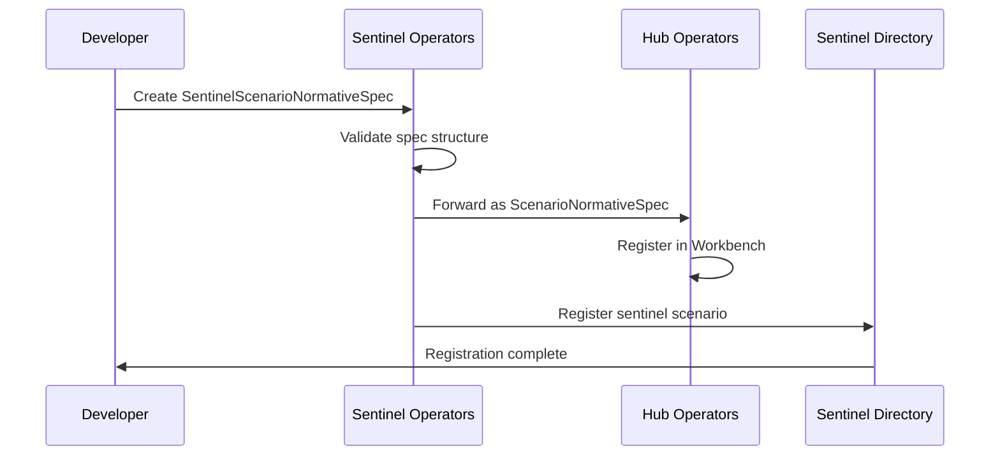

# Sentinel Scenario Normative Specification

> **Status**: 🟢 Design Complete  
> **Last Updated**: 2026-01-14  
> **Design Level**: C2 (Container)

---

## Overview

The **SentinelScenarioNormativeSpec** defines the normative requirements for a Request Sentinel's scenario. It extends Hub's `ScenarioNormativeSpec` without Sentinel-specific additions, following the standard Hub normative layer pattern.

Request Sentinels operate as Employed Agents within a Workbench, observing and/or participating in other requests. The normative specification defines *what the sentinel ought to do* — its goals, roles, SOPs, and decision criteria.

---

## Relationship to Hub ScenarioNormativeSpec

```
┌─────────────────────────────────────────────────────────────────────────────┐
│                    SPECIFICATION INHERITANCE                                  │
│                                                                               │
│   ┌─────────────────────────────────────────────────────────────────────┐   │
│   │  Hub ScenarioNormativeSpec                                           │   │
│   │  • Goals and success criteria                                        │   │
│   │  • Agent roles                                                       │   │
│   │  • Standard Operating Procedures (SOPs)                              │   │
│   │  • Decision criteria                                                 │   │
│   │  • Evidence requirements                                             │   │
│   │  • Escalation rules                                                  │   │
│   └────────────────────────────────┬────────────────────────────────────┘   │
│                                    │                                         │
│                                    │ extends (no additions)                  │
│                                    ▼                                         │
│   ┌─────────────────────────────────────────────────────────────────────┐   │
│   │  SentinelScenarioNormativeSpec                                       │   │
│   │  • Same structure as ScenarioNormativeSpec                           │   │
│   │  • Used specifically for Request Sentinel scenarios                  │   │
│   │  • Processed by Sentinel Operators → Hub Operators                   │   │
│   └─────────────────────────────────────────────────────────────────────┘   │
│                                                                               │
└─────────────────────────────────────────────────────────────────────────────┘
```

---

## Specification Structure

### CRD Definition

```yaml
apiVersion: seer.olympus.io/v1
kind: SentinelScenarioNormativeSpec
metadata:
  name: token-usage-governance-normative
  namespace: acme-disputes
  labels:
    workbench: acme-disputes
    sentinel: token-usage-governance
spec:
  # Identity
  scenario:
    name: token-usage-governance
    display_name: "Token Usage Governance"
    version: "1.0.0"
    workbench_ref: acme-disputes

  # Goals and Success Criteria
  goals:
    primary:
      description: "Monitor and govern AI agent token usage across requests"
      success_criteria:
        - metric: token_budget_violations_detected
          target: "100%"
          description: "All budget violations detected and flagged"
        - metric: false_positive_rate
          target: "< 5%"
          description: "Minimize false positive alerts"
    
    secondary:
      - description: "Provide actionable insights for cost optimization"
        success_criteria:
          - metric: recommendations_accepted
            target: ">= 70%"

  # Agent Roles (for the Sentinel itself)
  agent_roles:
    - id: token-monitor
      name: "Token Usage Monitor"
      description: "Observes requests and monitors token consumption"
      tasks:
        - observe-token-usage
        - detect-anomalies
        - generate-alerts
      decision_authority:
        - flag_high_usage: true
        - recommend_intervention: true
        - escalate_budget_violation: true

  # Standard Operating Procedures
  sops:
    - id: token-monitoring-sop
      name: "Token Usage Monitoring"
      description: "Standard procedure for monitoring token consumption"
      steps:
        - id: observe
          action: "Receive request update notification"
          expected_outcome: "Token usage data extracted"
        - id: evaluate
          action: "Compare usage against thresholds"
          expected_outcome: "Usage classified as normal/warning/critical"
        - id: act
          action: "Generate observation or escalate"
          expected_outcome: "Appropriate action taken"
      references:
        - "knowledge://seer/token-governance-guidelines"

  # Decision Criteria
  decision_criteria:
    - id: budget-threshold
      name: "Budget Threshold Evaluation"
      description: "Determine if token usage exceeds budget thresholds"
      rules:
        - condition: "usage_percentage > 80"
          action: "Generate warning observation"
        - condition: "usage_percentage > 95"
          action: "Escalate to supervisor"
        - condition: "usage_percentage >= 100"
          action: "Flag budget violation"

  # Evidence Requirements
  evidence_requirements:
    - type: token_usage_metrics
      description: "Token consumption data from request updates"
      retention_days: 90
    - type: budget_configuration
      description: "Configured budget limits at time of evaluation"
      retention_days: 90

  # Escalation Rules
  escalation_rules:
    - id: budget-exceeded
      trigger: "Token budget exceeded"
      escalate_to: supervisor
      notification: immediate
      priority: high
    
    - id: anomaly-detected
      trigger: "Unusual consumption pattern detected"
      escalate_to: senior-analyst
      notification: within_1_hour
      priority: medium
```

---

## Key Sections

### Goals and Success Criteria

Defines what the Request Sentinel aims to achieve:

| Component | Description |
|-----------|-------------|
| **Primary Goals** | Core objectives the sentinel must meet |
| **Secondary Goals** | Additional objectives that enhance value |
| **Success Criteria** | Measurable metrics for evaluating performance |

### Agent Roles

For Request Sentinels, the agent role typically defines the sentinel's own behavior:

| Component | Description |
|-----------|-------------|
| **Role ID** | Unique identifier for the role |
| **Tasks** | What the sentinel does when enrolled |
| **Decision Authority** | What decisions the sentinel can make autonomously |

### Standard Operating Procedures

Defines the step-by-step process the sentinel follows:

| Component | Description |
|-----------|-------------|
| **SOP ID** | Unique identifier |
| **Steps** | Ordered actions to perform |
| **Expected Outcomes** | What each step should produce |
| **References** | Knowledge resources for guidance |

---

## Validation Rules

| Rule | Description |
|------|-------------|
| **Required Fields** | `scenario.name`, `scenario.workbench_ref`, `goals.primary` |
| **Version Format** | Must follow semantic versioning (e.g., `1.0.0`) |
| **Unique Name** | Name must be unique within namespace |
| **Workbench Exists** | Referenced workbench must exist |

---

## Processing Flow



---

## Related Documentation

- [Sentinel Spec Manager](./sentinel-spec-manager.md) — Manages SentinelSpec that references this spec
- [Sentinel Scenario Automation Spec](./sentinel-scenario-automation-spec.md) — Automation layer configuration
- [Sentinel Scenario Deployment Spec](./sentinel-scenario-deployment-spec.md) — Deployment configuration
- [Hub ScenarioNormativeSpec](../../../olympus-hub-docs/04-subsystems/operators/process-architect-operator.md) — Base specification pattern

---

*SentinelScenarioNormativeSpec defines the normative requirements for Request Sentinel scenarios, extending Hub's ScenarioNormativeSpec without modifications.*
