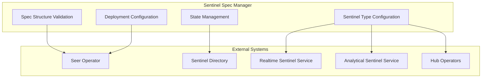
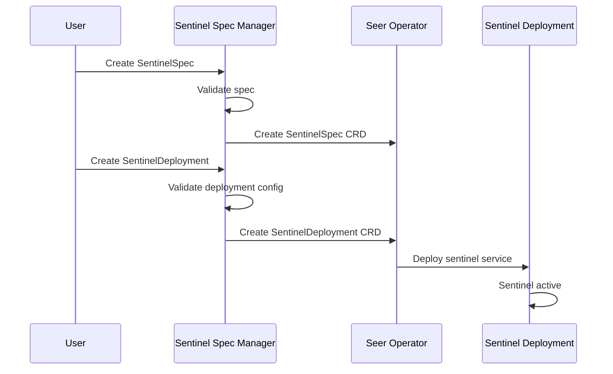

# Sentinel Spec Manager

> **Status**: 🟢 Design Complete  
> **Last Updated**: 2026-01-14  
> **Design Level**: C2 (Container)

---

## Overview

Sentinel Spec Manager is the foundational component of the Seer Sentinels subsystem. It manages Sentinel Specifications (SentinelSpec CRDs) that define sentinel policies for agent sessions.

Sentinel Spec Manager handles spec structure validation, sentinel type configuration (Realtime, Analytical, and Request), and deployment configuration.

---

## Architecture



---

## Functional Scope

### Sentinel Spec Structure

Sentinel Spec Manager validates the complete structure of SentinelSpec CRDs:

#### Core Components

| Component | Description | Validation Rules |
|-----------|-------------|------------------|
| **Sentinel Type** | Realtime, Analytical, or Request | Required, must be one of: `realtime`, `analytical`, `request` |
| **Sentinel Name** | Unique identifier | Required, must be unique within workbench |
| **Target Scope** | Agents/workbenches to monitor | Required, must specify agent_ids or workbench_ids |
| **Policy Definition** | OPA policy (Realtime) or SQL template (Analytical) | Required for realtime/analytical, validated for syntax |
| **Observation Configuration** | When to generate Observations vs. Exceptions | Required for realtime/analytical, must specify conditions |
| **Sentinel Scenario Specs** | References to SentinelScenarioSpec CRDs | Required for request type |
| **Deployment Configuration** | Deployment CRD reference | Required for deployment |

#### Spec Structure Example

```yaml
apiVersion: seer.olympus.io/v1
kind: SentinelSpec
metadata:
  name: stuck-agent-detector
  namespace: acme-disputes
spec:
  # Sentinel Type (required)
  type: realtime  # realtime | analytical
  
  # Target Scope (required)
  target:
    workbench_ids: ["acme-disputes"]
    agent_ids: []  # Empty = all agents in workbench
  
  # Policy Definition (required)
  policy:
    # For Realtime: OPA policy
    opa_policy: |
      package seer.sentinel.stuck_agent
      
      default allow = false
      
      allow {
        input.event_type == "agent_session_update"
        input.agent_id == data.target_agent_id
        time.now_ns() - input.last_activity_ns > 300000000000  # 5 minutes
      }
    
    # For Analytical: SQL template
    sql_template: |
      SELECT 
        agent_id,
        workbench_id,
        session_id,
        last_activity_time,
        current_time - last_activity_time as inactivity_duration
      FROM agent_sessions
      WHERE 
        workbench_id IN {{ .workbench_ids }}
        AND current_time - last_activity_time > INTERVAL '5 minutes'
        AND session_status = 'active'
  
  # Observation Configuration (required)
  observation_config:
    generate_observation:
      condition: "policy_result == true"
      observation_type: "agent_stuck"
      severity: "warning"
    
    generate_exception:
      condition: "policy_result == true AND inactivity_duration > INTERVAL '15 minutes'"
      exception_type: "agent_stuck_critical"
      criticality: "tier-1"
  
  # Deployment Configuration (required)
  deployment:
    enabled: true
    replicas: 2
    resources:
      cpu: "100m"
      memory: "256Mi"
```

---

### Sentinel Type Configuration

Sentinel Spec Manager configures sentinel types:

#### Realtime Sentinel

| Configuration | Description |
|---------------|-------------|
| **Event Source** | Signal Exchange (SX) events |
| **Policy Engine** | OPA policy evaluation |
| **Evaluation Trigger** | On SX event arrival |
| **Output** | Real-time Observations/Exceptions |

#### Analytical Sentinel

| Configuration | Description |
|---------------|-------------|
| **Data Source** | Agent Analytics data mart |
| **Query Engine** | Templated SQL execution |
| **Evaluation Trigger** | Periodic (configurable interval) |
| **Output** | Analytical Observations/Exceptions |

#### Request Sentinel

| Configuration | Description |
|---------------|-------------|
| **Event Source** | Request creation/updates in Workbench |
| **Enrollment Trigger** | Automatic based on scenario filters and OPA policy |
| **Execution Model** | Employed Agent in Workbench |
| **Output** | Child requests created, actions within child request scope |

Request Sentinels differ fundamentally from Realtime and Analytical Sentinels:

| Aspect | Realtime/Analytical | Request |
|--------|---------------------|---------|
| **Operation Model** | Observe and generate Observations/Exceptions | Participate as Employed Agent |
| **Specification** | `policy` + `observation_config` | `sentinel_scenario_specs` |
| **Output** | Cronus Observations/Exceptions | Child requests, agent actions |
| **Integration** | Seer internal services | Hub Request model via Hub Operators |

---

### Request Sentinel Specification

Request Sentinels use a different specification structure, referencing SentinelScenarioSpec CRDs:

```yaml
apiVersion: seer.olympus.io/v1
kind: SentinelSpec
metadata:
  name: token-usage-governance-sentinel
  namespace: acme-disputes
spec:
  # Sentinel Type (required)
  type: request  # realtime | analytical | request
  
  # Target Scope (required)
  target:
    workbench_ids: ["acme-disputes"]
  
  # For Request Sentinel: Reference to Sentinel Scenario Specs
  sentinel_scenario_specs:
    normative_ref:
      name: token-usage-governance-normative
      version: "1.0.0"
    automation_ref:
      name: token-usage-governance-automation
      version: "1.0.0"
    deployment_ref:
      name: token-usage-governance-deployment
      version: "1.0.0"
```

Request Sentinels do NOT use `policy` or `observation_config` sections. Instead, they reference:

- **SentinelScenarioNormativeSpec** — Normative requirements (goals, SOPs, decision criteria)
- **SentinelScenarioAutomationSpec** — Automation configuration (application binding, filters)
- **SentinelScenarioDeploymentSpec** — Deployment configuration (limits, notification delivery)

See:
- [Sentinel Scenario Normative Spec](./sentinel-scenario-normative-spec.md)
- [Sentinel Scenario Automation Spec](./sentinel-scenario-automation-spec.md)
- [Sentinel Scenario Deployment Spec](./sentinel-scenario-deployment-spec.md)

---

### Deployment Configuration

Sentinel Spec Manager manages deployment configuration:

#### Deployment CRD Structure

```yaml
apiVersion: seer.olympus.io/v1
kind: SentinelDeployment
metadata:
  name: stuck-agent-detector-deployment
  namespace: acme-disputes
spec:
  sentinel_spec_ref:
    name: stuck-agent-detector
    version: "1.0.0"
  
  deployment_config:
    replicas: 2
    resources:
      cpu: "100m"
      memory: "256Mi"
    
    # For Realtime Sentinel
    realtime_config:
      event_subscriptions:
        - event_type: "agent_session_update"
          filters:
            workbench_id: "acme-disputes"
    
    # For Analytical Sentinel
    analytical_config:
      schedule: "*/5 * * * *"  # Every 5 minutes
      query_timeout: "30s"
```

#### Deployment Flow



---

### Spec Validation

Sentinel Spec Manager validates sentinel specs:

#### Validation Rules

| Validation Type | Description | Action on Failure |
|-----------------|-------------|-------------------|
| **Structure Validation** | Required fields present, correct types | Reject spec |
| **Sentinel Type Validation** | Type is `realtime`, `analytical`, or `request` | Reject spec |
| **Policy Syntax Validation** | OPA policy syntax (Realtime) or SQL syntax (Analytical) | Reject spec |
| **Target Scope Validation** | Target agents/workbenches exist | Reject spec |
| **Observation Config Validation** | Observation/Exception conditions valid (realtime/analytical only) | Reject spec |
| **Sentinel Scenario Refs Validation** | All three SentinelScenarioSpec CRDs exist (request only) | Reject spec |
| **Trained Agent Chain Validation** | HubApplicationSpec → seerTrainingRef → TrainingSpec exists (request only) | Reject spec |
| **Deployment Config Validation** | Deployment configuration valid | Reject spec |

#### Type-Specific Validation

| Sentinel Type | Required Sections | Rejected If Present |
|---------------|-------------------|---------------------|
| `realtime` | `policy.opa_policy`, `observation_config` | `sentinel_scenario_specs`, `cogSpec` |
| `analytical` | `policy.sql_template`, `observation_config` | `sentinel_scenario_specs`, `cogSpec` |
| `request` | `sentinel_scenario_specs` | `policy`, `observation_config` |

#### COG Sentinel Validation

Additional validation rules for COG Sentinels (sentinels with `sentinel.olympus.io/cog-sentinel: "true"` label):

| Rule | Description | Error |
|------|-------------|-------|
| **COGW Only** | COG Sentinel label only allowed in COGW workbenches | "COG Sentinel must be defined in COGW workbench" |
| **Type Request** | COG Sentinels must have `type: request` | "COG Sentinel must be request type" |
| **cogSpec Required** | Label requires cogSpec in SentinelScenarioDeploymentSpec | "COG Sentinel requires cogSpec in deployment" |
| **Label Required** | cogSpec requires COG Sentinel label | "cogSpec requires COG Sentinel label" |
| **Pattern Syntax** | cogSpec patterns must be valid (action: allow/disallow) | "Invalid cogSpec pattern syntax" |

> See [COG Sentinel Specification](../../subsystems/cognitive-operations-governance-workbench/cog-sentinel-specification.md) for details.

---

## Integration Points

### Upstream Integration

| Service | Integration Method | Purpose |
|---------|-------------------|---------|
| **Seer Operator** | CRD reconciliation | CRD creation and state management |

### Downstream Integration

| Service | Integration Method | Purpose |
|---------|-------------------|---------|
| **Sentinel Directory** | Spec registration | Registry and search |
| **Realtime Sentinel Service** | Spec configuration | Realtime sentinel execution |
| **Analytical Sentinel Service** | Spec configuration | Analytical sentinel execution |
| **Sentinel Operators** | Spec lifecycle | Registration and state transitions |

---

## Key Design Decisions

### Three Sentinel Types

- **Realtime Sentinel**: Observes SX events, evaluates OPA policies, generates real-time Observations/Exceptions
- **Analytical Sentinel**: Runs templated SQL on analytics data mart periodically, generates analytical Observations/Exceptions
- **Request Sentinel**: Operates as Employed Agent in Workbench, observes/participates in requests, creates child requests

### Deployment Model

- **Sentinels deployed via Deployment CRDs** referencing Spec CRDs
- **Deployment CRD corresponds to Spec CRD** where templatized definition is stored
- **Clear separation** between spec definition and deployment configuration

### Lifecycle Pattern

- **Follows same pattern** as Trained/Employed Agent lifecycle managers
- **Spec Manager handles validation** and structure management
- **Seer Operator reconciles** CRDs to Kubernetes state

---

## Related Documentation

- [Realtime Sentinel Service](./realtime-sentinel-service.md) — SX event observation and OPA policy evaluation
- [Analytical Sentinel Service](./analytical-sentinel-service.md) — SQL template execution on analytics data mart
- [Sentinel Scenario Normative Spec](./sentinel-scenario-normative-spec.md) — Request Sentinel normative requirements
- [Sentinel Scenario Automation Spec](./sentinel-scenario-automation-spec.md) — Request Sentinel automation configuration
- [Sentinel Scenario Deployment Spec](./sentinel-scenario-deployment-spec.md) — Request Sentinel deployment configuration
- [Sentinel Operators](./sentinel-operators.md) — Lifecycle management and state transitions
- [Sentinel Directory](./sentinel-directory.md) — Registry and search

---

*Sentinel Spec Manager provides the foundation for Seer Sentinels by managing sentinel specifications and deployment configuration.*
