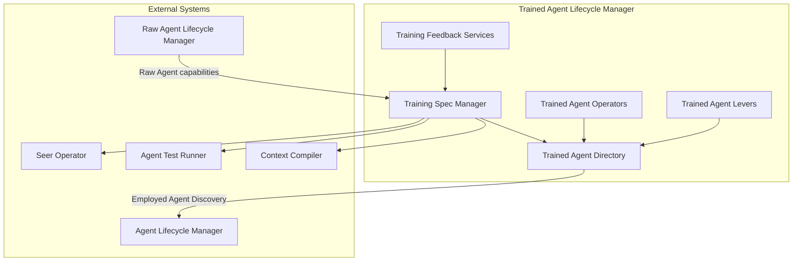

# Trained Agent Lifecycle Manager

> **Status**: 🟢 Design Complete  
> **Last Updated**: 2026-01-13

## Overview

Trained Agent Lifecycle Manager manages the complete lifecycle of Trained Agents (Training Specs), including Training Specification management, validation, directory, lifecycle management, operational controls, and feedback services.

---

## Design Documents

| Document | Description | Status |
|----------|-------------|--------|
| [SCOPE.md](./SCOPE.md) | Design scope, coverage summary, key decisions | Overview |
| [Training Spec Manager](./training-spec-manager.md) | Spec structure, validation, Raw Agent compatibility, immutability enforcement | C2 |
| [Trained Agent Directory](./trained-agent-directory.md) | Registry, search, version tracking, Employed Agent discovery | C2 |
| [Trained Agent Operators](./trained-agent-operators.md) | Registration, validation, versioning, state transitions | C2 |
| [Trained Agent Levers](./trained-agent-levers.md) | Publication controls, deprecation, version freeze | C2 |
| [Training Feedback Services](./training-feedback-services.md) | Feedback collection, routing, aggregation, improvement integration | C2 |

---

## Architecture

---

## Key Design Decisions

### Guardrail Immutability Principle

- **Training Spec guardrails are immutable once published** (cannot be relaxed at Employment)
- Guardrails are locked at "Validated" state
- Full immutability enforced at "Published" state
- Employment can only narrow (never expand) authority

### Raw Agent Capability Constraints

- **Training Specs are constrained by Raw Agent capabilities**
- Training Spec Manager validates compatibility before publication
- Training Specs cannot require capabilities Raw Agent doesn't support
- Capability mismatches are caught during validation, not at runtime

### Seer Operator Boundary

- **Training Spec Manager is business logic layer**; Seer Operator is controller layer
- Training Spec Manager handles validation and state management
- Seer Operator reconciles CRDs to Kubernetes state
- Clear separation between validation and deployment

### Employed Agent Discovery as Directory Query

- **Employed Agent Discovery is a query capability in Directory**, not a separate service
- Directory queries Agent Lifecycle Manager's Employed Agent Directory
- Enables impact analysis when Training Specs change
- Single source of truth for Training Spec relationships

### Lever Actions Affect All Derived Employed Agents

- **Lever actions on Training Specs impact all Employed Agents** that use the affected Training Spec
- Ensures consistent safety posture across all employments
- Enables centralized control for security and compliance
- Impact varies by action type (block, suspend, warn)

---

## Capabilities

Based on `olympus-hub-docs/scratchpad/seer-subsystems.md`:

- ✅ Training Spec structure validation
- ✅ Raw Agent compatibility validation
- ✅ Guardrail immutability enforcement
- ✅ Trained Agent registry and search
- ✅ Version tracking and history
- ✅ Employed Agent discovery
- ✅ Lifecycle state management
- ✅ Publication controls
- ✅ Version deprecation
- ✅ Training feedback collection and routing

---

## Related Documentation

### Conceptual
- [Agent Lifecycle Concepts](../../implementation-concepts/agent-lifecycle.md) — Three-layer agent model
- [Training Spec CRD](../../hub-integration/training-spec-crd.md) — Complete CRD schema reference

### Related Subsystems
- [Raw Agent Lifecycle Manager](../raw-agent-lifecycle-manager/README.md) — Raw Agent capability definitions
- [Agent Lifecycle Manager](../agent-lifecycle-manager/README.md) — Employed Agent management
- [Agent Test Runner](../agent-test-runner/README.md) — Training Spec validation testing
- [Context Compiler](../context-compiler/README.md) — Retriever configurations from Training Specs

---

*Trained Agent Lifecycle Manager provides comprehensive lifecycle management for Training Specs with validation, directory, operational controls, and feedback integration.*
