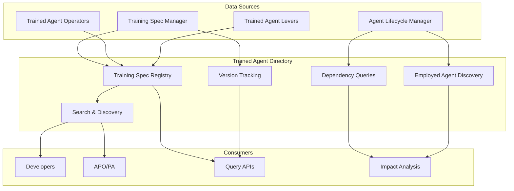
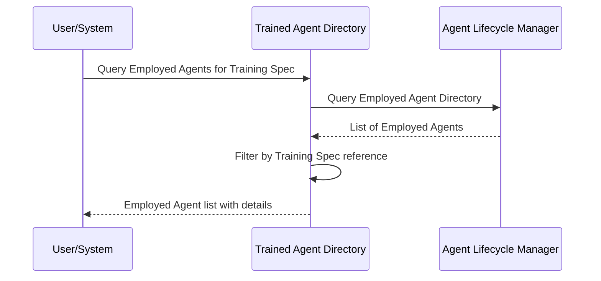

# Trained Agent Directory

> **Status**: 🟢 Design Complete  
> **Last Updated**: 2026-01-13

---

## Overview

The Trained Agent Directory provides a comprehensive registry of all Trained Agents (Training Specs), including their capabilities, versions, dependencies, and relationships to Employed Agents. It serves as the central source of truth for discovering, searching, and querying Trained Agent information.

The directory enables developers to discover suitable Trained Agents, track version history, and understand which Employed Agents depend on specific Training Specs.

---

## Architecture



---

## Functional Scope

### Training Spec Registry

The registry maintains a searchable index of all Training Specs, organized by capabilities, domain, role, and version.

#### Registry Structure

| Index Type | Purpose | Query Capabilities |
|------------|---------|-------------------|
| **By Capabilities** | Find Training Specs by required capabilities | Tool calling, orchestration, archetype roles |
| **By Domain** | Find Training Specs by business domain | disputes, payments, onboarding |
| **By Role** | Find Training Specs by agent role | case-analyst, triage-agent, specialist |
| **By Raw Agent** | Find Training Specs using specific Raw Agent | All Training Specs for a Raw Agent |
| **By Version** | Track version history | Version lineage, compatibility matrix |

#### Registry Entry Structure

```yaml
trainedAgentEntry:
  # Core Identity
  identity:
    trainingSpecId: "ts-fraud-analyst-v2"
    name: "fraud-analyst-v2"
    namespace: "acme-disputes"
    version: "1.7.0"
    state: "published"
  
  # Raw Agent Reference
  rawAgent:
    name: "fraud-analyst-base"
    version: "^2.0.0"
    capabilities:
      toolCalling: ["http", "grpc"]
      orchestration: ["sequential", "parallel"]
      archetypeRoles: ["thinker", "doer"]
  
  # Training Spec Metadata
  metadata:
    displayName: "Fraud Case Analyst"
    role: "case-analyst"
    domain: "disputes"
    description: "AI agent specialized in fraud case analysis"
  
  # Capabilities Summary
  capabilities:
    tools:
      - protocol: "temenos-t24/get-transactions"
      - protocol: "fraud-engine/evaluate"
    knowledgeBases:
      - ref: "fraud-patterns-kb"
      - ref: "dispute-policies-kb"
    guardrails:
      - name: "pii-protection"
      - name: "amount-threshold"
  
  # Version Information
  versionInfo:
    current: "1.7.0"
    previousVersions: ["1.6.0", "1.5.0"]
    compatibility:
      rawAgent: "^2.0.0"
  
  # Dependencies
  dependencies:
    rawAgent: "fraud-analyst-base:^2.0.0"
    guardrails:
      - "pii-protection:^1.0.0"
      - "financial-compliance:^2.1.0"
    knowledgeBases:
      - "fraud-patterns-kb"
      - "dispute-policies-kb"
  
  # Derived Information
  derived:
    activeEmployments: 3
    lastEmploymentDate: "2026-01-10T14:30:00Z"
    employmentCount: 5
```

---

## Search & Discovery

### Functional Scope

The directory provides search capabilities to help developers and APOs discover suitable Training Specs for their use cases.

#### Search Capabilities

| Search Type | Description | Example Query |
|-------------|-------------|---------------|
| **By Capabilities** | Find Training Specs with specific capabilities | "Find Training Specs that support fraud detection tools" |
| **By Domain** | Find Training Specs in a business domain | "Find all dispute-related Training Specs" |
| **By Role** | Find Training Specs for a specific role | "Find case analyst Training Specs" |
| **By Raw Agent** | Find Training Specs using a Raw Agent | "Find all Training Specs using fraud-analyst-base" |
| **By Guardrails** | Find Training Specs with specific guardrails | "Find Training Specs with PII protection" |
| **By Knowledge Base** | Find Training Specs using knowledge bases | "Find Training Specs using fraud-patterns-kb" |

#### Search Example

```yaml
# Search Query
search:
  filters:
    domain: "disputes"
    role: "case-analyst"
    capabilities:
      toolCalling: ["http"]
    guardrails:
      - name: "pii-protection"
  sortBy: "version"
  order: "desc"

# Search Results
results:
  - trainingSpecId: "ts-fraud-analyst-v2"
    name: "fraud-analyst-v2"
    version: "1.7.0"
    displayName: "Fraud Case Analyst"
    matchScore: 0.95
  - trainingSpecId: "ts-dispute-triage-v1"
    name: "dispute-triage-v1"
    version: "1.2.0"
    displayName: "Dispute Triage Agent"
    matchScore: 0.82
```

---

## Version Tracking

### Functional Scope

The directory tracks version history for Training Specs, enabling version lineage queries and compatibility analysis.

#### Version Information

| Information | Description | Use Case |
|-------------|-------------|----------|
| **Version History** | Complete version lineage | Track evolution of Training Spec |
| **Compatibility Matrix** | Raw Agent version compatibility | Determine upgrade paths |
| **Deprecation Status** | Version deprecation information | Identify versions to migrate from |
| **Migration Paths** | Recommended upgrade paths | Plan Training Spec upgrades |

#### Version Tracking Example

```yaml
versionHistory:
  trainingSpec: "fraud-analyst"
  versions:
    - version: "1.7.0"
      state: "active"
      publishedAt: "2026-01-08T10:00:00Z"
      rawAgent: "fraud-analyst-base:^2.0.0"
      activeEmployments: 3
    - version: "1.6.0"
      state: "archived"
      publishedAt: "2025-12-15T09:00:00Z"
      rawAgent: "fraud-analyst-base:^2.0.0"
      activeEmployments: 0
      supersededBy: "1.7.0"
    - version: "1.5.0"
      state: "archived"
      publishedAt: "2025-11-20T14:00:00Z"
      rawAgent: "fraud-analyst-base:^1.5.0"
      activeEmployments: 0
      supersededBy: "1.6.0"
```

---

## Dependency Queries

### Functional Scope

The directory tracks dependencies between Training Specs and other resources, enabling impact analysis and dependency queries.

#### Dependency Types

| Dependency Type | Description | Query Use Case |
|-----------------|-------------|----------------|
| **Raw Agent** | Training Spec depends on Raw Agent | "What Training Specs use this Raw Agent?" |
| **Guardrails** | Training Spec references guardrails | "What Training Specs use this guardrail?" |
| **Knowledge Bases** | Training Spec uses knowledge bases | "What Training Specs use this knowledge base?" |
| **Employed Agents** | Employed Agents use Training Spec | "What Employed Agents use this Training Spec?" |

#### Dependency Query Example

```yaml
# Query: Find all Training Specs using a specific Raw Agent
query:
  type: "rawAgentDependencies"
  rawAgent: "fraud-analyst-base"
  version: "^2.0.0"

# Results
dependencies:
  - trainingSpec: "fraud-analyst-v2"
    version: "1.7.0"
    state: "active"
  - trainingSpec: "dispute-triage-v1"
    version: "1.2.0"
    state: "active"
  - trainingSpec: "fraud-investigator-v3"
    version: "2.1.0"
    state: "published"
```

---

## Employed Agent Discovery

### Functional Scope

The directory provides query capabilities to discover which Employed Agents use a specific Training Spec. This enables impact analysis when Training Specs are updated, deprecated, or modified.

#### Discovery Queries

| Query Type | Description | Use Case |
|------------|-------------|----------|
| **By Training Spec** | Find all Employed Agents using a Training Spec | Impact analysis for Training Spec changes |
| **By Version** | Find Employed Agents using specific version | Plan version migrations |
| **By State** | Find Employed Agents by Training Spec state | Identify agents using deprecated Training Specs |

#### Discovery Flow



#### Discovery Example

```yaml
# Query: Find all Employed Agents using fraud-analyst-v2
query:
  type: "employedAgentsByTrainingSpec"
  trainingSpec: "fraud-analyst-v2"
  version: "1.7.0"

# Results
employedAgents:
  - employmentSpecId: "es-fraud-analyst-acme-retail"
    name: "fraud-analyst-acme-retail"
    workbench: "acme-disputes"
    state: "active"
    employmentDate: "2026-01-10T14:30:00Z"
  - employmentSpecId: "es-fraud-analyst-acme-corp"
    name: "fraud-analyst-acme-corp"
    workbench: "acme-disputes"
    state: "active"
    employmentDate: "2026-01-08T09:15:00Z"
  - employmentSpecId: "es-fraud-analyst-acme-test"
    name: "fraud-analyst-acme-test"
    workbench: "acme-disputes-sandbox"
    state: "suspended"
    employmentDate: "2025-12-20T11:00:00Z"
```

---

## Integration Points

### Training Spec Manager

**Direction**: Inbound  
**Purpose**: Receive validated Training Specs for registration

**Integration Pattern**:
- Training Spec Manager publishes validated Training Specs
- Directory registers Training Specs upon publication
- Directory maintains searchable index and version history

### Agent Lifecycle Manager

**Direction**: Bidirectional  
**Purpose**: Query Employed Agent information for discovery

**Integration Pattern**:
- Directory queries Employed Agent Directory for Employed Agent information
- Enables "Employed Agent Discovery" queries
- Supports impact analysis when Training Specs change

### Trained Agent Operators

**Direction**: Inbound  
**Purpose**: Receive state transition updates

**Integration Pattern**:
- Operators update Training Spec state (Published, Active, Archived)
- Directory updates registry entries with new state
- State changes trigger dependency queries

### Trained Agent Levers

**Direction**: Inbound  
**Purpose**: Receive lever action updates (deprecation, version freeze)

**Integration Pattern**:
- Levers update Training Spec deprecation status
- Directory updates registry entries with deprecation information
- Deprecation status affects search results and recommendations

---

## Key Design Decisions

### Employed Agent Discovery as Directory Query

**Decision**: Employed Agent Discovery is a query capability in the Directory, not a separate service.

**Rationale**:
- Directory already tracks Training Spec information
- Discovery is a natural extension of dependency queries
- Avoids service proliferation
- Single source of truth for Training Spec relationships

**Impact**:
- Directory queries Agent Lifecycle Manager's Employed Agent Directory
- Discovery queries are efficient and consistent with other directory queries
- No separate discovery service needed

### Search by Capabilities

**Decision**: Directory supports search by capabilities (tool calling, orchestration, archetype roles) to help developers discover suitable Training Specs.

**Rationale**:
- Developers need to find Training Specs that match their requirements
- Capability-based search is more intuitive than domain/role alone
- Enables reuse of Training Specs across domains

**Impact**:
- Directory maintains capability indexes
- Search queries can filter by multiple capability dimensions
- Enables Training Spec discovery and reuse

### Version Lineage Tracking

**Decision**: Directory tracks complete version history and compatibility information.

**Rationale**:
- Enables upgrade planning and migration
- Supports compatibility analysis
- Helps identify deprecated versions

**Impact**:
- Directory maintains version history for all Training Specs
- Version queries support upgrade planning
- Compatibility matrix helps determine migration paths

---

## Persona Twin Support

### Overview

Trained Agent Directory supports **Persona Twins**—personal AI agents created by collaborators for delegated tasks. The directory indexes Persona Twins alongside standard Training Specs with additional filtering capabilities.

### Persona Twin Filtering

The directory provides dedicated filtering for Persona Twins:

| Filter | Type | Description |
|--------|------|-------------|
| `personaTwin` | boolean | Filter to show only Persona Twins (`true`) or exclude them (`false`) |
| `delegator` | string | Filter by delegator (user reference) |
| `blueprintSource` | string | Filter by source blueprint |

### Persona Twin Registry Entry

Persona Twin Training Specs include additional metadata in their registry entries:

```yaml
trainedAgentEntry:
  # Core Identity
  identity:
    trainingSpecId: "ts-john-smith-assistant"
    name: "john-smith-assistant"
    namespace: "acme-disputes"
    version: "1.0.0"
    state: "published"
  
  # Raw Agent Reference
  rawAgent:
    name: "assistant-raw"
    version: "^2.0.0"
  
  # Persona Twin Metadata
  personaTwin:
    isPersonaTwin: true
    delegator: "user:john.smith@acme.com"
    blueprintSource: "collaborator-assistant-base:1.0.0"
  
  # Training Spec Metadata
  metadata:
    displayName: "John's Task Assistant"
    role: "personal-assistant"
    domain: "disputes"
    labels:
      persona-twin: "true"
```

### Persona Twin Queries

```yaml
# Find all Persona Twins in a namespace
query:
  type: "list"
  filter:
    namespace: "acme-disputes"
    personaTwin: true

# Find all Persona Twins for a specific delegator
query:
  type: "list"
  filter:
    delegator: "user:john.smith@acme.com"

# Find Persona Twins from a specific blueprint
query:
  type: "list"
  filter:
    personaTwin: true
    blueprintSource: "collaborator-assistant-base"
```

### Indexing

The directory maintains indexes for Persona Twin discovery:

| Index | Purpose |
|-------|---------|
| **By Persona Twin Label** | Quick filtering of all Persona Twins |
| **By Delegator** | Find all twins for a collaborator |
| **By Blueprint Source** | Find twins created from a specific blueprint |

---

## Related Documentation

- [Training Spec Manager](./training-spec-manager.md) — Spec validation and management
- [Trained Agent Operators](./trained-agent-operators.md) — Lifecycle management
- [Employed Agent Directory](../agent-lifecycle-manager/employed-agent-directory.md) — Employed Agent registry
- [Raw Agent Lifecycle Manager](../raw-agent-lifecycle-manager/README.md) — Raw Agent capability definitions
- [Persona Twins](../../implementation-concepts/persona-twins.md) — Persona Twin concept documentation
- [Persona Twin Blueprint](../../implementation-concepts/persona-twin-blueprint.md) — Blueprint for creating Persona Twins

---

*Trained Agent Directory provides comprehensive discovery and query capabilities for Training Specs, enabling developers to find suitable agents and understand dependencies. It supports Persona Twin filtering and indexing.*
