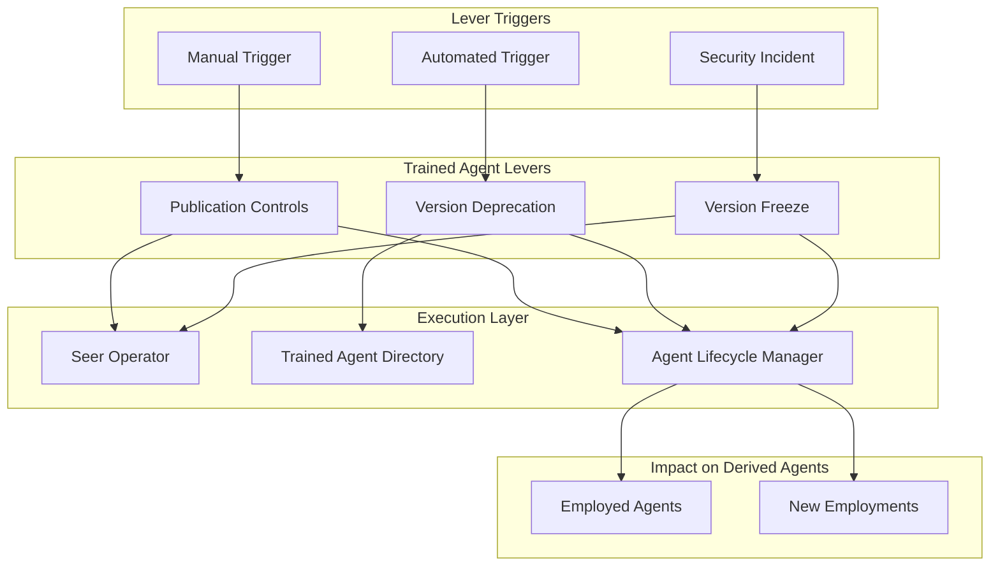
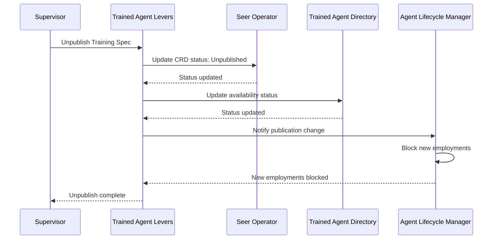
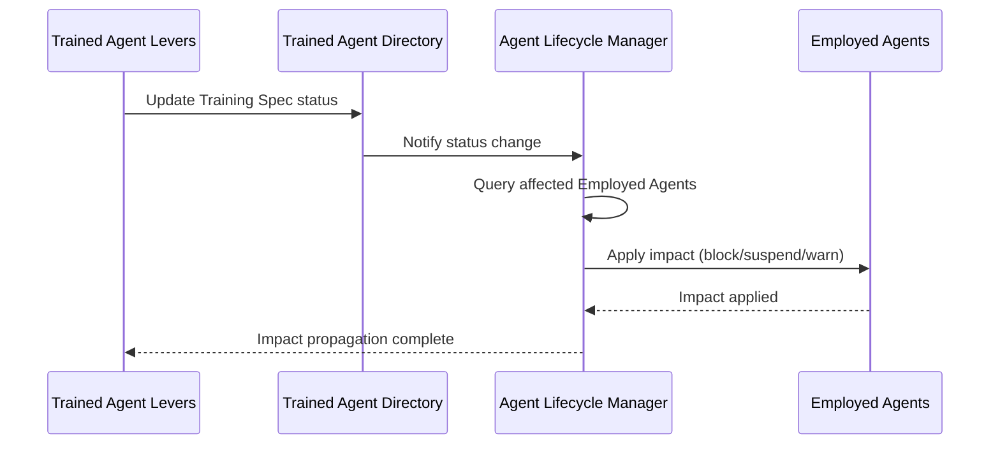

# Trained Agent Levers

> **Status**: 🟢 Design Complete  
> **Last Updated**: 2026-01-13

---

## Overview

Trained Agent Levers provide operational control mechanisms for Training Specs, including publication controls, version deprecation, and version freeze. These "levers" enable supervisors, security teams, and automated systems to control Training Spec availability and impact all derived Employed Agents.

Unlike normal state transitions managed by Operators, levers provide immediate operational control for safety and compliance purposes.

---

## Architecture



---

## Functional Scope

### Publication Controls

Publication Controls manage the availability of Training Specs for new employments, enabling supervisors to prevent new deployments while allowing existing employments to continue.

#### Publication Actions

| Action | Description | Impact on New Employments | Impact on Existing Employments |
|--------|-------------|---------------------------|-------------------------------|
| **Unpublish** | Remove Training Spec from available list | ❌ Blocked | ✅ Continue |
| **Republish** | Restore Training Spec availability | ✅ Allowed | ✅ Continue |
| **Freeze** | Prevent new employments temporarily | ❌ Blocked | ✅ Continue |

#### Unpublish Action

Unpublishes a Training Spec, preventing new employments while allowing existing employments to continue.

```yaml
# Unpublish Action Request
apiVersion: seer.olympus.io/v1
kind: TrainingSpecLeverAction
metadata:
  name: unpublish-fraud-analyst-v2
spec:
  action: unpublish
  target:
    type: trainingSpec
    ref: "fraud-analyst-v2"
    version: "1.7.0"
  reason: "Security review in progress"
  initiator: "user:security-team@acme.com"
  impact:
    newEmployments: "blocked"
    existingEmployments: "continue"
```

**Execution Flow**:



---

## Version Deprecation

Version Deprecation marks specific Training Spec versions as deprecated, signaling that they should be migrated to newer versions while allowing existing employments to continue.

### Deprecation Actions

| Action | Description | Impact |
|--------|-------------|--------|
| **Deprecate Version** | Mark version as deprecated | Warning for new employments, migration recommended |
| **Undeprecate Version** | Remove deprecation status | Restore normal availability |
| **Deprecate with Timeline** | Deprecate with migration deadline | Enforce migration by deadline |

#### Deprecate Version Action

Deprecates a Training Spec version, signaling migration to newer versions.

```yaml
# Deprecate Version Action Request
apiVersion: seer.olympus.io/v1
kind: TrainingSpecLeverAction
metadata:
  name: deprecate-fraud-analyst-v1-6
spec:
  action: deprecate
  target:
    type: trainingSpec
    ref: "fraud-analyst"
    version: "1.6.0"
  reason: "Superseded by v1.7.0 with improved fraud detection"
  initiator: "user:disputes-team@acme.com"
  migration:
    recommendedVersion: "1.7.0"
    deadline: "2026-03-01T00:00:00Z"
    enforcement: "warning"  # or "block" after deadline
```

**Deprecation Impact**:

| Impact Type | Description | Enforcement |
|-------------|-------------|-------------|
| **New Employments** | Warning shown, may be blocked after deadline | Configurable |
| **Existing Employments** | Continue, migration recommended | No enforcement |
| **Directory Search** | Deprecated versions shown with warning | Visual indicator |
| **Migration Path** | Recommended version provided | Guidance only |

---

## Version Freeze

Version Freeze prevents all state changes to a Training Spec version, including new employments, updates, and deprecation. This is used for security incidents or compliance requirements.

### Freeze Actions

| Action | Description | Impact |
|--------|-------------|--------|
| **Freeze Version** | Prevent all changes to version | All operations blocked |
| **Unfreeze Version** | Restore normal operations | Operations resume |
| **Emergency Freeze** | Immediate freeze for security incidents | Immediate enforcement |

#### Freeze Version Action

Freezes a Training Spec version, preventing all changes.

```yaml
# Freeze Version Action Request
apiVersion: seer.olympus.io/v1
kind: TrainingSpecLeverAction
metadata:
  name: freeze-fraud-analyst-v2
spec:
  action: freeze
  target:
    type: trainingSpec
    ref: "fraud-analyst-v2"
    version: "1.7.0"
  reason: "Security incident investigation"
  initiator: "user:security-team@acme.com"
  emergency: true
  impact:
    newEmployments: "blocked"
    existingEmployments: "suspended"  # Optional: suspend existing
    updates: "blocked"
    deprecation: "blocked"
```

**Freeze Impact**:

| Operation | Impact | Enforcement |
|----------|--------|-------------|
| **New Employments** | Blocked | Immediate |
| **Existing Employments** | Continue or suspend (configurable) | Immediate |
| **Spec Updates** | Blocked | Immediate |
| **Deprecation** | Blocked | Immediate |
| **Unfreeze** | Requires unfreeze action | Manual or automated |

---

## Impact on Derived Employed Agents

### Functional Scope

All lever actions impact Employed Agents that use the affected Training Spec. The impact varies by action type and configuration.

#### Impact Matrix

| Lever Action | New Employments | Existing Employments | Migration Required |
|--------------|----------------|---------------------|-------------------|
| **Unpublish** | ❌ Blocked | ✅ Continue | No |
| **Deprecate** | ⚠️ Warning/Blocked | ✅ Continue | Recommended |
| **Freeze** | ❌ Blocked | ✅ Continue or ⏸️ Suspended | No |
| **Emergency Freeze** | ❌ Blocked | ⏸️ Suspended | No |

#### Impact Propagation



#### Impact Notification

Affected Employed Agents receive notifications about Training Spec lever actions:

```yaml
# Impact Notification
notification:
  type: "trainingSpecLeverAction"
  action: "deprecate"
  trainingSpec: "fraud-analyst"
  version: "1.6.0"
  affectedEmployments:
    - "es-fraud-analyst-acme-retail"
    - "es-fraud-analyst-acme-corp"
  recommendedAction: "migrate"
  migrationPath:
    targetVersion: "1.7.0"
    deadline: "2026-03-01T00:00:00Z"
```

---

## Integration Points

### Seer Operator

**Direction**: Outbound  
**Purpose**: Update TrainingSpec CRD status for lever actions

**Integration Pattern**:
- Levers update TrainingSpec CRD status fields (unpublished, deprecated, frozen)
- Seer Operator reconciles CRD changes to Kubernetes state
- Status changes are reflected in CRD

### Trained Agent Directory

**Direction**: Outbound  
**Purpose**: Update directory with lever action status

**Integration Pattern**:
- Levers update directory with publication status, deprecation status, freeze status
- Directory maintains current lever state
- Search results reflect lever status (e.g., deprecated versions shown with warning)

### Agent Lifecycle Manager

**Direction**: Outbound  
**Purpose**: Notify and enforce impact on Employed Agents

**Integration Pattern**:
- Levers notify Agent Lifecycle Manager of lever actions
- Agent Lifecycle Manager queries affected Employed Agents
- Agent Lifecycle Manager applies impact (block new employments, suspend existing, show warnings)
- Employed Agent Directory updated with impact status

---

## Key Design Decisions

### Lever Actions Affect All Derived Employed Agents

**Decision**: Lever actions on Training Specs impact all Employed Agents that use the affected Training Spec.

**Rationale**:
- Training Specs are shared resources; changes affect all consumers
- Ensures consistent safety posture across all employments
- Enables centralized control for security and compliance

**Impact**:
- Lever actions propagate to all derived Employed Agents
- Agent Lifecycle Manager enforces impact on Employed Agents
- Impact varies by action type (block, suspend, warn)

### Publication Controls vs. State Transitions

**Decision**: Publication controls (unpublish/republish) are separate from normal state transitions (Drafted → Validated → Published).

**Rationale**:
- Publication controls are operational, not lifecycle
- Allows temporary unavailability without state change
- Enables quick response to security or compliance issues

**Impact**:
- Publication status is separate from lifecycle state
- Training Spec can be Published but Unpublished (blocking new employments)
- Operators manage state transitions; Levers manage publication controls

### Deprecation with Migration Guidance

**Decision**: Deprecation includes migration guidance (recommended version, deadline) to help users migrate.

**Rationale**:
- Deprecation is a signal to migrate, not an immediate block
- Migration guidance reduces friction
- Deadline enforcement provides compliance mechanism

**Impact**:
- Deprecation includes recommended version and deadline
- New employments may be warned or blocked based on configuration
- Existing employments continue with migration recommendation

---

## Related Documentation

- [Trained Agent Operators](./trained-agent-operators.md) — Normal state transitions
- [Trained Agent Directory](./trained-agent-directory.md) — Registry and search
- [Agent Levers Service](../agent-lifecycle-manager/agent-levers-service.md) — Employed Agent levers
- [Agent Lifecycle Concepts](../../implementation-concepts/agent-lifecycle.md) — Three-layer agent model

---

*Trained Agent Levers provide operational control over Training Specs, enabling supervisors to manage availability, deprecation, and emergency response while impacting all derived Employed Agents.*
