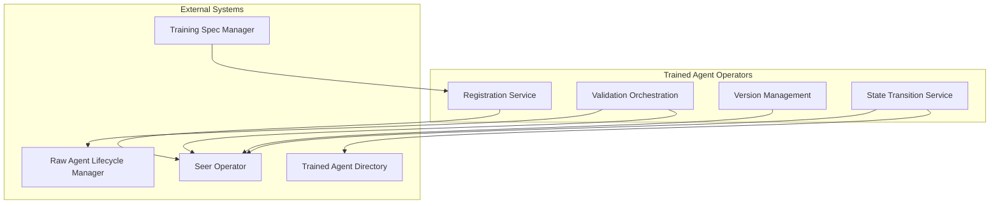
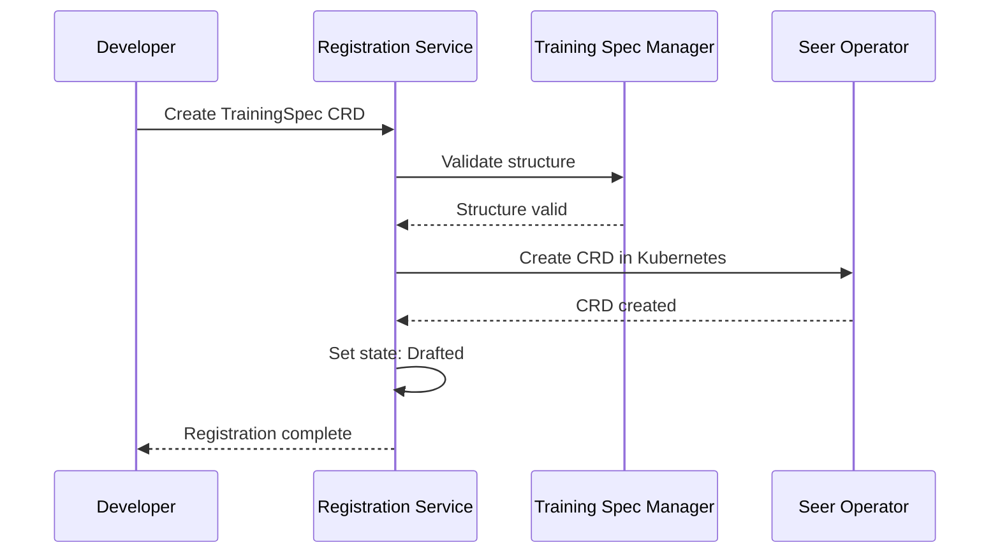
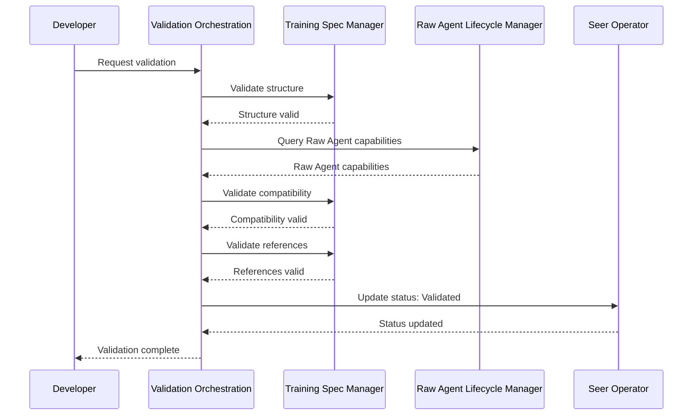
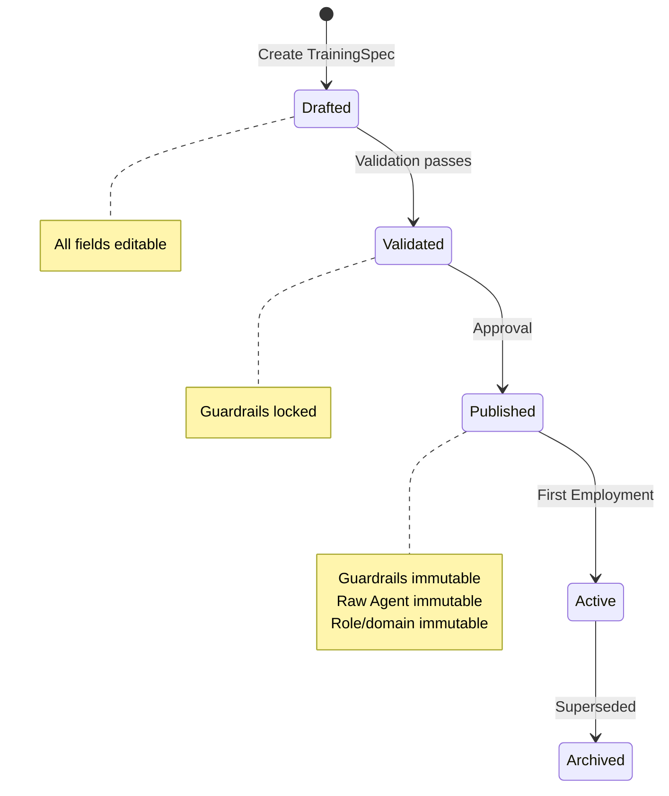

# Trained Agent Operators

> **Status**: 🟢 Design Complete  
> **Last Updated**: 2026-01-13

---

## Overview

Trained Agent Operators manage the lifecycle of Training Specs through Seer Operator, handling registration, validation, versioning, and state transitions. Operators bridge the business logic layer (Training Spec Manager) with the Kubernetes control plane (Seer Operator).

Operators ensure Training Specs are properly registered, validated, and transitioned through their lifecycle states (Drafted → Validated → Published → Active → Archived).

---

## Architecture



---

## Functional Scope

### Registration Service

Registration Service handles the initial registration of Training Specs in the system, ensuring they are properly formatted and ready for validation.

#### Registration Flow



#### Registration Steps

| Step | Description | Validation |
|------|-------------|------------|
| **1. CRD Creation** | Developer creates TrainingSpec CRD | Basic schema validation |
| **2. Structure Validation** | Training Spec Manager validates structure | Required fields, types, syntax |
| **3. Kubernetes Registration** | Seer Operator creates CRD | Kubernetes API validation |
| **4. State Initialization** | Set initial state to "Drafted" | State transition validation |
| **5. Directory Registration** | Register in Trained Agent Directory | Directory index update |

---

## Validation Orchestration

Validation Orchestration coordinates validation checks across multiple systems before a Training Spec can transition to "Validated" state.

### Validation Checks

| Check Type | Validated By | Purpose |
|------------|--------------|---------|
| **Structure Validation** | Training Spec Manager | Ensure all required fields present and correctly formatted |
| **Raw Agent Compatibility** | Training Spec Manager + Raw Agent Lifecycle Manager | Verify Raw Agent exists and capabilities align |
| **Reference Validation** | Training Spec Manager | Verify all references (guardrails, tools, knowledge bases) exist |
| **Syntax Validation** | Training Spec Manager | Verify selectors, version ranges, etc. are valid |

### Validation Flow



### Validation Results

| Result | Action | Next State |
|--------|--------|------------|
| **All Checks Pass** | Update status to "Validated" | Validated |
| **Structure Invalid** | Return validation errors | Drafted (no change) |
| **Compatibility Invalid** | Return compatibility errors | Drafted (no change) |
| **References Invalid** | Return reference errors | Drafted (no change) |

---

## Version Management

Version Management handles versioning of Training Specs, ensuring proper version assignment, compatibility tracking, and version history.

### Version Assignment

| Version Type | Assignment Rule | Example |
|-------------|----------------|---------|
| **Draft Versions** | `0.x.x` (pre-publication) | `0.1.0`, `0.2.0` |
| **Published Versions** | `1.0.0+` (semver) | `1.0.0`, `1.1.0`, `2.0.0` |
| **Patch Versions** | Bug fixes, non-breaking changes | `1.0.0` → `1.0.1` |
| **Minor Versions** | New features, backward compatible | `1.0.0` → `1.1.0` |
| **Major Versions** | Breaking changes | `1.0.0` → `2.0.0` |

### Version Compatibility

Version Management tracks compatibility between Training Spec versions and Raw Agent versions:

```yaml
# Training Spec v1.7.0
version:
  spec: "1.7.0"
  compatibility:
    rawAgent: "^2.0.0"
    guardrails:
      pii-protection: "^1.0.0"
      financial-compliance: "^2.1.0"
```

### Version History

Operators maintain version history for each Training Spec:

```yaml
versionHistory:
  trainingSpec: "fraud-analyst"
  versions:
    - version: "1.7.0"
      state: "active"
      publishedAt: "2026-01-08T10:00:00Z"
      changes: "Added new skill prompt for transaction analysis"
    - version: "1.6.0"
      state: "archived"
      publishedAt: "2025-12-15T09:00:00Z"
      supersededBy: "1.7.0"
```

---

## State Transition Service

State Transition Service manages transitions between Training Spec lifecycle states, enforcing transition rules and updating related systems.

### Lifecycle States

```
[Drafted] → [Validated] → [Published] → [Active] → [Archived]
```

### State Transition Rules

| Transition | Condition | Action | Immutability Impact |
|------------|-----------|--------|-------------------|
| **Drafted → Validated** | All validations pass | Lock guardrails, update status | Guardrails become immutable |
| **Validated → Published** | Approval granted | Mark as published, register in directory | Full immutability enforced |
| **Published → Active** | First EmploymentSpec created | Update activeEmployments count | No change |
| **Active → Archived** | Newer version supersedes | Freeze spec, mark as archived | No change |

### State Transition Flow



### Transition Enforcement

| Rule | Description | Enforcement |
|------|-------------|-------------|
| **Validation Required** | Cannot transition to Validated without passing all checks | Validation Orchestration blocks transition |
| **Approval Required** | Cannot transition to Published without approval | Approval workflow required |
| **Guardrail Locking** | Guardrails locked at Validated state | Training Spec Manager enforces immutability |
| **Immutability Enforcement** | Full immutability at Published state | Training Spec Manager blocks changes |

---

## Integration Points

### Training Spec Manager

**Direction**: Inbound  
**Purpose**: Receive validation requests and structure validation results

**Integration Pattern**:
- Operators request validation from Training Spec Manager
- Training Spec Manager performs structure, compatibility, and reference validation
- Validation results determine state transition eligibility

### Seer Operator

**Direction**: Outbound  
**Purpose**: Update TrainingSpec CRD status and state in Kubernetes

**Integration Pattern**:
- Operators update TrainingSpec CRD status fields
- Seer Operator reconciles CRD changes to Kubernetes state
- State transitions are reflected in CRD status

### Trained Agent Directory

**Direction**: Outbound  
**Purpose**: Update directory with state changes and version information

**Integration Pattern**:
- Operators update directory upon state transitions
- Directory maintains current state and version history
- Search indexes updated with new state information

### Raw Agent Lifecycle Manager

**Direction**: Outbound  
**Purpose**: Query Raw Agent capabilities for compatibility validation

**Integration Pattern**:
- Operators query Raw Agent Directory for capability information
- Compatibility validation uses Raw Agent capabilities
- Ensures Training Specs are compatible with Raw Agents

---

## Key Design Decisions

### Operator as Orchestration Layer

**Decision**: Trained Agent Operators orchestrate validation and state transitions, but delegate actual validation logic to Training Spec Manager.

**Rationale**:
- Separation of concerns: operators handle orchestration, Training Spec Manager handles business logic
- Reusability: validation logic can be reused by other components
- Testability: validation logic can be tested independently

**Impact**:
- Operators coordinate validation across multiple systems
- Training Spec Manager performs actual validation checks
- Clear separation between orchestration and validation logic

### CRD-Based State Management

**Decision**: State transitions are managed through TrainingSpec CRD status fields, with Seer Operator reconciling to Kubernetes state.

**Rationale**:
- Kubernetes-native pattern
- State is persisted in CRD
- Seer Operator handles reconciliation automatically

**Impact**:
- State transitions update CRD status
- Seer Operator watches and reconciles CRDs
- State is visible in Kubernetes API

### Version Management at Operator Level

**Decision**: Version assignment and tracking is handled by Operators, not Training Spec Manager.

**Rationale**:
- Versioning is a lifecycle concern, not a validation concern
- Operators manage complete lifecycle, including versioning
- Version history is maintained alongside state transitions

**Impact**:
- Operators assign versions based on change type
- Version history tracked in directory
- Compatibility information maintained with versions

---

## Related Documentation

- [Training Spec Manager](./training-spec-manager.md) — Spec validation and structure management
- [Trained Agent Directory](./trained-agent-directory.md) — Registry and search capabilities
- [Trained Agent Levers](./trained-agent-levers.md) — Publication controls and deprecation
- [Agent Lifecycle Concepts](../../implementation-concepts/agent-lifecycle.md) — Three-layer agent model

---

*Trained Agent Operators orchestrate Training Spec lifecycle management, ensuring proper validation, versioning, and state transitions through Seer Operator.*
