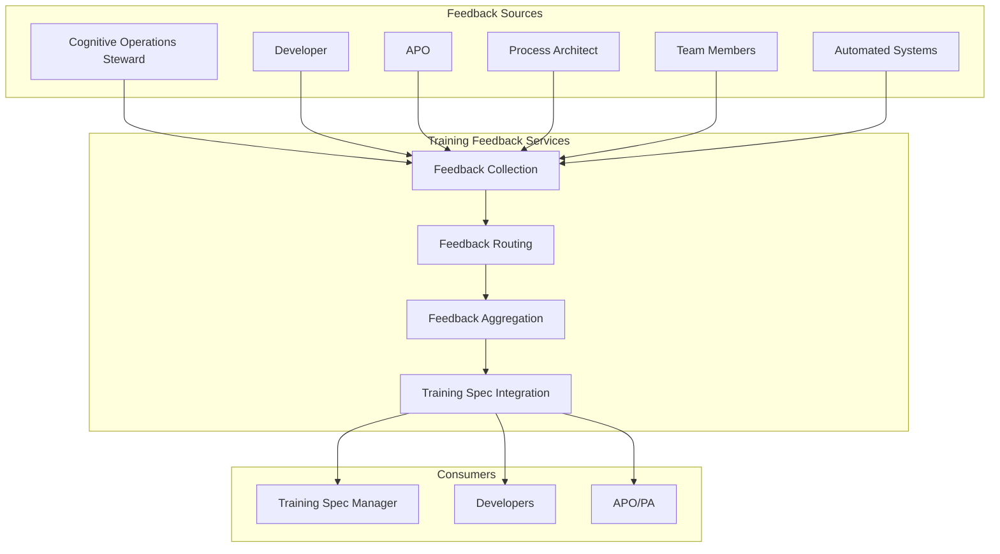
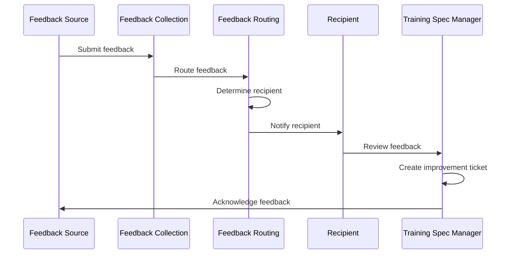
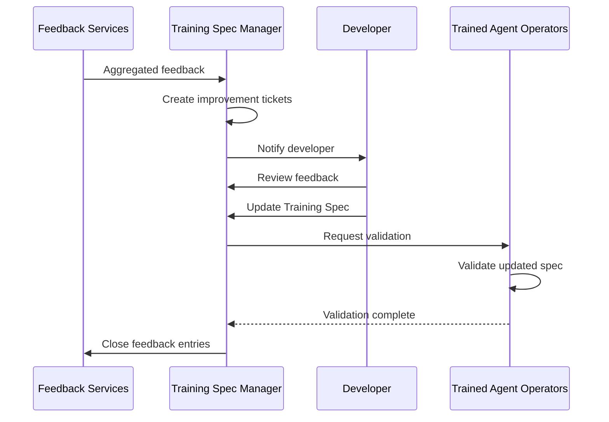

# Training Feedback Services

> **Status**: 🟢 Design Complete  
> **Last Updated**: 2026-01-13

---

## Overview

Training Feedback Services collect and route feedback on Training Specs from various stakeholders, including Cognitive Operations Stewards (COS), Developers, APOs, PAs, and other team members. Feedback is used to improve Training Specs, identify issues, and guide Training Spec evolution.

Feedback Services provide structured feedback collection, routing, and integration with Training Spec Manager for continuous improvement.

---

## Architecture



---

## Functional Scope

### Feedback Collection

Feedback Collection provides structured interfaces for stakeholders to submit feedback on Training Specs.

#### Feedback Types

| Feedback Type | Source | Purpose | Example |
|---------------|--------|---------|---------|
| **Training Spec Improvements** | COS, Developer | Suggest improvements to prompts, guardrails, knowledge bindings | "System prompt should emphasize customer empathy" |
| **Agent Behavior Feedback** | APO, PA | Report on agent behavior in production | "Agent escalates too frequently for low-value cases" |
| **Capability Gaps** | Developer, Team Members | Identify missing capabilities | "Agent needs access to transaction history API" |
| **Safety Concerns** | COS, Security Team | Report safety or compliance issues | "Guardrail threshold too high for high-risk customers" |
| **Performance Issues** | Developer, COS | Report performance or quality issues | "Agent response time too slow for time-sensitive cases" |

#### Feedback Structure

```yaml
# Feedback Entry
feedback:
  id: "fb-fraud-analyst-v2-001"
  trainingSpec:
    name: "fraud-analyst-v2"
    version: "1.7.0"
  
  # Feedback Metadata
  metadata:
    type: "training_spec_improvement"
    priority: "medium"
    submittedAt: "2026-01-12T10:30:00Z"
    submittedBy: "user:cos-disputes@acme.com"
    status: "open"
  
  # Feedback Content
  content:
    category: "system_prompt"
    description: |
      The system prompt should emphasize customer empathy when 
      communicating with customers about fraud cases. Current 
      prompt focuses on technical analysis but lacks empathy guidance.
    suggestion: |
      Add section to system prompt:
      "When communicating with customers, always:
      1. Acknowledge their concern
      2. Express empathy for the situation
      3. Provide clear next steps"
    impact: "improves_customer_experience"
  
  # Related Information
  context:
    source: "production_observations"
    workbench: "acme-disputes"
    scenario: "fraud-investigation"
    evidence:
      - "Customer complaint: 'Agent was too technical, didn't understand my concern'"
      - "Sentiment analysis: 40% negative feedback on agent communication"
  
  # Routing
  routing:
    assignedTo: "user:disputes-team@acme.com"
    requiresApproval: false
    autoAction: "create_improvement_ticket"
```

---

## Feedback Routing

Feedback Routing directs feedback to appropriate recipients based on feedback type, priority, and Training Spec ownership.

### Routing Rules

| Feedback Type | Default Route | Approval Required |
|---------------|---------------|-------------------|
| **Training Spec Improvements** | Training Spec owner (Developer/Team) | No |
| **Agent Behavior Feedback** | APO/PA | No |
| **Capability Gaps** | Developer | No |
| **Safety Concerns** | Security Team + Training Spec owner | Yes |
| **Performance Issues** | Developer + COS | No |

### Routing Flow



### Routing Configuration

```yaml
# Routing Configuration
routing:
  trainingSpec: "fraud-analyst-v2"
  rules:
    - type: "training_spec_improvement"
      routeTo: "training_spec_owner"
      priority: "medium"
    - type: "safety_concern"
      routeTo: ["security_team", "training_spec_owner"]
      priority: "high"
      requiresApproval: true
    - type: "agent_behavior"
      routeTo: "apo_pa"
      priority: "medium"
```

---

## Feedback Aggregation

Feedback Aggregation combines related feedback entries, identifies patterns, and generates aggregated insights.

### Aggregation Capabilities

| Capability | Description | Use Case |
|------------|-------------|----------|
| **Related Feedback Grouping** | Group feedback by Training Spec, category, or issue | Identify common themes |
| **Pattern Detection** | Detect recurring feedback patterns | Identify systemic issues |
| **Priority Calculation** | Calculate aggregated priority based on volume and severity | Prioritize improvements |
| **Trend Analysis** | Track feedback trends over time | Monitor Training Spec quality |

### Aggregation Example

```yaml
# Aggregated Feedback
aggregatedFeedback:
  trainingSpec: "fraud-analyst-v2"
  category: "system_prompt"
  period: "2026-01-01 to 2026-01-31"
  
  summary:
    totalFeedback: 15
    uniqueIssues: 3
    averagePriority: "medium"
    trend: "increasing"
  
  issues:
    - issue: "Lack of customer empathy guidance"
      feedbackCount: 8
      priority: "high"
      sources: ["cos", "apo", "team_members"]
      firstReported: "2026-01-05"
      lastReported: "2026-01-28"
      status: "in_progress"
    
    - issue: "Technical jargon in customer communications"
      feedbackCount: 5
      priority: "medium"
      sources: ["cos", "team_members"]
      firstReported: "2026-01-10"
      lastReported: "2026-01-25"
      status: "open"
    
    - issue: "Missing escalation criteria"
      feedbackCount: 2
      priority: "low"
      sources: ["developer"]
      firstReported: "2026-01-15"
      lastReported: "2026-01-20"
      status: "resolved"
  
  recommendations:
    - action: "Update system prompt with empathy guidance"
      priority: "high"
      estimatedImpact: "improves_customer_experience"
    - action: "Add communication style guidelines"
      priority: "medium"
      estimatedImpact: "reduces_customer_complaints"
```

---

## Training Spec Integration

Training Spec Integration connects feedback to Training Spec improvement workflows, enabling feedback-driven Training Spec evolution.

### Integration Workflows

| Workflow | Description | Trigger |
|----------|-------------|---------|
| **Improvement Ticket Creation** | Create improvement tickets from feedback | Feedback submission |
| **Training Spec Update** | Update Training Spec based on feedback | Developer action |
| **Version Planning** | Plan new Training Spec version with improvements | Feedback aggregation |
| **Validation Integration** | Include feedback in validation criteria | Training Spec validation |

### Integration Flow



### Improvement Ticket Example

```yaml
# Improvement Ticket
improvementTicket:
  id: "imp-fraud-analyst-v2-001"
  trainingSpec: "fraud-analyst-v2"
  version: "1.7.0"
  
  title: "Add customer empathy guidance to system prompt"
  description: |
    Multiple feedback entries indicate that the system prompt 
    lacks guidance on customer empathy. This affects customer 
    experience and satisfaction.
  
  sourceFeedback:
    - "fb-fraud-analyst-v2-001"
    - "fb-fraud-analyst-v2-005"
    - "fb-fraud-analyst-v2-012"
  
  priority: "high"
  status: "in_progress"
  assignedTo: "user:disputes-team@acme.com"
  
  proposedChanges:
    - component: "system_prompt"
      change: "Add empathy section"
      details: |
        Add section emphasizing customer empathy in communications
      
  validation:
    testScenarios:
      - "Customer communication test"
      - "Empathy tone validation"
  
  targetVersion: "1.8.0"
  estimatedCompletion: "2026-02-15"
```

---

## Integration Points

### Training Spec Manager

**Direction**: Outbound  
**Purpose**: Provide feedback for Training Spec improvement

**Integration Pattern**:
- Feedback Services aggregate and route feedback to Training Spec Manager
- Training Spec Manager creates improvement tickets from feedback
- Training Spec updates incorporate feedback-driven improvements

### Trained Agent Directory

**Direction**: Outbound  
**Purpose**: Track feedback statistics for Training Specs

**Integration Pattern**:
- Feedback Services update directory with feedback statistics
- Directory displays feedback metrics in Training Spec profiles
- Search results can include feedback-based quality indicators

### Agent Lifecycle Manager

**Direction**: Inbound  
**Purpose**: Receive agent behavior feedback from production

**Integration Pattern**:
- Agent Lifecycle Manager provides agent behavior observations
- Feedback Services collect behavior feedback for Training Spec improvement
- Behavior feedback informs Training Spec evolution

---

## Key Design Decisions

### Multi-Source Feedback Collection

**Decision**: Feedback Services collect feedback from multiple sources (COS, Developer, APO, PA, team members) with structured feedback types.

**Rationale**:
- Different stakeholders have different perspectives
- Structured feedback enables automated routing and aggregation
- Multi-source feedback provides comprehensive view of Training Spec quality

**Impact**:
- Feedback collection supports multiple feedback types
- Routing rules direct feedback to appropriate recipients
- Aggregation combines feedback from multiple sources

### Feedback-Driven Improvement Workflow

**Decision**: Feedback is integrated into Training Spec improvement workflows, creating improvement tickets and guiding version planning.

**Rationale**:
- Feedback should drive Training Spec evolution
- Structured workflow ensures feedback is acted upon
- Improvement tickets track feedback resolution

**Impact**:
- Feedback Services create improvement tickets
- Training Spec updates incorporate feedback
- Version planning considers aggregated feedback

### Automated Feedback Collection

**Decision**: Feedback Services support automated feedback collection from observability systems and production monitoring.

**Rationale**:
- Automated feedback provides continuous quality monitoring
- Reduces manual feedback collection burden
- Enables proactive issue detection

**Impact**:
- Automated systems can submit feedback
- Feedback aggregation includes automated feedback
- Pattern detection identifies systemic issues

---

## Related Documentation

- [Training Spec Manager](./training-spec-manager.md) — Spec validation and management
- [Trained Agent Directory](./trained-agent-directory.md) — Registry and search
- [Agent Lifecycle Manager](../agent-lifecycle-manager/README.md) — Employed Agent management
- [Agent Observability](../agent-observability.md) — Runtime monitoring and feedback

---

*Training Feedback Services enable continuous improvement of Training Specs through structured feedback collection, routing, and integration with Training Spec improvement workflows.*
