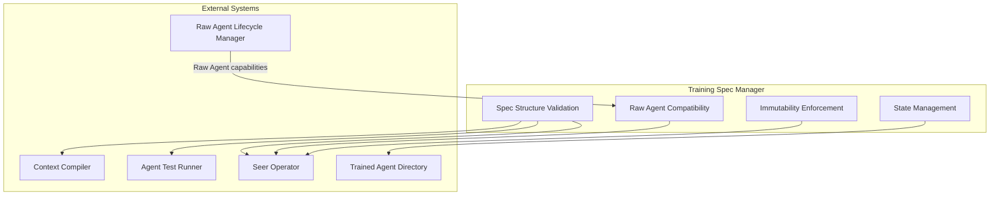
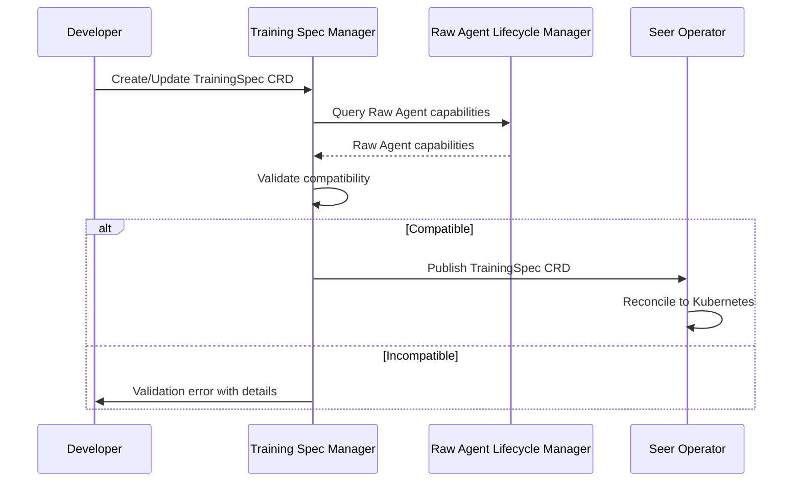
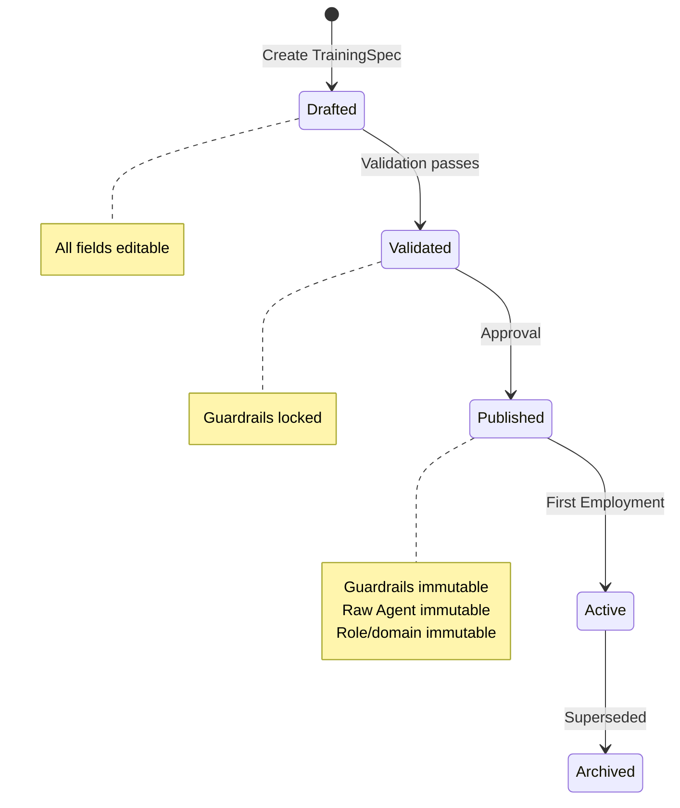
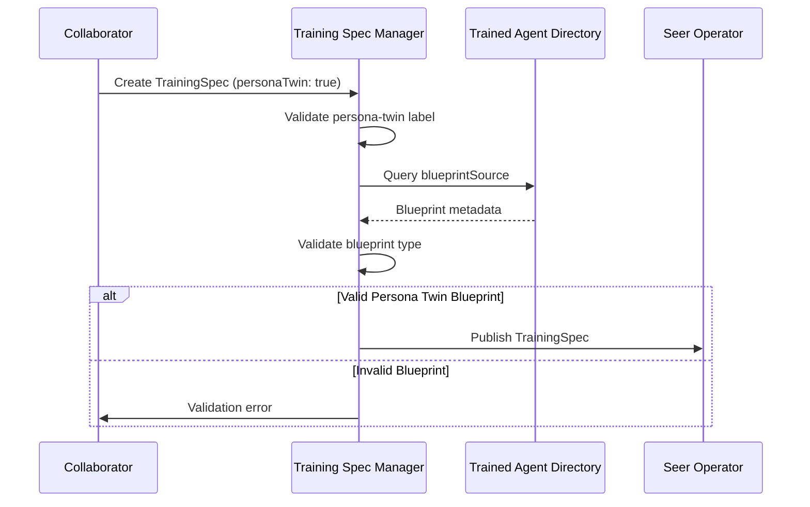

# Training Spec Manager

> **Status**: 🟢 Design Complete  
> **Last Updated**: 2026-01-13

---

## Overview

Training Spec Manager is the foundational component of the Trained Agent Lifecycle Manager subsystem. It manages Training Specifications (TrainingSpec CRDs) that define Trained Agents—Raw Agents configured with organizational knowledge, domain-specific skills, prompts, and referenced capabilities.

Training Spec Manager handles spec structure validation, Raw Agent compatibility checks, and enforces immutability rules (particularly for guardrails) once Training Specs are published.

---

## Architecture



---

## Functional Scope

### Training Spec Structure

Training Spec Manager validates the complete structure of TrainingSpec CRDs, ensuring all required components are present and correctly formatted.

#### Core Components

| Component | Description | Validation Rules |
|-----------|-------------|------------------|
| **Raw Agent Reference** | Container image reference | Must reference valid Raw Agent with compatible version |
| **Context Definitions** | Identity, role, domain, PIDA mapping | Required fields: displayName, role, domain |
| **Behavioral Configuration** | System prompts, skill prompts, style guidelines | System prompt required; skill prompts optional |
| **Guardrail References** | Referenced and inline guardrails | Guardrails validated for syntax; immutability enforced after publication |
| **Tool References** | Tool protocols and Hub-native tools | Tool protocols validated against Tools Gateway registry |
| **Knowledge Base References** | Knowledge base bindings | Knowledge bases validated for existence and accessibility |
| **Memory Configuration** | Agent Memory and Enterprise Memory patterns | Memory store types validated; compaction strategies validated |
| **Context Compilation Config** | Retriever configurations with selectors | Selector syntax validated; retriever types validated |

#### Spec Structure Example

```yaml
apiVersion: seer.olympus.io/v1
kind: TrainingSpec
metadata:
  name: fraud-analyst-v2
  namespace: acme-disputes
spec:
  # Raw Agent Reference (validated against Raw Agent Directory)
  rawAgent:
    name: fraud-analyst-base
    version: "^2.0.0"
  
  # Context Definitions (required)
  context:
    identity:
      displayName: "Fraud Case Analyst"
      role: case-analyst
      domain: disputes
  
  # Behavioral Configuration (system prompt required)
  behavioral:
    systemPrompt: |
      You are a Fraud Case Analyst AI agent...
    skillPrompts:
      - name: analyze-transaction
        prompt: |
          When analyzing a transaction...
  
  # Guardrail References (immutable after publication)
  guardrails:
    refs:
      - name: pii-protection
        version: "^1.0.0"
    inline:
      - name: amount-threshold
        type: decision-boundary
        config:
          maxAutonomousApproval: 5000
  
  # Context Compilation Configuration
  contextCompilation:
    retrieverConfigs:
      - selector:
          updateType: "task_created"
          taskType: "fraud_investigation"
        retrievers:
          - type: enterprise_memory
            purpose: "precedents"
          - type: knowledge_base
            ref: "fraud-patterns-kb"
```

---

## Raw Agent Compatibility

### Functional Scope

Training Spec Manager validates that Training Specs reference valid Raw Agents and that the Training Spec configuration is compatible with the Raw Agent's declared capabilities.

#### Compatibility Checks

| Check Type | Description | Validation Logic |
|------------|-------------|------------------|
| **Raw Agent Existence** | Raw Agent must exist in Raw Agent Directory | Query Raw Agent Lifecycle Manager |
| **Version Compatibility** | Raw Agent version must match semver range | Validate version range syntax and compatibility |
| **Capability Alignment** | Training Spec must not require capabilities Raw Agent doesn't support | Compare tool calling capabilities, orchestration capabilities, archetype roles |
| **Prompt Tag Validation** | Prompt tags must match Raw Agent's supported tags | Validate tags against Raw Agent's tag definitions |

#### Capability Constraint Example

```yaml
# Raw Agent declares capabilities
rawAgent:
  capabilities:
    toolCalling: ["http", "grpc"]
    orchestration: ["sequential", "parallel"]
    archetypeRoles: ["thinker", "doer"]
    promptTags: ["autonomy_level", "authority_scope"]

# Training Spec must align
trainingSpec:
  rawAgent:
    name: fraud-analyst-base
    version: "^2.0.0"  # Must support required capabilities
  
  behavioral:
    skillPrompts:
      - name: analyze-transaction
        tags:
          autonomy_level: "Full"  # Must be supported by Raw Agent
          authority_scope: "case_analysis"  # Must be supported by Raw Agent
```

#### Validation Flow



---

## Immutability Enforcement

### Functional Scope

Training Spec Manager enforces immutability rules, particularly for guardrails, once a Training Spec transitions to **Published** or **Active** state.

#### Immutability Rules

| Component | Immutability Rule | Rationale |
|-----------|-------------------|-----------|
| **Guardrails** | Cannot be relaxed after publication | Safety constraints must not be weakened |
| **Raw Agent Reference** | Cannot change to different Raw Agent | Training is tied to specific Raw Agent |
| **Context Identity** | Role and domain cannot change | Agent identity is fixed |
| **System Prompt** | Can be updated (new version) | Allows prompt improvements |

#### Guardrail Immutability

**Principle**: Training Spec guardrails are immutable once published. They cannot be relaxed, bypassed, or overridden at Employment time.

**Enforcement**:
- Guardrail references cannot be removed
- Guardrail versions cannot be downgraded
- Inline guardrail thresholds cannot be increased (relaxed)
- New guardrails can be added (strengthening is allowed)

**Example**:

```yaml
# Published Training Spec v1.0.0
guardrails:
  inline:
    - name: amount-threshold
      config:
        maxAutonomousApproval: 5000  # Cannot be increased to 10000

# Attempted update (rejected)
guardrails:
  inline:
    - name: amount-threshold
      config:
        maxAutonomousApproval: 10000  # ❌ REJECTED: Relaxation not allowed
```

**Allowed Updates**:
- Adding new guardrails (strengthening)
- Upgrading guardrail versions (if new version is stricter)
- Updating prompts (creates new version)

#### State-Based Immutability



---

## Validation Rules

### Spec Structure Validation

| Rule | Description | Error Type |
|------|-------------|------------|
| **Required Fields** | All required spec fields must be present | ValidationError |
| **Field Types** | All fields must match expected types | ValidationError |
| **Reference Validity** | All references (Raw Agent, guardrails, tools, knowledge bases) must exist | ValidationError |
| **Version Syntax** | Version ranges must be valid semver | ValidationError |
| **Selector Syntax** | Context compilation selectors must be valid | ValidationError |

### Raw Agent Compatibility Validation

| Rule | Description | Error Type |
|------|-------------|------------|
| **Raw Agent Exists** | Referenced Raw Agent must exist in directory | CompatibilityError |
| **Version Range** | Version range must match available Raw Agent versions | CompatibilityError |
| **Capability Support** | Training Spec must not require unsupported capabilities | CompatibilityError |
| **Tag Support** | Prompt tags must be supported by Raw Agent | CompatibilityError |

### Immutability Validation

| Rule | Description | Error Type |
|------|-------------|------------|
| **Guardrail Relaxation** | Cannot relax guardrails after publication | ImmutabilityError |
| **Raw Agent Change** | Cannot change Raw Agent reference | ImmutabilityError |
| **Role/Domain Change** | Cannot change role or domain | ImmutabilityError |

---

## Integration Points

### Raw Agent Lifecycle Manager

**Direction**: Inbound  
**Purpose**: Query Raw Agent capabilities for compatibility validation

**Integration Pattern**:
- Training Spec Manager queries Raw Agent Directory for capability information
- Validates Training Spec requirements against Raw Agent capabilities
- Ensures Training Spec does not require capabilities Raw Agent doesn't support

### Seer Operator

**Direction**: Outbound  
**Purpose**: Publish validated TrainingSpec CRDs for reconciliation

**Integration Pattern**:
- Training Spec Manager validates TrainingSpec CRD
- Upon validation success, TrainingSpec CRD is published (status updated)
- Seer Operator watches TrainingSpec CRDs and reconciles to Kubernetes state
- Seer Operator handles CRD lifecycle (state transitions, status updates)

### Trained Agent Directory

**Direction**: Outbound  
**Purpose**: Register validated Training Specs in directory

**Integration Pattern**:
- Upon successful validation and publication, Training Spec is registered in directory
- Directory maintains searchable index of Training Specs
- Directory tracks version history and dependencies

### Agent Test Runner

**Direction**: Outbound  
**Purpose**: Provide Training Specs for test deployment validation

**Integration Pattern**:
- Agent Test Runner queries Training Spec Manager for Training Specs to test
- Training Spec Manager provides validated Training Specs for test deployment
- Test results may feed back to Training Spec Manager for validation improvements

### Context Compiler

**Direction**: Outbound  
**Purpose**: Provide retriever configurations from Training Specs

**Integration Pattern**:
- Context Compiler reads retriever configurations from Training Specs
- Training Spec Manager ensures retriever configuration syntax is valid
- Context Compiler uses selectors to match request updates to retriever configurations

---

## State Management

### Lifecycle States

Training Spec Manager manages state transitions for Training Specs:

```
[Drafted] → [Validated] → [Published] → [Active] → [Archived]
```

| State | Description | Editable | Can Deploy |
|-------|-------------|----------|------------|
| **Drafted** | In development, editable | ✅ All fields | ❌ |
| **Validated** | Passed validation, ready for approval | ⚠️ Limited (guardrails locked) | ❌ |
| **Published** | Approved, available for employment | ❌ Immutable (guardrails, Raw Agent, role/domain) | ✅ |
| **Active** | Has active employments | ❌ Immutable | ✅ |
| **Archived** | Superseded by newer version | ❌ Frozen | ❌ (new) |

### State Transition Rules

| Transition | Condition | Action |
|------------|-----------|--------|
| Drafted → Validated | All validations pass | Lock guardrails, update status |
| Validated → Published | Approval granted | Mark as published, register in directory |
| Published → Active | First EmploymentSpec created | Update activeEmployments count |
| Active → Archived | Newer version supersedes | Freeze spec, mark as archived |

---

## Key Design Decisions

### Guardrail Immutability Principle

**Decision**: Training Spec guardrails are immutable once published. They cannot be relaxed, bypassed, or overridden at Employment time.

**Rationale**:
- Safety constraints must not be weakened after training
- Employment can only narrow (never expand) authority
- Ensures consistent safety posture across all employments

**Impact**:
- Training Specs must be carefully validated before publication
- Guardrail changes require new Training Spec version
- Employment Specs inherit guardrails and can only add additional constraints

### Raw Agent Capability Constraints

**Decision**: Training Specs are constrained by Raw Agent capabilities. Training Spec Manager validates compatibility before publication.

**Rationale**:
- Training Specs configure Raw Agents; they cannot add capabilities Raw Agent doesn't have
- Ensures Training Specs are deployable
- Prevents runtime failures due to capability mismatches

**Impact**:
- Training Spec creation requires Raw Agent selection first
- Raw Agent capabilities influence Training Spec options
- Capability mismatches are caught during validation, not at runtime

### Seer Operator Boundary

**Decision**: Training Spec Manager is business logic layer; Seer Operator is controller layer that reconciles CRDs to Kubernetes state.

**Rationale**:
- Separation of concerns: business logic vs. infrastructure reconciliation
- Training Spec Manager handles validation and state management
- Seer Operator handles Kubernetes-native operations

**Impact**:
- Training Spec Manager publishes validated CRDs
- Seer Operator watches and reconciles CRDs
- Clear boundary between validation and deployment

---

## Persona Twin Support

### Overview

Training Spec Manager supports **Persona Twins**—personal AI agents that collaborators create to handle delegated tasks. Persona Twins follow the standard Training Spec lifecycle with additional metadata recognition.

### Persona Twin Metadata Validation

Training Spec Manager validates Persona Twin specific metadata fields:

| Field | Type | Validation Rule |
|-------|------|-----------------|
| `metadata.labels.persona-twin` | string | Must be `"true"` if present |
| `spec.metadata.personaTwin` | boolean | If `true`, validates Persona Twin specific fields |
| `spec.metadata.delegator` | string | Required if `personaTwin: true`; must be valid user reference |
| `spec.metadata.blueprintSource` | string | Optional; validates blueprint exists if specified |

#### Persona Twin Training Spec Example

```yaml
apiVersion: seer.olympus.io/v1
kind: TrainingSpec
metadata:
  name: john-smith-assistant
  namespace: acme-disputes
  labels:
    persona-twin: "true"  # Metadata label for recognition
spec:
  # Standard Training Spec fields
  rawAgent:
    name: assistant-raw
    version: "^2.0.0"
  
  # Persona Twin specific metadata
  metadata:
    personaTwin: true
    delegator: "user:john.smith@acme.com"
    blueprintSource: "collaborator-assistant-base:1.0.0"
  
  # Training configuration
  knowledge:
    sources:
      - type: knowledge-base
        ref: john-smith-preferences-kb
  
  skills:
    - name: task-triage
      procedure: procedures/task-triage-v1
  
  prompts:
    system: |
      You are John's personal task assistant.
      Help triage and manage tasks efficiently.
  
  guardrails:
    refs:
      - name: pii-protection
        version: "^1.0.0"
```

### Persona Twin Blueprint Source

Persona Twins are typically created from Persona Twin Blueprints. Training Spec Manager validates:

1. **Blueprint existence**: If `blueprintSource` is specified, the referenced blueprint must exist
2. **Blueprint type**: Source blueprint must be a valid Persona Twin Blueprint (has `personaTwinBlueprint` field)
3. **Version compatibility**: Blueprint version must be valid and available

#### Blueprint Source Validation Flow



### Persona Twin Validation Rules

| Rule | Description | Error Type |
|------|-------------|------------|
| **Label Consistency** | If `spec.metadata.personaTwin: true`, label `persona-twin` must be `"true"` | ValidationError |
| **Delegator Required** | If `personaTwin: true`, `delegator` must be specified | ValidationError |
| **Delegator Format** | Delegator must be valid user reference (`user:*` format) | ValidationError |
| **Blueprint Type** | If specified, blueprint source must be Persona Twin Blueprint | ValidationError |
| **Non-Developer Creation** | Persona Twins can be created by any collaborator (not just Developers) | N/A (authorization) |

### Key Design Decisions

**Non-Developer Creation**: Unlike standard Training Specs which require Developer persona, Persona Twin Training Specs can be created by any collaborator. This enables the primary use case of personal delegation.

**Blueprint-Based Creation**: While manual Training Spec creation is supported, the typical flow is blueprint-based, which provides signal suggestions and OPA filter templates.

---

## Related Documentation

- [Training Spec CRD](../../hub-integration/training-spec-crd.md) — Complete CRD schema reference
- [Trained Agent Directory](./trained-agent-directory.md) — Registry and search capabilities
- [Raw Agent Lifecycle Manager](../raw-agent-lifecycle-manager/README.md) — Raw Agent capability definitions
- [Agent Lifecycle Concepts](../../implementation-concepts/agent-lifecycle.md) — Three-layer agent model
- [Persona Twins](../../implementation-concepts/persona-twins.md) — Persona Twin concept documentation
- [Persona Twin Blueprint](../../implementation-concepts/persona-twin-blueprint.md) — Blueprint for creating Persona Twins

---

*Training Spec Manager ensures Training Specs are valid, compatible with Raw Agents, and maintain immutability guarantees for safety-critical components. It supports Persona Twins with dedicated metadata validation.*
