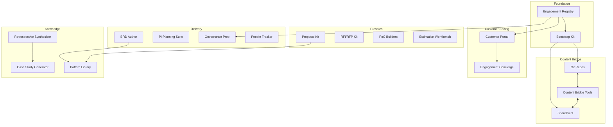

# ERE Systems and Tools

The Engagement Readiness Engineering function builds and operates a portfolio of systems that support the entire Engagement lifecycle — from Exploration through completion.

## Design Philosophy

| Principle | Application |
|-----------|-------------|
| **Pragmatic hybrid** | Configure existing platforms where commoditized; build custom where differentiated |
| **AI-native** | Agents are first-class participants, not bolted-on features |
| **Progressive enforcement** | Tools guide initially, then assist, then enforce as adoption matures |
| **Knowledge-first** | Every tool captures reusable knowledge as a byproduct of work |

## System Portfolio

### Foundational Systems

These systems form the backbone of Engagement lifecycle management.

#### [Engagement Registry](engagement-registry.md)

The central system of record for all Engagements and Explorations.

| Capability | Purpose |
|------------|---------|
| Identity Management | Assign and maintain unique IDs (`ENG-{CODE}`, `EXP-{CODE}`) |
| Lifecycle State Machine | Track state transitions with governance enforcement |
| Resource Index | Catalog all related resources (repos, SharePoint, Jira, Teams) |
| Governance Enforcement | Enforce creation and transition rules defined by ERC |
| Portfolio Visibility | Aggregate view across all active Engagements |

#### [Bootstrap Kit](bootstrap-kit.md)

Automated provisioning of resources for Explorations and Engagements.

| Capability | Purpose |
|------------|---------|
| Exploration Bootstrap | Create exploration repo, SharePoint folders, Teams channel |
| Engagement Bootstrap | Create requirements/project repos, Jira project, portal instance |
| Charter Generation | Draft initial charter from Exploration artifacts |
| Atomic Provisioning | All-or-nothing resource creation with rollback |

### [Presales Toolkit](presales-toolkit.md)

Tools that enable Exploration and qualification — the period before customer commitment.

| System | Purpose |
|--------|---------|
| Proposal Kit | Templated proposal builder with reusable sections |
| RFI/RFP Kit | Response management with answer library and compliance tracking |
| PoC App Builders | Rapid proof-of-concept assembly |
| Presentation Builder | Branded slide generation |
| Proposal Repository | Searchable archive of proposals with outcome data |
| Demo & Recording Library | Indexed repository of demos and presentations |
| Estimation Workbench | Effort estimation with historical calibration |

### [Delivery Toolkit](delivery-toolkit.md)

Tools that support the Engagement lifecycle from Initiate through Complete.

| System | Purpose |
|--------|---------|
| BRD Author & Validator | Requirements documentation with traceability |
| Estimation & Planning Suite | Delivery estimation integrated with staffing |
| PI Planning Suite | Program Increment planning with dependency tracking |
| Customer Meeting Suite | Meeting scheduling, notes, action tracking |
| Governance Prep Suite | Gate readiness dashboards and artifact enforcement |
| Steering Committee Prep | Executive reporting templates |
| People Assignment Tracker | Staffing assignments and capacity visualization |
| Engagement P&L Dashboard | Real-time financial visibility |

### [Knowledge Platform](knowledge-platform.md)

Systems that capture, curate, and disseminate Engagement learnings.

| System | Purpose |
|--------|---------|
| Case Study Generator | Semi-automated case study creation |
| Pattern Library | Curated repository of reusable patterns |
| Retrospective Synthesizer | Aggregates findings across Engagements |
| Archetype Maintenance | Feedback loop to archetype definitions |

### [Customer Portal](customer-portal.md)

Self-service portal enabling customers to participate in and observe their Engagement.

| Capability | Purpose |
|------------|---------|
| Engagement Dashboard | Real-time status and health indicators |
| Artifact Access | Secure access to delivered artifacts |
| Approval Workflows | Sign-offs on scope changes and go-live |
| Change Requests | Submit and track scope change requests |
| Meeting & Decision Log | Searchable history of decisions |
| Training Hub | Access to training materials |

### [Content Bridge](content-bridge.md)

Tools that bridge the Git (Markdown) and Office (SharePoint) ecosystems.

| Category | Tools |
|----------|-------|
| Git → Office | Template Renderer, Proposal Exporter, Status Report Generator, Batch Exporter |
| Office → Git | RFI/RFP Parser, Requirements Extractor, Contract Analyzer, PDF → Markdown |
| Teams Integration | Transcript Processor, Recording Summarizer, Auto-file to Repo |
| Outlook Plugin | Engagement Tagger, Export to SharePoint, Thread Summarizer |

## Architecture Overview

## AI Role Classification

All ERE tools follow an AI-native design with clear role classification:

| AI Role | Behavior | Example |
|---------|----------|---------|
| **Assistive** | AI drafts, suggests, flags; human reviews and approves | Proposal Agent drafts sections from past proposals |
| **Automative** | AI executes routine tasks autonomously; human monitors | Template Renderer exports markdown to Word |

AI agents progress from Assistive to Automative based on proven reliability. See [AI Architecture](../03-ai-architecture/README.md) for governance details.

## Related Documentation

- [Overview: What is ERE?](../01-overview/README.md)
- [AI Architecture](../03-ai-architecture/README.md)
- [Document Governance](../05-document-governance/README.md)
- [Content Bridge Integration](content-bridge.md)

---

[← Previous: Overview](../01-overview/README.md) | [→ Next: AI Architecture](../03-ai-architecture/README.md)
