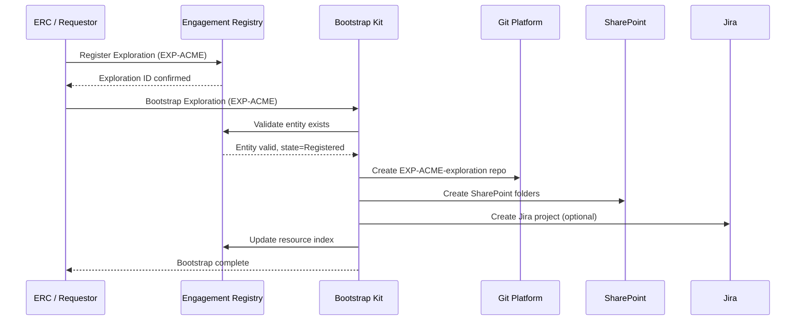

# Bootstrap Kit

[← Back to Systems Overview](README.md)

---

The Bootstrap Kit automates the provisioning of all resources required for Explorations and Engagements. It uses the [Engagement Registry](engagement-registry.md) as its source of truth and orchestrates the creation of repos, SharePoint sites, Jira projects, and other infrastructure.

## Purpose

The Bootstrap Kit ensures that every Exploration and Engagement starts with:

- **Consistent structure** — standardized repo layouts, folder hierarchies, and naming
- **Complete provisioning** — all required resources created atomically
- **Governed creation** — only entities registered in the Engagement Registry can be bootstrapped
- **Immediate productivity** — teams can start work without manual setup

## Relationship to Engagement Registry



**Key principle:** Bootstrap Kit never creates an entity — it only provisions resources for entities that already exist in the Engagement Registry.

## Bootstrapping Workflows

### Exploration Bootstrap

Triggered when a new Exploration is registered and ready for team activation.

**Provisioned Resources:**

| Resource | Details |
|----------|---------|
| **Git Repo** | `EXP-{CODE}-exploration` with standard folder structure |
| **SharePoint** | Customer folder with RFI/RFP, Proposal, PoC subfolders |
| **Teams Channel** | (Optional) Exploration channel in Sales Teams space |
| **Outlook Tags** | `EXP-{CODE}` for email categorization |

**Exploration Repo Structure:**

```
EXP-{CODE}-exploration/
├── README.md                 # Exploration overview
├── rfi-rfp/
│   ├── original/             # Source documents (extracted to markdown)
│   ├── requirements.md       # Extracted requirements
│   ├── compliance-matrix.md  # Response tracking
│   └── questions.md          # Clarification log
├── discovery/
│   ├── stakeholders.md       # Key contacts and interests
│   ├── current-state.md      # As-is architecture/process
│   ├── pain-points.md        # Problems to solve
│   └── meeting-notes/        # Discovery session notes
├── solution/
│   ├── approach.md           # High-level solution approach
│   ├── architecture.md       # Technical architecture sketch
│   ├── scope.md              # In/out of scope
│   └── assumptions.md        # Working assumptions
├── proposal/
│   ├── executive-summary.md  # Win themes
│   ├── scope-of-work.md      # Deliverables
│   ├── staffing.md           # Team composition
│   ├── timeline.md           # High-level schedule
│   └── pricing/              # Cost models (access controlled)
├── poc/
│   ├── objectives.md         # PoC success criteria
│   ├── scenarios.md          # Demo scenarios
│   └── results.md            # PoC outcomes
└── decisions/
    └── YYYYMMDD-decision-title.md
```

### Engagement Bootstrap

Triggered when an Exploration converts to an Engagement (contract signed).

**Provisioned Resources:**

| Resource | Details |
|----------|---------|
| **Requirements Repo** | `ENG-{CODE}-requirements` with requirements structure |
| **Project Repo** | `ENG-{CODE}-project` with PI planning structure |
| **SharePoint** | Customer-Provided, Deliverables, Contracts folders |
| **Jira Project** | Project key `{CODE}`, linked to repos |
| **Teams Channel** | Engagement channel in Delivery Teams space |
| **Outlook Tags** | `ENG-{CODE}` for email categorization |
| **Customer Portal** | Portal instance with initial configuration |

**Requirements Repo Structure:**

```
ENG-{CODE}-requirements/
├── README.md                 # Requirements overview
├── brd/
│   ├── business-requirements.md
│   ├── functional-requirements.md
│   └── non-functional-requirements.md
├── change-requests/
│   └── CR-001-title.md
├── traceability/
│   └── requirements-matrix.md
└── sharepoint-refs.md        # URLs to customer-provided docs
```

**Project Repo Structure:**

```
ENG-{CODE}-project/
├── README.md                 # Project overview
├── charter/
│   └── engagement-charter.md
├── pi/
│   └── PI-{N}/
│       ├── objectives.md     # PI Objectives (SMART)
│       ├── backlog.md        # Features and stories
│       ├── program-board.md  # Timeline and dependencies
│       ├── roam.md           # Risk board
│       ├── confidence.md     # Confidence vote
│       ├── staffing.md       # PI staffing
│       └── retrospective.md  # I&A outcomes
├── decisions/
│   └── YYYYMMDD-decision-title.md
├── meetings/
│   └── YYYYMMDD-meeting-type.md
├── status/
│   └── YYYY-WW-status.md     # Weekly status updates
└── handover/
    └── verification-checklist.md
```

### Charter Generation

The Bootstrap Kit generates an initial Engagement Charter from Exploration artifacts.

**Inputs (from Exploration repo):**

- `solution/approach.md`
- `solution/scope.md`
- `proposal/executive-summary.md`
- `proposal/staffing.md`

**Output (to Project repo):**

- `charter/engagement-charter.md` — draft charter for EPM refinement

**AI Role:** Automative — extracts and synthesizes; human reviews and signs.

## Provisioning Automation

| Step | Action | Rollback on Failure |
|------|--------|---------------------|
| 1 | Validate entity in Registry | N/A |
| 2 | Create Git repo(s) from templates | Delete repo |
| 3 | Create SharePoint folders | Delete folders |
| 4 | Create Jira project | Delete project |
| 5 | Configure Teams channel | Remove channel |
| 6 | Set up Outlook tags | Remove tags |
| 7 | Update Registry resource index | Revert index |
| 8 | Send completion notification | N/A |

**Atomicity:** If any step fails, previous steps are rolled back to maintain consistency.

## Configuration

Bootstrap behavior is configured per customer/product line:

| Setting | Options |
|---------|---------|
| **Jira Project Template** | Standard, SAFe, Kanban |
| **SharePoint Template** | Standard, Extended (with additional folders) |
| **Teams Provisioning** | Enabled / Disabled |
| **Access Control Template** | Customer-specific AD groups, default groups |

## Integration Points

| System | Integration |
|--------|-------------|
| **Engagement Registry** | Validates entity, updates resource index |
| **Git Platform** | Repo creation via API (GitHub/GitLab/ADO) |
| **SharePoint** | Folder creation via Graph API |
| **Jira** | Project creation via REST API |
| **Teams** | Channel creation via Graph API |
| **Outlook** | Category creation via Graph API |

## Access Control

| Role | Permissions |
|------|-------------|
| **ERC Members** | Trigger any bootstrap |
| **EPM/EPO** | Trigger bootstrap for assigned entities |
| **ERE Operations** | Configure templates, monitor provisioning |

## Related Documentation

- [Engagement Registry](engagement-registry.md) — source of truth for entities
- [Document Governance](../05-document-governance/README.md) — repo structure details
- [Delivery Toolkit](delivery-toolkit.md) — tools that use bootstrapped resources

---

[← Back to Systems Overview](README.md)
