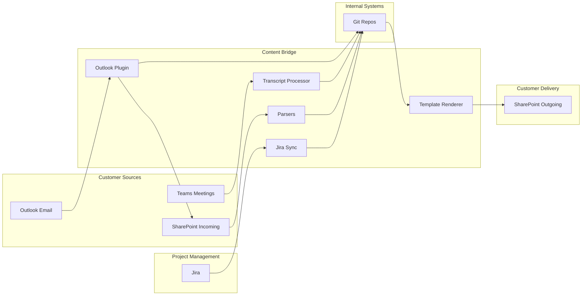

# Content Bridge

[← Back to Systems Overview](README.md)

---

Tools that bridge the **Git (Markdown)** and **Office (SharePoint)** ecosystems, enabling seamless flow of content while maintaining the document governance model.

## Purpose

The Content Bridge exists because Engagement documentation lives in two worlds:

| Document Type | Location | Format |
|---------------|----------|--------|
| **Shared BY customer** | SharePoint | Office (Word, Excel, PPT) |
| **Shared WITH customer** | SharePoint | Office (Word, Excel, PPT) |
| **Internal working documents** | Git | Markdown |

The Content Bridge enables content to flow between these systems while preserving governance, structure, and audit trails.

## Git → Office (Export & Templating)

### Template Renderer

Converts markdown to branded Office documents (Word, PPT, Excel) using standardized professional templates.

| Aspect | Detail |
|--------|--------|
| **Function** | Transform markdown content into polished Office documents |
| **AI Role** | Automative — renders on demand or batch |
| **Key Features** | Template library, brand enforcement, batch processing |
| **Output formats** | Word, PowerPoint, Excel |

### Proposal Exporter

Generates final proposal documents from the `proposal/` folder in exploration repos.

| Aspect | Detail |
|--------|--------|
| **Function** | Compile proposal components into submission-ready documents |
| **AI Role** | Assistive — suggests formatting, flags incomplete sections |
| **Key Features** | Section assembly, formatting validation, completeness checking |
| **Integration** | Proposal Kit (source), Template Renderer (export) |

### Status Report Generator

Creates steering committee decks from `updates/` and PI data.

| Aspect | Detail |
|--------|--------|
| **Function** | Generate executive status presentations |
| **AI Role** | Automative — pulls data, generates deck |
| **Key Features** | Data aggregation, risk visualization, decision formatting |
| **Integration** | Steering Committee Prep (workflow), PI Planning Suite (data) |

### Batch Exporter

Exports multiple documents for gate reviews or customer handoffs.

| Aspect | Detail |
|--------|--------|
| **Function** | Package multiple artifacts for delivery |
| **AI Role** | Automative — packages all required artifacts |
| **Key Features** | Artifact selection, format conversion, archive creation |
| **Integration** | Governance Prep Suite (gate packages) |

### Template Library

Standardized, professionally designed templates for customer-facing documents:

| Template Category | Examples |
|-------------------|----------|
| Commercial | Proposals, SOWs, contracts |
| Governance | Status reports, steering committee decks |
| Technical | Requirements documents, architecture documents |
| Transition | Handover packages, runbooks |

## Office/PDF → Git (Import & Extraction)

### RFI/RFP Parser

Extracts questions from RFP documents (Word/PDF) into structured markdown in `rfi-rfp/questions/`.

| Aspect | Detail |
|--------|--------|
| **Function** | Parse RFP documents into workable question sets |
| **AI Role** | Automative — parses and structures; flags ambiguities |
| **Key Features** | Question extraction, section identification, compliance mapping |
| **Integration** | RFI/RFP Kit (intake), Exploration repos (output) |

### Requirements Extractor

Parses customer requirements documents into structured format in `requirements/`.

| Aspect | Detail |
|--------|--------|
| **Function** | Transform customer documents into structured requirements |
| **AI Role** | Assistive — proposes structure; human validates |
| **Key Features** | Requirement identification, categorization, traceability setup |
| **Integration** | BRD Author (input), Requirements repos (output) |

### Contract Analyzer

Extracts key terms, SLAs, obligations, and milestones from contracts.

| Aspect | Detail |
|--------|--------|
| **Function** | Extract actionable information from legal documents |
| **AI Role** | Assistive — highlights key clauses; human reviews |
| **Key Features** | Obligation extraction, SLA identification, milestone mapping |
| **Output** | Structured summary for project tracking |

### PDF → Markdown

General-purpose extraction for reference documents.

| Aspect | Detail |
|--------|--------|
| **Function** | Convert arbitrary documents to markdown |
| **AI Role** | Automative — best-effort conversion |
| **Key Features** | Text extraction, structure preservation, image handling |

## Teams Integration

### Transcript Processor

Extracts decisions, action items, and key points from Teams meeting transcripts.

| Aspect | Detail |
|--------|--------|
| **Function** | Transform meeting recordings into structured artifacts |
| **AI Role** | Automative — extracts; routes to `meetings/` folder |
| **Key Features** | Decision extraction, action identification, key point summarization |
| **Integration** | Customer Meeting Suite (workflow), Auto-file to Repo (storage) |

### Recording Summarizer

AI-generated summary of meeting recordings.

| Aspect | Detail |
|--------|--------|
| **Function** | Create concise summaries of recorded meetings |
| **AI Role** | Assistive — generates summary; human approves |
| **Key Features** | Key topic identification, action summary, decision highlights |

### Auto-file to Repo

Routes meeting notes to correct folder based on meeting type and participants.

| Aspect | Detail |
|--------|--------|
| **Function** | Automatically organize meeting artifacts |
| **AI Role** | Automative — files based on calendar metadata |
| **Key Features** | Meeting type detection, folder routing, metadata preservation |

### Speaker Attribution

Identifies who said what; maps speakers to stakeholder roles.

| Aspect | Detail |
|--------|--------|
| **Function** | Add attribution context to meeting artifacts |
| **AI Role** | Assistive — proposes attribution; human confirms |
| **Key Features** | Speaker identification, role mapping, action assignment |

## Outlook Plugin

### Engagement Tagger

Tag and categorize emails to specific Exploration or Engagement.

| Aspect | Detail |
|--------|--------|
| **Function** | Associate emails with Engagements for organization |
| **AI Role** | Assistive — suggests tag based on participants, subject; user confirms |
| **Key Features** | Auto-suggest tags, manual tagging, search by Engagement |
| **Tags** | `EXP-{CODE}` for Explorations, `ENG-{CODE}` for Engagements |

### Export to SharePoint

One-click export of email and attachments to Engagement SharePoint folder.

| Aspect | Detail |
|--------|--------|
| **Function** | Archive important emails to SharePoint |
| **AI Role** | Automative — exports to correct folder |
| **Key Features** | Attachment handling, folder routing, duplicate detection |

### SharePoint → Git Trigger

Triggers extraction pipeline when new customer documents arrive in SharePoint.

| Aspect | Detail |
|--------|--------|
| **Function** | Initiate document processing automatically |
| **AI Role** | Automative — notifies relevant parser |
| **Key Features** | File monitoring, parser routing, notification |

### Thread Summarizer

AI summary of email thread with option to create meeting note or decision record.

| Aspect | Detail |
|--------|--------|
| **Function** | Extract decisions and actions from email threads |
| **AI Role** | Assistive — proposes summary; user edits and saves |
| **Key Features** | Thread summarization, decision extraction, artifact creation |

### Action Extractor

Identifies commitments and action items in emails; prompts to create tasks.

| Aspect | Detail |
|--------|--------|
| **Function** | Surface commitments from email content |
| **AI Role** | Assistive — highlights actions; user confirms |
| **Key Features** | Commitment detection, task creation, deadline identification |

## Jira Integration

Extracts PI progress data from Jira into the project repo's `pi/` folders. Jira project structure follows **Project Sera** conventions — see Project Sera documentation for field mappings, label conventions, and workflow definitions.

### PI Progress Extractor

Pulls sprint/iteration data, velocity, burndown, and objective status from Jira.

| Aspect | Detail |
|--------|--------|
| **Function** | Sync PI execution data from Jira to Git |
| **AI Role** | Automative — scheduled sync or on-demand |
| **Key Features** | Velocity tracking, burndown data, objective status mapping |
| **Output** | Updates to `pi/PI-{N}/` folders |

### Backlog Synchronizer

Mirrors PI backlog items (features, stories, enablers) to `pi-backlog.md`.

| Aspect | Detail |
|--------|--------|
| **Function** | Keep Git backlog in sync with Jira |
| **AI Role** | Automative — bidirectional sync |
| **Key Features** | Feature/story mapping, status sync, priority alignment |
| **Output** | `pi/PI-{N}/pi-backlog.md` |

### Risk Importer

Extracts ROAM-tagged items from Jira into `pi-risks.md` with proper status indicators.

| Aspect | Detail |
|--------|--------|
| **Function** | Sync risk items from Jira to structured ROAM format |
| **AI Role** | Automative — maps Jira labels to ROAM status |
| **Key Features** | ROAM status mapping (✅ 🔶 🤝 🛡️), owner attribution, mitigation tracking |
| **Output** | `pi/PI-{N}/pi-risks.md` |

### Confidence Tracker

Aggregates squad confidence data from Jira into `confidence-vote.md`.

| Aspect | Detail |
|--------|--------|
| **Function** | Capture and track squad confidence scores |
| **AI Role** | Assistive — proposes updates; human confirms |
| **Key Features** | Squad-level aggregation, trend tracking, concern flagging |
| **Output** | `pi/PI-{N}/confidence-vote.md` |

## Integration with ERE Tools

| ERE Tool | Content Bridge Enhancement |
|----------|---------------------------|
| **RFI/RFP Kit** | Uses RFI/RFP Parser for intake; Template Renderer for final response |
| **BRD Author** | Uses Requirements Extractor for customer docs; exports to Word for customer review |
| **Customer Meeting Suite** | Uses Transcript Processor and Recording Summarizer |
| **PI Planning Suite** | Uses PI Progress Extractor, Backlog Synchronizer, Risk Importer, Confidence Tracker for Jira ↔ Git sync |
| **Governance Prep Suite** | Uses Batch Exporter for gate review packages |
| **Bootstrap Kit** | Configures Outlook Plugin with Engagement tags on creation |
| **Steering Committee Prep** | Uses Status Report Generator and Template Renderer |

## Content Flow Architecture

## AI Role Summary

| Tool | AI Role | Progression Potential |
|------|---------|----------------------|
| Template Renderer | Automative | Already automative |
| Proposal Exporter | Assistive | → Automative for complete proposals |
| Status Report Generator | Automative | Already automative |
| Batch Exporter | Automative | Already automative |
| RFI/RFP Parser | Automative | Already automative |
| Requirements Extractor | Assistive | Remains assistive (validation needed) |
| Contract Analyzer | Assistive | Remains assistive (legal review needed) |
| Transcript Processor | Automative | Already automative |
| Recording Summarizer | Assistive | → Automative for routine meetings |
| Auto-file to Repo | Automative | Already automative |
| Engagement Tagger | Assistive | → Automative for high-confidence tags |
| Export to SharePoint | Automative | Already automative |
| Thread Summarizer | Assistive | → Automative for routine threads |
| Action Extractor | Assistive | Remains assistive (commitment sensitivity) |
| PI Progress Extractor | Automative | Already automative |
| Backlog Synchronizer | Automative | Already automative |
| Risk Importer | Automative | Already automative |
| Confidence Tracker | Assistive | Remains assistive (judgment needed) |

## Related Documentation

- [Document Governance](../05-document-governance/README.md) — governance model this bridge supports
- [Presales Toolkit](presales-toolkit.md) — proposal export workflow
- [Delivery Toolkit](delivery-toolkit.md) — meeting and status report workflows

---

[← Back to Systems Overview](README.md)
