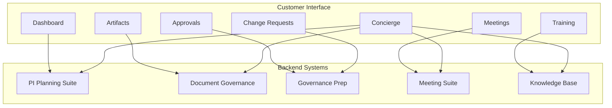

# Customer Portal

[← Back to Systems Overview](README.md)

---

Self-service portal enabling customers to participate in and observe their Engagement.

## Purpose

The Customer Portal transforms customers from passive recipients to informed partners by:

- Providing real-time visibility into Engagement status and health
- Enabling self-service access to artifacts, training, and decisions
- Streamlining approval workflows and change requests
- Offering AI-powered assistance through the Engagement Concierge

## Capabilities

### Engagement Dashboard

Real-time status of lifecycle phase, milestones, and health indicators.

| Feature | Description |
|---------|-------------|
| **Lifecycle visualization** | Current phase, upcoming milestones, phase history |
| **Health indicators** | Schedule, budget, risk, and quality status |
| **Milestone tracking** | Upcoming and completed milestones with dates |
| **Progress metrics** | PI progress, deliverable completion |

### Artifact Access

Secure access to delivered artifacts, documentation, and verification records.

| Feature | Description |
|---------|-------------|
| **Document library** | Organized access to all customer-facing deliverables |
| **Version history** | Track document evolution over time |
| **Download & export** | Bulk download and export capabilities |
| **Verification records** | Access to certification and verification documentation |

### Approval Workflows

Customer sign-offs on scope changes, UAT, and go-live readiness.

| Feature | Description |
|---------|-------------|
| **Scope approvals** | Review and approve scope changes with impact visibility |
| **UAT sign-off** | Structured user acceptance testing workflows |
| **Go-live readiness** | Certification and readiness checklist sign-off |
| **Audit trail** | Complete history of all approvals and decisions |

### Change Requests

Submit and track scope change requests with impact visibility.

| Feature | Description |
|---------|-------------|
| **CR submission** | Structured change request forms |
| **Impact analysis** | Visibility into schedule, cost, and scope impact |
| **Status tracking** | Track CR through evaluation and approval process |
| **History** | Complete change request history |

### Meeting & Decision Log

Searchable history of meetings, decisions, and action items.

| Feature | Description |
|---------|-------------|
| **Meeting history** | Agendas, notes, and recordings |
| **Decision register** | Searchable log of all decisions with rationale |
| **Action tracking** | Open and completed action items |
| **Search** | Full-text search across all meeting artifacts |

### Training & Enablement Hub

Access to training materials, recorded sessions, and self-paced learning.

| Feature | Description |
|---------|-------------|
| **Training catalog** | Organized training materials by topic |
| **Recorded sessions** | Access to workshop and training recordings |
| **Self-paced learning** | Interactive learning modules |
| **Progress tracking** | Track completion of training requirements |

## Engagement Concierge

The Customer Portal is paired with an AI-powered **Engagement Concierge** that serves as the first point of contact for customer queries.

### Concierge Capabilities

| Capability | Description | AI Role |
|------------|-------------|---------|
| **Status Q&A** | Answers questions about Engagement status, artifacts, decisions, next steps | Assistive |
| **Request routing** | Accepts requests (scope changes, meeting scheduling, artifact access) and routes to appropriate workflows | Assistive → Automative |
| **Proactive notifications** | Provides guidance based on lifecycle phase | Automative |
| **Learning** | Improves response quality from customer interactions | Continuous |

### Concierge Progression

| State | Behavior | Criteria |
|-------|----------|----------|
| **Initial (Assistive)** | Answers questions, explains status | Launch |
| **Mature (Automative)** | Processes routine requests autonomously | 90%+ accuracy on Q&A; <5% escalation rate on routine requests |

### Example Interactions

| Customer Query | Concierge Response |
|----------------|-------------------|
| "What's the status of PI-3?" | Retrieves PI-3 progress, highlights key milestones, surfaces risks |
| "Schedule a meeting with the tech lead" | Routes to meeting scheduling workflow, suggests available times |
| "Where's the latest architecture doc?" | Links to document in artifact library with version info |
| "I need to request a scope change" | Guides through CR submission, explains impact assessment process |

## Portal Architecture

## Access Control

| Access Level | Capabilities |
|--------------|--------------|
| **Executive sponsor** | Full visibility, all approvals |
| **Project lead** | Full visibility, operational approvals |
| **Team member** | Read access, limited approvals |
| **Observer** | Dashboard and artifact read-only |

## Security Considerations

| Concern | Control |
|---------|---------|
| **Isolation** | Per-Engagement data isolation |
| **Role-based access** | Capabilities restricted by role |
| **Audit logging** | All access and actions logged |
| **Data protection** | Sensitive information protected per classification |

## Related Documentation

- [AI Architecture](../03-ai-architecture/README.md) — Concierge governance
- [Delivery Toolkit](delivery-toolkit.md) — backend systems
- [Document Governance](../05-document-governance/README.md) — SharePoint structure

---

[← Back to Systems Overview](README.md)
