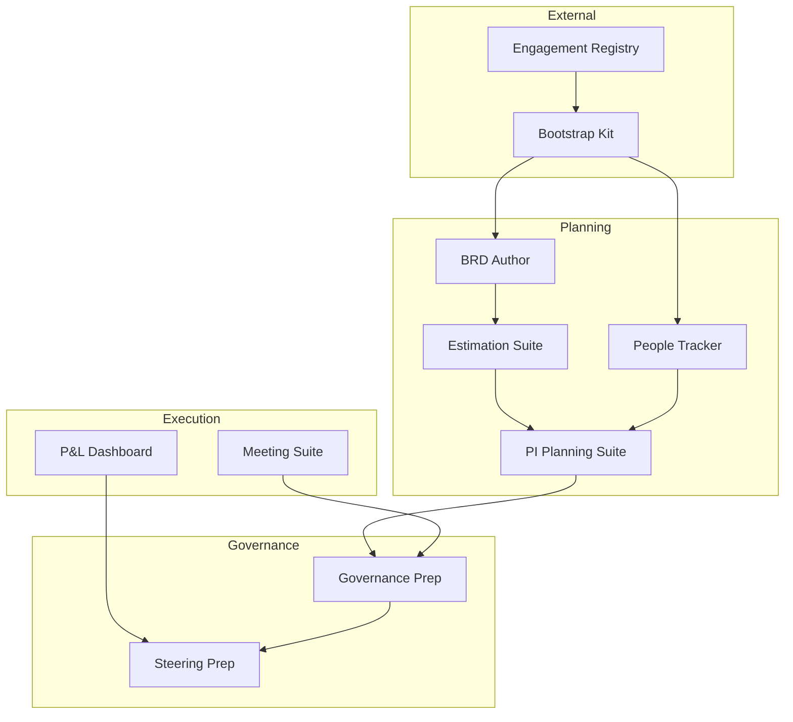

# Delivery Engineering Toolkit

[← Back to Systems Overview](README.md)

---

Tools that support the Engagement lifecycle from Initiate through Complete.

## Purpose

The Delivery Toolkit ensures consistent, governed execution of Engagements by:

- Enabling structured Program Increment (PI) planning
- Providing real-time visibility into staffing, finances, and governance compliance
- Capturing decisions, meetings, and artifacts throughout the lifecycle
- Preparing Engagements for lifecycle gates and executive reviews

> **Note:** Engagement kickoff and provisioning is handled by the [Bootstrap Kit](bootstrap-kit.md), which operates independently and uses the [Engagement Registry](engagement-registry.md) as its source of truth.

## Systems

### BRD Author & Validator

Business requirements documentation with traceability to scope, Product Line capabilities, and archetype gaps.

| Aspect | Detail |
|--------|--------|
| **Function** | Create and validate business requirements documents |
| **AI Role** | Assistive — drafts from discovery notes; validates completeness against archetype |
| **Key Features** | Template-driven authoring, traceability matrix, gap analysis, completeness validation |
| **Integration** | Requirements Extractor (input), Pattern Library (gaps), Content Bridge (export) |

### Estimation & Planning Suite

Delivery estimation integrated with staffing demand and Product Line capacity models.

| Aspect | Detail |
|--------|--------|
| **Function** | Generate delivery estimates with staffing requirements |
| **AI Role** | Assistive — suggests staffing profiles; flags capacity conflicts |
| **Key Features** | Effort estimation, staffing profiles, capacity modeling, conflict detection |
| **Integration** | Estimation Workbench (presales handoff), People Assignment Tracker (staffing) |

### PI Planning Suite

Program Increment planning with cross-squad dependency tracking, objective alignment, and risk visualization.

| Aspect | Detail |
|--------|--------|
| **Function** | Plan and track Program Increments across squads |
| **AI Role** | Assistive — identifies dependency conflicts; suggests sequencing |
| **Key Features** | PI objectives, program board, dependency tracking, ROAM risk management, confidence voting |
| **Integration** | People Assignment Tracker (staffing), Governance Prep Suite (gates) |

**SAFe Artifacts Supported:**

| Artifact | Content |
|----------|---------|
| PI Objectives | Committed business and technical objectives (SMART format) |
| Program Backlog | Features, enablers, stories planned for the PI |
| Program Board | Delivery timeline, dependencies, milestones |
| ROAM Board | Risks: Resolved, Owned, Accepted, Mitigated |
| Confidence Vote | Squad-by-squad confidence scores (1-5) |

### Customer Meeting Suite

Meeting scheduling, agenda templating, notes capture, action tracking, and decision logging.

| Aspect | Detail |
|--------|--------|
| **Function** | Manage the complete customer meeting lifecycle |
| **AI Role** | Automative — generates agendas from backlog; transcribes and extracts actions |
| **Key Features** | Agenda templates, transcription, action extraction, decision logging, searchable history |
| **Integration** | Transcript Processor (Teams), Content Bridge (meeting notes to repo) |

### Governance Prep Suite

Gate readiness dashboards, artifact checklist enforcement, and sign-off workflows.

| Aspect | Detail |
|--------|--------|
| **Function** | Prepare Engagements for lifecycle gates |
| **AI Role** | Assistive — flags missing artifacts; drafts gate review summaries |
| **Key Features** | Gate checklists, artifact tracking, sign-off workflows, exception documentation |
| **Integration** | PI Planning Suite (PI gates), AVA (certification gates) |

**Gates Supported:**

| Gate | Required Artifacts |
|------|-------------------|
| Initiate | Charter signed, roles assigned, operating model confirmed |
| Discover | Solution architecture reviewed, staffing committed, test strategy agreed |
| Build | Increment certification, go-live criteria met |
| Transfer | Handover checklist complete, verification module delivered |
| Complete | Stabilization criteria met, inner source complete |

### Steering Committee Prep

Executive-level reporting templates, risk summaries, and decision request formatting.

| Aspect | Detail |
|--------|--------|
| **Function** | Prepare materials for executive governance meetings |
| **AI Role** | Assistive — drafts deck from project data; highlights decisions needed |
| **Key Features** | Status roll-up, risk visualization, decision request formatting, branded templates |
| **Integration** | Status Report Generator (export), PI Planning Suite (data) |

### People Assignment Tracker

Staffing assignments, rotation schedules, skill matching, and capacity visualization.

| Aspect | Detail |
|--------|--------|
| **Function** | Manage Engagement staffing and capacity |
| **AI Role** | Automative — suggests assignments based on skill fit and availability |
| **Key Features** | Skill matching, availability tracking, rotation scheduling, capacity visualization |
| **Integration** | Estimation & Planning Suite (demand), PI Planning Suite (PI staffing) |

### Engagement P&L Dashboard

Real-time financial visibility with actuals vs. budget, burn rate, and forecast to complete.

| Aspect | Detail |
|--------|--------|
| **Function** | Provide financial transparency for Engagements |
| **AI Role** | Automative — pulls data from time/expense systems; alerts on variance |
| **Key Features** | Budget tracking, burn rate, variance alerts, forecast to complete |
| **Integration** | Time/expense systems, ERC portfolio dashboards |

## Workflow Integration

## AI Role Summary

| System | AI Role | Progression Potential |
|--------|---------|----------------------|
| BRD Author & Validator | Assistive | → Automative for template completion |
| Estimation & Planning Suite | Assistive | Remains assistive (high-stakes) |
| PI Planning Suite | Assistive | → Automative for dependency detection |
| Customer Meeting Suite | Automative | Already automative for transcription |
| Governance Prep Suite | Assistive | → Automative for gate summaries |
| Steering Committee Prep | Assistive | → Automative for data roll-up |
| People Assignment Tracker | Automative | Already automative for suggestions |
| Engagement P&L Dashboard | Automative | Already automative for data pull |

## Related Documentation

- [Engagement Registry](engagement-registry.md) — source of truth for Engagements
- [Bootstrap Kit](bootstrap-kit.md) — provisions resources before delivery begins
- [Presales Toolkit](presales-toolkit.md) — handoff from Exploration
- [Knowledge Platform](knowledge-platform.md) — capturing learnings
- [Governance Enforcement](../06-governance-enforcement/README.md) — gate requirements
- [Document Governance](../05-document-governance/README.md) — repo structures

---

[← Back to Systems Overview](README.md)
