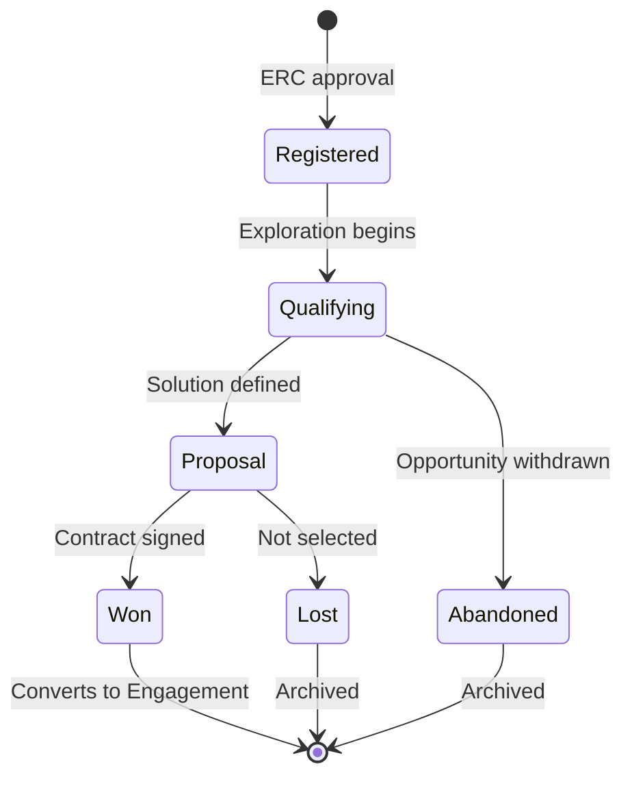
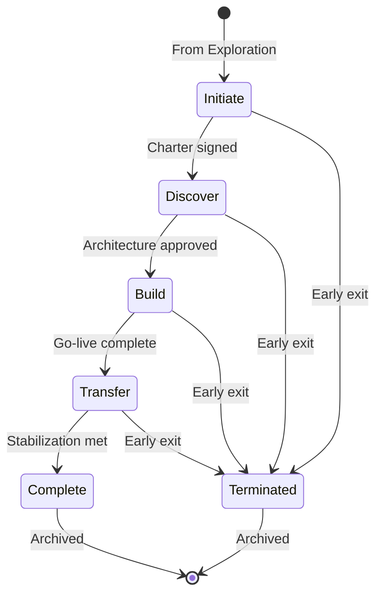
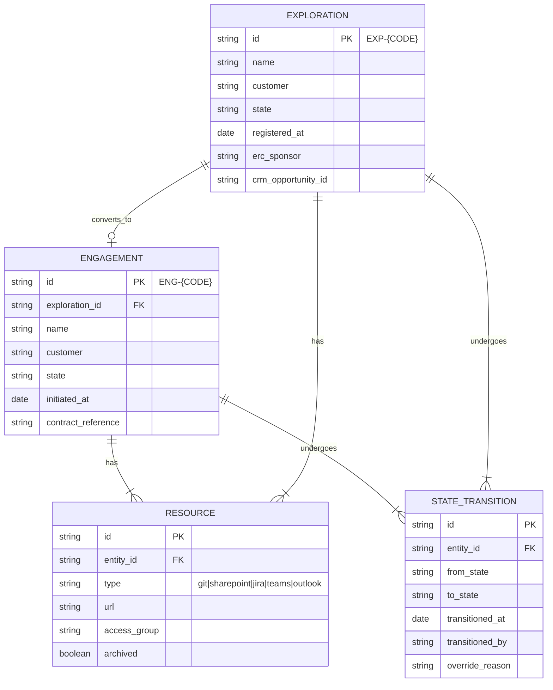

# Engagement Registry

[← Back to Systems Overview](README.md)

---

The Engagement Registry is the central system of record for all Engagements and Explorations. It manages lifecycle state, enforces governance, and provides the authoritative index of all engagement-related resources.

## Purpose

The Registry serves as the **single source of truth** for the Engagement Operating Model by:

- Assigning and maintaining unique identifiers for all Engagements and Explorations
- Tracking lifecycle state transitions with governance enforcement
- Indexing all related resources (repos, SharePoint, Jira, Teams channels)
- Enforcing creation and transition rules defined by ERC
- Providing portfolio-level visibility across all active Engagements

## Core Capabilities

### Identity Management

Every Engagement and Exploration receives a unique identifier upon registration.

| Entity | ID Format | Example |
|--------|-----------|---------|
| Exploration | `EXP-{CODE}` | `EXP-NXTORBIT` |
| Engagement | `ENG-{CODE}` | `ENG-NXTORBIT` |

**Rules:**
- `{CODE}` is typically derived from customer/opportunity name (e.g., NXTORBIT, ACMEBANK)
- Explorations that convert to Engagements retain the same `{CODE}`
- IDs are globally unique and immutable once assigned
- No ID reuse — archived Engagement IDs remain reserved

### Lifecycle State Machine

The Registry maintains the definitive state for each entity.

**Exploration Lifecycle:**

**Engagement Lifecycle:**

### Resource Index

The Registry maintains a complete index of all resources associated with each Engagement or Exploration.

| Resource Type | Tracked Attributes |
|---------------|-------------------|
| **Git Repos** | Repo URL, access group, archive status |
| **SharePoint** | Site URL, folder structure, access group |
| **Jira Project** | Project key, board URL, PI mapping |
| **Teams Channel** | Channel URL, membership group |
| **Outlook Tags** | Tag identifier, auto-categorization rules |
| **Customer Portal** | Portal instance, access configuration |

### Governance Enforcement

The Registry enforces rules at creation and state transitions.

**Creation Rules:**

| Checkpoint | Enforced Rule |
|------------|---------------|
| Exploration registration | ERC sponsor assigned, opportunity qualified in CRM |
| Engagement creation | Exploration in "Won" state, contract reference attached |

**Transition Rules:**

| Transition | Required Conditions |
|------------|---------------------|
| Qualifying → Proposal | Solution architecture drafted, staffing preliminary estimate |
| Initiate → Discover | Charter signed, roles assigned, operating model confirmed |
| Discover → Build | Architecture approved by PAC, staffing committed |
| Build → Transfer | Go-live criteria met, certification complete |
| Transfer → Complete | Stabilization criteria met, inner source complete |

**Exception Handling:**
- Transitions blocked until conditions met
- ERC can override with documented exception
- All overrides recorded in audit log

## Data Model

## Integration Points

| System | Integration |
|--------|-------------|
| **Bootstrap Kit** | Consumes Registry API to validate creation, updates resource index post-provisioning |
| **Governance Prep Suite** | Queries Registry for gate readiness, triggers transitions |
| **Customer Portal** | Reads lifecycle state for status display |
| **ERC Dashboards** | Aggregates portfolio data from Registry |
| **Content Bridge** | Uses Registry to resolve `ENG-{CODE}` to resource URLs |

## API Surface

The Registry exposes APIs for both human and automated consumers.

| Operation | Description | Consumers |
|-----------|-------------|-----------|
| `registerExploration` | Create new Exploration with ERC sponsor | Bootstrap Kit, ERC |
| `convertToEngagement` | Create Engagement from won Exploration | Bootstrap Kit |
| `updateResourceIndex` | Add/update resource associations | Bootstrap Kit, provisioning tools |
| `requestTransition` | Request lifecycle state change | Governance Prep Suite |
| `queryByState` | List entities in a given state | ERC dashboards, reports |
| `getEntityDetails` | Full entity details with resources | Customer Portal, tools |

## Access Control

| Role | Permissions |
|------|-------------|
| **ERC Members** | Full access: create, transition, override |
| **EPM/EPO** | View assigned Engagements, request transitions |
| **ERE Systems** | API access for provisioning and status updates |
| **Reporting** | Read-only aggregated views |

## Audit Trail

Every mutation is recorded:

- **Who**: User or system identity
- **What**: Operation performed
- **When**: Timestamp
- **Context**: Related entity, state change, override justification

Audit logs are immutable and retained for compliance.

## Related Documentation

- [Bootstrap Kit](bootstrap-kit.md) — provisioning tool that uses the Registry
- [Governance Enforcement](../06-governance-enforcement/README.md) — gate requirements
- [Document Governance](../05-document-governance/README.md) — repo naming conventions

---

[← Back to Systems Overview](README.md)
