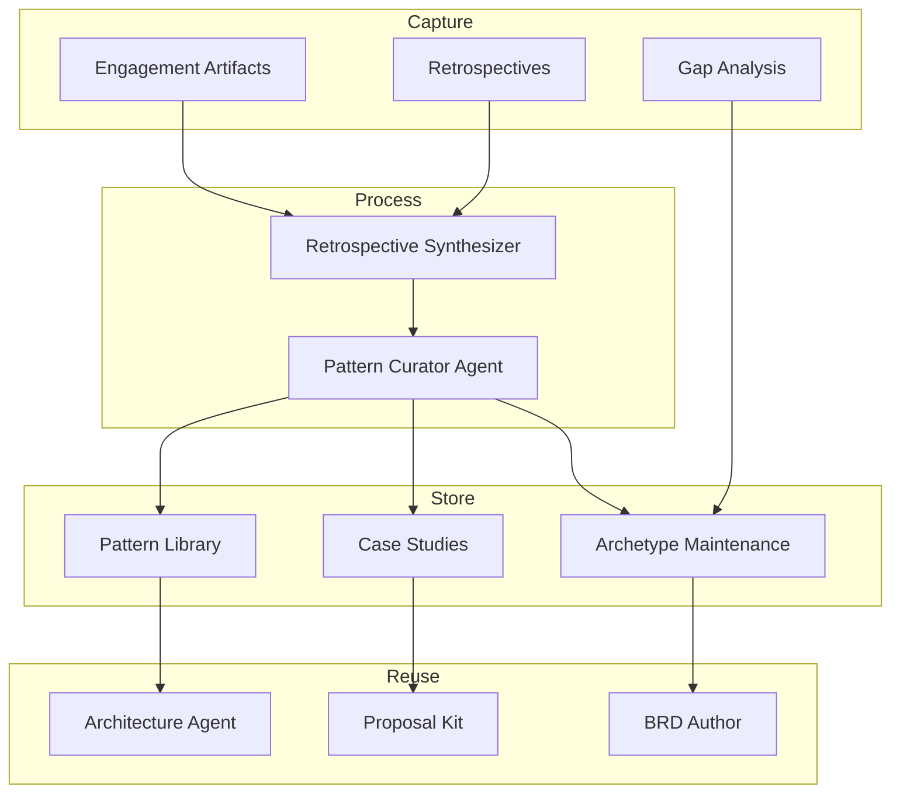

# Knowledge & Reuse Platform

[← Back to Systems Overview](README.md)

---

Systems that capture, curate, and disseminate Engagement learnings.

## Purpose

The Knowledge Platform maximizes organizational learning by:

- Converting Engagement experience into reusable case studies and patterns
- Identifying systemic issues across retrospectives
- Maintaining feedback loops between Engagements and archetypes
- Making institutional knowledge searchable and actionable

## Design Principle

Knowledge capture is not optional overhead — it is a **first-class function** within Engagement Readiness Engineering. Every tool in the ERE portfolio captures reusable knowledge as a byproduct of work.

## Systems

### Engagement Case Study Generator

Semi-automated case study creation from Engagement artifacts, metrics, and retrospectives.

| Aspect | Detail |
|--------|--------|
| **Function** | Transform Engagement experience into reusable case studies |
| **AI Role** | Assistive — drafts case study; highlights differentiators and outcomes |
| **Key Features** | Template-driven generation, metrics extraction, differentiator identification, outcome quantification |
| **Integration** | Retrospective Synthesizer (learnings), Engagement P&L (metrics) |

**Case Study Components:**

| Section | Source |
|---------|--------|
| Challenge | Discovery notes, stakeholder map |
| Solution | Architecture decisions, archetype fit |
| Approach | PI plans, retrospectives |
| Results | P&L dashboard, certification records |
| Learnings | Retrospective findings, pattern candidates |

### Pattern Library

Curated repository of reusable architecture patterns, integration recipes, and Studio Component templates.

| Aspect | Detail |
|--------|--------|
| **Function** | Store and retrieve proven patterns for solution design |
| **AI Role** | Assistive — recommends patterns based on customer context; answers pattern questions |
| **Key Features** | Taxonomy-based organization, context-aware search, usage tracking, quality scoring |
| **Integration** | Architecture Agent (recommendations), BRD Author (gap analysis), PoC Builders (components) |

**Pattern Categories:**

| Category | Examples |
|----------|----------|
| Architecture patterns | Integration topologies, data flows, security models |
| Integration recipes | API patterns, event-driven integrations, batch processing |
| Component templates | Studio components, UI patterns, workflow templates |
| Process patterns | Delivery approaches, governance models, testing strategies |

### Retrospective Synthesizer

Aggregates retrospective findings across Engagements; identifies systemic issues and improvement opportunities.

| Aspect | Detail |
|--------|--------|
| **Function** | Extract organizational learnings from individual retrospectives |
| **AI Role** | Automative — extracts themes; routes improvement suggestions to PAC or Product Lines |
| **Key Features** | Cross-Engagement aggregation, theme extraction, improvement routing, trend analysis |
| **Integration** | Pattern Library (pattern candidates), Archetype Maintenance (gaps), Case Study Generator |

**Synthesis Outputs:**

| Output | Destination |
|--------|-------------|
| Recurring pain points | PAC for process improvement |
| Product gaps | Product Lines for roadmap input |
| Pattern candidates | Pattern Library for curation |
| Archetype gaps | Archetype Maintenance for updates |

### Archetype Maintenance

Feedback loop from Engagements to archetype definitions; tracks archetype health and coverage.

| Aspect | Detail |
|--------|--------|
| **Function** | Keep archetypes current based on Engagement experience |
| **AI Role** | Assistive — suggests archetype updates based on gap analysis patterns |
| **Key Features** | Gap tracking, coverage analysis, update suggestions, health scoring |
| **Integration** | BRD Author (gap analysis), Retrospective Synthesizer (patterns), Pattern Library |

**Archetype Health Metrics:**

| Metric | Meaning |
|--------|---------|
| Coverage | % of Engagement scenarios covered by archetype |
| Gap frequency | How often gaps are identified |
| Update recency | Time since last archetype update |
| Reuse rate | How often archetype is selected |

## Pattern Curator Agent

An AI agent that continuously monitors and improves the knowledge base:

| Capability | Function |
|------------|----------|
| **Pattern scanning** | Scans new artifacts for pattern candidates |
| **Duplicate detection** | Identifies duplicates and suggests consolidation |
| **Gap identification** | Flags gaps ("No case studies for [archetype X] in 6 months") |
| **Taxonomy evolution** | Proposes taxonomy updates based on emerging themes |
| **Q&A synthesis** | Answers questions by synthesizing across the knowledge base |

## Knowledge Lifecycle

## Quality Standards

Knowledge artifacts are governed by quality gates:

| Quality Dimension | Criteria |
|-------------------|----------|
| **Completeness** | All required sections populated |
| **Reusability** | Clear enough for someone unfamiliar with original context |
| **Findability** | Properly tagged per taxonomy |
| **Freshness** | Reviewed within policy period |
| **Accuracy** | Validated by domain steward |

## AI Role Summary

| System | AI Role | Progression Potential |
|--------|---------|----------------------|
| Case Study Generator | Assistive | → Automative for template completion |
| Pattern Library | Assistive | → Automative for auto-tagging |
| Retrospective Synthesizer | Automative | Already automative for extraction |
| Archetype Maintenance | Assistive | Remains assistive (high-stakes decisions) |
| Pattern Curator Agent | Automative | Already automative for scanning |

## Related Documentation

- [Knowledge Engineering](../04-knowledge-engineering/README.md) — ownership and processes
- [Presales Toolkit](presales-toolkit.md) — pattern reuse in proposals
- [Delivery Toolkit](delivery-toolkit.md) — capturing learnings during delivery
- [Governance Enforcement](../06-governance-enforcement/README.md) — knowledge gates

---

[← Back to Systems Overview](README.md)
