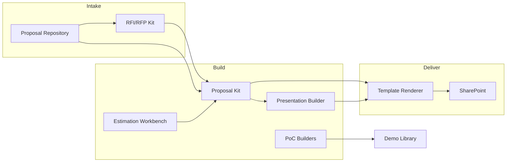

# Presales Engineering Toolkit

[← Back to Systems Overview](README.md)

---

Tools that enable Exploration and qualification — the period before customer commitment.

## Purpose

The Presales Toolkit reduces friction in the Exploration phase by:

- Accelerating proposal creation through reusable content and AI-assisted drafting
- Ensuring consistent, high-quality responses to RFIs and RFPs
- Enabling rapid proof-of-concept assembly using Product Line components
- Capturing institutional knowledge from past proposals for future reuse

## Systems

### Proposal Kit

Templated proposal builder with reusable sections, pricing tables, and compliance checklists.

| Aspect | Detail |
|--------|--------|
| **Function** | Build customer proposals from modular, reusable sections |
| **AI Role** | Assistive — drafts sections from past proposals and customer context |
| **Key Features** | Template library, section reuse, pricing tables, compliance checklists, version control |
| **Integration** | Proposal Repository (sources), Template Renderer (export) |

### RFI/RFP Kit

Response management system with question parsing, answer library, compliance matrix, and review workflows.

| Aspect | Detail |
|--------|--------|
| **Function** | Manage RFI/RFP response lifecycle from intake to submission |
| **AI Role** | Automative — auto-matches answers from library; flags gaps |
| **Key Features** | Question extraction from documents, answer library, compliance matrix, review workflows, deadline tracking |
| **Integration** | RFI/RFP Parser (intake), Proposal Repository (answers), Template Renderer (export) |

### PoC App Builders

Low-code environment for rapid proof-of-concept assembly using Product Line components.

| Aspect | Detail |
|--------|--------|
| **Function** | Build demonstration applications quickly using pre-built components |
| **AI Role** | Assistive — suggests component configurations based on customer requirements |
| **Key Features** | Component library, visual assembly, pre-configured integrations, quick deployment |
| **Integration** | Pattern Library (component patterns), Demo & Recording Library (capture) |

### Presentation Builder

Branded slide generation with product visuals, architecture diagrams, and customer-specific data.

| Aspect | Detail |
|--------|--------|
| **Function** | Generate customer presentations with consistent branding |
| **AI Role** | Automative — generates draft decks from proposal content and archetype |
| **Key Features** | Brand templates, diagram generation, data visualization, archetype-based content |
| **Integration** | Proposal Kit (content), Template Renderer (export) |

### Proposal Repository

Searchable archive of all proposals with outcome data (won/lost, reasons, reuse potential).

| Aspect | Detail |
|--------|--------|
| **Function** | Store and retrieve past proposals with outcome intelligence |
| **AI Role** | Assistive — surfaces relevant past proposals during new proposal creation |
| **Key Features** | Full-text search, outcome tagging, reuse scoring, win/loss analysis |
| **Integration** | Proposal Kit (source), Pattern Library (patterns), RFI/RFP Kit (answers) |

### Demo & Recording Library

Indexed repository of demos, presentations, and workshop recordings with transcripts.

| Aspect | Detail |
|--------|--------|
| **Function** | Capture, index, and retrieve demo and presentation content |
| **AI Role** | Assistive — finds relevant clips, answers questions about product capabilities |
| **Key Features** | Video indexing, transcript search, clip extraction, capability Q&A |
| **Integration** | Presentation Builder (assets), Customer Meeting Suite (recordings) |

### Estimation Workbench

Effort estimation tool with historical calibration, archetype-based templates, and confidence ranges.

| Aspect | Detail |
|--------|--------|
| **Function** | Generate reliable effort estimates grounded in historical data |
| **AI Role** | Assistive — suggests estimates based on similar Engagements; flags outliers |
| **Key Features** | Historical calibration, archetype templates, confidence ranges, outlier detection |
| **Integration** | Proposal Kit (effort sections), Estimation & Planning Suite (handoff) |

## Workflow Integration

## AI Role Summary

| System | AI Role | Progression Potential |
|--------|---------|----------------------|
| Proposal Kit | Assistive | → Automative for routine sections |
| RFI/RFP Kit | Automative | Already automative for library matching |
| PoC App Builders | Assistive | → Automative for standard configurations |
| Presentation Builder | Automative | Already automative for draft generation |
| Proposal Repository | Assistive | → Automative for auto-tagging and classification |
| Demo & Recording Library | Assistive | → Automative for clip recommendation |
| Estimation Workbench | Assistive | Remains assistive (high-stakes decisions) |

## Related Documentation

- [Delivery Toolkit](delivery-toolkit.md) — handoff after Exploration
- [Knowledge Platform](knowledge-platform.md) — patterns and case studies
- [Content Bridge](content-bridge.md) — export to Office formats

---

[← Back to Systems Overview](README.md)
