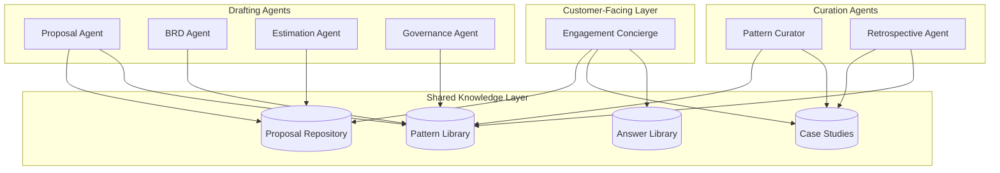

# AI-Native Architecture

[← Back to Engagement Readiness Engineering](../README.md)

All ERE tooling follows an **AI-native design principle**: agents are first-class participants, not bolted-on features.

## Design Philosophy

AI agents are embedded throughout the ERE platform — not as afterthought integrations, but as core architectural components that participate in every workflow. This means:

- **Agents share context** — A common knowledge layer (Proposal Repository, Pattern Library, Case Studies) is accessible to all agents
- **Progressive autonomy** — Agents start assistive and earn automative capabilities through proven reliability
- **Human-in-the-loop by default** — All agent actions are reviewable; high-stakes decisions require human approval
- **Unified governance** — The same progressive enforcement model governs both human and agent compliance

## Architecture Overview

All agents draw from the shared knowledge layer — past proposals, patterns, case studies, and curated answers. Customer-facing agents (Concierge) access read-only views; drafting agents contribute back to the repositories.

## AI Posture

ERE tools operate in two AI modes depending on task complexity:

| Mode | Description | Use Cases |
|------|-------------|-----------|
| **Assistive** | Drafting, suggestions, Q&A — human reviews and approves | Proposal drafting, architecture recommendations, Q&A |
| **Automative** | Routine execution with minimal human intervention | Meeting transcription, status report generation, artifact routing |

Agents progress from Assistive to Automative based on accuracy metrics, user feedback, and ERC review.

## In This Section

| Document | Description |
|----------|-------------|
| [Agents](agents.md) | All AI agents: Engagement Concierge (customer-facing) and Specialized Drafting Agents (internal) |
| [Agent Governance](agent-governance.md) | Autonomy levels, progression criteria, audit requirements, and ERC oversight |

## Relationship to Other Sections

- **Systems**: Each tool in [Systems](../02-systems/README.md) specifies its AI role (Assistive or Automative)
- **Knowledge Engineering**: Agents access and contribute to the [Knowledge Platform](../04-knowledge-engineering/README.md)
- **Governance**: Agent compliance is tracked in [Governance Enforcement](../06-governance-enforcement/README.md)

---

*See also: [Progressive Enforcement Model](../06-governance-enforcement/README.md) | [Knowledge Engineering](../04-knowledge-engineering/README.md)*

---

[← Previous: Systems and Tools](../02-systems/README.md) | [→ Next: Knowledge Engineering](../04-knowledge-engineering/README.md)
