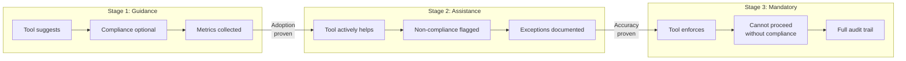

# Governance Enforcement

[← Back to ERE Guide](../README.md)

The ERE function enforces governance through a **progressive model**: tools initially guide and assist, with mandatory gates introduced as adoption matures and tooling proves reliable.

---

## Progressive Enforcement Model

Governance evolves through three stages based on tooling maturity and adoption:

| Stage | Behavior | Example |
|-------|----------|---------|
| **Guidance** | Tools suggest; compliance is optional | Estimation Workbench suggests staffing; EPM can override |
| **Assistance** | Tools actively help; non-compliance is flagged | BRD Validator flags incomplete sections; Engagement can proceed with documented exceptions |
| **Mandatory Gate** | Tools enforce; Engagement cannot proceed without compliance | AVA certification must pass in Governance Prep Suite before go-live |

This model applies uniformly to:

- **Delivery gates** — lifecycle phase transitions
- **Knowledge capture gates** — required artifacts at each transition
- **AI agent autonomy** — agents progress from assistive to automative based on proven reliability

### Enforcement Flow

### Why Progressive?

1. **Reduces adoption friction** — teams experience value before enforcement
2. **Builds trust in tooling** — tools must prove accuracy before blocking
3. **Allows calibration** — policies adjust based on real-world feedback
4. **Protects delivery** — mandatory gates only when tooling is reliable enough not to create false blocks

---

## Governance Scope

ERE governance covers three domains:

| Domain | What It Governs | Progression |
|--------|-----------------|-------------|
| **Lifecycle** | State transitions enforced by [Engagement Registry](../02-systems/engagement-registry.md), creation rules | Enforced from inception |
| **Delivery** | Lifecycle phase transitions, artifact completeness, certification | Guidance → Mandatory gates |
| **Knowledge** | Capture at transitions, contribution metrics, coverage | Guidance → Mandatory gates |
| **AI Agents** | Autonomy levels, escalation triggers, accuracy requirements | Assistive → Automative |

The **Engagement Registry** is the foundational enforcement layer — no Exploration or Engagement can be created or transitioned without meeting Registry rules. This is always mandatory (not progressive) because identity and lifecycle state are prerequisites for all other governance.

---

## In This Section

| Document | What It Covers |
|----------|---------------|
| [Gates and Checkpoints](gates-checkpoints.md) | Lifecycle gates, delivery gates, knowledge gates |
| [Knowledge Governance](knowledge-governance.md) | Contribution metrics, accountability, coverage targets |
| [Compliance Dashboards](compliance-dashboards.md) | Delivery, knowledge, and AI agent compliance visibility |

---

## AI Agent Governance

AI agents operate under explicit governance controls:

| Control | Description |
|---------|-------------|
| **Autonomy levels** | Each agent has a defined autonomy level (Assistive, Automative) that determines what actions require human approval |
| **Escalation triggers** | Agents escalate to humans when confidence is low, request is out-of-scope, or stakes are high (e.g., customer-facing commitments) |
| **Audit trail** | All agent actions are logged with context, decision rationale, and outcome |
| **Feedback loop** | Human corrections feed back into agent training; systematic errors trigger autonomy review |
| **Periodic review** | ERC reviews agent performance quarterly; autonomy levels adjusted based on accuracy and adoption metrics |

### Agent Autonomy Progression

| Agent | Initial State | Progression Criteria | Target State |
|-------|---------------|---------------------|--------------|
| **Engagement Concierge** | Answers questions; routes requests to humans | 90%+ accuracy on Q&A; <5% escalation rate on routine requests | Processes routine requests autonomously |
| **Proposal Agent** | Drafts sections for human review | 80%+ acceptance rate on drafts; positive user feedback | Generates complete first drafts |
| **Governance Agent** | Flags missing artifacts | 95%+ accuracy on completeness checks | Auto-generates gate review summaries |

---

## Related Content

- [Engagement Registry](../02-systems/engagement-registry.md) — lifecycle state machine and governance enforcement
- [Document Governance](../05-document-governance/README.md) — governance of documentation structure
- [AI Architecture](../03-ai-architecture/README.md) — agent design and capabilities
- [Knowledge Engineering](../04-knowledge-engineering/README.md) — knowledge capture principles

---

[← Previous: Document Governance](../05-document-governance/README.md) | [→ Next: Team Structure](../07-team-structure/README.md)
