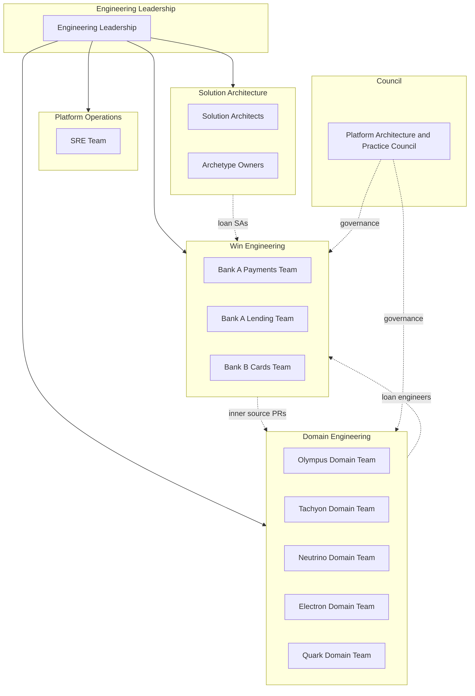

# Product Line Engineering at Zeta

## Executive Summary

Zeta adopts **Product Line Engineering (PLE)** as the mental model and operational framework for software delivery. Our platforms (Olympus, Tachyon, Neutrino, Electron, Quark) are **core assets**; customer solutions are **derived** from these assets through configuration, extension, and integration.

This documentation describes:

- **Domain Engineering** — Core asset development and maintenance (Domain Teams)
- **Win Engineering** — Customer Solution delivery (Win Engineering Teams, composed per engagement)
- **Governance** — Platform Architecture & Practice Council, inner source, variability management
- **Adoption** — Rollout plan, stakeholder concerns, executive coaching

PLE at Zeta is **inspired by** the SEI's Product Line Engineering framework and **adapted** for enterprise solution delivery. See [PLE Overview](framework/ple-overview.md) for what we adopt, what we adapt, and what we do not do.

---

## Quick Reference: Organizational Structure

---

## Navigation

### Some Placeholder 3334

| Section | Description |
|--------|-------------|
| [Framework](framework/ple-overview.md) | PLE foundations, Zeta adaptations, what we are and aren't doing |
| [Domain Engineering](framework/domain-engineering.md) | Domain Teams, Domain Engineers, Domain Maintainers |
| [Win Engineering](framework/win-engineering.md) | Win Engineering Teams, Customer Solution delivery |
| [Solution Archetypes](framework/solution-archetypes.md) | Archetype concept, components, ownership |
| [Operating Models](framework/operating-models.md) | Fully Managed, Co-Managed, Customer-Operated |
| [Variability Management](framework/variability-management.md) | Tracking, governance, template |
| [Council Charter](governance/council-charter.md) | Platform Architecture & Practice Council |
| [Inner Source Guidelines](governance/inner-source-guidelines.md) | DoD, PR process, Maintainer model |
| [Tech Debt Policy](governance/tech-debt-policy.md) | Soft gate, tracking, remediation |
| [Engagement Lifecycle](processes/engagement-lifecycle.md) | Scoping → Compose → Deliver → Transition |
| [Team Composition](processes/team-composition.md) | Forming Win Engineering Teams |
| [Rotation Model](processes/rotation-model.md) | Engineer rotation, return guarantees |
| [Knowledge Capture](processes/knowledge-capture.md) | Learning preservation |
| [Engagement Lead](roles/engagement-lead.md) | Role definition, accountability |
| [Solution Architect](roles/solution-architect.md) | Role definition, variability ownership |
| [Domain Maintainer](roles/domain-maintainer.md) | Role definition, PR governance |
| [Career Paths](roles/career-paths.md) | Domain depth vs. Win breadth |
| [Rollout Plan](adoption/rollout-plan.md) | Phased adoption |
| [Stakeholder Concerns](adoption/stakeholder-concerns.md) | Concerns by role, mitigations |
| [Executive Coaching Guide](adoption/executive-coaching-guide.md) | How leaders handle concerns and criticism |
| [Archetype Catalog](archetypes/README.md) | Current archetypes, how to use and propose |

---

## Glossary

| Term | Definition |
|------|------------|
| **Customer Solution** | The integrated solution delivered to a customer under an engagement; derived from domain platforms and configured/extended per engagement. |
| **Domain Engineering** | The PLE layer that develops and maintains core assets (platforms). SEI-aligned term. |
| **Domain Engineer** | Engineer who develops and maintains core platform assets; may be loaned to Win Engineering Teams. |
| **Domain Maintainer** | Engineer dedicated to reviewing and governing contributions to a domain platform (inner source); rotated quarterly/semester. |
| **Domain Team** | Permanent team owning a platform (Olympus, Tachyon, Neutrino, Electron, Quark). |
| **Engagement** | All activity under a Statement of Work; may span Customer Solution (PLE scope), Studio, and sometimes back-office support. |
| **Inner Source** | Model where Win Engineering Teams contribute code to domain platforms via PRs; Domain Maintainers review and merge. |
| **Platform Architecture & Practice Council (PAPC)** | Single body with Practice Mode (monthly, advisory) and Governance Mode (ad-hoc, decision authority). |
| **Blueprint** | Reference architecture and configuration baseline for a solution archetype; primary design reference for Win Engineering when deriving a Customer Solution. |
| **Cookbook** | How-to guides for common tasks (configuration, integration, operations) within a solution archetype; task-oriented guidance for Win Engineering Teams. |
| **Playbook** | Delivery guide (phases, activities, checkpoints, handover) for an engagement; used by Engagement Lead and Win Engineering Team. |
| **Product Line Engineering (PLE)** | Systematic approach to developing a family of related products from shared core assets with managed variability. |
| **Solution Archetype** | Reusable pattern for a class of solutions (e.g., Credit Card Issuer, Lending); includes blueprint, cookbook, playbook. |
| **Studio** | Customer-exclusive product development (apps, portals, back-office tools); out of PLE scope; customer IP. |
| **Win Engineering** | The PLE layer that delivers Customer Solutions; replaces "Application Engineering" in Zeta terminology. |
| **Win Engineering Team** | Team composed per engagement to deliver a Customer Solution; may remain on that solution for up to ~2 years; some roles may rotate. |
