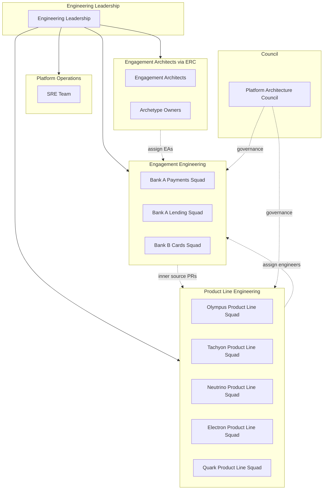

# Product Line Engineering at Zeta

## Executive Summary

Zeta adopts **Product Line Engineering (PLE)** as the mental model and operational framework for software delivery. Our platforms (Olympus, Tachyon, Neutrino, Electron, Quark) are **core assets**; Customer Products are **derived** from these assets through configuration, extension, and integration.

This documentation describes:

- **Product Line Engineering** — Core asset development and maintenance (Product Line Squads)
- **Engagement Engineering** — Customer Product delivery (Customer Product Squads, composed per Engagement)
- **Governance** — Platform Architecture Council, inner source, variability management
- **Adoption** — Rollout plan, stakeholder concerns, executive coaching

PLE at Zeta is **inspired by** the SEI's Product Line Engineering framework and **adapted** for enterprise solution delivery. See [PLE Overview](framework/ple-overview.md) for what we adopt, what we adapt, and what we do not do.

**PLE and the Engagement Operating Model:** PLE provides structural ingredients (Product Line Squads, inner source, archetypes, variability, PAC, rotation model) that a delivery methodology uses. PLE does not define that delivery methodology — the [Engagement Operating Model](../engagement/README.md) does. PLE enables; the Engagement Operating Model executes. See the [Engagement Operating Model Guide](../engagement/README.md) for roles, lifecycle, squad model, verification, and governance.

---

## Quick Reference: Organizational Structure

---

## Navigation

### Document Map

#### Framework — PLE-Owned Content

| Document | Description |
|----------|-------------|
| [PLE Overview](framework/ple-overview.md) | PLE foundations, Zeta adaptations, what we are and aren't doing |
| [Product Line Squads](framework/product-line-squads.md) | Product Line Squads, Product Line Engineers, Product Line Maintainers |
| [Solution Archetypes](framework/solution-archetypes.md) | Archetype concept, components, ownership |
| [Operating Models](framework/operating-models.md) | Fully Managed, Co-Managed, Customer-Operated |
| [Variability Management](framework/variability-management.md) | Tracking, governance, template |
| [Engagement Engineering](framework/engagement-engineering.md) | PLE framing of Engagement Engineering — ownership boundary and PLE metrics *(PLE perspective; full squad model in [Engagement Guide](../engagement/README.md))* |

#### Governance — PLE-Owned Content

| Document | Description |
|----------|-------------|
| [PAC Charter](governance/council-charter.md) | Platform Architecture Council |
| [Inner Source Guidelines](governance/inner-source-guidelines.md) | DoD, PR process, Maintainer model |
| [Tech Debt Policy](governance/tech-debt-policy.md) | Soft gate, tracking, remediation |

#### Processes — PLE Perspective Stubs

These documents describe Engagement processes **from the Product Line perspective** — what PL Squads, Maintainers, PPM, and PAC do. For the full process descriptions, roles, and activities, see the [Engagement Operating Model Guide](../engagement/README.md).

| Document | Description |
|----------|-------------|
| [Engagement Lifecycle](processes/engagement-lifecycle.md) | Per-phase PLE responsibilities *(PLE perspective; full lifecycle in [Engagement Guide](../engagement/lifecycle.md))* |
| [Team Composition](processes/team-composition.md) | PL capacity, staffing conflicts *(PLE perspective; full staffing in [Engagement Guide](../engagement/squad-model.md))* |
| [Rotation Model](processes/rotation-model.md) | Engineer rotation, return guarantees |
| [Knowledge Capture](processes/knowledge-capture.md) | Knowledge flow back to platforms and PAC |

#### Roles

| Document | Description |
|----------|-------------|
| [Engagement Architect](roles/engagement-architect.md) | PLE-specific EA responsibilities — variability, inner source, archetypes *(PLE perspective; full role in [Engagement Guide](../engagement/roles.md))* |
| [Product Line Maintainer](roles/product-line-maintainer.md) | Role definition, PR governance |
| [Career Paths](roles/career-paths.md) | **Moved** — redirects to [Engagement Guide](../engagement/career-paths.md) |
| [Customer Product Delivery Lead](roles/customer-product-delivery-lead.md) | **Deprecated** — see successor roles |

#### Adoption — PLE Change Management

These documents exist in PLE because the concerns they address arise from PLE adoption — the introduction of Product Line Squads, inner source, rotation, and the structural separation of platform and Engagement work.

| Document | Description |
|----------|-------------|
| [Rollout Plan](adoption/rollout-plan.md) | Phased PLE adoption |
| [Stakeholder Concerns](adoption/stakeholder-concerns.md) | PLE adoption concerns by role, mitigations |
| [Executive Coaching Guide](adoption/executive-coaching-guide.md) | How leaders handle PLE change concerns |

#### Archetypes

| Document | Description |
|----------|-------------|
| [Archetype Catalog](archetypes/README.md) | Current archetypes, how to use and propose |

---

## Glossary

| Term | Definition |
|------|------------|
| **Customer Product** | The integrated solution delivered to a customer under an Engagement; derived from Product Line platforms and configured/extended per Engagement. |
| **Product Line Engineering** | The PLE layer that develops and maintains core assets (platforms). SEI-aligned term. |
| **Product Line Engineer** | Engineer who develops and maintains core platform assets; may be assigned to Customer Product Squads. |
| **Product Line Maintainer** | Engineer dedicated to reviewing and governing contributions to a Product Line platform (inner source); rotated quarterly/semester. |
| **Product Line Squad** | Permanent team owning a platform (Olympus, Tachyon, Neutrino, Electron, Quark). |
| **Engagement** | End-to-end delivery lifecycle for customer-specific product instantiation; may span Customer Product (PLE scope), Studio Components, and integration. |
| **Inner Source** | Model where Customer Product Squads contribute code to Product Line platforms via PRs; Product Line Maintainers review and merge. |
| **Platform Architecture Council (PAC)** | Single body with Practice Mode (monthly, advisory) and Governance Mode (ad-hoc, decision authority). |
| **Blueprint** | Reference architecture and configuration baseline for a solution archetype; primary design reference for Engagement Engineering when deriving a Customer Product. |
| **Cookbook** | How-to guides for common tasks (configuration, integration, operations) within a solution archetype; task-oriented guidance for Customer Product Squads. |
| **Playbook** | Delivery guide (phases, activities, checkpoints, handover) for an Engagement; used by EPM, ELs, and Customer Product Squad. |
| **Product Line Engineering (PLE)** | Systematic approach to developing a family of related products from shared core assets with managed variability. |
| **Solution Archetype** | Reusable pattern for a class of solutions (e.g., Credit Card Issuer, Lending); includes blueprint, cookbook, playbook. |
| **Studio** | Customer-exclusive product development (apps, portals, back-office tools); out of PLE scope; customer IP. |
| **Engagement Engineering** | The PLE layer that delivers Customer Products; replaces "Application Engineering" in Zeta terminology. |
| **Customer Product Squad** | Team composed per Engagement to deliver a Customer Product; assignments exceeding two quarters are long-term associations. |
| **Engagement Architect** | Owns architecture guidance across the entire Engagement — Customer Product, Studio Components, and their integration. |
| **Customer Product Delivery Lead** | **Deprecated.** Replaced by EO (overall accountability), EPM (customer liaison, Engagement Success), EL (squad delivery), EA, AVA, EPO, SRE Lead. See [Engagement Operating Model Guide](../engagement/README.md). |
| **Exploration** | Pre-commitment work (discovery, scoping, POC, technical evaluation) that qualifies whether an Engagement should be initiated. |
