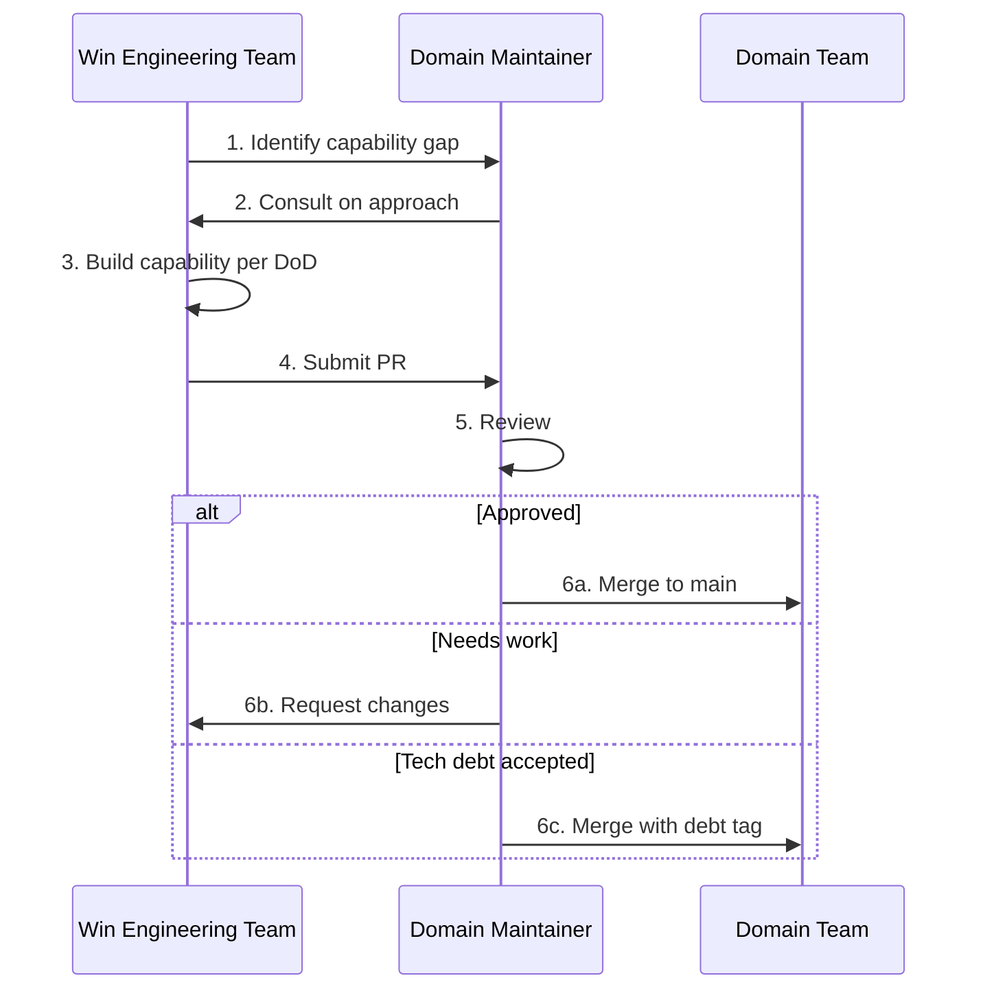

# Inner Source Guidelines

## What Is Inner Source at Zeta

**Inner source** at Zeta means: Win Engineering Teams (and others with need) can **contribute code** to domain platforms via pull requests (PRs). Domain Maintainers review and merge (or reject, or accept with tech debt tagging). This replaces the model where only Domain Teams change platforms and all other requests go through an intake queue.

**Benefits:**

- Faster capability development for Customer Solutions
- Use of Win Engineering expertise directly in the platform
- Clear ownership: Domain Maintainers gatekeep; Domain Teams own the asset

**Governance:** Definition of Done, Maintainer review, soft gate with tech debt tracking, and Council oversight keep quality under control. See [Tech Debt Policy](tech-debt-policy.md).

---

## The Flow

1. **Identify capability gap** — Win Engineering Team needs a platform capability that doesn’t exist (or isn’t exposed).
2. **Consult on approach** — Team consults Domain Maintainer (and Domain Team as needed) on design, extension points, and standards. Agreement before implementation reduces rework.
3. **Build capability per DoD** — Team implements following Definition of Done and platform standards.
4. **Submit PR** — Team opens PR against the domain platform repo.
5. **Review** — Domain Maintainer reviews (and may involve other Domain Engineers).
6. **Outcome:**
   - **Approved** — Merge to main.
   - **Needs work** — Request changes; team iterates.
   - **Tech debt accepted** — Merge with tech debt tag per [Tech Debt Policy](tech-debt-policy.md); remediation tracked.

---

## Domain Maintainer Responsibilities

Domain Maintainers:

- **Review** PRs for correctness, alignment with platform standards, and DoD compliance
- **Coach** contributors on approach when the PR doesn’t meet bar (rather than only rejecting)
- **Gatekeep** — Reject or request changes when quality or architecture is insufficient; use tech debt path only when justified and tracked
- **Escalate** to Council when dispute or repeated quality issues cannot be resolved locally

Maintainers do not “do the work for” the Win Engineering Team; they review and guide. The Win Engineering Team owns implementation and DoD.

---

## Definition of Done

All PRs to domain platforms must satisfy a **Definition of Done (DoD)**. The Council and Domain Teams define and maintain the DoD. A typical DoD includes (customize per platform):

- [ ] Code compiles and passes platform test suite
- [ ] New or changed behavior has automated tests
- [ ] Documentation updated (API, config, or runbook as relevant)
- [ ] No known security or performance regressions
- [ ] Follows platform coding and architecture standards
- [ ] Review by at least one Domain Maintainer (or designated reviewer)

**PRs that do not meet DoD** must be improved until they do, or merged only under the tech debt process (see [Tech Debt Policy](tech-debt-policy.md)) with explicit tagging and remediation plan.

---

## PR Review SLAs

To avoid Win Engineering Teams blocked on review:

- **Target cycle time** for first review (e.g. 2–3 business days) is agreed and published
- **Ownership** — Domain Maintainers (or designated reviewers) commit to meeting the SLA
- **Escalation** — If SLA is missed, Win Engineering Team can escalate to Domain Team lead or Council

SLAs are defined per org (e.g. in Council or Domain Team charter). The goal is predictable feedback, not “as fast as possible.”

---

## Handling Timeline vs. Quality Conflicts

When an engagement timeline pressures a PR that doesn’t fully meet DoD:

1. **First choice:** Improve the PR to meet DoD; adjust engagement timeline if necessary (Engagement Lead and customer agree).
2. **If timeline cannot move:** Use **soft gate** — Merge with **tech debt** tag per [Tech Debt Policy](tech-debt-policy.md). Remediation is scheduled and assigned; Council oversees.
3. **Not acceptable:** Merging without DoD and without tech debt tracking. That undermines platform quality and is not allowed.

Domain Maintainers have authority to reject or request changes; they do not have to accept substandard work. Tech debt is the exception path, not the norm.

---

## Preventing "PR Dumping"

“PR dumping” is when a Win Engineering Team submits a half-finished PR expecting the Domain Team to complete it.

**Prevention:**

- **DoD** — PRs must meet DoD; incomplete work is rejected or sent back with clear feedback
- **Consult-first** — Consultation before implementation (step 2 in the flow) aligns on scope and approach
- **Engagement accountability** — Engagement Lead is accountable for delivery; PR quality is part of that. Poor PR quality can be raised in engagement retrospectives and performance feedback
- **Council** — Repeated low-quality or incomplete PRs can be escalated to Council; Council can set expectations or impose constraints

Domain Maintainers are reviewers and gatekeepers, not implementers for the engagement. The Win Engineering Team owns the implementation.

---

## References

- [Domain Engineering](../framework/domain-engineering.md)
- [Domain Maintainer Role](../roles/domain-maintainer.md)
- [Tech Debt Policy](tech-debt-policy.md)
- [Council Charter](council-charter.md)
