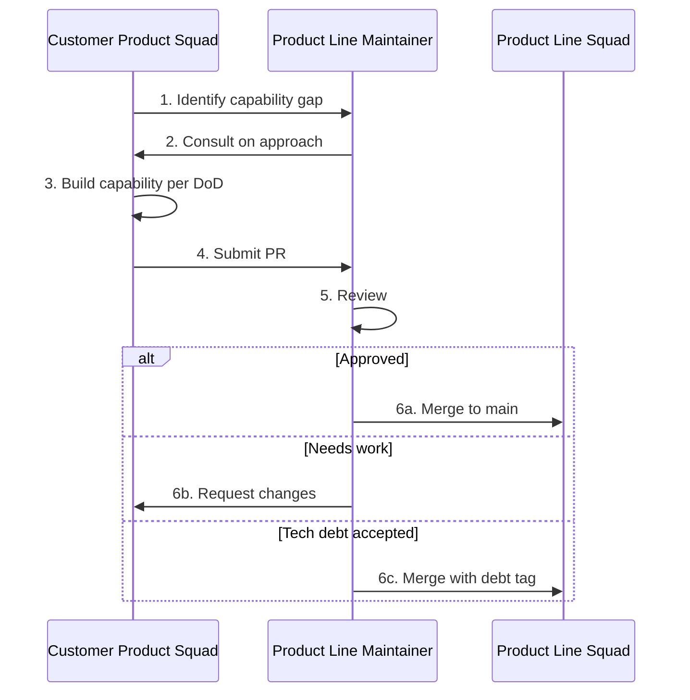

# Inner Source Guidelines

## What Is Inner Source at Zeta

**Inner source** at Zeta means: Customer Product Squads (and others with need) can **contribute code** to Product Line platforms via pull requests (PRs). Product Line Maintainers review and merge (or reject, or accept with tech debt tagging). This replaces the model where only Product Line Squads change platforms and all other requests go through an intake queue.

**Benefits:**

- Faster capability development for Customer Products
- Use of Engagement Engineering expertise directly in the platform
- Clear ownership: Product Line Maintainers gatekeep; Product Line Squads own the asset

**Governance:** Definition of Done, Maintainer review, soft gate with tech debt tracking, and Council oversight keep quality under control. See [Tech Debt Policy](tech-debt-policy.md).

---

## The Flow

1. **Identify capability gap** — Customer Product Squad needs a platform capability that doesn’t exist (or isn’t exposed).
2. **EA validates and prioritizes** — Engagement Architect (EA) confirms the gap aligns with overall architecture direction and prioritizes it against other inner source work in the Engagement. EA may also sequence contributions to avoid conflicting changes.
3. **Consult on approach** — Team consults Product Line Maintainer (and Product Line Squad as needed) on design, extension points, and standards. Agreement before implementation reduces rework.
4. **Build capability per DoD** — Team implements following Definition of Done and platform standards.
5. **Submit PR** — Team opens PR against the Product Line platform repo.
6. **Review** — Product Line Maintainer reviews (and may involve other Product Line Engineers).
7. **Outcome:**
   - **Approved** — Merge to main.
   - **Needs work** — Request changes; team iterates.
   - **Tech debt accepted** — Merge with tech debt tag per [Tech Debt Policy](tech-debt-policy.md); remediation tracked.

---

## Product Line Maintainer Responsibilities

Product Line Maintainers:

- **Review** PRs for correctness, alignment with platform standards, and DoD compliance
- **Coach** contributors on approach when the PR doesn’t meet bar (rather than only rejecting)
- **Gatekeep** — Reject or request changes when quality or architecture is insufficient; use tech debt path only when justified and tracked
- **Escalate** to Council when dispute or repeated quality issues cannot be resolved locally

Maintainers do not “do the work for” the Customer Product Squad; they review and guide. The Customer Product Squad owns implementation and DoD.

---

## Definition of Done

All PRs to Product Line platforms must satisfy a **Definition of Done (DoD)**. The Council and Product Line Squads define and maintain the DoD. A typical DoD includes (customize per platform):

- [ ] Code compiles and passes platform test suite
- [ ] New or changed behavior has automated tests
- [ ] Documentation updated (API, config, or runbook as relevant)
- [ ] No known security or performance regressions
- [ ] Follows platform coding and architecture standards
- [ ] Review by at least one Product Line Maintainer (or designated reviewer)

**PRs that do not meet DoD** must be improved until they do, or merged only under the tech debt process (see [Tech Debt Policy](tech-debt-policy.md)) with explicit tagging and remediation plan.

---

## PR Review SLAs

To avoid Customer Product Squads blocked on review:

- **Target cycle time** for first review (e.g. 2–3 business days) is agreed and published
- **Ownership** — Product Line Maintainers (or designated reviewers) commit to meeting the SLA
- **Escalation** — If SLA is missed, Customer Product Squad can escalate to Product Line Squad lead or Council

SLAs are defined per org (e.g. in Council or Product Line Squad charter). The goal is predictable feedback, not “as fast as possible.”

---

## Handling Timeline vs. Quality Conflicts

When an Engagement timeline pressures a PR that doesn’t fully meet DoD:

1. **First choice:** Improve the PR to meet DoD; adjust engagement timeline if necessary (EL and EPM agree with the customer).
2. **If timeline cannot move:** Use **soft gate** — Merge with **tech debt** tag per [Tech Debt Policy](tech-debt-policy.md). Remediation is scheduled and assigned; Council oversees.
3. **Not acceptable:** Merging without DoD and without tech debt tracking. That undermines platform quality and is not allowed.

Product Line Maintainers have authority to reject or request changes; they do not have to accept substandard work. Tech debt is the exception path, not the norm.

---

## Preventing "PR Dumping"

“PR dumping” is when a Customer Product Squad submits a half-finished PR expecting the Product Line Squad to complete it.

**Prevention:**

- **DoD** — PRs must meet DoD; incomplete work is rejected or sent back with clear feedback
- **Consult-first** — Consultation before implementation (step 2 in the flow) aligns on scope and approach
- **Engagement accountability** — Engineering Lead (EL) is accountable for squad delivery; PR quality is part of that. Poor PR quality can be raised in Engagement retrospectives and performance feedback
- **Council** — Repeated low-quality or incomplete PRs can be escalated to Council; Council can set expectations or impose constraints

Product Line Maintainers are reviewers and gatekeepers, not implementers for the Engagement. The Customer Product Squad owns the implementation.

---

## References

- [Product Line Engineering](../framework/product-line-squads.md)
- [Product Line Maintainer Role](../roles/product-line-maintainer.md)
- [Tech Debt Policy](tech-debt-policy.md)
- [Council Charter](council-charter.md)
