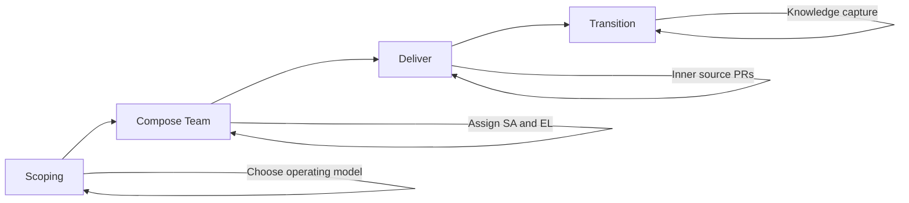

# Engagement Lifecycle

## Overview

The engagement lifecycle for a Customer Solution has four phases: **Scoping** → **Compose Team** → **Deliver** → **Transition**. This document describes activities, inputs, outputs, decision gates, and role responsibilities for each phase.

---

## Four Phases

---

## Phase 1: Scoping

**Objective:** Understand customer needs, define solution scope, select archetype, choose operating model, and identify gaps.

**Activities:**

- Customer needs assessment
- Solution architecture design (Solution Architect)
- Archetype selection or adaptation (Solution Architect)
- Platform identification (which domain platforms: Olympus, Tachyon, others)
- Gap analysis (what’s in platform vs. what’s needed)
- Scope definition (platform config, extensions, integrations, custom components)
- Operating model selection (Fully Managed, Co-Managed, Customer-Operated)
- Commercial and contract alignment (Engagement Lead + commercial)

**Inputs:** Customer requirements, engagement intent, practice area context.

**Outputs:**

- Solution architecture document (or equivalent)
- Engagement scope document
- Archetype and platform selection
- Operating model and responsibility matrix
- Commercial proposal and contract (or draft)

**Decision gate:** Scope and operating model agreed with customer; contract (or SoW) reflects PLE model and operating model.

**Role responsibilities:**

- **Solution Architect:** Architecture, archetype, gap analysis, variability expectations
- **Engagement Lead:** Delivery scope, customer liaison, commercial alignment
- **Domain Teams (as needed):** Feasibility, platform capacity, inner source expectations

---

## Phase 2: Compose Team

**Objective:** Form the Win Engineering Team for the engagement; assign Engagement Lead and Solution Architect; loan engineers from Domain Teams and other pools.

**Activities:**

- Define role requirements per engagement type (Solution Architect, Engagement Lead, Domain Engineers, Integration Engineers, QA, Domain Analysts)
- Request and secure loan of Solution Architect from Solution Architecture
- Request and secure loan of Domain Engineers (and others) from Domain Teams
- Assign Engagement Lead
- Document rotation and return expectations (duration, return dates or rotation cadence)
- Kickoff and team alignment (roles, RACI, escalation)

**Inputs:** Scoped engagement, staffing model, capacity from Domain Teams and Solution Architecture.

**Outputs:**

- Staffing plan with named individuals and return/rotation dates
- RACI and escalation path for the engagement
- Kickoff completed

**Decision gate:** Team is staffed and committed; Domain Team leads and Solution Architecture have confirmed capacity; Engagement Lead and Solution Architect are assigned.

**Role responsibilities:**

- **Engagement Lead:** Team composition request, coordination with Domain Team leads, kickoff
- **Domain Team Leads:** Commit capacity, assign loaned engineers, agree return/rotation
- **Solution Architecture:** Assign Solution Architect, agree engagement portfolio load

See [Team Composition](team-composition.md) for detailed process.

---

## Phase 3: Deliver

**Objective:** Configure platforms, build extensions and integrations, contribute to platforms via inner source where needed, and deliver the Customer Solution.

**Activities:**

- Platform provisioning and base configuration
- Configuration per archetype and customer (using blueprint and cookbook where applicable)
- Extension development within platform boundaries
- Integration development (customer systems, data lakes, etc.)
- Inner source: consult Domain Maintainers, implement capability, submit PRs; Domain Maintainers review and merge (or reject, or accept with tech debt)
- Variability documentation: Solution Architect documents configuration points, options, binding time, customer usage per [Variability Management](../framework/variability-management.md)
- Testing and validation
- Operational readiness (per operating model): runbooks, escalation matrix, handover checklist
- Go-live and stabilization

**Inputs:** Staffed team, solution architecture, archetype (blueprint, cookbook, playbook), platform access, customer access and dependencies.

**Outputs:**

- Configured and integrated Customer Solution
- Variability documentation for the engagement
- Test results and validation evidence
- Operational readiness artifacts (runbooks, escalation matrix)
- Merged inner source PRs (if any) and any tech debt tickets

**Decision gates:**

- Go-live: operational readiness criteria met; handover plan agreed per operating model
- Inner source: PRs meet DoD or are merged with tech debt per [Tech Debt Policy](../governance/tech-debt-policy.md)

**Role responsibilities:**

- **Engagement Lead:** Delivery coordination, scope and timeline, customer liaison, escalation
- **Solution Architect:** Architecture decisions, archetype application, variability documentation, escalation to Council when needed
- **Win Engineering Team:** Configuration, extension, integration, inner source contributions
- **Domain Maintainers:** PR review, DoD enforcement, tech debt tagging when soft gate is used

---

## Phase 4: Transition

**Objective:** Hand over the Customer Solution to steady-state operations (Zeta run team and/or customer per operating model); capture knowledge; release loaned team members per rotation/return plan.

**Activities:**

- Handover per operating model:
  - **Fully Managed:** Handover to Zeta run team (or SRE/ops); playbooks, escalation, access
  - **Co-Managed:** Handover to Zeta run team and customer per contract; responsibility matrix and checklist
  - **Customer-Operated:** Handover to customer with documentation, runbooks, escalation path; Zeta retains platform ops and support
- Platform enhancements that became platform work are owned by Domain Teams for ongoing maintenance
- Customer-specific components: handover to customer or small run team per contract
- Knowledge capture: engagement retrospective, decision log, archetype updates (Solution Architect), pattern extraction (Council)
- Release loaned engineers per return/rotation plan; document lessons for future engagements

**Inputs:** Delivered Customer Solution, operational readiness artifacts, operating model, contract.

**Outputs:**

- Handover complete (run team and/or customer)
- Knowledge capture artifacts (retrospective, decision log, archetype updates)
- Team released per rotation/return plan
- Any open tech debt or follow-up items assigned and tracked

**Decision gate:** Handover criteria met; knowledge capture done; team released.

**Role responsibilities:**

- **Engagement Lead:** Handover coordination, customer sign-off, team release
- **Solution Architect:** Archetype updates, variability documentation finalization, pattern extraction input to Council
- **Domain Teams:** Accept return of loaned engineers; own platform maintenance for merged inner source work
- **Council:** Pattern extraction (e.g. in next Practice Mode session); variability review

See [Knowledge Capture](knowledge-capture.md) for mechanisms.

---

## Timeline Expectations

- **Scoping:** Typically 2–4 weeks (depends on complexity and customer alignment).
- **Compose Team:** Typically 1–2 weeks after scope is agreed (depends on capacity and availability).
- **Deliver:** Variable; may extend to ~2 years for large or complex Customer Solutions.
- **Transition:** Typically 2–4 weeks (handover, knowledge capture, team release).

Exact timelines are set per engagement; the above are guidelines.

---

## References

- [Team Composition](team-composition.md)
- [Rotation Model](rotation-model.md)
- [Knowledge Capture](knowledge-capture.md)
- [Operating Models](../framework/operating-models.md)
- [Variability Management](../framework/variability-management.md)
- [Inner Source Guidelines](../governance/inner-source-guidelines.md)
- [Tech Debt Policy](../governance/tech-debt-policy.md)
