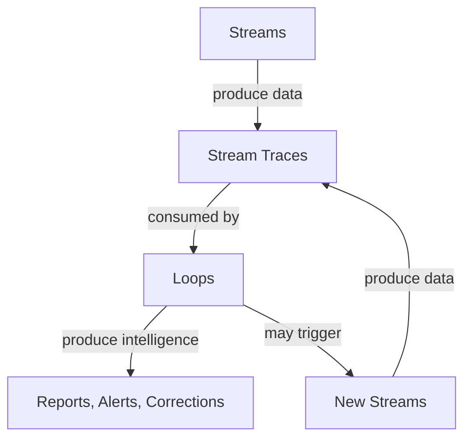

# Chapter 07.03.03: Modeling Loops

Loops represent the internal discipline of a Hub — the recurring, disciplined practices that keep the domain healthy. This document explains how to identify, classify, and model Loops. Audience: product managers, domain architects.

---

## 1. Loops as Internal Discipline

Not all work in a Hub is driven by external commitments. When a customer applies for a credit card, that is a Stream — an external commitment the bank must fulfill. But the Credit Card Hub does not wait for customers to trigger everything it does. Interest accrues nightly. Fraud patterns are monitored continuously. Reconciliation runs daily. Compliance is verified on schedule.

**Loops are the Hub's rituals and routines.** They are recurring, disciplined practices that keep the domain healthy, honest, and improving. They are triggered by the Hub's own schedule, its own events, its own operators — not by external parties crossing the boundary with a request.

This distinction matters. Streams answer "what does the bank owe the outside world?" Loops answer "what does the bank do for itself?" Both are essential. A domain that only fulfills external commitments without internal discipline will drift — data will diverge, compliance will lapse, risk will accumulate. A domain that only runs Loops without Streams has no external value. The two work together.

---

## 2. The Full Range of Loop Work

A healthy domain requires many kinds of internal discipline. Some are computational, some are analytical, some are about vigilance, and some are simply about keeping the house in order:

| Category | Description | Banking Examples |
|----------|-------------|------------------|
| **Analytical** | Pattern discovery, segmentation, trend analysis — seeks to understand what is happening and why | Application funnel drop-off analysis, card usage pattern detection, customer segment refresh, delinquency trend analysis |
| **Observational** | Continuous or periodic watching of metrics against expectations — alerts on deviation, threshold breach, or anomaly | SLA monitoring, queue depth and latency surveillance, business KPI tracking, transaction volume anomaly detection, operational health dashboards |
| **Computational** | Interest computation, fee calculation, account status assessment, period-close processing | Nightly interest accrual, monthly fee assessment, end-of-day balance status, month-end statement generation |
| **Integrity** | Reconciliation, data quality checks, cross-system validation | Daily GL reconciliation, payment vs ledger matching, core vs card system balance validation |
| **Compliance** | Policy adherence verification, regulatory checks, audit preparation | AML transaction monitoring, regulatory limit checks, audit trail verification, policy exception reporting |
| **Preparatory** | Feature engineering, ML pipelines, risk scoring | Risk score refresh for decisioning, feature vectors for fraud models, propensity scores for marketing |
| **Housekeeping** | System maintenance, batch processing, scheduled jobs | Archival of closed accounts, batch file processing, scheduled data purges |

A single Hub typically has Loops across multiple categories. The Payments Hub runs reconciliation (integrity), fee calculation (computational), fraud monitoring (compliance), usage analysis (analytical), and SLA tracking (observational). The Credit Card Hub runs interest accrual (computational), engagement scoring (preparatory), compliance monitoring (compliance), and volume anomaly detection (observational). Model each Loop by what it does, not by a narrow "analytics" label.

---

## 3. Trigger Models

Loops are discipline-driven — they exist because the Hub needs to maintain internal health. But *when* they run is a separate dimension. The trigger mechanism determines cadence and responsiveness:

| Trigger Type | Description | Banking Examples |
|--------------|-------------|------------------|
| **Periodic (cadence-driven)** | Runs on a fixed schedule — daily, weekly, monthly | Daily reconciliation, monthly interest accrual, weekly compliance report, quarterly risk review |
| **Continuous (always-on)** | Runs continuously or near-continuously | Real-time fraud monitoring, compliance surveillance, live balance validation |
| **Event-driven (internal events)** | Triggered when an internal event occurs | Runs when a batch load completes, when a threshold is breached, when a Stream produces an exception |
| **Administrative (explicit operator action)** | Manually triggered by domain operators | Ad-hoc reconciliation run, manual compliance sweep, operator-initiated data quality check |

**Key point:** Discipline-driven and event-triggered are not a dichotomy. "Discipline-driven" describes *why* the Loop exists — it serves internal health, not an external request. "Trigger mechanism" describes *when* it runs. A fraud monitoring Loop is discipline-driven (the Hub maintains fraud vigilance) and may be event-triggered (runs when a transaction batch completes) or continuous (always-on surveillance). A reconciliation Loop is discipline-driven and typically periodic (daily at 2 AM) but could be event-driven (when settlement file arrives). Model both dimensions: the Loop's purpose (discipline) and its trigger (schedule, event, or operator).

---

## 4. Loop Outputs

What does a Loop produce? The output determines who or what consumes it and whether the Loop creates downstream action:

| Output Type | Description | Banking Examples |
|-------------|-------------|------------------|
| **Passive intelligence** | Reports, dashboards, metrics — consumed by humans or systems for awareness | Daily reconciliation report, compliance dashboard, usage metrics, trend charts |
| **Active intelligence** | Alerts, flags, notifications to operators — requires attention | Fraud alert to investigator, reconciliation exception to ops, compliance breach notification |
| **Automated corrections** | Direct configuration changes, rule updates — no human in the loop | Auto-adjustment of risk limits, rule updates based on policy changes, configuration drift correction |
| **New Stream triggers** | When internal discipline reveals something requiring an external commitment | Fraud detected triggers customer notification Stream; compliance breach triggers regulatory filing Stream |

A Loop may produce multiple output types. A compliance monitoring Loop might produce a passive dashboard (metrics), active alerts (when thresholds are breached), and new Stream triggers (when a breach requires regulatory notification). Model each output explicitly: what is produced, and who or what consumes it.

---

## 5. Execution Model

A Loop is a modeling construct, not a privileged process. **Loops execute as Scenarios** — the same execution model as Streams. There is no separate Loop engine, no special infrastructure. The framework classifies work by trigger origin (internal vs external); it does not prescribe how that work runs.

Some Loops are fully automated. Interest computation runs as a Scenario resolved entirely by machines — no agent involvement. Others involve agents. A compliance review Loop may require a human to assess flagged items and decide whether to escalate. A reconciliation exception Loop may route to an ops agent for investigation. The framework does not prescribe autonomy level. Modelers choose the appropriate Resolution Model (Pure Automation, Automation with Exception Escalation, Human-AI Teaming, etc.) for each Loop's Scenarios, just as they do for Streams.

Teams are the 'who' for Loop Scenarios, just as for Streams. Some Loops have no human Team — a nightly interest computation is resolved entirely by machine agents invoking Tools from Machines (Pure Automation). A reconciliation Loop may have a small exception-handling Team that reviews discrepancies flagged by automated checks. A compliance monitoring Loop may involve a human-AI Team where AI agents surface anomalies and human compliance officers assess them. The Resolution Model determines Team involvement; the Loop model stays the same regardless.

---

## 6. Cross-Hub Loops

Some analysis spans multiple Hubs. Enterprise-wide AML monitoring, cross-product compliance, consolidated risk reporting — these require data from multiple product Hubs. How do you model them?

**Model an aggregation Hub.** Loops always live in a Hub; they do not float above Hubs. When cross-cutting analysis is needed, create an aggregation Hub — for example, an Enterprise Compliance Hub or a Central Risk Hub. That Hub's Loops consume data from multiple product Hubs (Payments, Credit Card, Servicing) and produce enterprise-level intelligence. The aggregation Hub has its own boundary, its own Loops, and its own Streams (e.g., regulatory filing when enterprise-level compliance requires it).

Do not create Loops that span Hubs without a home. Every Loop belongs to a Hub. Cross-Hub coordination happens through data flows into the aggregation Hub, not through Loops that reach across boundaries.

---

## 7. Loop-Stream Feedback

Loops and Streams form a feedback system. The Hub improves because it operates:

1. **Streams produce data.** Every commitment fulfilled generates a trace — decisions, outcomes, exceptions. Payment authorizations, card applications, dispute resolutions — each leaves an observable record.

2. **Loops consume Stream data.** Analysis, verification, and computation use that data. Reconciliation compares Stream outcomes to ledger state. Fraud monitoring analyzes transaction patterns from authorization Streams. Compliance checks verify that Stream decisions align with policy.

3. **Loops may trigger new Streams.** When internal discipline reveals something requiring an external commitment, the Loop triggers a Stream. Fraud detected triggers a customer notification Stream. Compliance breach triggers a regulatory filing Stream. The transition is explicit and auditable.

The cycle is virtuous: Streams generate data; Loops process it; Loops may create new Streams; those Streams generate more data. The domain becomes more intelligent, more compliant, and more efficient over time.

---

## 8. Loop Anti-Patterns

Avoid these common modeling mistakes:

### The Inert Loop

A Loop that runs but produces no actionable output. No intelligence is consumed. No corrections are applied. No Streams are triggered. If nothing changes because the Loop ran, it is waste. Every Loop should have a clear consumer — a dashboard that someone views, an alert that triggers action, a correction that is applied, or a Stream that is initiated. If you cannot name the consumer, question whether the Loop should exist.

### The Shadow Stream

A Loop that actually handles external commitments. If it responds to customer requests, produces externally visible outputs (e.g., a statement sent to a customer), or fulfills obligations to regulators or partners, it is misclassified. It should be a Stream. The test: does the work originate from outside the Hub boundary? If yes, it is a Stream. Loops are internally triggered.

### The Entangled Loop

A Loop that directly modifies another Hub's state without going through a cross-Hub Stream or proper boundary mechanism. A Credit Card Hub Loop should not directly update a Payments Hub ledger. Cross-Hub effects flow through Streams or through explicit integration contracts. Violating Hub boundaries creates hidden coupling and breaks the model.

### The Unobserved Loop

A Loop with no metrics, no monitoring, no evidence of execution. Discipline without measurement is ritual without purpose. Every Loop should be observable: did it run? what did it produce? were there exceptions? If you cannot answer these questions, the Loop is not operational — it is aspirational.

---

## 9. Loop Heuristics

Use these heuristics when modeling Loops:

**Every Loop should answer: what output does it produce, and who or what consumes it?** If you cannot articulate both, the Loop is underspecified.

**If a Loop serves only one Stream, consider whether it should be part of that Stream's Scenarios.** A Loop that exists solely to prepare data for a single Stream might be better modeled as a Scenario within that Stream — for example, a pre-decisioning risk score refresh. The boundary is judgment: does the work have independent value (e.g., the score is used elsewhere) or is it purely Stream-supporting?

**Do not classify by work type — classify by trigger origin.** "Analytics" is not a Loop. "Nightly reconciliation" is a Loop — it is internally triggered. "Customer segmentation for marketing" is a Loop if it runs on schedule or internal events. "Ad-hoc report for a regulator" might be a Stream if the regulator requested it. The trigger origin determines the classification.

---

## What Modeling Loops Delivers

Loops formalize the internal disciplines that banks have always performed but rarely modeled. Making them explicit produces several concrete outcomes:

**Internal disciplines become governable.** Reconciliation, monitoring, compliance checks, data staging — when each is an explicit Loop with declared triggers, outputs, and consumers, the bank can verify: are our disciplines actually running? Are they producing useful output? Are they keeping us healthy? Invisible discipline failures — the reconciliation that silently stopped running, the monitoring that nobody checked — become structurally detectable.

**AI discovers invisible work.** Much of a domain's internal discipline was never formalized — it lived in spreadsheets, morning routines, and the habits of experienced operators. Once the known Loops are modeled, AI can examine operational patterns against the baseline and surface candidates for new Loops: a daily manual reconciliation that should be formalized, a monitoring pattern that nobody made explicit.

**AI reasons about gaps.** Given the stated Loops, AI can identify missing disciplines. No fraud velocity monitoring? No regulatory disclosure check? No cross-system validation for a data migration? The model provides the structural context that makes these gap hypotheses situated and testable rather than generic.

**The feedback system emerges.** Streams produce data — every commitment fulfilled generates decisions, outcomes, and exceptions. Loops consume that data — analyzing it for patterns, checking it against policies, computing derived values. And Loops may trigger new Streams — when fraud monitoring detects suspicious activity, it initiates a customer notification, creating a new external commitment. Each cycle makes the domain more intelligent.

---

## Summary

Loops are the Hub's internal discipline — recurring, disciplined practices that keep the domain healthy. They span analytical, observational, computational, integrity, compliance, preparatory, and housekeeping work. They may be triggered periodically, continuously, by internal events, or by operator action. They produce passive or active intelligence, automated corrections, or new Stream triggers. Loops execute as Scenarios, live in Hubs, and form a feedback system with Streams. Avoid inert, shadow, entangled, and unobserved Loops. Model each Loop with clear outputs and consumers.

---

## Related Documents

- [Framework and Rationale](01-framework-and-rationale.md) — design principles and scope
- [Modeling Streams](02-modeling-streams.md) — external commitments, the other side of the partition
- [Modeling Teams](06-modeling-teams.md) — who resolves Loop Scenarios
- [Modeling Machines](07-modeling-machines.md) — tools used for internal discipline
- [Ontology Alignment](08-ontology-alignment.md) — Work Patterns and Resolution Models for Loop Scenarios
- [Implementing in Hub](09-implementing-in-hub.md) — Loop implementation in Olympus Hub
- [Worked Examples](10-examples.md) — Loop modeling in banking domains
