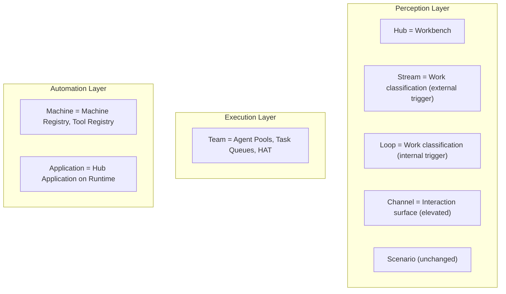

# Chapter 07.03.08: The Hub Way and the Olympus Hub Ontology

This document explains how The Hub Way framework relates to the Olympus Hub ontology. It is written for architects and engineers who need to understand the theoretical fit, what The Hub Way extends versus what it leaves unchanged, and how to apply both frameworks together.

---

## 1. The Four-Layer Ontology Recap

Olympus Hub's ontology organizes Human-AI Team Operations into four layers. Each layer answers a distinct question:

| Layer | Question | Key Concepts |
|-------|----------|--------------|
| **Perception** | What's happening? | Domain, Workbench, Signal, Trigger, Scenario |
| **Normative** | What ought to be done? | Role, Goal, SOP, Capability, Decision Criteria |
| **Execution** | How is it done? | Operation (Procedure, Workflow, Case), Activity, Task, Agent |
| **Automation** | How is it codified? | Automation, Runtime, Tools, Registries |

### Layer Summary

| Layer | Purpose |
|-------|---------|
| **Perception** | Observes and interprets reality. Signals from the environment are interpreted by Triggers into Scenarios. Descriptive, not prescriptive. |
| **Normative** | Defines standards, rules, and goals. Roles, Goals, SOPs, Capabilities, and Decision Criteria shape expected behavior. |
| **Execution** | Where work happens. Operations (Procedure, Workflow, Case) prescribe Activities; Activities become Tasks delegated to Agents when agent involvement is required. |
| **Automation** | Codified definitions of operations. Automations are software representations of procedures, workflows, or cases. Automation Runtime instantiates and supervises live operations. |

### Core Runtime Lifecycle

The ontology defines a strict runtime flow:

```
Signal → Trigger → Scenario → Automation → Operation → Activity → Action
```

This lifecycle is invariant. Every piece of work in Hub flows through this sequence.

---

## 2. What The Hub Way Adds

The Hub Way introduces four dimensions that the ontology does not explicitly address:

| Dimension | The Hub Way Concept | Ontology Gap |
|-----------|---------------------|--------------|
| **Work classification by purpose and trigger origin** | Streams and Loops | The ontology models *what* work is (Scenario, Operation) and *how* it executes, but not *why* the work exists or where the trigger originates. |
| **Collaboration surface modeling** | Channels | The ontology does not explicitly address how users interact with the system across different interfaces. |
| **Collaborator structuring** | Teams | The ontology defines Agent types but does not make agent organization a modeling concern. The Hub Way elevates Team composition as a domain-level decision. |
| **Tool availability as modeling concern** | Machines | The ontology defines Machine/Tool/Command abstractly. The Hub Way makes which Machines a Hub needs a domain-level modeling decision. |

### Why These Dimensions Matter

- **Streams and Loops** answer: "Why does this work exist? Is it driven by an external commitment or by internal discipline?" This classification affects how work is designed, measured, and audited.
- **Channels** answer: "Through what do collaborators participate?" Different interfaces (web, chat, API, MCP) have different interaction models, identity requirements, and delegation flows.

---

## 3. How The Hub Way Is Orthogonal

The Hub Way **extends** the ontology; it does **not** modify it. This is critical.

### Execution Model Untouched

| Ontology Element | The Hub Way Impact |
|------------------|---------------------|
| Signal → Trigger → Scenario → Automation → Operation → Activity → Action | Unchanged. Both Streams and Loops execute through this lifecycle. |
| Scenario | Remains the atomic unit of work. The Hub Way classifies Scenarios by trigger origin; it does not replace Scenario. |
| Workbench | Remains the container for domain encapsulation. Hub maps to Workbench. |

### Work Patterns Apply to Both Streams and Loops

The seven Work Patterns are available to both Stream Scenarios and Loop Scenarios:

| Work Pattern | Description |
|--------------|-------------|
| Queue-Based | Serial processing of work items with SLAs |
| Case-Based | Non-deterministic, collaborative resolution |
| Event-Driven | Signal-triggered response |
| Conversation-Based | Real-time exchange toward understanding |
| Artifact-Centric | Single artifact: draft → review → approve |
| Review-Based | Assessing artifacts, decisions, or outcomes |
| Generative/Design | Diverge → create variants → select → converge |

### Resolution Models Apply Uniformly

All nine Resolution Models apply to both Stream and Loop Scenarios:

| Resolution Model | Description |
|------------------|-------------|
| Pure Automation | Machines resolve entirely; no agent involvement |
| Automation with Exception Escalation | Machines resolve; agents engage only for business exceptions |
| Automation with Checkpoint Approval | Machines resolve; agents approve at defined points |
| Agent-Assisted Automation | Automation does the work; agents guide, review, or correct |
| Human-AI Teaming | Human and AI agents collaborate throughout |
| AI-Autonomous | AI agents operate independently within governance |
| Human-Supervised AI | AI proposes; humans approve each action |
| Pure Human Collaboration | Humans work together; platform provides infrastructure |
| Human with Tool Support | Human resolves; machines provide capabilities on demand |

### Agent Model Unchanged

The ontology's Agent types remain:

| Agent Type | Description |
|------------|-------------|
| Human | Human agent |
| AI Agent | AI-driven agent |
| Rule-Based Agent | Deterministic rule execution |
| Workflow Agent | Workflow-driven automation |

The Hub Way does not introduce new agent types or change how agents participate in Scenarios.

### Teams and the Agent Model

The Hub Way's Team concept uses the ontology's Agent types unchanged but elevates **agent organization** as a first-class modeling concern. The ontology answers 'what types of agents exist?' The Hub Way asks 'how are agents organized to resolve this Hub's Scenarios?' — skill-based pools, task queues, escalation matrices, mixed human-AI teams.

**Application-Agent Convergence**: When the runtime is Seer, the Hub Application IS an AI Agent — the Seer Case Orchestration Agent. This agent is simultaneously the Scenario orchestrator (Application role) and a Team member (Agent role). The distinction between 'what orchestrates the work' and 'who resolves the work' collapses. This convergence is natural within the ontology — the Agent type is unchanged; the deployment context is new.

### Persona-Channel Architecture Already Exists

Hub already has Persona (platform-level user archetype) and Channel (interaction interface) as implementation concepts. The Hub Way elevates **Channel** to a first-class modeling concern at the Hub level. The Persona-Channel architecture is not new; The Hub Way makes Channel a domain modeling decision, not just a platform configuration.

---

## 4. The Trigger Boundary as the Defining Classification

The classification of work into Streams and Loops rests on one rule:

| Trigger Origin | Classification |
|----------------|----------------|
| **External trigger** (crosses Hub boundary inward) | Stream |
| **Internal trigger** (originates within Hub) | Loop |

### What Does Not Determine Classification

| Factor | Why It Doesn't Determine Classification |
|--------|----------------------------------------|
| Type of work | Both Streams and Loops can be analytical, computational, case-based, or event-driven. |
| Execution model | Both use the same lifecycle: Signal → Trigger → Scenario → Automation → Operation → Activity → Action. |
| Work Pattern | Queue-Based, Case-Based, Event-Driven, etc. apply to both. |
| Resolution Model | Pure Automation through Pure Human Collaboration apply to both. |

### What Does Determine Classification

**The trigger origin.** Where does the work originate?

- Customer applies for credit card → external → Stream
- Partner submits payment → external → Stream
- Regulator requests filing → external → Stream
- Scheduled interest computation runs → internal → Loop
- Reconciliation batch executes → internal → Loop
- Fraud monitoring detects anomaly → internal → Loop (even if it later triggers a new Stream)

---

## 5. Where The Hub Way Sits Conceptually

The Hub Way operates at the **Perception Layer** level. It enriches Domain and Workbench with additional modeling dimensions:

| The Hub Way Dimension | Ontology Layer | Enrichment |
|-----------------------|----------------|------------|
| Work classification (Stream/Loop) | Perception | Adds "why does this work exist?" and "where does the trigger originate?" to Domain/Workbench modeling. |
| Collaboration surface (Channel) | Perception (gap fill) | Adds "through what do collaborators participate?" to domain modeling. |
| Collaborator structuring (Team) | Execution | Adds "how are agents organized to resolve Scenarios?" to domain modeling. |
| Tool availability (Machine) | Automation | Adds "what Machines and Tools does this Hub need?" to domain modeling. |



The Hub Way does not add new layers. It extends the modeling vocabulary across existing layers.

---

## 6. Bridging to Work Patterns and Resolution Models

While The Hub Way says "everything is a Scenario," the ontology differentiates Scenarios through **Work Patterns** and **Resolution Models**. Modelers should profile both Stream Scenarios and Loop Scenarios with these attributes.

### Why Profiling Matters

- **Work Pattern** describes the nature of the situation (queue processing, case investigation, event reaction, etc.).
- **Resolution Model** describes who resolves it (pure automation, human-AI teaming, etc.).

Together they define how work actually happens. A Stream Scenario and a Loop Scenario can share the same Work Pattern and Resolution Model; the Stream/Loop classification is orthogonal.

### Example Scenario Profiling

| Scenario | Stream or Loop | Work Pattern | Resolution Model |
|----------|----------------|--------------|------------------|
| Payment authorization | Stream | Event-Driven | Pure Automation |
| Credit card application | Stream | Case-Based | Human-AI Teaming |
| Fraud investigation | Stream | Case-Based | Human-AI Teaming |
| Interest computation | Loop | Queue-Based | Pure Automation |
| Daily reconciliation | Loop | Queue-Based | Automation with Exception Escalation |
| Compliance monitoring | Loop | Event-Driven | Human-Supervised AI |

### Design Guidance

When modeling a Scenario:

1. **Classify by trigger**: External → Stream; Internal → Loop.
2. **Select Work Pattern**: What kind of situation is this? Queue, Case, Event, Artifact, Review, Conversation, or Generative?
3. **Select Resolution Model**: Who resolves it? Pure Automation, Human-AI Teaming, or something in between?

All three dimensions are independent. A Loop can be Case-Based with Human-AI Teaming. A Stream can be Event-Driven with Pure Automation.

---

## 7. Channels and the Ontology

### The Ontology Gap

The ontology does not explicitly address how users interact with the system across different interfaces. The Channel concept in Hub fills this gap.

### What the Ontology Covers

| Ontology Concept | Implementation | Relationship |
|------------------|----------------|--------------|
| Agent (Human) | User + Channel | Agents interact via Channels |
| Action | Channel-specific interaction | Actions taken through Channel interface |

### What Channels Address

| Concern | Channel Role |
|---------|--------------|
| Multi-surface access | Same user, different devices (web, mobile, chat) |
| Context optimization | Right interface for each context |
| AI integration | AI assistants as first-class channel (MCP) |
| API access | Programmatic interaction (REST) |

### Hub's Existing Persona-Channel Architecture

Hub already has:

- **Persona**: Platform-level user archetype (Agent, Supervisor, Process Architect, etc.)
- **Channel**: Interaction interface (Web Console, MS Teams, MCP, REST API)

Channels are implementation concepts that enable multi-surface interaction. The Hub Way elevates **Channel** to a first-class modeling concern at the Hub level. Domain modelers should consciously decide which Channels are available for a Hub's Scenarios.

### Channel vs Channel Product

| Concept | Scope | Description |
|---------|-------|-------------|
| **Channel** | Hub-scoped | One Hub's view of collaboration for a persona. Configured per Workbench. |
| **Channel Product** | Organization-scoped | Composes Channels from multiple Hubs into a cohesive persona experience. Delivered through Neutrino. |

---

## 8. Summary Mapping Table

| The Hub Way Concept | Ontology Relationship |
|---------------------|------------------------|
| **Hub** | Workbench (Perception Layer). Domain encapsulation. |
| **Stream** | Work classification by external trigger. Extends Perception Layer. |
| **Loop** | Work classification by internal trigger. Extends Perception Layer. |
| **Channel** | Fills ontology gap for interaction surfaces. Elevates existing Hub Channel to modeling concern. |
| **Scenario** | Scenario (Perception Layer). Unchanged. |
| **Stream Trace** | Leverages Cognitive Audit Fabric. Post-facto observable record of how a commitment was fulfilled. |
| **Channel Product** | Organization-scoped composite. Neutrino, above Hub. |
| **Team** | Agent Pools, Task Queues, HAT (Execution Layer). Elevates agent organization as modeling concern. |
| **Machine** | Machine Registry, Tool Registry (Automation Layer). Elevates tool availability as modeling concern. |
| **Application** | Hub Application on Runtime (Automation Layer). When Seer, Application = AI Agent. |

---

## Related Documents

- [The Hub Way Framework Reference](../README.md) — authoritative definitions
- [Olympus Hub Ontology Reference](../../../../../olympus-hub-docs/01-concepts/ontology-reference.md) — four-layer ontology
- [Information-Centric Work Patterns](../../../../../olympus-hub-docs/03-information-centric-work/README.md) — Work Patterns and Resolution Models
- [Implementing The Hub Way in Olympus Hub](09-implementing-in-hub.md) — translating models to configuration
- [Modeling Teams](06-modeling-teams.md) — Teams and agent organization
- [Modeling Machines](07-modeling-machines.md) — Machines, Tools, and Applications
