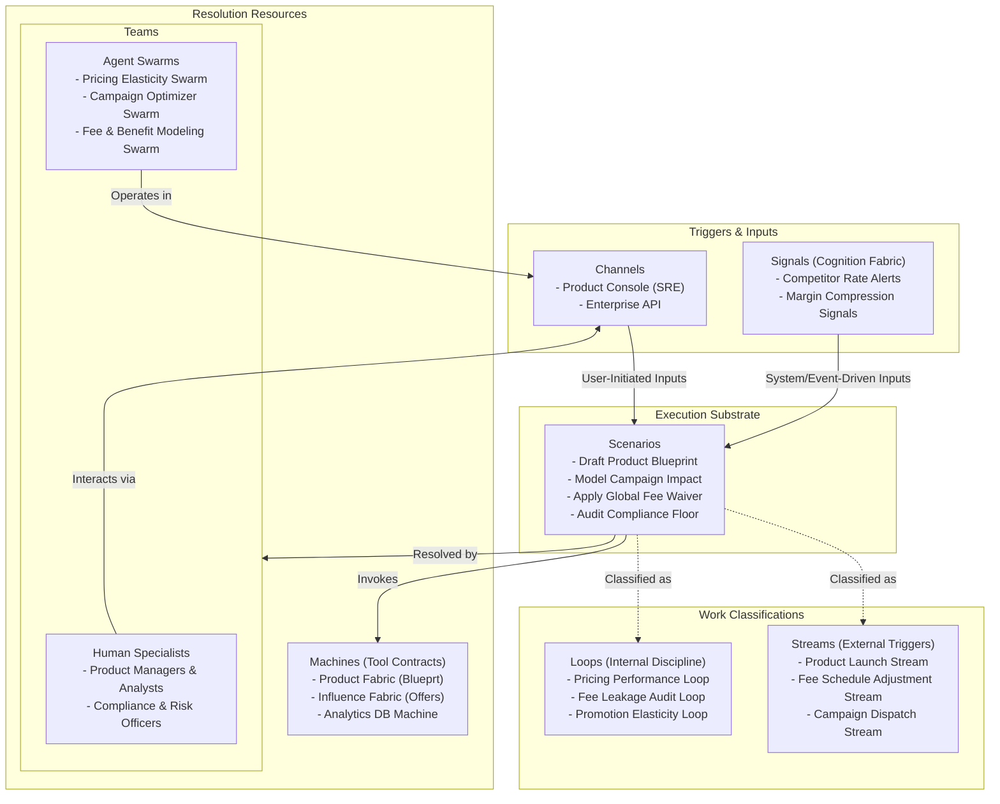

# Chapter 03.03.01: Product Hub — Product Note

**The commercial brain of the enterprise bank, managing financial product and bundle blueprints, orchestrating promotional mechanics (Rewards, Offers, Discounts, Fee Waivers), simulating campaign impacts, and dispatching targeted promotions to delivery and engagement channels.**

---

## What It Governs

The **Product Hub** is the central repository and modeling engine for the commercial constructs of the bank. It governs the lifecycle of financial blueprints—including savings and checking accounts, revolving credit lines, term loans, mortgages, and commercial card programs. Additionally, it governs the rules, triggers, and commercial math behind pricing tiers, interest matrices, fee schedules, reward programs, and promotion campaigns.

In scope:
- **Product Blueprinting**: Definition of interest rates, payment schedules, fee matrices, and product features.
- **Dynamic Bundling**: Rules governing multi-product bundles, family banking packages, and merchant co-brand relationships.
- **Promotion & Reward Management**: Rules for cashback, points, fee waivers, and interest rate discounts.
- **Commercial Simulation**: Modeling the revenue and volume impact of rate or fee adjustments before publishing.
- **Targeted Promotions Handoff**: Dispatching personalized promotional rules to the Relationship Hub.

Out of scope:
- **Sourcing and Sales Execution**: Handed off to the Distribution Hub.
- **Customer Balance & Transaction Ledgering**: Handed off to the Demand/Term Deposit and Revolving Credit Fabrics.
- **Direct Channel Delivery**: Handed off to the Relationship Hub and external customer channels.

---

## Source of Truth

- **Entities Owned**: Product Blueprints, Bundle Rules, Fee Schedules, Interest Matrices, Promotion Campaigns, Reward & Offer Rules, Commercial Impact Simulations.
- **Key Invariants**:
  - No product blueprint can be published to acquisition without explicit risk and compliance sign-off.
  - Active interest rates and fees must adhere to regional regulatory ceilings (e.g., Usury laws, Truth in Lending acts).
  - Campaign budgets have strict, automated kill-switches to prevent reward-overrun exposure.
- **Configurable vs. Compliance Floor**:
  - *Configurable*: Interest rates, fee amounts, reward points multipliers, bundling rules, eligibility criteria, and campaign duration.
  - *Compliance Floor*: Truth-in-lending disclosure rules, compliance verification gates, margin checks, and mandatory fee-waiver reporting.

---

## Scope Highlights

- **Declarative Product Authoring**: Replaces hard-coded core banking modifications with a visual and code-based declarative blueprint environment.
- **Pre-Rollout Impact Modeling**: Runs historical simulation runs on customer transaction databases to test "what-if" scenarios (e.g., "What is the margin impact if we lower the savings rate by 15bps but wave monthly fees?").
- **Dynamic Pricing & Benefit Rules**: Orchestrates complex eligibility formulas (e.g., "Waive ATM fees if average daily balance exceeds $5,000 OR if customer has an active mortgage").
- **Automated Blueprint Handoff**: Compiles active configurations into an immutable, versioned artifact and publishes it to the Distribution Hub to immediately govern new application processing.

---

## Work Model (Work Architecture)

The Product Hub operates on a structured Work Model that translates business intent into governed configurations and dispatched campaigns. 

### Streams (External Triggers)
- **Product Launch Stream**: Initiated by a Product Manager or market trigger. Compiles a new product's financial rules, routes them through compliance gates, registers them with core ledgers, and compiles the final blueprint for Distribution.
- **Fee Schedule Adjustment Stream**: Triggered by executive decree or margin pressure. Executes an adjustment to existing interest rate tables or fee matrices, updates active accounts, and dispatches notices.
- **Campaign Dispatch Stream**: Triggered by marketing operations. Compiles a new promotional campaign (e.g., "Double points on summer travel"), registers the reward triggers, and dispatches targeting rules to the Relationship Hub.

### Loops (Internal Discipline)
- **Pricing Performance Loop**: Runs on a weekly schedule. Analyzes yield, deposit growth, and funding costs against competitor rates to highlight margin compression or expansion opportunities.
- **Fee Leakage Audit Loop**: Runs on a daily schedule. Scans transaction records to identify fee waivers granted outside of configured policies, ensuring billing integrity and compliance.
- **Promotion Elasticity Loop**: Runs continuously. Monitors ongoing campaigns to verify whether promotional spend (Rewards, Cashback, Discounts) is driving the expected lift in deposit volumes or card spend, automatically flagging underperforming campaigns.

---

## Teams and Agent Swarms

The Product Hub's workforce is structured as a collaborative unit of human domain experts and specialized, goal-directed **Agent Swarms**:

### Human Specialists
- **Product Managers**: Author overall business rules, bundle definitions, and margin goals.
- **Risk & Compliance Officers**: Define compliance boundaries, review disclosures, and approve fee structures.
- **Campaign Directors**: Direct promotional strategy, budgets, and distribution channels.

### Native Agent Swarms
- **Pricing Elasticity Swarm**: Operates within the *Pricing Performance Loop*. Constantly ingests market competitive rates, macroeconomic indicators, and the bank's active balance sheets to simulate rate-adjustment impacts. It generates predictive reports detailing how a proposed rate change would influence customer deposit retention and net interest margin (NIM).
- **Campaign Optimizer Swarm**: Operates within the *Promotion Elasticity Loop*. Monitors real-time campaign performance across active customer cohorts. It predicts budget exhaustion dates, identifies which customer segments are highly responsive, and suggests automated adjustments to rewards targeting rules to maximize ROI.
- **Fee & Benefit Modeling Swarm**: Operates within the *Fee Leakage Audit Loop*. It scans customer profiles, account types, and posted fee waivers to identify discrepancies. It highlights accounts receiving unauthorized waivers and runs "what-if" models to assess the financial impact of enforcing strict fee policies.

---

## Boundaries and Adjacencies

| Adjacent Hub / Fabric | Consumed Interface / Relationship |
|:---|:---|
| **Product Fabric** | *Fabric Consumed*. Exposes core data structures and registers the compiled Product Blueprints as system-wide metadata definitions. |
| **Influence Fabric** | *Fabric Consumed*. Governs the rules engines, targeting metadata, and dynamic discount structures that Product Hub manipulates during campaigns. |
| **Distribution Hub** | *Downstream Hub*. Receives versioned Product Blueprints to drive the eligibility, pricing, and onboarding criteria for new applicants. |
| **Relationship Hub** | *Downstream Hub*. Receives published campaign rules, dynamic discounts, and personalized offers to contextually display to active customers. |
| **Accounting Fabric** | *Adjacent Fabric*. Receives fee structure mappings and subledger configurations defined in the product blueprints to align core financial reporting. |
| **Engagement Fabric** | *Adjacent Fabric*. Receives targeting triggers and campaign milestones to orchestrate push alerts, SMS, or email delivery. |
