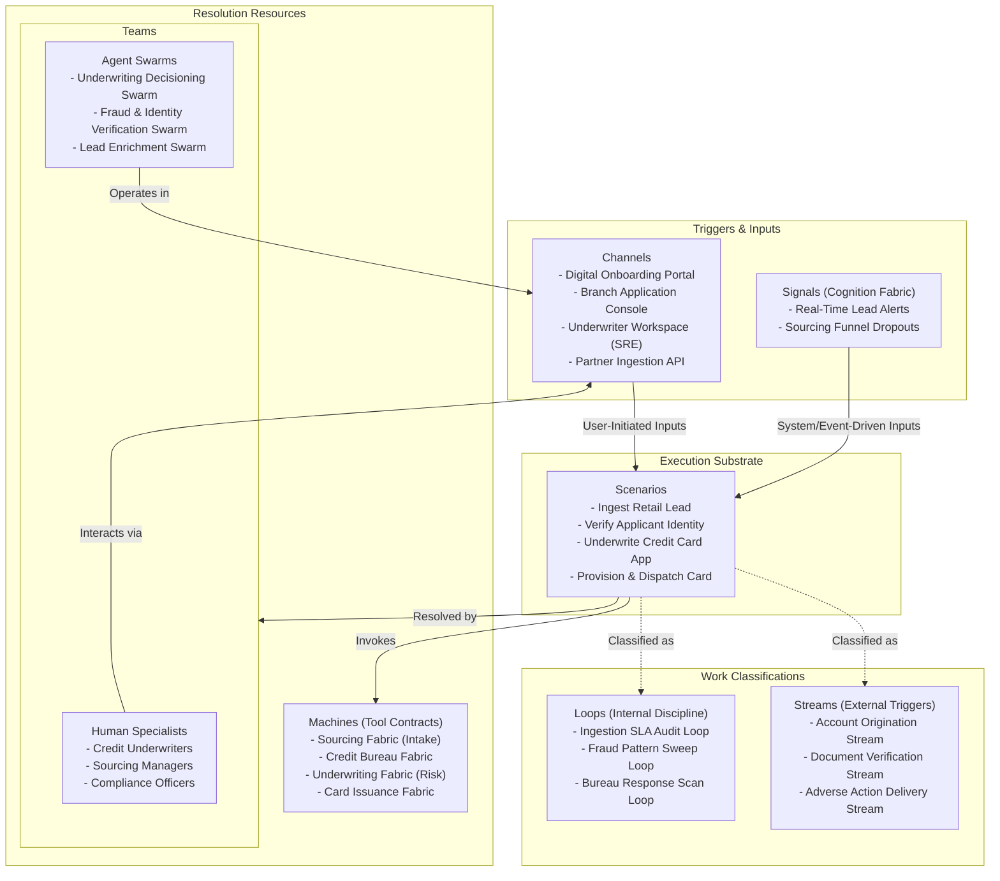

# Chapter 03.03.02: Distribution Hub — Product Note

**The sourcing and acquisition gatekeeper of the bank, managing lead ingestion, application capture, customer assessment, underwriting, credit decisioning, and physical/digital card or account issuance before transitioning active relationships to servicing.**

---

## What It Governs

The **Distribution Hub** is the frontline gateway for growth. It governs the entire customer acquisition lifecycle, taking prospects from initial lead ingestion through application capture, identity verification, risk/credit assessment, decision gating, product provisioning, physical and digital issuance, and relationship handover.

In scope:
- **Lead Ingestion & Enrichment**: Capturing and pre-populating marketing leads and referrals.
- **Application Capture**: Orchestrating application intake journeys across digital channels and branch workspaces.
- **Underwriting & Assessment**: Calling credit bureaus, fraud services, and decision engines to evaluate risk.
- **Decision Gating**: Executing automated accept/decline/counter-offer rules against eligibility criteria defined by the Product Hub.
- **Issuance & Provisioning**: Activating accounts, creating card profiles, generating digital keys, and dispatching physical cards.
- **Relationship Transition**: Handoff of the activated relationship to the Relationship Hub.

Out of scope:
- **Product Definiton and Pricing Rules**: Set and published by the Product Hub.
- **Ongoing Relationship Servicing**: Handed off to the Relationship Hub post-activation.
- **Back-Office Exceptions**: Handed off to the Operations Hub when applications require complex manual investigation or dispute resolution.

---

## Source of Truth

- **Entities Owned**: Applications, Leads, Credit Assessment Runs, KYB/KYC Verification Sessions, Issued Credentials/Tokens, Card Delivery Tracks.
- **Key Invariants**:
  - No application can proceed to decisioning without completing identity verification (KYC/AML) checks.
  - Credit decisions must strictly adhere to underwriting boundaries registered in the Product Blueprints.
  - Digital credentials and account numbers must never be exposed in plaintext during provisioning.
- **Configurable vs. Compliance Floor**:
  - *Configurable*: Form fields, assessment checklists, custom routing paths, underwriting score thresholds, and issuance channels.
  - *Compliance Floor*: Bank Secrecy Act (BSA) rules, Anti-Money Laundering (AML) gates, Fair Credit Reporting Act (FCRA) disclosure flows, and adverse action notice delivery.

---

## Scope Highlights

- **Omnichannel Application Capture**: Unifies applications started on mobile, web, third-party BaaS partners, or in-branch, maintaining a single, resumable state.
- **Automated Underwriting Cockpit**: Orchestrates parallel API queries to credit bureaus, fraud consortiums, and document verification providers, compiling results into a unified score.
- **Instant Issuance Engine**: Generates active account numbers, virtual card numbers (VCNs), and digital wallet push-provisioning tokens immediately upon approval, minimizing time-to-first-spend.
- **Seamless Servicing Handover**: Automates the compilation of signed contracts, disclosures, and initial funding statuses, seamlessly publishing the transition event to the Relationship Hub.

---

## Work Model (Work Architecture)

The Distribution Hub operates on a structured Work Model focused on high-velocity throughput and compliance enforcement.

### Streams (External Triggers)
- **Account Origination Stream**: Triggered by a prospect submitting an application. Drives the application through KYC, underwriting, provisioning, card delivery, and onboarding, ending in handover to the Relationship Hub.
- **Document Verification Stream**: Triggered when automated KYC fails. Routes identity or income documents to a verification queue for OCR/AI analysis and human underwriter review.
- **Adverse Action Delivery Stream**: Triggered by an application decline. Generates and sends a compliant adverse action letter explaining the decision and credit factors.

### Loops (Internal Discipline)
- **Ingestion SLA Audit Loop**: Runs hourly. Monitors active origination streams to identify bottlenecks (e.g., applications stuck in verification) and alerts ops teams.
- **Fraud Pattern Sweep Loop**: Runs on a schedule. Analyzes recently completed or abandoned applications to detect coordinated identity fraud, application-farming, or bot attacks.
- **Bureau Response Scan Loop**: Runs daily. Evaluates the performance and response times of integrated credit bureaus and identity services to optimize caching and routing policies.

---

## Teams and Agent Swarms

The Distribution Hub combines human credit specialists with highly specialized Agent Swarms:

### Human Specialists
- **Credit Underwriters**: Conduct manual reviews of high-value applications or complex exceptions.
- **Sourcing Managers**: Design marketing leads ingestion strategies and partner integrations.
- **Compliance Officers**: Review and audit KYC/KYB and adverse action compliance.

### Native Agent Swarms
- **Underwriting Decisioning Swarm**: Operates within the *Account Origination Stream*. Ingests application details, queries credit bureaus via tool contracts, computes DTI ratios, cross-checks product eligibility rules, and compiles a comprehensive credit dossier with a recommended decision.
- **Fraud & Identity Verification Swarm**: Operates within the *Document Verification Stream*. Extracts data from uploaded identity documents (passports, utility bills), verifies holographic overlays and formatting, matches the document photo against face-match selfies, and flags anomalies.
- **Lead Enrichment Swarm**: Operates within the *Ingestion SLA Audit Loop*. Scans incoming raw leads, matches them against public commercial databases or marketing profiles, and appends demographic or business indicators before application launch.

---

## Boundaries and Adjacencies

| Adjacent Hub / Fabric | Consumed Interface / Relationship |
|:---|:---|
| **Sourcing Fabric** | *Fabric Consumed*. Exposes lead capture forms, ingestion APIs, and tracking metadata. |
| **Credit Bureau Fabric** | *Fabric Consumed*. Wraps third-party credit bureaus (Experian, Equifax, TransUnion) under a unified tool contract. |
| **Underwriting Fabric** | *Fabric Consumed*. Governs internal scorecard execution, rules engines, and fraud risk databases. |
| **Card Issuance Fabric** | *Fabric Consumed*. Coordinates card number allocation, physical card printing partners, and digital wallet provisioners. |
| **Product Hub** | *Upstream Hub*. Provides the Product Blueprints (interest rates, fees, eligibility rules) that govern the underwriting decision gate. |
| **Relationship Hub** | *Downstream Hub*. Receives activated accounts and onboarding packets to initiate long-term servicing and engagement. |
