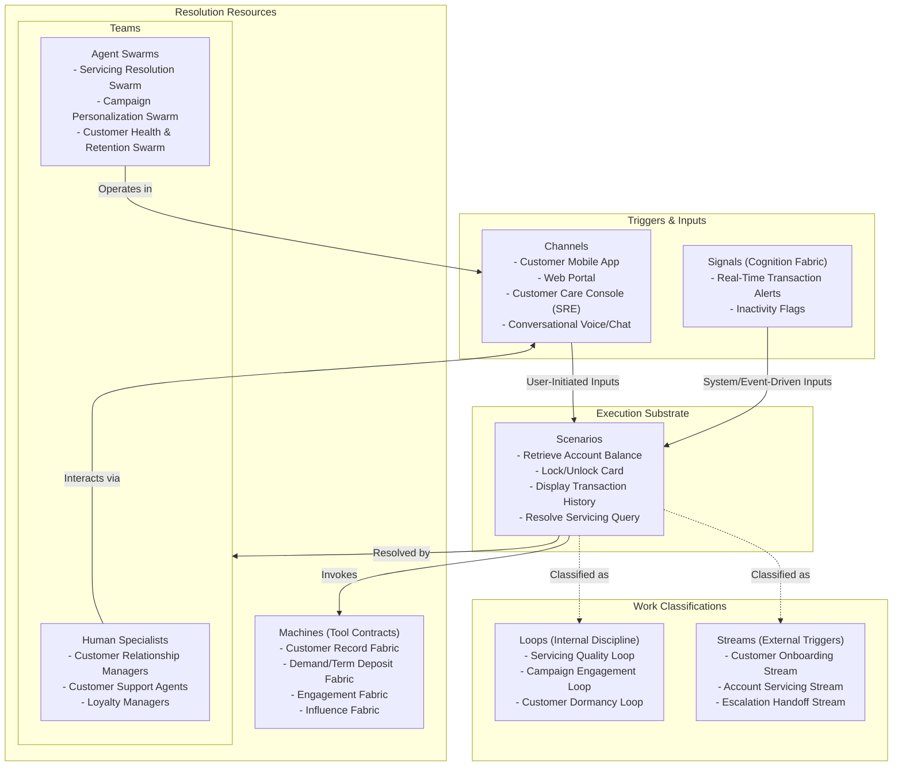

# Chapter 03.03.03: Relationship Hub — Product Note

**The primary system of engagement and servicing for active customers, handling self-serve account operations, balances, statements, and transaction queries, while contextually executing Product Hub promotions and marketing campaigns across channels.**

---

## What It Governs

The **Relationship Hub** is the heart of the customer experience. It governs the ongoing interactions with active customers (consumers, SMBs, or corporates), coordinating account inquiries, transaction searches, fee and interest disputes, self-serve changes (limits, PINs, contact info), statement deliveries, and the personalized, context-aware delivery of loyalty rewards and promotional campaigns.

In scope:
- **Account Servicing**: Direct access to balance inquiries, ledger details, interest schedules, and statement lookups.
- **Self-Service Requests**: Facilitating secure customer updates (e.g., locking a card, resetting a PIN, updating contact info).
- **Campaign Execution & Delivery**: Prioritizing, contextually displaying, and administering targeted promotional rules (e.g., rewards, cashbacks, fee waivers) dispatched by the Product Hub.
- **Engagement Channel Orchestration**: Driving alerts, SMS, email, and mobile-push notifications based on customer actions.
- **Request Routing**: Managing the preliminary routing and escalation of complex issues.

Out of scope:
- **Application Underwriting & Account Issuance**: Governed by the Distribution Hub.
- **Deep Back-Office Case Investigations**: Escalated to the Operations Hub (e.g., formal fraud disputes, debt collection negotiations).
- **Core Ledger and Ledgering**: Handed off to underlying ledger fabrics like Demand Deposit or Revolving Credit.

---

## Source of Truth

- **Entities Owned**: Customer Servicing Profiles, Consents & Preferences, Interaction History, Campaign Enrollment States, Active Reward Balance Summary.
- **Key Invariants**:
  - Customer data displays must remain synchronized in real-time with underlying ledger systems.
  - Personal Identifiable Information (PII) must be masked across all servicing workspaces and logs.
  - Promotional benefits (e.g., double points) can only be granted to customers matching active eligibility states defined by the Product Hub.
- **Configurable vs. Compliance Floor**:
  - *Configurable*: Servicing templates, reward display banners, channel communication preferences, and escalation thresholds.
  - *Compliance Floor*: Reg E dispute timelines, customer data privacy regulations (GDPR/CCPA), and electronic statement disclosure requirements.

---

## Scope Highlights

- **Omnichannel Servicing Interface**: Unifies the client's view across mobile apps, online portals, chat interfaces, and human customer-care workspaces.
- **Real-Time Transaction Context**: Enriches raw ledger transaction lines with merchant logos, categories, maps, and clear business names, resolving user confusion immediately.
- **Context-Aware Promotion Delivery**: Evaluates ongoing customer transactions and behaviors to dynamically surface rewards or waivers (e.g., "Spend $50 more this week to unlock free international transfers").
- **Immutable Handoff Traces**: Compiles complete communication transcripts, recent actions, and ledger records into a secure case dossier before escalating a customer-care case to the Operations Hub.

---

## Work Model (Work Architecture)

The Relationship Hub operates on a structured Work Model designed for high-availability responsiveness and personalized engagement.

### Streams (External Triggers)
- **Customer Onboarding Stream**: Initiated upon reception of an activated relationship from the Distribution Hub. Launches personalized onboarding tutorials, captures preferences, and tracks initial engagement.
- **Account Servicing Stream**: Triggered by a customer query (e.g., "Why was this fee charged?"). Resolves queries through automated dialogs or routes to an agent.
- **Escalation Handoff Stream**: Triggered when a customer dispute or exception cannot be resolved. Packages the interaction history and logs, and dispatches an escalation case to the Operations Hub.

### Loops (Internal Discipline)
- **Servicing Quality Loop**: Runs continuously. Evaluates customer feedback, CSAT scores, and conversation transcripts using AI engines to highlight friction zones.
- **Campaign Engagement Loop**: Runs daily. Analyzes customer response rates to active promotions, automatically fine-tuning the presentation layer or pausing low-converting cohorts.
- **Customer Dormancy Loop**: Runs weekly. Identifies accounts nearing inactive thresholds and triggers personalized re-engagement campaigns via the Engagement Fabric.

---

## Teams and Agent Swarms

The Relationship Hub balances personal human touch with highly efficient, context-aware Agent Swarms:

### Human Specialists
- **Relationship Managers**: Deliver dedicated servicing and advisory to high-net-worth or commercial clients.
- **Customer Support Agents**: Resolve complex customer inquiries, disputes, and escalated complaints.
- **Loyalty & Retention Managers**: Optimize promotional campaigns and loyalty rules.

### Native Agent Swarms
- **Servicing Resolution Swarm**: Operates within the *Account Servicing Stream*. Interacts with customers via conversational channels, retrieves real-time ledger records via Tool Contracts, resolves common queries (balances, limit checks, transactions), and executes basic self-serve actions (PIN resets, card locks).
- **Campaign Personalization Swarm**: Operates within the *Campaign Engagement Loop*. Ingests available campaigns from the Product Hub, evaluates a customer's active transactional history, selects the most relevant promotion, and formats it for channel display.
- **Customer Health & Retention Swarm**: Operates within the *Customer Dormancy Loop*. Analyzes account activity, predicts customer churn probability, and compiles retention actions (e.g., offering customized benefits or waving pending fees).

---

## Boundaries and Adjacencies

| Adjacent Hub / Fabric | Consumed Interface / Relationship |
|:---|:---|
| **Customer Record Fabric**| *Fabric Consumed*. Serves as the source of truth for core customer metadata, contact profiles, and consent. |
| **Demand/Term/Revolving Fabrics** | *Fabrics Consumed*. Expose the live balance and transactional ledgers that power servicing views. |
| **Engagement Fabric** | *Fabric Consumed*. Delivers message templates, delivery channels (SMS, Email, Push), and routing preferences. |
| **Influence Fabric** | *Fabric Consumed*. Handles the rewards, cashback triggers, and offer-eligibility rules that drive loyalty. |
| **Product Hub** | *Upstream Hub*. Dispatches active promotional rules, fee tables, and campaign metadata. |
| **Distribution Hub** | *Upstream Hub*. Transitions newly approved customers and activated accounts into the servicing scope. |
| **Operations Hub** | *Downstream Hub*. Receives escalated billing, fraud, collection, and compliance cases. |
