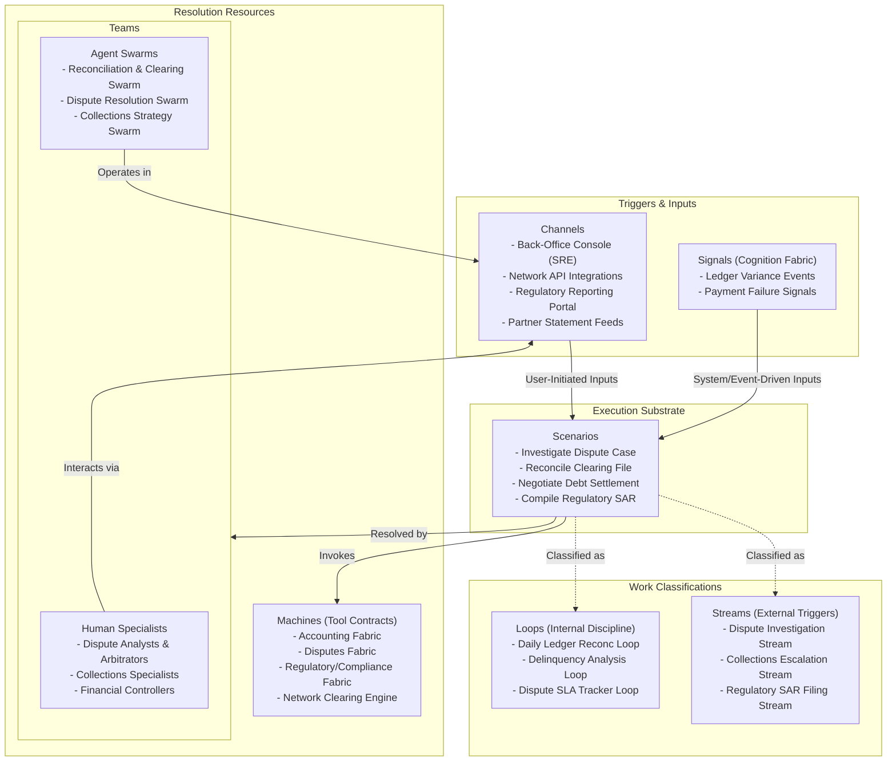

# Chapter 03.03.04: Operations Hub — Product Note

**The back-office exception, case management, and financial/network discipline engine of the bank, governing manual and complex investigations, disputes, collection cycles, and network reconciliation and clearing.**

---

## What It Governs

The **Operations Hub** is the ultimate guardian of operational and financial discipline. It governs the resolution of back-office anomalies, exceptions, and cases that cannot be automated at the edge. It acts as the case and queue manager for complex investigations (fraud disputes, credit collections, regulatory compliance) and controls the daily financial routines that ensure ledger and settlement integrity.

In scope:
- **Collaborative Case Management**: Orchestrating queues, tasks, and escalation workflows for complex, human-in-the-loop operational reviews.
- **Card Network Disputes & Arbitration**: Governing cardholder chargebacks, merchant representments, and network arbitration cycles.
- **Collections & Recoveries**: Managing delinquency cases, workout negotiations, and write-off processes.
- **Financial Reconciliation**: Matching internal subledgers with partner bank statements, network clearing houses, and physical vaults.
- **Clearing & Settlement Operations**: Coordinating end-of-day clearing files, ACH batching, and payment settlement networks.

Out of scope:
- **Direct Customer Servicing Interaction**: Handed off to the Relationship Hub (Operations posts status updates, but doesn't manage channels).
- **Core Ledger and Ledgering**: Handed off to the underlying ledger fabrics (Accounting, Demand Deposit).
- **Account Origination Decisions**: Handed off to the Distribution Hub.

---

## Source of Truth

- **Entities Owned**: Case Files, Investigation Records, Chargeback Cases, Reconciliation Runs, Settlement Batches, Delinquency Tracking Dossiers.
- **Key Invariants**:
  - No financial ledger adjustment can be posted without matching reconciliation evidence.
  - Dispute resolution processing times must comply with card network (Visa/Mastercard) and regulatory SLAs.
  - Collections actions must respect consumer protection hours and contact frequency limits.
- **Configurable vs. Compliance Floor**:
  - *Configurable*: Case queues, routing hierarchies, document checklists, reconciliation thresholds, and collection letters.
  - *Compliance Floor*: Reg E / Reg Z dispute resolution clocks, Fair Debt Collection Practices Act (FDCPA) contact rules, and anti-money laundering (SAR) reporting guidelines.

---

## Scope Highlights

- **Unified Case & Queue Console**: Consolidates exceptions from payments, credit, lending, and compliance into a single operational interface.
- **Automated Dispute Packager**: Compiles transaction traces, authorization logs, cardholder letters, and merchant responses into a standardized representment package for card networks.
- **Rule-Based Reconciliation Engine**: Automatically matches thousands of transactions against settlement files, flagging discrepancies down to the penny for manual operational review.
- **Ledger Adjustments via Accounting Fabric**: Posts double-entry balancing adjustments directly to subledgers via Accounting Fabric Tool Contracts upon successful case resolution.

---

## Work Model (Work Architecture)

The Operations Hub operates on an asynchronous Work Model structured around queues, strict timers, and exception-driven loops.

### Streams (External Triggers)
- **Dispute Investigation Stream**: Triggered by a customer disputing a transaction. Drives the dispute through merchant intake, network representment, arbitration, and final accounting adjustment.
- **Collections Escalation Stream**: Triggered when a loan or credit card account enters late-stage delinquency. Packages the account history and initiates active collection and workout options.
- **Regulatory SAR Filing Stream**: Triggered when fraud or compliance loops detect suspicious activity. Assembles transaction traces and submits a Suspicious Activity Report (SAR) to regulators.

### Loops (Internal Discipline)
- **Daily Ledger Reconc Loop**: Runs nightly. Reconciles transactions on core ledgers against actual network settlement and partner bank funding sheets, flagging variance.
- **Delinquency Analysis Loop**: Runs daily. Scans credit and lending ledgers to categorize accounts into aging delinquency buckets, updating risk provisioning.
- **Dispute SLA Tracker Loop**: Runs continuously. Monitors dispute streams to ensure visa/mastercard and Reg E SLA boundaries are never breached, auto-escalating aging cases.

---

## Teams and Agent Swarms

The Operations Hub coordinates specialized back-office experts with highly efficient, goal-directed Agent Swarms:

### Human Specialists
- **Dispute Analysts**: Oversee network arbitration and manual representment decisions.
- **Collections Specialists**: Manage complex workouts, corporate debt recoveries, and physical foreclosure actions.
- **Financial Controllers**: Supervise end-of-day balances, network settlement reconciliations, and regulatory reports.

### Native Agent Swarms
- **Reconciliation & Clearing Swarm**: Operates within the *Daily Ledger Reconc Loop*. Automatically extracts ledger files, processes bank statements, executes automated transaction matching, identifies unresolved variances, and generates investigation briefs.
- **Dispute Resolution Swarm**: Operates within the *Dispute Investigation Stream*. Gathers dispute logs via tool contracts, drafts chargeback or representment cases, submits them to card network APIs, and applies automated credit adjustments to cardholder ledgers.
- **Collections Strategy Swarm**: Operates within the *Delinquency Analysis Loop*. Analyzes delinquent customer behavioral data, groups debtors into risk categories, and selects optimal communication strategies (re-aging, fee waivers, debt consolidation).

---

## Boundaries and Adjacencies

| Adjacent Hub / Fabric | Consumed Interface / Relationship |
|:---|:---|
| **Accounting Fabric** | *Fabric Consumed*. Serves as the tool target for double-entry subledger postings and settlement reconciliation. |
| **Disputes Fabric** | *Fabric Consumed*. Governs the transactional schemas, network dispute rules, and dispute filing states. |
| **Regulatory/Compliance Fabric**| *Fabric Consumed*. Exposes compliance scorecard logic, AML patterns, and automated SAR filing gateways. |
| **Relationship Hub** | *Upstream Hub*. Escalates unresolved customer issues, chargeback requests, and delinquency statuses into Operations. |
| **Product Hub** | *Upstream Hub*. Provides subledger mappings and fee policies to align reconciliation. |
