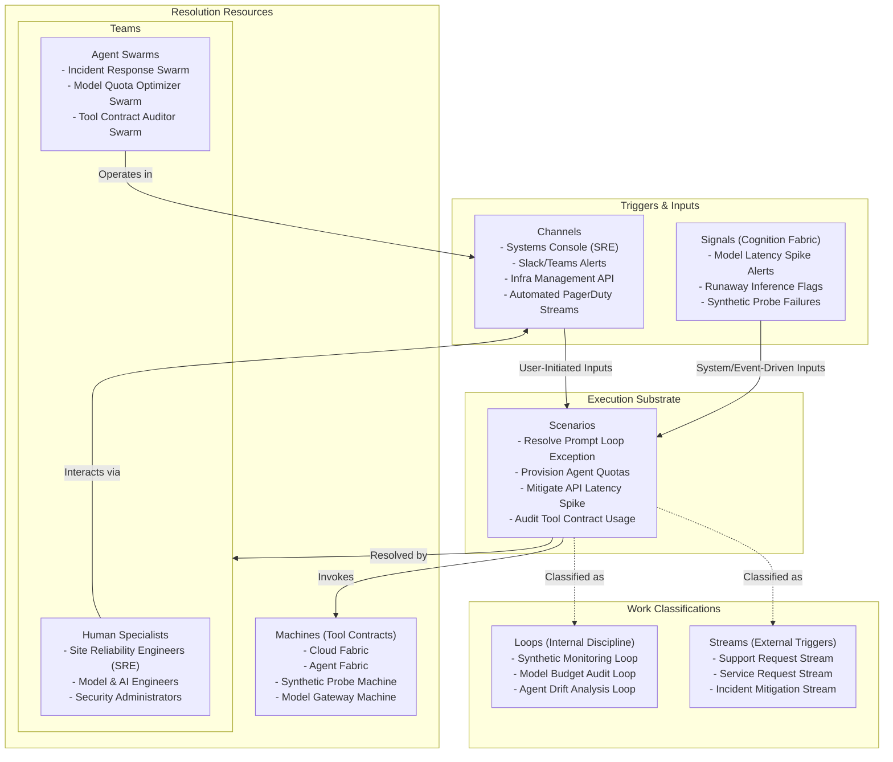

# Chapter 03.03.05: Systems Hub — Product Note

**The technical operations, health observability, change, incident, and problem management cockpit of the bank, managing active system and agent infrastructures and orchestrating Support and Service Requests.**

---

## What It Governs

The **Systems Hub** is the central command center for the digital enterprise. It governs the health, performance, security, and lifecycle of both technical systems and the AI workforce. It monitors infrastructure metrics, application service flows, synthetic probes, and AI agent performance metrics (token usage, model latency, prompt loop exceptions), orchestrating change and incident resolution across the bank's active environments.

In scope:
- **Technical Infrastructure Observability**: Monitoring system and application performance using Utilization, Saturation, and Errors (USE) signals.
- **AI Agent Performance Monitoring**: Tracking raw, trained, and employed agents and swarms, measuring model latency, cost budgets, and tool execution success.
- **Active Incident & Problem Management**: Managing technical alerts, prompt loops, and service degradations.
- **Support Requests (System-to-Ops Escalation)**: Automated compile and dispatch of diagnostic context on system or agent failure.
- **Service Requests (Ops-to-System Provisioning)**: Enabling human operators or swarms to dynamically request capacity, override configurations, or execute deployment changes.

Out of scope:
- **Business Operations Exception Routing**: Handed off to the Operations Hub (Systems Hub resolves technical failures, not business delinquencies or disputes).
- **Physical Asset Provisioning**: Managed by enterprise cloud hosting consoles.
- **Direct End-User App Delivery**: Handed off to the Relationship Hub.

---

## Source of Truth

- **Entities Owned**: Support Tickets, Service Change Requests, Tool Contract Audit Logs, Active Swarm Capacities, Model Quota Budgets, Component USE Signposts.
- **Key Invariants**:
  - No Agent Swarm can be deployed or granted Tool Contract access without compliance validation and active budget boundaries.
  - On system or agent failure, diagnostic dumps must contain complete prompt and execution traces without exposing sensitive customer PII.
  - Service change requests must pass cryptographic security and policy verification before deployment.
- **Configurable vs. Compliance Floor**:
  - *Configurable*: Threshold alerts, token budget caps, synthetic probe intervals, agent scaling rules, and workspace logging levels.
  - *Compliance Floor*: SOC2 security monitoring rules, model governance and ethical constraints, and financial audit logging rules.

---

## Scope Highlights

- **The Unified Digital Cockpit**: Surfaces real-time health indicators for core fabrics, client journeys, and active Agent Swarms in a single operational interface.
- **Automated Failure Capture**: Intercepts prompt loops, model timeout exceptions, or API latency breaches, compiling diagnostic details (including episodic memory and audit logs) into an unalterable incident ticket.
- **Dynamic Worker Scaling**: Adjusts agent swarms' capacities and changes model routing (e.g., fallback to a faster or cheaper model) based on transaction volumes and latency budgets.
- **MCP Tool Contract Auditing**: Monitors Tool Contracts (Model Context Protocol) to detect unauthorized tool usage, anomalous API call counts, or model hallucination vectors.

---

## Work Model (Work Architecture)

The Systems Hub operates on an active, write-back technical operations model that bridges technical infrastructure with the AI workforce.

### The Support and Service Request Action Model

The Systems Hub acts through two primary operational mechanisms to keep the enterprise bank healthy:

#### I. Support Requests (Active System-to-Ops Escalation)
When a core fabric degrades, or an active Agent Swarm encounters a terminal execution state (such as a fatal prompt loop, recursive tool failures, or critical cost budget depletion), the Systems Hub automatically triggers a **Support Request**:
1. **Context Compiling**: The Hub fetches real-time diagnostic context from underlying platforms. It pulls episodic memory, detailed prompt traces, and tool audit logs from the **Agent Fabric**, and pairs them with service flow metrics, environment states (Space/Zone/Enclave), and USE signals from the **Cloud Fabric**.
2. **Immutable Dossier Creation**: It packages this data into an immutable, cryptographically signed Support Ticket.
3. **Dispatch & Notification**: It dispatches the ticket directly to human SRE communication channels (such as Slack, Teams, or pager services) or escalates it to specialized automated Infra Swarms for immediate, self-healing mitigation.

#### II. Service Requests (Active Ops-to-System Provisioning)
A **Service Request** is the write-back mechanism enabling human operators or automated swarms to control and provision the system runtime:
1. **Dynamic Scaling**: Allows human SREs or authorized optimizer swarms to dynamically request model quota increases, adjust token budgets, or scale active Agent Swarm capacities to meet demand spikes.
2. **Configuration Overrides**: Enables the injection of safe configuration overrides, deployment of updated prompt structures, or immediate hot-swapping of underperforming LLM backends.
3. **Tool Contract Provisioning**: Manages the provisioning, rotation, and revocation of Model Context Protocol (MCP) credentials and Tool Contracts for the bank's digital workforce.

---

## Teams and Agent Swarms

The Systems Hub couples human Site Reliability Engineers (SREs) with specialized technical Agent Swarms:

### Human Specialists
- **Site Reliability Engineers (SREs)**: Oversee general environment health, cloud configurations, and high-severity incidents.
- **Model Engineers**: Track model drift, adjust agent training vectors, and manage model endpoints.
- **Security & IAM Administrators**: Manage access permissions, cryptographic keys, and tool trust profiles.

### Native Agent Swarms
- **Incident Response Swarm**: Operates within the *Synthetic Monitoring Loop*. Detects service-level agreement (SLA) breaches or component failures, initiates diagnostic scans, packages the failure traces, and acts as the first responder to execute automated failovers or restarts.
- **Model Quota Optimizer Swarm**: Operates within the *Model Budget Audit Loop*. Tracks token usage patterns and model costs across all active Hubs, dynamically adjusting quota allocations or routing traffic to cheaper backup models to ensure overall compliance with financial limits.
- **Tool Contract Auditor Swarm**: Operates within the *Agent Drift Analysis Loop*. Audits Model Context Protocol (MCP) calls made by Agent Swarms across the bank. It identifies anomalous tool calls, detects unexpected prompt hallucinations, and flags unauthorized access attempts.

---

## Boundaries and Adjacencies

| Adjacent Hub / Fabric | Consumed Interface / Relationship |
|:---|:---|
| **Cloud Fabric** | *Fabric Consumed*. Exposes infrastructure resources (Space, Zone, Enclave), microservices health, and system USE signals. |
| **Agent Fabric** | *Fabric Consumed*. Exposes AI Agent profiles, running swarm counts, episodic histories, prompt execution traces, and cost metrics. |
| **All Active Hubs** | *Supervised Targets*. The Systems Hub monitors, manages budgets, and processes Support/Service requests across all running Hub instances (Product, Distribution, Relationship, Operations). |
