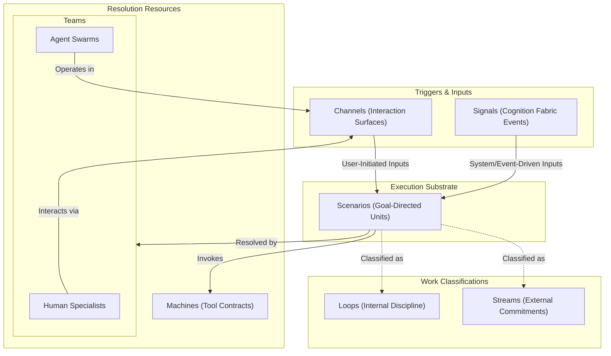
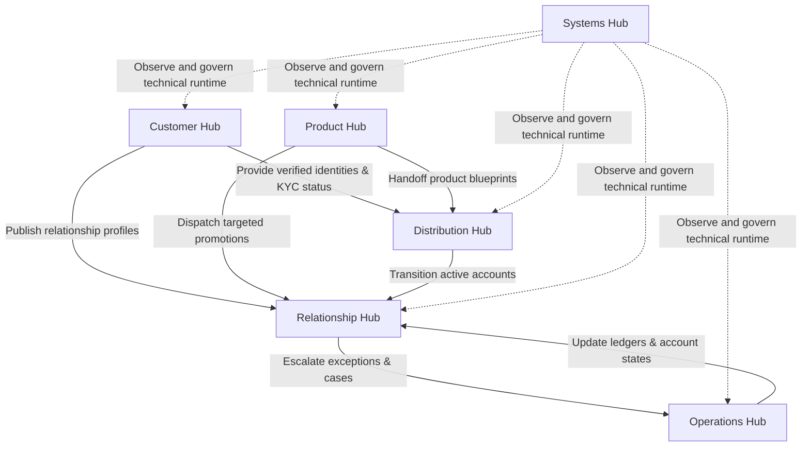

# Chapter 03.03: The Hubs of Enterprise Banking

The operational model is the final frontier of modern banking architecture. While legacy cores lock business logic inside rigid, point-to-point application topologies, and contemporary cloud platforms merely host these silos in virtual machines, the next-generation banking enterprise requires a declarative, model-driven architecture. 

This section introduces **The Hubs of Enterprise Banking**—the primary bounded business domains that compose the modern financial institution. Operating natively on **Evolution Fabric**, these Hubs organize the bank's people, intelligence, systems, and processes into a unified, model-driven taxonomy.

---

## 1. What is a Hub?

A **Hub** is an encapsulated, bounded business domain running on Evolution Fabric. Rather than a collection of microservices or database tables, a Hub is a complete operational unit defined not by its physical deployment, but by its declarative domain model.

Every Hub represents a cohesive business boundary (e.g., card acquiring, retail servicing, credit underwriting) and is governed by a unified taxonomy of commitments, policies, and collaborative resources. In the Hub Way, the bank is not a monolithic ledger; it is a collaborative network of autonomous, model-driven Hubs coordinating to deliver commercial value.

### Openness and Extensibility

Every Hub shipped in our product catalogs — whether a specialized **Quark Domain Hub** or a core **Neutrino Experience Hub** — is built on our core architectural principle of absolute extensibility. Rather than serving as vendor-locked software black boxes, **all Hubs are fully open and evolvable by the bank's own engineering teams natively running on the Foundry Fabric**. 

Using the Foundry Fabric's declarative definition workspace and Git-backed repository, a bank's developers can easily:
- **Add or Evolve Scenarios:** Author and customize active goal-directed execution units to match changing local regulations or business policies.
- **Register Custom Machines:** Connect their own existing core systems or third-party fabrics to the Hub by exposing them as standardized secure MCP Tool Contracts.
- **Configure New Channel Products:** Author and publish specialized, brand-aligned visual dashboards or conversational app intent templates.
- **Inject Custom Signals:** Stream new system-driven behavioral events from the Cognition Fabric to trigger automated Scenarios.
- **Deploy Specialized Agent Swarms:** Enroll their own fine-tuned or custom-configured LLM agents as collaborative members within the Hub's Teams primitive.

---

## 2. The Hub Composition Model

A Hub is structured through a declarative blueprint called the **Work Model** (also known as the **Work Architecture**). The Work Model establishes exactly how work is structured, executed, governed, and triggered inside the domain. 

Rather than executing through rigid, hardcoded procedures, every Hub's Work Model is composed of six core architectural primitives structured under the **Hub Way Ontology**:

### I. Channels (Interaction Surfaces)
**Channels** are the interaction surfaces through which humans and Agent Swarms interact with and participate in Scenarios. In the modern agentic enterprise, a Channel is no longer assumed to be a human-only screen (UI). Channels are highly asymmetric and fall into two primary interfacing paradigms:
- **Human-Optimized Channels**: Conventional visual and conversational surfaces (Web consoles, SRE workspaces, Mobile app views, Voice IVR).
- **Agent-Optimized Channels**: Protocols and interfaces designed for AI-to-System and AI-to-AI interaction. A user participating in a Hub Scenario may be represented by a **Delegated Agent** who acts on their behalf. This manifests in two ways:
  1. **Bank-Provided Agent Channel Products**: Fully conversational, proactive, or voice-native agent interfaces shipped by the bank (such as a secure WhatsApp co-pilot or a wealth-advisory conversational channel) that serve as the primary relationship interface.
  2. **Bring-Your-Own-Agent (BYOA)**: The customer or merchant delegates their banking operations to an external, sovereign agent (e.g., Apple Intelligence/Siri, ChatGPT, Gemini, or a corporate treasury LLM). Rather than leaving this unmanaged, the bank projects its capabilities into these platforms by shipping **Plugins, Connectors, and App Intents**. These plugins are first-class, bank-provided **Channel Products** enabled by the Engagement Fabric. They adapt the bank’s underlying secure API and Model Context Protocol (MCP) Channels to the native, evolving tool-calling schemas of popular customer agents, allowing the customer's agent to securely transact with the bank under delegated authority. The mechanism and interfaces of these plugins evolve as platform capabilities and standardization models (like MCP) mature.

### II. Signals (Cognitive Perception)
**Signals** represent continuous, system-level events and interpretations streamed from the **Cognition Fabric** (e.g., "Account Balance Breached", "Dispute Lifecycle Initiated"). They represent system-driven triggers that perceive state changes across the enterprise and inject them directly into the Hub to trigger Scenarios pre-emptively.

### III. Scenarios (The Execution Substrate)
Both user-driven inputs from Channels and system-driven events from Signals activate **Scenarios**—the fundamental unit of execution in a Hub. A Scenario is a goal-oriented model of what needs to be accomplished rather than a rigid, hardcoded workflow. Scenarios coordinate resolving resources (Teams and Machines) dynamically based on the current situation context.

### IV. Streams & Loops (Work Classifications)
Every Scenario execution is classified into one of two business categories based on its trigger origin and operational concern:
- A **Stream** represents a Scenario triggered by an external request, executing against an explicit, episodic commitment to the outside world (e.g., a customer loan application).
- A **Loop** represents a schedule-triggered or pattern-triggered Scenario of internal, feedback-driven discipline (e.g., a daily reconciliation cycle or risk-limit review) that maintains the integrity of the Hub.

### V. Teams (Human-Agent Collaboration)
Scenarios are resolved by **Teams**—the fundamental collaborative workforce unit of the Hub. Teams are not built of isolated micro-agents; they are composed of human domain specialists collaborating alongside highly specialized, goal-directed **Agent Swarms**. Agent Swarms are shipped pre-configured with the Hub, operate natively inside the Hub's Channels, and hold defined, authorized delegation boundaries.

### VI. Machines (System Capabilities)
**Machines** represent physical or logical core systems (such as general ledgers, card processors, or gateways) that expose their capabilities as **Tool Contracts** (using standard protocols like the Model Context Protocol, or MCP). Scenarios invoke these Tool Contracts to execute commands, retrieve balances, or update entity states. Because Scenarios interact only with stable Tool Contracts rather than vendor APIs, underlying core engines can be swapped without disrupting the Hub's Work Model.

---

## 3. The 6 Hub Classes

Enterprise banking operations are classified into six fundamental Hub Classes. Every business domain in the financial institution can be modeled as an instance of one of these classes:

| Hub Class | Core Focus | Primary Fabrics Consumed | Native Agent Swarms |
|:---|:---|:---|:---|
| **Customer Hub** | Party governance and lifecycle; manages customer onboarding checklists, identity verification transitions, and KYC refresh loops. | Customer Record Fabric | - KYC Progression Swarm - Profile Verification Swarm - Customer Onboarding Audit Swarm |
| **Product Hub** | The commercial brain; blueprints financial instruments, bundles, and campaigns, handing them off to Distribution and Relationship. | Product Fabric, Influence Fabric | - Pricing Elasticity Swarm - Campaign Optimizer Swarm - Fee & Benefit Modeling Swarm |
| **Distribution Hub** | Sourcing and acquisition gatekeeper; manages lead ingestion, application capture, assessment, underwriting, decisioning, and card/account issuance. | Sourcing Fabric, Credit Bureau Fabric, Underwriting Fabric, Card Issuance Fabric | - Underwriting Decisioning Swarm - Fraud & Identity Verification Swarm - Lead Enrichment Swarm |
| **Relationship Hub** | Active customer engagement and servicing; handles self-serve account operations and contextually executes Product Hub promotions. | Customer Record Fabric, Demand/Term Deposit Fabrics, Card Issuance Fabric, Engagement Fabric | - Servicing Resolution Swarm - Campaign Personalization Swarm - Customer Health & Retention Swarm |
| **Operations Hub** | Back-office exception and financial/network discipline engine; governs case management (Disputes, Collections, Compliance) and clearing routines. | Accounting Fabric, Disputes Fabric, Regulatory/Compliance Fabric | - Reconciliation & Clearing Swarm - Dispute Resolution Swarm - Collections Strategy Swarm |
| **Systems Hub** | Technical operations cockpit; monitors active services, component USE signals, and model budgets, orchestrating Support and Service Requests. | Cloud Fabric, Agent Fabric | - Incident Response Swarm - Model Quota Optimizer Swarm - Tool Contract Auditor Swarm |

---

## 4. The Inter-Hub Lifecycle

Commitments, data, and commercial influence do not live in isolation; they propagate dynamically through the inter-hub lifecycle. The following model-driven flows govern how the six Hub classes interact:

1. **Identity & KYC Propagation (Customer to Distribution & Relationship)**: The Customer Hub manages party profiles, KYC status, and household graphs. It feeds verified identity and compliance metadata to the Distribution Hub to gate onboarding eligibility, and publishes real-time profile updates and servicing preferences to the Relationship Hub.
2. **Handoff (Product to Distribution)**: The Product Hub compiles and publishes commercial blueprints (interest rates, fees, underwriting guidelines, eligibility rules). It hands these blueprints off to the Distribution Hub to govern acquisition pipelines.
3. **Dispatch (Product to Relationship)**: The Product Hub dispatches campaign rules, rewards parameters, and dynamic discounts to the Relationship Hub, enabling cross-channel, context-aware customer rewards.
4. **Transition (Distribution to Relationship)**: The Distribution Hub runs the acquisition pipeline. Once an application crosses the underwriting decision gate and is approved, the Distribution Hub provisions the accounts/cards, executes initial funding, and transitions the active relationship to the Relationship Hub for ongoing servicing.
5. **Escalation (Relationship to Operations)**: When active servicing encounters exceptions that cannot be automated (e.g., a customer disputes a transaction, a payments clearing cycle fails, or a loan enters delinquency), the Relationship Hub escalates the state as an immutable Case to the Operations Hub.
6. **Reconciliation (Operations to Relationship)**: The Operations Hub resolves disputes, compliance investigations, and collection actions. It posts adjusting entries to core ledgers via the Accounting Fabric, which automatically synchronizes and updates the account states displayed inside the Relationship Hub.
7. **Observability & Orchestration (Systems Hub to All)**: The Systems Hub sits over the top of the entire lifecycle. It acts as the command center for the digital workforce and underlying cloud resources—monitoring system health, managing model access budgets, and executing Support and Service Requests to adjust agent capacities or resolve failures across all active Hubs.
