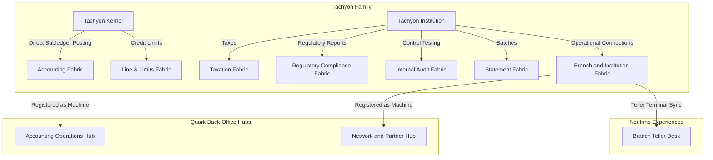

# Chapter 03.04.01: Tachyon — Account Products

**Product lines for core account infrastructure, liability/asset ledgers, customer lifecycle management, and institutional governance — providing the absolute compliance floor and financial ledger integrity for the bank.**

---

## Product Family

Tachyon is Zeta's account products family. It provides the core account infrastructure, ledger mechanics, and institutional operating baseline that banks need to originate, manage, and audit financial accounts and institutional relationships across segments.

### Product Lines

| Product Line | Domain | Description | Production Status |
|---|---|---|---|
| **Tachyon Kernel** | Core account ledger & limits | Shared account ledger, limit management, subledger controls (**Accounting Fabric**), and product configuration engine underlying all Tachyon product lines. | In production (powers all Tachyon deployments) |
| **Tachyon Institution** | Institutional operational foundation | Bank-wide financial reporting, regulatory compliance, internal audit, taxation, statement rendering, physical branches, and partner networks. | Active design / Rollout |
| **Tachyon DDA** | Demand deposit accounts | Demand deposit account origination, lifecycle, and servicing — supporting purpose-specific account programs (health benefits, loyalty and rewards). | In production — multiple US programs including health benefits (Optum) and loyalty/rewards programs |
| **Tachyon Credit Cards** | Credit card accounts | Credit card account origination, lifecycle management, billing, statement generation, and card-level controls. | In production — three credit card programs in the USA |
| **Tachyon CLM** | Customer lifecycle management | Customer onboarding profiles, risk grading, periodic KYC reviews, and customer status transitions. | In production / Early adoption |
| **Tachyon Loans** | Lending products | Personal, auto, mortgage, and installment loans with flexible amortization schedules and workout paths. | Early adoption |

### Production Footprint

Tachyon is in production in the United States across two product lines:

- **Tachyon Credit Cards** powers three credit card programs in the USA. All three programs use Photon for payment rail processing (authorization, clearing, settlement).
- **Tachyon DDA** powers multiple demand deposit account programs in the USA, including health benefits accounts (Optum) and loyalty/rewards programs. All programs use Photon for payment processing.

Tachyon Credit Cards and Tachyon DDA represent Zeta's core account platform in production at scale in the US market. Tachyon CLM and Tachyon Loans are active expansion areas, while Tachyon Institution delivers the consolidated corporate and legal compliance layer.

---

## Orchestrated Banking Fabrics

Tachyon orchestrates and implements **fourteen core banking fabrics** to guarantee absolute transactional, financial, and legal safety:

### I. Tachyon Kernel (Foundational Ledgers)
- **Accounting Fabric (01):** Directly integrated into Tachyon Kernel to serve as the master general ledger, managing subledgers, charts of accounts, and posting rules.
- **Line and Limits Fabric (04):** Governs aggregate exposure, authorized limits, and credit availability checks.
- **Demand Deposit Fabric (05):** Runs checking, savings, and transaction-account accounting structures.
- **Term Deposit Fabric (06):** Governs fixed-term certificates, maturity schedules, and penalty logic.
- **Revolving Credit Fabric (07):** Governs interest accrual, grace periods, billing cycles, and fee calculations.
- **Term Loans Fabric (08):** Executes amortizing loan calculations, installment scheduling, and interest calculations.
- **Mortgage Fabric (09):** Runs long-term property-backed lending, escrow management, and collateral records.
- **Underwriting Fabric (10):** Houses scoring matrices, eligibility policies, and credit decision runs.
- **Collections Fabric (11):** Governs delinquency lifecycles, payment promises, and workout accounts.

### II. Tachyon Institution (Corporate Operating Engine)
- **Regulatory Compliance Fabric (31):** Aggregates and files Call Reports, HMDA, CRA, and other supervisor submissions.
- **Internal Audit Fabric (32):** Logs tamper-evident audit trails, access reviews, policy violations, and controls evidence.
- **Statement Fabric (29):** Runs high-volume cycle-based statement batch rendering, multi-product consolidation, and archiving.
- **Taxation Fabric (30):** Handles customer backup withholding, 1099/1098 generation, and direct IRS reporting.
- **Branch and Institution Fabric (33):** Governs physical teller terminals, cash drawer vault levels, and the bank's direct connections to **Payment Networks** (Visa/MC) and **Clearing Houses** (ACH, wire, central banks).

---

## Operational Topology

---

## Relationship to Infrastructure Fabrics

| Infra Fabric | How Tachyon Uses It |
|---|---|
| **Evolution Fabric** | Tachyon product lines register as Machines in domain Hubs — declaring their capabilities as Tools (commands, predictions, decisions) that Scenarios invoke. Account operations modeled as Streams and Loops within Evolution Fabric's domain model. |
| **Trust Fabric** | Secures customer identities, authorization permissions, credential validation, and encryption-at-rest keys for account records. |
| **Truth Fabric** | Establishes the authoritative semantic definitions for account balances, limits, transaction statuses, and posting schemas to maintain absolute reconciliation consistency. |
| **Cognitive Audit Fabric** | Tracks and certifies every automated ledger adjustment, credit approval, limit increase, and risk grade change. |
| **Cloud Fabric** | Orchestrates compute nodes, database clusters, transaction replication pipelines, and high-availability targets for Tachyon ledger databases. |

---

## Relationship to Other Product Families

| Family | Relationship |
|---|---|
| **Photon** | Tachyon accounts and subledgers are the destination endpoints for Photon payment transactions. Photon routes payment events, and Tachyon applies authorizations, holds, and final postings. |
| **Electron** | Electron commercial cards utilize Tachyon Kernel's lines, limits, and multi-tier subledger configurations to enforce corporate spending structures. |
| **Neutrino** | Neutrino provides the visual and conversational channels (mobile apps, web, conversational copilots) that interact with Tachyon accounts and branch teller networks. |
| **Quark** | Quark back-office hubs ingest Tachyon capabilities as Tools — invoking ledger, compliance, and statement generation capabilities within pre-modeled back-office Streams and Loops. |

---

## References

- [Accounting Fabric](01-accounting-fabric.md) — The financial ledger bedrock.
- [Branch and Institution Fabric](33-branch-and-institution-fabric.md) — Connects physical and partner networks.
- [Regulatory Compliance Fabric](31-regulatory-compliance-fabric.md) — Mandated supervisor filing.
- [Internal Audit Fabric](32-internal-audit-fabric.md) — Three lines of defense compliance.
