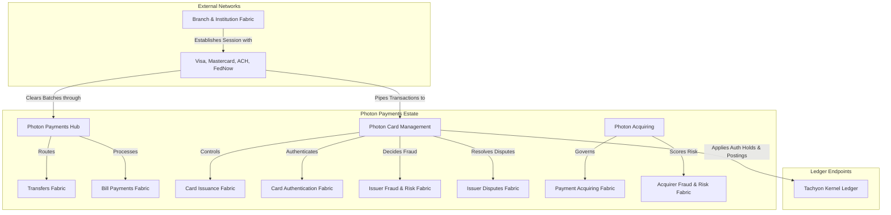

# Chapter 03.04.02: Photon — Payments and Money Movement

**Product lines for payment processing, orchestration, acquiring, and money movement — covering payment rails, card management, merchant acquiring, tokenization, and private-labeled payment networks.**

---

## Product Family

Photon is Zeta's payments and money movement family. It provides the full modern payment infrastructure for processing, routing, acquiring, and settling payments across networks — from real-time domestic rails and international card schemes to merchant acquiring and private closed-loop payment networks.

### Product Lines

| Product Line | Domain | Description |
|---|---|---|
| **Photon Payments Hub** | Payment orchestration | Real-time and batch orchestration across domestic and cross-border rails — UPI, ACH, FedWire, SWIFT, and real-time networks (FedNow). |
| **Photon Card Management** | Issuer card lifecycle | Consumer physical and virtual card manufacturing, activation, replacement, PIN management, and block/unblock controls. |
| **Photon Tokenization** | Network credential security | Apple Pay/Google Pay provisioning, network-level de-tokenization, and card-on-file (COF) secure vaulting. |
| **Photon Acquiring** | Merchant gateway & ledger | POS terminal provisioning, QR code acquiring, checkout payment gateways, merchant settlement accounts, and chargeback representment. |
| **Photon Payment Network** | Private closed-loop networks | Private-labeled clearing, proprietary message routing, settlement engines, and dispute resolution for closed-loop merchant programs. |
| **Photon Payment Aggregator** | Sub-merchant facilitation | Multi-tenant sub-merchant onboarding, payment aggregation, split payouts, and aggregator-level settlement workflows. |

---

## Orchestrated Banking Fabrics

Photon orchestrates and implements **fifteen core banking fabrics** to process, protect, and settle payment flows:

### I. Issuer-Side Card & Transaction Processing
- **Card Issuance Fabric (12):** Drives card manufacturing, personalized printing, instant virtual issuance, and cardholder-driven controls.
- **Issuer Tokenization Fabric (14):** Orchestrates token requestor verification and network-token lifecycle states on the issuer side.
- **Card Issuer Txn Processing Fabric (17):** Processes incoming ISO 8583 message streams, ledger authorization holds, network clearing, and interchange settlement.
- **UPI Issuer Txn Processing Fabric (18):** Manages real-time mobile UPI transactions, cryptographic key checks, and scheme messaging.
- **Card Authentication Fabric (19):** Executes issuer-side 3D Secure (3DS) authentication challenges and Strong Customer Authentication (SCA) evaluations.
- **Issuer Disputes Fabric (20):** Manages cardholder chargeback submissions, dispute lifecycles, and network arbitration cases.
- **Issuer Fraud and Risk Fabric (21):** Evaluates real-time card transaction authorize streams for instant fraud block decisioning.

### II. Merchant-Side Acquiring & Acceptance
- **Payment Acquiring Fabric (22):** Owns merchant accounts, fee processing, POS/gateway acceptance, and settlement.
- **Card PSP Fabric (23):** Governs payment service provider integration, routing card acceptance flows to respective card schemes.
- **UPI PSP Fabric (24):** Governs UPI merchant directories, deep linking, dynamic QR generation, and real-time callbacks.
- **Acquirer Tokenization Fabric (25):** Drives merchant-side secure vaulting, recurring transaction token swaps, and card credential updates.
- **Acquirer Disputes Fabric (26):** Resolves incoming acquirer disputes and coordinates chargeback response (representment) evidence compilation.
- **Acquirer Fraud and Risk Fabric (27):** Scores acquiring transaction velocity, merchant risk parameters, and checkout fraud markers.

### III. Account-to-Account Rail Orchestration
- **Transfers Fabric (15):** Drives domestic batch transfers (ACH, wire, RTGS) and instant account-to-account rails.
- **Bill Payments Fabric (16):** Integrates with utility/payment presentment networks to execute scheduled or ad-hoc bill pays.

---

## Operational Topology

---

## Relationship to Infrastructure Fabrics

| Infra Fabric | How Photon Uses It |
|---|---|
| **Evolution Fabric** | Photon product lines register as Machines in payment domain Hubs. Real-time transaction flows are modeled as high-throughput Streams, while end-of-day clearing, card fees, and settlement runs are driven by Evolution Loops. |
| **Trust Fabric** | Secures merchant credentials, cardholder PCI data, network authentication keys, and transaction message signatures. |
| **Truth Fabric** | Standardizes payment schemas, merchant categories, currency exchange rates, and transaction state semantics to maintain perfect inter-system reconciliation. |
| **Cognitive Audit Fabric** | Logs and validates routing choices, exception overrides, fraud block overrides, and dispute resolutions. |
| **Cloud Fabric** | Provides low-latency, active-active database and network routing replication to ensure 99.999% uptime for transaction authorizations. |

---

## Relationship to Other Product Families

| Family | Relationship |
|---|---|
| **Tachyon** | Photon transactions debit or credit Tachyon consumer or business accounts. The Tachyon account ledger is the final destination and system of record for all money movement settled by Photon. |
| **Electron** | Electron commercial card authorizations run through Photon's transaction processing and tokenization fabrics to enforce spend limits and policies. |
| **Neutrino** | Neutrino provides payment initiation surfaces (e.g., instant peer-to-peer transfers, digital wallet provisioning) and visual feedback channels. |
| **Quark** | Quark back-office operations hubs (Disputes Operations, Compliance Operations) consume Photon as a Machine to trigger chargeback actions or run compliance checks. |

---

## References

- [Tachyon Product Family](01-tachyon.md) — The ledger endpoints.
- [Transfers Fabric](15-transfers-fabric.md) — Account-to-account payment processing.
- [Card Issuer Txn Processing Fabric](17-card-issuer-txn-processing-fabric.md) — Issuer clearing and settlement.
- [Payment Acquiring Fabric](22-payment-acquiring-fabric.md) — Merchant acceptance ledger.
