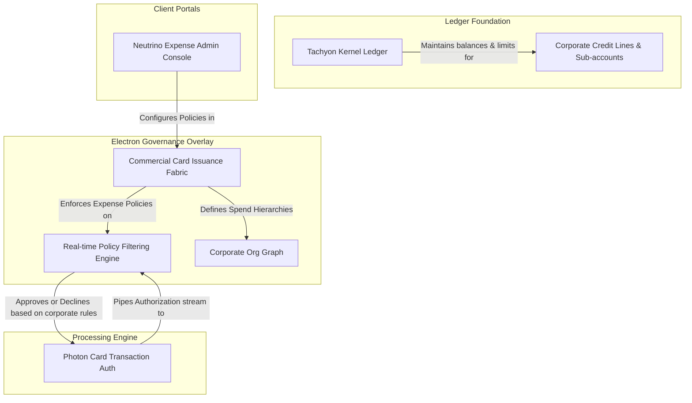

# Chapter 03.04.03: Electron — Commercial Cards and Payment Products

**Product lines for commercial, corporate, and small-business card programs — covering benefits cards, corporate expense management, purchasing cards (P-Cards), and complex corporate spending hierarchies.**

---

## Product Family

Electron is Zeta's commercial cards and corporate payment products family. It provides the infrastructure for corporate card programs, fleet/purchasing card programs, and benefits allocation. 

Rather than duplicating core ledger or payment rail code, Electron functions as a **commercial governance overlay**. It sits on top of **Tachyon Kernel** (for balance tracking, limits, and accounts) and **Photon** (for card transaction processing and network authorization), extending them with corporate hierarchical permissioning, expense policies, and employee spending controls.

### Product Lines

| Product Line | Domain | Description |
|---|---|---|
| **Electron Benefits** | Employee benefit programs | Flexible healthcare benefit cards (HSA/FSA), lifestyle allowances, transit/parking programs, and cafeteria benefit allowances. |
| **Electron Expense Cards** | Corporate spend management | Corporate cards for travel & entertainment (T&E) and daily operational expenses, combined with real-time employee receipt uploading and policy matching. |
| **Electron Purchase Cards** | B2B purchasing & P-Cards | Large-volume commercial purchase card (P-Card) and corporate virtual card programs with invoice matching and strict merchant category limitations. |

---

## Orchestrated Banking Fabrics

Electron orchestrates and is natively defined by **one core commercial banking fabric**, while calling upon underlying Tachyon and Photon fabrics to fulfill complete account and payment lifecycles:

- **Commercial Card Issuance Fabric (13):** Governs corporate-specific card configurations, fleet/purchasing metadata tables, tax/accounting-code assignments, corporate spend policies, and hierarchical employee spend permissions.

### Core Underlying Engine Leverage
To execute complete financial transactions, Electron leverages:
- **Tachyon Kernel (Accounting, Line & Limits, Customer Record):** To ledger the corporate balance sheet, credit lines, employee subledgers, and organizational customer hierarchies.
- **Photon (Card Issuance, Card Issuer Txn Processing):** To manufacture/provision cards, process ISO 8583 authorization messages, and handle network clearing and settlement.

---

## Operational Topology

---

## Relationship to Infrastructure Fabrics

| Infra Fabric | How Electron Uses It |
|---|---|
| **Evolution Fabric** | Electron product lines register as Machines in commercial card domain Hubs. Policy exceptions are processed as high-priority Streams, and corporate billing cycles and credit sweeps are driven by weekly/monthly Loops. |
| **Trust Fabric** | Secures corporate hierarchies, manages programmatic consent, and implements role-based access control (RBAC) for company administrators, finance teams, and cardholders. |
| **Truth Fabric** | Enforces consistent financial definitions across company hierarchies — matching employee expense codes, tax categories, and merchant ID metadata. |
| **Cognitive Audit Fabric** | Logs and certifies all administrative changes to employee limits, corporate policy overrides, and program fee calculations. |
| **Cloud Fabric** | Scales policy-matching memory caches dynamically to support multi-tenant corporate accounts during peak travel and retail hours. |

---

## Relationship to Other Product Families

| Family | Relationship |
|---|---|
| **Tachyon** | Electron is built on top of Tachyon account infrastructure. All corporate master accounts and employee spending limit sub-ledgers are maintained in Tachyon. |
| **Photon** | Electron card transactions flow through Photon's authorization, clearing, and settlement engines. Photon queries Electron's policy engine before authorizing. |
| **Neutrino** | Neutrino provides cardholder and corporate administrator experiences — including mobile expense apps, travel booking integrations, and administrator policy dashboards. |
| **Quark** | Quark commercial back-office hubs (Product Hub, Operations Hub) consume Electron's capabilities as programmatic Tools to configure corporate programs or manage exceptions. |

---

## References

- [Tachyon Product Family](01-tachyon.md) — The ledger and limit foundation.
- [Photon Product Family](02-photon.md) — Card transaction and tokenization engines.
- [Commercial Card Issuance Fabric](13-commercial-card-issuance-fabric.md) — The core commercial spending governance rules.
