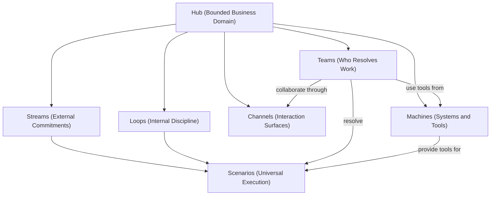

# The Hub Way

The Hub Way is a framework for modeling work in enterprise banking domains. It provides six core concepts that together describe how a bank organizes, classifies, executes, and interacts with work in its business domains.

---

## The Core Concepts

### Hub — The System

A **Hub** is a bounded business domain. It is the system within which all operational work is organized.

A Hub is not a replacement for existing systems. It is an operations and collaboration fabric that sits on top of existing systems — bringing them together, enabling banks to address business scenarios through coordinated human and AI collaboration. Hubs integrate Zeta product lines natively and work equally well with third-party systems.

In Olympus Hub, a Hub maps to a **Workbench** — the platform's unit of domain encapsulation.

### Stream — External Commitments

A **Stream** represents work performed against an explicit external commitment. When a customer applies for a credit card, a partner submits a payment, or a regulator requests a filing, the Hub has made a commitment to the outside world. The coordinated work required to fulfill that commitment is a Stream.

Streams are:
- **Commitment-driven**: anchored by an explicit request from outside the Hub boundary
- **Episodic**: they begin, progress through coordinated Scenarios, and resolve
- **Cross-domain capable**: a Stream may span multiple Hubs when the commitment requires coordination across business domains

A Stream is a coordinated collection of Scenarios — not a sequence. The path through a Stream is not fully predetermined; Scenarios may fire conditionally, run in parallel, or repeat. This aligns with Case model thinking: the goal is resolution of a commitment, not completion of a predetermined sequence.

**Stream terminology:**
- **Stream Specification** — the prescriptive, design-time definition of a type of commitment
- **Stream** (instance) — the operative, runtime instance of a commitment being fulfilled
- **Stream Trace** — the observable, post-facto record of how the commitment was fulfilled

### Loop — Internal Discipline

A **Loop** represents all work within a Hub that is asynchronous to external commitments. Loops are the Hub's internal discipline — the rituals and routines that keep the domain healthy, honest, and improving.

Loops encompass a broad range of work:
- **Analytical**: funnel analysis, usage analysis, segmentation, trend detection — seeks to understand patterns
- **Observational**: SLA monitoring, threshold alerting, anomaly detection, operational health — watches metrics against expectations
- **Computational**: interest computation, fee calculation, account status assessment, period-close processing
- **Integrity**: reconciliation, data quality checks, cross-system validation
- **Compliance**: policy adherence verification, regulatory checks, audit preparation
- **Preparatory**: feature engineering, ML pipelines, risk scoring
- **Housekeeping**: system maintenance, batch processing, scheduled jobs

Loops are discipline-driven and may be triggered periodically, continuously, by internal events, or by administrative action. They are not exclusively event-triggered, but they may be event-triggered — these are not mutually exclusive.

Loops execute as Scenarios, just like Streams. Some Loops are fully automated processes; others involve agents (human or AI). The Loop is a modeling construct — it does not prescribe the execution model.

### Channel — Collaboration Surfaces

A **Channel** is the collaboration and interaction surface through which humans and agents participate in a Hub's Scenarios. A Channel is not a UI. It is a comprehensive system that embodies identity, authentication, access control, and the interaction model nuances appropriate to its collaborators. A Channel is built from composable, paradigm-specific components — the same capability takes a native form in each Channel type (cards on a desk, bot messages in Teams, webhooks on REST, tool listings on MCP). Because Channels are composed from components, they can be recomposed for different contexts.

Channel types include:
- Web applications (desks, consoles) — persona-specific, task-oriented
- Chat and collaboration platforms (MS Teams) — conversational, embedded in work contexts
- Voice and telephony — quasi-digital, real-time, human-centric
- API channels (REST) — system-to-system, programmatic
- AI agent channels (MCP) — AI-native interaction via Model Context Protocol
- CLI — developer-oriented

Channels are a **Hub-level** concept: each Hub configures which Channels are available for its Scenarios. A Payments Hub may expose REST APIs for system integration and an Agent Desk for operations. A Customer Servicing Hub may expose web portals, voice/telephony, chat, and AI agent channels. Channel selection is a domain modeling decision.

**Channel vs Channel Product**: A Channel is Hub-scoped — it represents one Hub's view of collaboration for a domain-scoped persona (customer-as-payer, agent-as-dispute-investigator). A **Channel Product** is Organization-scoped — it recomposes components from multiple Hubs into a cohesive experience for an organization-scoped persona (customer-as-banking-relationship-holder, agent-as-unified-operations-staff). A customer's mobile banking app is a Channel Product, not a single Hub's Channel. Channel Products are delivered through the Neutrino suite.

### Team — The Collaborators

A **Team** is the combination of human and AI agents enrolled in a Hub to resolve its Scenarios. Teams are integral constituents of a Hub — the "who" behind every piece of work.

A dispute investigation Team might include human analysts, an AI research assistant, and a supervisor. A nightly interest computation might have no human team at all — the application that runs it is itself an agent. Teams align with AOSM's Human-AI Team (HAT) concept: shared context, task interoperability, seamless handoff, human oversight.

Teams are Hub-scoped — agents are enrolled per Workbench. The composition of the Team determines where each Scenario sits on the resolution spectrum, from fully human to fully automated. The model does not change when the team composition changes; only who resolves the work changes.

### Machine — The Systems and Tools

A **Machine** is a deployed system that provides capabilities (Tools) to the Hub. Core banking systems, payment switches, fraud engines, ML services, credit bureaus — all are Machines. What matters for modeling is the Tools they provide:

- **Prediction Applications** (Observe/Predict): fraud risk scores, propensity models, credit assessments
- **Decision Applications** (Decide): credit policy engines, AML rule sets, limit management
- **Commands / Actuators** (Act): `lockAccount`, `authorizePayment`, `issueCard`, `postTransaction`

A **Hub Application** orchestrates how Scenarios are resolved — invoking Tools from Machines, coordinating Team activities, managing state. When the runtime is Seer, the Application IS an AI Agent, simultaneously orchestrating and participating.

The Hub does not care which system provides a Tool. Zeta product lines (Tachyon, Neutrino, Electron) and third-party systems are equally valid Machines. Replacing a Machine does not change Streams, Loops, Teams, or Channels. The Tool contract is the stable interface.

---

## The Defining Boundary

The classification of work into Streams and Loops rests on one rule:

- **External trigger** (crosses the Hub boundary inward) → **Stream**
- **Internal trigger** (originates within the Hub) → **Loop**

Every piece of work in a Hub is either a Stream or a Loop. This is a complete partition. There is no third category.

---

## The Universal Execution Model

Both Streams and Loops execute through **Scenarios** — the atomic unit of all work in a Hub. A Scenario is a goal-oriented definition of what needs to be achieved, not a step-by-step procedure. Agents (human and AI) collaborate to resolve Scenarios through Channels.

The Hub platform provides one execution infrastructure for all work. There is no separate engine for Streams vs Loops. The classification is a modeling concern; the execution is unified.

While everything is a Scenario, not all Scenarios are alike. The Olympus Hub ontology provides **Work Patterns** (Queue-Based, Case-Based, Event-Driven, Conversation-Based, Artifact-Centric, Review-Based, Generative) and **Resolution Models** (Pure Automation through Pure Human Collaboration) for differentiating how Scenarios execute. Modelers should select these consciously based on the nature of the work.

---

## The Feedback System

Streams and Loops form a feedback system:

1. **Streams generate data.** Every Stream instance produces a trace — outcomes, decisions, timelines, exceptions.
2. **Loops consume Stream data.** Analytical, compliance, and integrity Loops process this data to detect patterns, verify adherence, and generate intelligence.
3. **Loops may trigger new Streams.** When internal discipline reveals something requiring an external commitment (fraud detected → customer notification), the Loop triggers a new Stream.

The Hub improves because it operates. Streams produce the raw material that Loops learn from, and Loops produce the intelligence that makes future Streams better.

---

## Scope

The Hub Way is a **framework for modeling work in business domains**. It covers:
- How work is classified (Streams vs Loops)
- How work is executed (Scenarios)
- How collaborators participate (Channels)
- How collaborators are structured (Teams)
- What systems and tools are available (Machines)
- How domains are bounded (Hubs)

It does **not** address data architecture, product architecture, commercial architecture, integration governance, or temporal architecture. These are complementary concerns.

## Relationship to DDD and AOSM

The Hub Way extends two established frameworks without contradicting either:

- **Domain-Driven Design (DDD)**: Hub = Bounded Context. The Hub Way inherits DDD's bounded context practice for domain boundaries and adds work classification (Stream/Loop) within each context.
- **Agent-Oriented Systems Modeling (AOSM)**: Scenario = AOSM's goal-oriented execution model. The Hub Way adds a work classification dimension (why does this work exist?) that the four-layer ontology doesn't explicitly address.

**AOSM Concept Mapping:**

| AOSM Concept | The Hub Way Concept |
|---|---|
| Bounded Context | Hub |
| Scenario | Scenario |
| Channel | Channel |
| Human-AI Team (HAT) | Team |
| Machine / Tool / Command | Machine / Tool |

**What The Hub Way Adds:**

| Concern | DDD / AOSM | The Hub Way |
|---|---|---|
| Work classification | Not addressed | Stream / Loop — explicit |
| Collaborator structuring | Not a modeling concern | Team — explicit |
| Tool availability | Implicit (Machine/Tool) | Machine — domain-level decision |

---

## Zeta's Hubs of Prominence

Domains where Zeta represents deep expertise, each modeled as a Hub with Streams, Loops, Channels, Teams, and Machines:

- Payments (various rails and instruments)
- Credit Card
- Customer Lifecycle Management (offers, rewards, cross-sell, up-sell)
- Customer Servicing and Digital Journeys
- Customer IAM, SSO, Identity Risk, Behavioral Risk
- Merchants, Acquiring, Payment Facilitation, and Payment Aggregation
- Commercial Cards
- Family Banking
- Small Business

## Typical Loops in Banking Hubs

- Compliance Loop
- Engagement Loop
- Fraud Loop
- Risk Loop
- Reconciliation, Settlements, and Disputes Loop
- Up-sell Loop

---

## Further Reading

- [Business Stakeholder Narrative](narrative.md) — The Hub Way explained for senior leadership and customers
- [Framework Critique](critique.md) — Critical assessment with resolved and open concerns
- [Enablement Suite](enablement/README.md) — The Hub Way Enablement Suite
