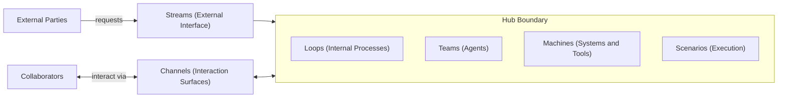

# Framework and Rationale

The Hub Way is a framework for modeling work in enterprise banking domains. This document explains why it exists, its design principles, its scope, and how it relates to established frameworks. Audience: product managers, architects, engineers.

---

## 1. Why The Hub Way Exists

Banking domains are complex. They are networks of commitments, disciplines, interactions, and cross-domain coordination. A payments domain must honor commitments to customers, merchants, and regulators while maintaining internal disciplines: reconciliation, fraud monitoring, compliance verification. A credit card domain processes applications (external commitments) while running risk loops, engagement loops, and compliance loops (internal discipline).

Existing approaches treat work as undifferentiated processes. BPM and workflow engines model everything as sequences of tasks with routing logic. The vocabulary does not distinguish between:

- **What the bank owes the outside world** — commitments triggered by customers, partners, regulators, or other external parties
- **What the bank does for itself** — internal discipline triggered by schedule, internal events, or operational necessity

The Hub Way provides that vocabulary. **Streams** represent work performed against explicit external commitments. **Loops** represent the internal discipline of a Hub — the rituals and routines that keep the domain healthy, honest, and improving. This distinction matters for governance, compliance, operational prioritization, and how teams think about their domains.

---

## 2. The Hub-as-System Metaphor

If a Hub is a system, then its components map cleanly to systems thinking:

| Component | Systems Analogy | What It Represents |
|-----------|-----------------|---------------------|
| **Streams** | External interface | What flows in and out — commitments from outside the boundary |
| **Loops** | Internal processes | What happens inside — discipline, analysis, integrity, compliance |
| **Channels** | Interaction surfaces | How collaborators engage — identity, auth, access control, interaction model |
| **Teams** | Agents / actors | Who does the work — the human and AI agents enrolled to resolve Scenarios |
| **Machines** | External systems | What systems and tools are available — the deployed systems providing capabilities |
| **Scenarios** | Universal execution model | How all work executes — goal-oriented, agent-resolved |

This metaphor gives domain experts a clear mental model: a Hub has a boundary, an interface (Streams), internals (Loops), and surfaces through which participants interact (Channels). All work executes through the same mechanism (Scenarios).

---

## 3. Six Orthogonal Concerns

The Hub Way introduces six independent dimensions. Each can be understood and modeled separately:

| Concern | Question Answered | Independent Of |
|---------|-------------------|----------------|
| **Hub** | What is the system? | Streams, Loops, Channels, Teams, Machines, Scenarios |
| **Streams / Loops** | How is work classified? | Hub boundary, Channels, Teams, Machines, execution model |
| **Channels** | Through what surface do collaborators participate? | Work classification, Teams, Machines, execution model |
| **Teams** | Who resolves the work? | Hub boundary, work classification, Channels, execution model |
| **Machines** | What systems and tools are available? | Hub boundary, work classification, Channels, Teams |
| **Scenarios** | How does work execute? | Work classification, Channel choice, Teams, Machines |

- **Hub** defines the bounded domain. A Payments Hub, a Credit Card Hub, a Compliance Hub — each is a coherent area of operations.
- **Streams and Loops** classify work within that domain. The classification is binary and complete.
- **Channels** define how humans and agents participate. A single Scenario may involve multiple Channels.
- **Teams** define who resolves work within the domain. Team composition determines the resolution model for each Scenario.
- **Machines** define what systems and tools are available. The Hub connects to external systems for capabilities; the Tool contract is the stable interface.
- **Scenarios** are the universal execution model. There is no separate infrastructure for Streams vs Loops.

Modelers can reason about each dimension without conflating them. A Hub's Streams can be redesigned without changing its Channels. A Channel can be added without changing work classification. The execution model is shared.

---

## 4. The Complete Partition

All work in a Hub is either a Stream or a Loop. There is no third category.

The classification rests on one rule: **trigger origin**.

| Trigger Origin | Classification |
|----------------|-----------------|
| **External** — crosses the Hub boundary inward | Stream |
| **Internal** — originates within the Hub | Loop |

When a customer applies for a credit card, the trigger is external. The work is a Stream. When interest is computed nightly, the trigger is internal (schedule, system event). The work is a Loop. When fraud monitoring detects suspicious activity and triggers a customer notification, the Loop produces a new Stream — the transition is explicit and auditable.

This partition is binary and unambiguous. Objectives (e.g., "keep my account working") are not work; they decompose into concrete Streams and Loops. Regulatory mandates arrive as external triggers at a Hub boundary. Work that transitions mid-flight (Loop detects fraud → Stream notifies customer) is modeled faithfully: the boundary crossing is visible.

**All participation happens through Channels.** Whether the work is a Stream or a Loop, collaborators engage through Channels — web portals, agent desks, APIs, voice, chat, AI agent protocols. Channels are the only way to participate in a Hub's Scenarios.

---

## 5. Key Design Principles

### Stream and Loop Are Work Classification Constructs, Not Privileged Processes

Streams and Loops do not have different execution engines or special infrastructure. They are modeling constructs that answer "why does this work exist?" — external commitment vs internal discipline. Both execute as Scenarios. The framework does not prescribe how many Streams or Loops a Hub should have. Domain experts decide.

### Channel Is Not a UI — It Is a Comprehensive System

A Channel embodies identity (who is participating), authentication (how they prove it), access control (what they are authorized to do), and the interaction model appropriate to the context. A REST API is a Channel. A voice telephony integration is a Channel. An Agent Desk is a Channel. Each is a full collaboration surface with governance, not a thin UI layer.

### Scenario Is the Universal Execution Model

There is no separate infrastructure for Streams vs Loops. Both execute through Scenarios — goal-oriented definitions of what needs to be achieved, resolved by agents (human and AI) within governance structures. One execution model, one platform. This avoids the fragmentation that plagues enterprise platforms (separate engines for workflows, cases, batch, events).

### Modeling Is Domain-Expert Discretion, Not Platform Prescription

The Hub Way does not prescribe rigid structures. How many Streams does the Payments Hub have? What Loops does Credit Card need? Which Channels should Servicing expose? These are modeling decisions made by people who understand the business. The framework provides vocabulary and principles; it does not impose a fixed catalog.

### Hub Is an Operations Fabric Over Existing Systems, Not a System Replacement

A Hub integrates with the bank's existing payment rails, core banking systems, and fraud engines. It does not replace them. It provides the operational structure — Scenarios, governance, collaboration model — that lets humans and AI agents work together to operate the domain. The fabric is system-agnostic.

---

## 6. Scope Statement

The Hub Way is a **framework for modeling work in business domains**. It covers:

| In Scope | Out of Scope |
|----------|--------------|
| Work classification (Streams vs Loops) | Data architecture |
| Work execution (Scenarios) | Product architecture |
| Collaboration surfaces (Channels) | Commercial architecture |
| Domain boundaries (Hubs) | Integration governance |
| Collaborator structuring (Teams) | Temporal architecture |
| Tool availability modeling (Machines) | |

These out-of-scope concerns are complementary. The Hub Way does not address how data is modeled, how products are packaged, how integrations are governed, or how temporal consistency is achieved. Teams should not expect The Hub Way to answer questions it was not designed for. Use The Hub Way for operational work modeling; use other frameworks for the rest.

---

## 7. Bridging Scenarios to Differentiation

While everything is a Scenario, not all Scenarios are alike. The Olympus Hub ontology provides **Work Patterns** and **Resolution Models** for differentiating how Scenarios execute. Modelers should select these consciously.

**Work Patterns** describe the nature of the situation — how attention is applied to work:

| Work Pattern | Focus | Key Characteristic |
|--------------|-------|---------------------|
| Queue-Based | Throughput | Serial processing of work items with SLAs |
| Case-Based | Investigation | Non-deterministic, collaborative resolution |
| Event-Driven | Reaction | Signal-triggered response |
| Conversation-Based | Dialogue | Real-time exchange toward understanding |
| Artifact-Centric | Creation | Single artifact: draft → review → approve |
| Review-Based | Evaluation | Assessing artifacts, decisions, or outcomes |
| Generative/Design | Exploration | Diverge → create variants → select → converge |

**Resolution Models** describe who resolves the work — the spectrum from pure automation to pure human collaboration:

| Resolution Model | Description |
|------------------|-------------|
| Pure Automation | Machines resolve entirely; no agent involvement |
| Automation with Exception Escalation | Machines resolve; agents engage only for exceptions |
| Automation with Checkpoint Approval | Machines resolve; agents approve at defined points |
| Agent-Assisted Automation | Automation does the work; agents guide, review, or correct |
| Human-AI Teaming | Human and AI agents collaborate throughout |
| AI-Autonomous | AI agents operate independently within governance |
| Human-Supervised AI | AI proposes; humans approve each action |
| Pure Human Collaboration | Humans work together; platform provides infrastructure |
| Human with Tool Support | Human resolves; machines provide capabilities on demand |

### Work Type to Pattern and Resolution Model

Different types of work map to Work Patterns and Resolution Models as follows. Modelers should use this as a starting point, not a prescription:

| Work Type | Typical Work Pattern | Typical Resolution Model | Notes |
|-----------|----------------------|--------------------------|-------|
| Payment authorization | Event-Driven | Pure Automation | Milliseconds, deterministic, high volume |
| Credit card application | Queue-Based → Case-Based | Human-AI Teaming, Human-Supervised AI | Days to weeks, conditional path |
| Fraud investigation | Case-Based | Human-AI Teaming, AI-Autonomous | Non-deterministic, expert collaboration |
| Interest computation | Event-Driven | Pure Automation | Batch, scheduled, fully automated |
| Customer service ticket | Queue-Based | Automation with Exception Escalation, Human-AI Teaming | SLA-driven, escalation for complex cases |
| Regulatory filing | Artifact-Centric, Review-Based | Human-Supervised AI, Human-AI Teaming | Document creation and approval |
| Reconciliation | Queue-Based, Event-Driven | Pure Automation, Automation with Exception Escalation | Routine automated; exceptions to agents |
| Compliance monitoring | Event-Driven | Pure Automation, Automation with Exception Escalation | Continuous or periodic checks |
| Dispute resolution | Case-Based | Human-AI Teaming | Investigation, evidence, decision |
| Policy design | Generative/Design | Pure Human Collaboration, Human-AI Teaming | Exploratory, judgment-heavy |

---

## 8. Relationship to AOSM and DDD

The Hub Way extends both Agent-Oriented Systems Modeling (AOSM) and Domain-Driven Design (DDD) without contradicting either.

### DDD Alignment

| DDD Concept | The Hub Way Equivalent |
|-------------|------------------|
| Bounded Context | Hub |

Hub = Bounded Context. The Hub Way inherits DDD's bounded context practice for domain boundaries. The same heuristics apply: Context Maps, event-storming, team cognitive load, Conway's Law alignment. The Hub Way adds work classification (Stream/Loop) within each context — the "why does this work exist?" dimension. If a single Hub has Streams that do not share Loops or Channels, it may be two Hubs; the Stream/Loop classification can help validate boundaries.

### AOSM Alignment

| AOSM Concept | The Hub Way Equivalent |
|--------------|-----------------|
| Goal-oriented execution model | Scenario |
| Agent (Human, AI) | Agent (unchanged) |
| Machine | Machine (unchanged) |
| Human-AI Team (HAT) | Team |
| Machine / Tool / Command | Machine / Tool |

Scenario = AOSM's execution model. The Hub Way does not replace it; it adds a work classification dimension. AOSM answers "how does work execute?" — goal-oriented, agent-resolved. The Hub Way adds "why does this work exist?" (Stream vs Loop) and "through what surface?" (Channel). The four-layer ontology (Perception, Normative, Execution, Automation) applies to all Scenarios regardless of Stream or Loop classification.

### What The Hub Way Adds

| Dimension | AOSM/DDD | The Hub Way Addition |
|-----------|----------|----------------|
| Domain boundary | Bounded Context (DDD) | Hub — same |
| Execution | Scenario (AOSM) | Same |
| Work classification | Not explicit | Stream vs Loop |
| Collaboration surface | Implicit | Channel — explicit, comprehensive |
| Collaborator structuring | Not a modeling concern | Team — explicit |
| Tool availability | Implicit (Machine/Tool) | Machine — domain-level decision |

---

## Summary

The Hub Way provides a vocabulary for modeling work in banking domains. It distinguishes external commitments (Streams) from internal discipline (Loops), uses the Hub-as-system metaphor for clarity, treats Channels as comprehensive collaboration surfaces, structures collaborators as Teams, and connects systems through Machines. Scenarios are the universal execution model. The framework is scoped to work modeling in business domains; it extends DDD and AOSM without contradicting them. Modelers should consciously select Work Patterns and Resolution Models when designing Scenarios.

---

## Related Documents

- [The Hub Way Framework Reference](../README.md) — authoritative definitions
- [Modeling Streams](02-modeling-streams.md) — identifying and designing external commitments
- [Modeling Loops](03-modeling-loops.md) — identifying and designing internal discipline
- [Modeling Hubs](04-modeling-hubs.md) — domain boundaries, cross-Hub patterns
- [Modeling Channels](05-modeling-channels.md) — collaboration surfaces, Channel Products
- [Modeling Teams](06-modeling-teams.md) — who resolves work
- [Modeling Machines](07-modeling-machines.md) — systems and tools
- [Ontology Alignment](08-ontology-alignment.md) — AOSM extension, Work Patterns, Resolution Models
