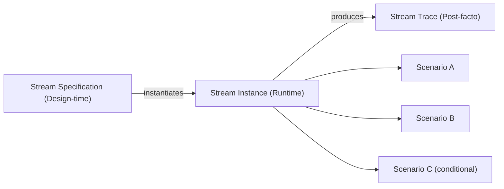

# Modeling Streams

Streams represent work performed against explicit external commitments. This document guides product managers and domain architects in identifying, specifying, and modeling Streams within The Hub Way framework. Audience: PMs, domain architects.

---

## 1. Streams as External Commitments

A **Stream** is what the Hub promises to the outside world. It represents work performed against an explicit commitment — a request — that crosses the Hub boundary inward.

When a customer applies for a credit card, the Credit Card Hub has made a commitment: *we will process your application and give you a decision*. When a merchant submits a payment for processing, the Payments Hub has made a commitment: *we will process this transaction and settle the funds*. When a regulator requests a filing, the Compliance Hub has made a commitment: *we will produce the requested information by the deadline*.

Streams acknowledge that a request may have **related requests**. A credit card application may spawn a request for additional documentation. A dispute may spawn a chargeback and a merchant notification. A regulatory filing may spawn follow-up requests for clarification. The Stream model accommodates these relationships without conflating them into a single monolithic process.

| Aspect | Description |
|--------|-------------|
| **Anchor** | An explicit request from outside the Hub boundary |
| **Nature** | Commitment-driven — the Hub owes something to an external party |
| **Scope** | May include related requests that arise during fulfillment |
| **Outcome** | Resolution when the commitment is fulfilled |

---

## 2. Identifying Commitments

Every Stream should answer two questions:

1. **Who is the external party?**
2. **What are they expecting, and what does "fulfilled" look like?**

Commitments come from explicit requests. Sources include:

| Source | Example | What "Fulfilled" Looks Like |
|--------|---------|-----------------------------|
| **Customers** | Credit card application | Applicant receives approval, decline, or request for more information |
| **Customers** | Dispute filing | Customer receives resolution (refund, denial, partial credit) with explanation |
| **Partners** | Payment submission | Merchant receives settlement confirmation or rejection |
| **Partners** | Chargeback initiation | Issuer receives chargeback outcome and documentation |
| **Regulators** | Filing request | Regulator receives required report by deadline |
| **Other Hubs** | Cross-domain request | Requesting Hub receives outcome or handoff confirmation |

If you cannot name the external party and articulate what "fulfilled" looks like, you may be modeling an objective or a Loop, not a Stream.

### Banking Examples

| Stream | External Party | What "Fulfilled" Looks Like |
|--------|----------------|----------------------------|
| Credit card application | Applicant | Decision (approve/decline) communicated; if approved, card provisioned |
| Dispute resolution | Cardholder | Resolution communicated; account adjusted if applicable |
| Merchant onboarding | Merchant | Merchant enabled for processing or rejection with reason |
| Regulatory filing | Regulator | Required report submitted by deadline |
| Account closure request | Customer | Account closed; final statement and confirmation provided |

---

## 3. Stream Terminology

The Hub Way uses three distinct terms for Stream-related concepts. Confusing them leads to modeling errors.

| Term | Phase | Description |
|------|-------|-------------|
| **Stream Specification** | Design-time | The prescriptive definition of a type of commitment. Describes what Scenarios may participate, what triggers the Stream, what resolution criteria apply. |
| **Stream** | Runtime | The operative instance of a commitment being fulfilled. A specific credit card application, a specific dispute, a specific filing request. |
| **Stream Trace** | Post-facto | The observable record of how the commitment was fulfilled. Decisions, timelines, outcomes, exceptions — the audit trail. |

| Concept | Analogy |
|---------|---------|
| Stream Specification | Process template or case type definition |
| Stream | Case instance or request instance |
| Stream Trace | Audit log or case record |

In banking, the Stream Trace is not optional. Regulators, compliance officers, and the bank itself need to verify that commitments were fulfilled properly. Every Stream must be designed with traceability in mind.

### Stream Lifecycle

---

## 4. Scenarios Within a Stream

A Stream is a **coordinated collection** of Scenarios — not a sequence. The Scenarios within a Stream:

- Are **episodic** — execution proceeds with business-meaningful pauses (waiting for documents, waiting for a decision, waiting for a deadline)
- Do **not** follow a fully predetermined path — the path emerges based on what the Hub discovers
- May **not fire** — some Scenarios are conditional and may never execute
- May **repeat** — e.g., multiple rounds of document requests
- May **run in parallel** — e.g., fraud check and credit decisioning

| Traditional BPM Thinking | Stream / Case Model Thinking |
|--------------------------|------------------------------|
| Steps in a fixed sequence | Scenarios in a coordinated collection |
| Completion of predetermined steps | Resolution of a commitment |
| Linear flow with branches | Episodic execution with conditional activation |
| Process instance | Stream instance |

Scenarios within a Stream are resolved by Teams using Tools from Machines, interacting through Channels. A credit card application Scenario might involve a credit officer (Team), a credit bureau lookup and policy engine (Machines providing Prediction and Decision tools), and an Agent Desk plus API (Channels). Team composition may vary per Scenario within the same Stream — initial intake may be automated while manual review involves a human-AI team.

### Example: Credit Card Application Stream

A credit card application Stream might include Scenarios such as:

- Initial application intake
- Identity verification
- Credit decisioning
- Income verification (conditional — only if required)
- Additional documentation request (conditional — may repeat)
- Compliance review (conditional — for certain segments)
- Card provisioning (conditional — only if approved)
- Decline notification (conditional — only if declined)

The path is not rigid. Some applications complete in minutes; others require weeks of back-and-forth. The commitment — "we will process your application and give you a decision" — is constant.

---

## 5. Case Model Alignment

Streams align with **Case model thinking**, not just workflow or BPM thinking. The goal is **resolution of a commitment**, not completion of predetermined steps.

| Dimension | Workflow/BPM | Case Model (Stream) |
|-----------|--------------|---------------------|
| **Goal** | Complete the process | Resolve the commitment |
| **Path** | Predetermined with branches | Emerges through investigation and judgment |
| **Determinism** | Largely deterministic | Non-deterministic; path depends on findings |
| **Success** | All steps done | Commitment fulfilled |

The Olympus Hub documentation covers **Case-Based Work** as one of seven work patterns. Streams that involve investigation, judgment, or evolving circumstances — disputes, complex applications, regulatory responses — typically use Case-Based Work patterns. The Scenario execution model supports this: goal-oriented, agent-resolved, with non-deterministic flow.

Streams are not exclusively Case-Based. A simple payment processing Stream may be largely Queue-Based or Event-Driven. The key is that the *Stream* is defined by the commitment and its resolution; the *Scenarios* within it may use different work patterns.

---

## 6. Stream Coordination

The Hub Way describes Stream coordination **conceptually** — episodic, non-sequential, potentially cross-Hub. The framework does not prescribe implementation mechanisms.

| Conceptual (The Hub Way) | Implementation (Olympus Hub) |
|-------------------|------------------------------|
| Scenarios are coordinated | Dependency expression, conditional activation |
| Episodic execution | State tracking, synchronization |
| Business-meaningful pauses | Human decision gates, wait states |
| Cross-Hub Streams | Cross-workbench context sharing |

How dependencies are expressed, how conditional activation works, how state is tracked, and how synchronization is achieved — these are **Olympus Hub implementation design concerns**, not The Hub Way framework concerns. The framework provides the vocabulary; the platform provides the mechanisms.

Modelers should focus on: *what Scenarios participate, under what conditions, and what resolution looks like*. Implementation details belong in the Hub implementation guide.

---

## 7. Cross-Hub Streams

Streams can span domain boundaries. When a commitment requires coordination across business domains, the Stream is **cross-Hub**.

| Example | Hubs Involved | Coordination |
|---------|---------------|--------------|
| Credit card application | Credit Card (decisioning), Payments (provisioning), Servicing (welcome communications) | Application context shared across workbenches |
| Dispute with chargeback | Servicing (customer), Payments (merchant), Credit Card (issuer) | Dispute context propagated to relevant Hubs |
| Regulatory filing with data from multiple domains | Compliance, Credit Card, Payments, Risk | Filing request triggers data aggregation across Hubs |

Olympus Hub supports cross-Hub Streams via **cross-workbench context sharing**. A Stream instance carries context that can be accessed by Scenarios in multiple workbenches. The Stream is still anchored by a single external commitment; the fulfillment may require work in multiple Hubs.

---

## 8. The OpenTelemetry Trace Analogy

OpenTelemetry traces provide a useful analogy for understanding Streams — with important limits.

### Where the Analogy Holds

| OpenTelemetry | Stream |
|---------------|--------|
| Trace ID (correlation ID) | Stream instance identifier |
| Spans | Scenarios |
| Distributed execution | Cross-Hub Streams |
| Observability | Stream Trace |

A Stream Trace is like a distributed trace: it correlates work across Scenarios (and potentially Hubs) into a single observable record. Correlation is essential for audit and understanding.

### Where the Analogy Breaks

| Dimension | OpenTelemetry | Stream |
|-----------|---------------|--------|
| **Design vs observation** | Traces are observed; spans are instrumented | Streams are *designed*; Stream Specifications are prescriptive |
| **Timescale** | Milliseconds to seconds | Days to weeks (business timescale) |
| **Scope** | Inter-service, technical | Cross-organizational, business |
| **Intent** | Observability | Commitment fulfillment with prescriptive intent |

Streams are not merely observed — they are **designed**. A Stream Specification defines what *should* happen. The Stream Trace records what *did* happen. OpenTelemetry traces are observation-time constructs; Streams have design-time intent.

---

## 9. Stream Boundaries

Whether two related commitments are one Stream or two is a **modeling choice** of domain experts, not an architectural constraint.

| Question | Example | Modeling Options |
|----------|---------|------------------|
| Application and dispute — one Stream or two? | A customer applies for a card; later disputes a charge | **One Stream per commitment.** Application is one Stream; dispute is a separate Stream (different external request, different "fulfilled" criteria). |
| Application and add-on product — one Stream or two? | Customer applies; during process, opts for balance transfer | Domain experts decide. If the balance transfer is part of the same "we will process your application" commitment, one Stream. If it is a separate request with separate fulfillment, two Streams. |
| Dispute and chargeback — one Stream or two? | Cardholder disputes; issuer initiates chargeback to acquirer | Often one Stream from cardholder perspective (resolve my dispute); the chargeback is internal coordination. Or two Streams if acquirer and issuer model chargeback as a separate commitment. |

The heuristic: **one external request, one commitment, one Stream**. If the external party would say "I made one request" or "I made two requests," that guides the boundary. Related requests (e.g., follow-up documentation) can be part of the same Stream if they are sub-requests within the same commitment.

---

## 10. Stream-Loop Relationships

Streams and Loops have **optional, modeling-driven** relationships. A Stream may have related Loops, and a Loop may have related Streams.

| Relationship | Description |
|--------------|-------------|
| **Loops consume Stream data** | Compliance Loop analyzes Stream Traces for policy adherence; Fraud Loop analyzes dispute patterns |
| **Loops trigger Streams** | Fraud Loop detects suspicious activity → triggers Customer Notification Stream |
| **Streams inform Loop design** | Stream volume and exception patterns drive Reconciliation Loop configuration |

The relationship is not structural — there is no required "Stream has Loops" or "Loop has Streams" in the model. The relationship is operational: Streams produce data; Loops consume it. Loops may produce new Streams when internal discipline reveals a need for an external commitment.

---

## 11. Stream Anti-Patterns

### The Infinite Stream

**Symptom:** No resolution criteria. The work never "completes" in a meaningful sense.

**Problem:** This is an **objective**, not a Stream. "Maintain customer satisfaction" is an objective. "Resolve complaint #12345" is a Stream.

| Not a Stream | Is a Stream |
|--------------|-------------|
| Maintain customer satisfaction | Resolve complaint #12345 |
| Keep the system healthy | Resolve incident #789 |
| Ensure regulatory compliance | Complete Q3 regulatory filing |
| Optimize conversion | Process application #45678 |

If you cannot define "fulfilled," you are modeling an objective. Objectives decompose into Streams and Loops — do not model objectives as Streams.

### The Mega Stream

**Symptom:** Dozens of Scenarios spanning months. The Stream becomes unmanageable.

**Problem:** Likely **multiple related Streams** masquerading as one. A "customer onboarding" Stream with 40 Scenarios across account opening, KYC, product setup, and welcome communications may be four Streams with dependencies.

**Heuristic:** If a Stream has more than ~10–15 Scenarios, consider splitting. Look for natural commitment boundaries — distinct external requests, distinct "fulfilled" criteria.

### The Opaque Stream

**Symptom:** No Stream Trace design. Cannot audit how the commitment was fulfilled.

**Problem:** In banking, **unacceptable**. Regulators, compliance officers, and the bank need to verify that commitments were fulfilled properly. Every Stream must produce an observable trace: what happened, who decided what, what data was used, what the outcome was.

**Remedy:** Design the Stream Trace as part of the Stream Specification. What must be recorded? What decisions must be attributable? What timeline must be reconstructable?

### The Trivial Stream

**Symptom:** Single Scenario. The Stream adds no coordination value.

**Problem:** May not need the Stream abstraction. If the commitment is fulfilled by one Scenario with no coordination, no related requests, and no cross-Hub scope, the Stream may be redundant. The Scenario alone may suffice.

**Caveat:** Even single-Scenario Streams can be valuable for consistency (all external commitments modeled as Streams), traceability (Stream Trace provides uniform audit structure), and future evolution (the commitment may gain Scenarios later). Use judgment.

---

## 12. Stream Heuristics

| Heuristic | Application |
|-----------|-------------|
| **Every Stream answers: who is the external party, and what does "fulfilled" look like?** | If you cannot answer both, you may have an objective, a Loop, or an ill-defined Stream. |
| **If a Stream has more than ~10–15 Scenarios, consider splitting** | Look for distinct commitments. Multiple Streams with clear boundaries are better than one Mega Stream. |
| **Objectives decompose into Streams and Loops — don't model objectives as Streams** | "Maintain X" is an objective. "Resolve request Y" is a Stream. |
| **Don't confuse "what mandates the work" with "what triggers the work"** | A regulatory mandate may *require* the bank to do something, but if the bank's own schedule initiates the work (e.g., monthly reconciliation), it is a Loop. The external trigger is what classifies work as a Stream. |

### Mandate vs Trigger

| Scenario | Mandate | Trigger | Classification |
|----------|---------|---------|-----------------|
| Monthly regulatory filing | Regulator requires it | Bank's schedule (monthly run) | **Loop** — internal trigger |
| Regulator requests ad-hoc filing | Regulator requires it | Regulator's request | **Stream** — external trigger |
| Customer dispute | Customer expects resolution | Customer files dispute | **Stream** — external trigger |
| Fraud monitoring | Policy requires it | Internal schedule/events | **Loop** — internal trigger |
| Customer notification when fraud detected | Customer deserves to know | Loop detects fraud | **Stream** — Loop triggers new external commitment |

---

## What Modeling Streams Delivers

When every external commitment is modeled as a Stream, several felt problems that banks live with begin to resolve:

**Commitments become visible and measurable.** The bank can answer: what do we owe the outside world? How many commitments are active? Where are we falling behind? These questions — unanswerable when commitments are scattered across workflows, case management tools, and manual tracking — become structural properties of the model.

**Compliance becomes structural.** Every Stream produces a governed trace from commitment to resolution — who decided, what information was used, what Tools were invoked, what the outcome was. The audit trail is a byproduct of Stream execution, not a separate reporting program. New regulations map to existing Streams: "which Streams does this regulation affect, and what governance adjustments are needed?"

**Domain-level AI outcomes become measurable.** Streams are the denominator. When the bank knows all the commitments in a domain, it can measure what fraction is AI-augmented, where the dial has moved, and what outcomes the shift produced. Without Streams, the bank can count AI projects. With Streams, it can measure AI transformation.

**Applications can be retired.** When agents resolve Scenarios directly within a Stream — interpreting specifications, invoking Tools, managing state — they don't need the legacy workflow engine to sequence them or the case management tool to track state. These applications become redundant. Each retired application removes a permanent cost.

---

## Summary

Streams represent work performed against explicit external commitments. Every Stream should have a clear external party and a clear definition of "fulfilled." Stream Specifications are design-time; Stream instances are runtime; Stream Traces are post-facto observability. Scenarios within a Stream form a coordinated collection with episodic, non-sequential execution — aligned with Case model thinking. Stream coordination mechanisms are implementation concerns; cross-Hub Streams span domain boundaries. Avoid the Infinite, Mega, Opaque, and Trivial Stream anti-patterns. Use the heuristics: name the external party, define fulfillment, split large Streams, decompose objectives, and distinguish mandate from trigger.

---

## Related Documents

- [Framework and Rationale](01-framework-and-rationale.md) — design principles and scope
- [Modeling Loops](03-modeling-loops.md) — internal discipline, the other side of the partition
- [Modeling Teams](06-modeling-teams.md) — who resolves Stream Scenarios
- [Modeling Machines](07-modeling-machines.md) — tools used to fulfill commitments
- [Ontology Alignment](08-ontology-alignment.md) — Work Patterns and Resolution Models for Stream Scenarios
- [Implementing in Hub](09-implementing-in-hub.md) — Stream implementation in Olympus Hub
- [Worked Examples](10-examples.md) — Stream modeling in banking domains
