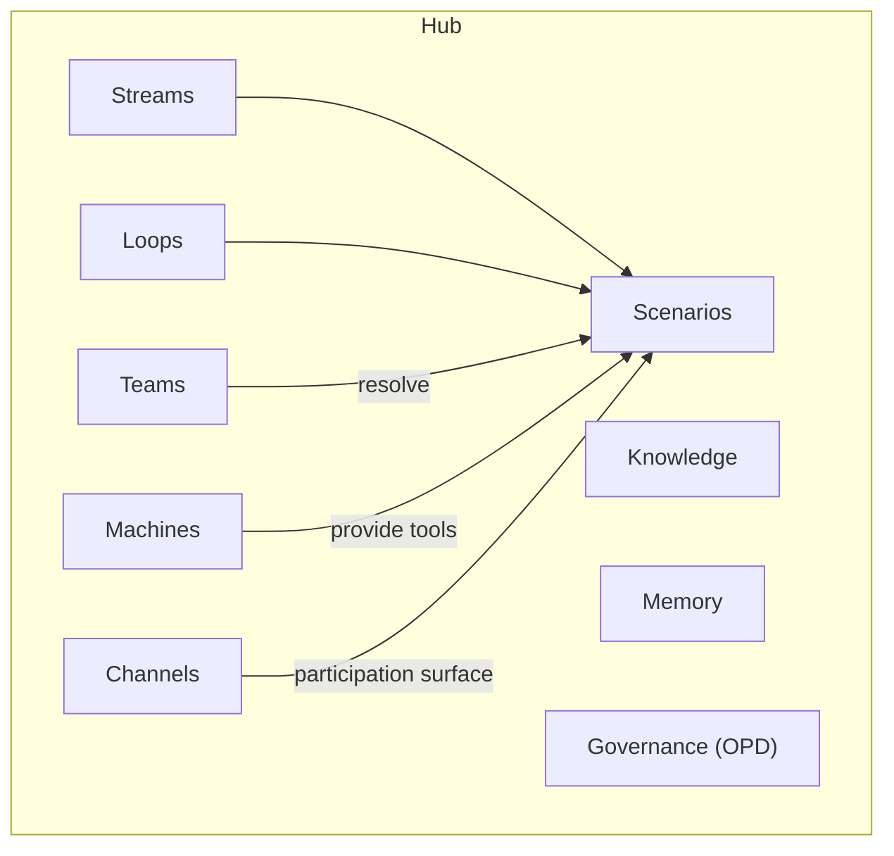

# Modeling Hubs

This document covers Hub boundaries, cross-Hub patterns, Zeta's Hubs of Prominence, anti-patterns, and heuristics. Audience: product managers, domain architects.

---

## 1. Hub as a Bounded Business Domain

A **Hub** is the system. It represents a coherent business domain with its own commitments, disciplines, interaction surfaces, and governance.

| Aspect | What It Means |
|--------|---------------|
| **Commitments** | What the domain owes to external parties — customers, partners, regulators |
| **Disciplines** | Internal rituals and routines that keep the domain healthy, honest, and improving |
| **Interaction surfaces** | How collaborators (human and AI) participate — Channels |
| **Collaborators / Teams** | Human and AI agents enrolled to resolve the domain's Scenarios |
| **Systems / Machines** | Deployed systems providing Tools — the capabilities agents use to Observe, Decide, and Act |
| **Governance** | How the domain is observed, predicted, and directed — OPD |

A Hub has a boundary. Work inside the boundary is organized into Streams (external commitments) and Loops (internal discipline). The boundary is a modeling choice made by domain experts — it is not prescribed by the platform.

---

## 2. Operations and Collaboration Fabric

A Hub is **not** a replacement for existing systems. It is an operations and collaboration fabric that sits on top of existing systems, bringing them together.

| Fabric Role | What It Enables |
|-------------|-----------------|
| **Integration** | Connects payment rails, core banking systems, fraud engines, servicing platforms |
| **Coordination** | Lets humans and AI agents work together to operate the domain |
| **Structure** | Provides Scenarios, governance, and collaboration model |
| **Business scenarios** | Addresses real business situations through coordinated human and AI collaboration |

The bank's existing systems remain. The Hub provides the operational structure that orchestrates them. It does not replace them.

---

## 3. System-Agnostic Integration

Zeta product lines integrate natively as systems in the Hub:

| Zeta Product Line | Role in Hub |
|-------------------|-------------|
| **Tachyon** | Processing — payments, cards, lifecycle |
| **Neutrino** | Digital experiences — customer interaction, channel orchestration |
| **Electron** | Lifecycle management — commercial cards, expense, benefits |

Third-party systems are equally supported. The Hub does not care which systems it integrates — it cares about **how work is organized**. A Payments Hub may use Tachyon for processing and a third-party fraud engine for risk scoring. A Credit Card Hub may use Electron for commercial cards and a bank's legacy core for account posting. The fabric is system-agnostic.

---

## 4. What a Hub Contains

A Hub is a container for the following elements:

| Element | Description |
|---------|-------------|
| **Streams** | External commitments — work triggered by requests from outside the Hub boundary |
| **Loops** | Internal discipline — work triggered by schedule, internal events, or operational necessity |
| **Channels** | Collaboration surfaces — how humans and AI agents participate in Scenarios |
| **Scenarios** | Execution model — goal-oriented definitions of what needs to be achieved |
| **Agents** | Participants — human and AI agents that resolve Scenarios |
| **Knowledge** | Domain knowledge base — the Hub's understanding of its domain |
| **Memory** | Episodic (what happened), semantic (what it means), procedural (how to do it), preference (what works) |
| **Teams** | Human and AI agents enrolled, organized into pools, assigned via task queues and escalation matrices |
| **Machines** | External systems registered in Machine Registry, exposing Tools (Prediction, Decision, Command) for Scenarios |
| **Governance** | OPD — Observability (can we see it?), Predictability (can we forecast it?), Directability (can we steer it?) |

All work in a Hub executes as Scenarios. Streams and Loops are work classification constructs; they share the same execution model. Channels are the only way to participate. Knowledge and Memory support agent resolution. Governance ensures the domain operates within acceptable bounds.

---

## 5. Hub Boundaries

Hub boundaries are a **domain-expert modeling choice**. The Hub Way inherits DDD's bounded context practice — it does not replace it.

DDD practitioners should recognize the Hub boundary question as the familiar **bounded context question**. The same heuristics apply:

| Heuristic | Application |
|-----------|-------------|
| **Context Maps** | Map relationships between Hubs; identify upstream/downstream, conformist/anti-corruption |
| **Event-storming** | Discover domain events; boundaries often emerge where events cross |
| **Team cognitive load** | A Hub should be understandable by a coherent team; too large suggests split |
| **Conway's Law alignment** | Hub boundaries should align with organizational structure where possible |

There is no algorithm for the "correct" boundary. Domain experts use these heuristics to make informed choices. The Stream/Loop classification can help validate boundaries — if Streams in a Hub do not share Loops or Channels, it may be two Hubs.

---

## 6. Cross-Hub Patterns

### Streams Spanning Hubs

When a commitment requires coordination across domains, a Stream may span multiple Hubs. Example: a credit card application involves the Credit Card Hub (decisioning), the Payments Hub (card provisioning), and the Customer Servicing Hub (welcome communications).

**Implementation:** Olympus Hub supports this via **cross-workbench context sharing**. A Stream instance can carry context across Workbenches so that Scenarios in different Hubs operate on the same commitment with shared visibility.

### Aggregation Hubs

Some Loops are cross-cutting — they need to analyze or govern across multiple product Hubs. Examples:

| Aggregation Hub | Purpose |
|-----------------|---------|
| **Enterprise Compliance Hub** | Cross-domain compliance monitoring, regulatory reporting, audit preparation |
| **Customer Intelligence Hub** | Cross-domain analysis — customer behavior across payments, cards, servicing |

Aggregation Hubs are created when cross-domain analysis needs to span multiple product Hubs. They consume data from product Hubs and run Loops that would not fit cleanly within any single product domain.

---

## 7. Hub and Workbench

In Olympus Hub, a Hub maps to a **Workbench** — the platform's unit of domain encapsulation.

| Hub Concept | Workbench Equivalent |
|-------------|----------------------|
| Hub | Workbench |
| Streams, Loops | Scenarios (classified by trigger origin) |
| Channels | Workbench-configured Channels |
| Agents | Workbench participants |
| Knowledge | Workbench knowledge base |
| Memory | Workbench memory |
| Governance | Workbench OPD configuration |
| Teams | Agent Pools, Task Queues, Escalation Matrices |
| Machines | Machine Registry, Tool Registry |

A Workbench contains Scenarios, Agents, Knowledge, Memory, and Governance. The Hub Way Hub is the business-domain view of the same encapsulation.

---

## 8. Zeta's Hubs of Prominence

Domains where Zeta represents deep expertise:

| Hub | Characterization |
|-----|------------------|
| **Payments** | Various rails and instruments — ACH, wire, real-time, card networks; orchestration and settlement |
| **Credit Card** | Issuance, lifecycle, servicing — consumer and retail card programs |
| **Customer Lifecycle Management** | Offers, rewards, cross-sell, up-sell — engagement and monetization |
| **Customer Servicing and Digital Journeys** | Multi-channel service delivery — self-serve, assisted, agentic |
| **Customer IAM** | SSO, identity risk, behavioral risk — authentication and identity assurance |
| **Merchants** | Acquiring, payment facilitation, payment aggregation — merchant-side operations |
| **Commercial Cards** | Business and corporate card programs — expense, purchase, virtual cards |
| **Family Banking** | Household-oriented banking — shared accounts, family financial management |
| **Small Business** | SMB banking and financial services — business accounts, lending, treasury |

---

## 9. Hub Anti-Patterns

### The God Hub

**Problem:** Too many unrelated domains in one Hub.

| Sign | What It Indicates |
|------|-------------------|
| Streams that don't relate to each other | Multiple domains forced together |
| Loops that serve only a subset of Streams | No shared discipline |
| Different teams managing different parts | Organizational mismatch |

This is DDD's "Big Ball of Mud." Split the Hub.

### The Empty Hub

**Problem:** Streams but no Loops.

If a domain has external commitments but no internal discipline, it is not a real bounded domain. It is likely a routing or orchestration layer — work passes through but nothing is maintained, analyzed, or improved. Either add Loops (reconciliation, compliance, analytics) or reconsider whether this is a Hub.

### The Island Hub

**Problem:** No cross-Hub Streams and no data consumed by Loops in other Hubs.

Complete isolation is suspicious in banking. Domains typically share commitments (a card application touches servicing) or feed cross-domain Loops (compliance, customer intelligence). If a Hub has no cross-Hub relationships, verify that the boundary is correct.

### The Mirror Hubs

**Problem:** Two Hubs sharing all their Streams.

If two Hubs have identical or near-identical Stream sets, they are probably one domain split artificially. The split may have been driven by organizational politics or legacy system boundaries rather than domain coherence. Consider merging.

---

## 10. Hub Heuristics

| Heuristic | Application |
|-----------|-------------|
| **Recognizable business domain name** | A Hub should have a name like "Payments" or "Credit Cards" — not "Processing Hub" or "Backend Hub" |
| **Streams share Loops or Channels** | If a Hub's Streams don't share any Loops or Channels, it might be two Hubs |
| **Loops are not duplicated across Hubs** | If two Hubs share all their Loops, they might be one Hub |
| **Boundary stability** | Hub Boundary Churn — constantly reorganizing — is a sign of premature modeling. Get the domain right before optimizing |
| **Stream/Loop classification validates boundaries** | Use the classification to test: do these Streams and Loops belong together? |

---

## Summary

A Hub is a bounded business domain — the system. It is an operations and collaboration fabric over existing systems, not a replacement. It integrates Zeta and third-party systems alike. A Hub contains Streams, Loops, Channels, Teams, Machines, Scenarios, Agents, Knowledge, Memory, and Governance (OPD). Hub boundaries follow DDD's bounded context practice. Cross-Hub patterns include Streams spanning Hubs (via cross-workbench context sharing) and Aggregation Hubs for cross-cutting Loops. In Olympus Hub, a Hub maps to a Workbench. Avoid God Hub, Empty Hub, Island Hub, and Mirror Hubs. Use the heuristics to validate boundaries.

---

## Related Documents

- [Framework and Rationale](01-framework-and-rationale.md) — design principles and scope
- [Modeling Streams](02-modeling-streams.md) — external commitments within a Hub
- [Modeling Loops](03-modeling-loops.md) — internal discipline within a Hub
- [Modeling Channels](05-modeling-channels.md) — collaboration surfaces configured per Hub
- [Modeling Teams](06-modeling-teams.md) — who resolves work within a Hub
- [Modeling Machines](07-modeling-machines.md) — systems and tools available to a Hub
- [Implementing in Hub](09-implementing-in-hub.md) — Hub to Workbench configuration
- [Worked Examples](10-examples.md) — Hub modeling in banking domains
